<div align="center">

# Microsoft Azure AZ-900 Fundamentals

### Kompletne kompendium do certyfikacji

[](https://azure.microsoft.com)
[](https://learn.microsoft.com/pl-pl/certifications/azure-fundamentals/)
[](.)

</div>

> Kompletny, praktyczny przewodnik do szybkiej nauki i utrwalenia wiedzy pod egzamin **AZ-900 Microsoft Azure Fundamentals**. Zawiera: podstawy chmury, architekture Azure, kluczowe uslugi (Compute/Networking/Storage), tozsamosc i bezpieczenstwo (Microsoft Entra), governance i koszty, monitoring, IaC & automatyzacje, rozszerzone uslugi oraz **podchwytliwe pytania egzaminacyjne**.

---

## Spis tresci
- [1. Cloud Concepts (Podstawy chmury)](#sec-01-cloud-concepts)
- [2. Azure Architecture (Architektura i hierarchia)](#sec-02-azure-architecture)
- [3. Compute Services (Usługi obliczeniowe)](#sec-03-compute-services)
- [4. Networking (Sieci i łączność)](#sec-04-networking)
- [5. Storage (Przechowywanie danych)](#sec-05-storage)
- [6. Identity & Access (Microsoft Entra)](#sec-06-identity-access)
- [7. Security (Bezpieczeństwo)](#sec-07-security)
- [8. Governance & Compliance](#sec-08-governance-compliance)
- [9. Monitoring & Logging](#sec-09-monitoring-logging)
- [10. Costs & Billing (Koszty i rozliczenia)](#sec-10-costs-billing)
- [11. IaC & Automation (Infrastruktura jako kod)](#sec-11-iac-automation)
- [12. Extended Azure Services (Usługi rozszerzone)](#sec-12-extended-services)
- [13. Podchwytliwe pytania AZ‑900](#sec-13-pytania-az900)
- [14. Glosariusz skrócony](#sec-14-glosariusz)
- [15. Azure Free Account - Free Tier](#sec-15-free-account)
- [16. SLA - Service Level Agreement](#sec-16-sla)
- [17. Bazy danych (Databases)](#sec-17-databases)
- [18. Subskrypcje (Subscription Models)](#sec-18-subscription-models)
- [19. Azure CLI](#sec-19-azure-cli)
- [20. Azure Cache for Redis](#sec-20-redis-cache)
- [21. Wdrażanie aplikacji na Azure (Deployment)](#sec-21-deployment)
- [22. Last-minute cram (pulapki + porownania)](#sec-22-last-minute-cram)
- [23. Azure Key Vault](#sec-23-azure-key-vault)
- [24. Debugowanie aplikacji Azure](#sec-24-debugging)
- [25. Azure Service Bus](#sec-25-service-bus)
- [26. Azure Event Hub](#sec-26-event-hub)
- [27. Azure Event Grid](#sec-27-event-grid)
- [28. Azure Logic Apps](#sec-28-logic-apps)
- [29. Load Balancing w Azure](#sec-29-load-balancing)
- [30. Azure Data Factory](#sec-30-data-factory)
- [31. Azure Storage i Blob Storage](#sec-31-azure-storage)

---

<a id="sec-01-cloud-concepts"></a>
## 1. Cloud Concepts (Podstawy chmury)

## Modele wdrożenia

### Public Cloud
Usługi uruchamiane w infrastrukturze dostawcy (np. Microsoft Azure). Dostępność i skalowanie zapewnia provider, a Ty płacisz za zużycie. Szybki time‑to‑market, szeroka oferta usług, brak konieczności utrzymywania hardware’u.
<br>


**Kiedy używać:** projekty o zmiennym obciążeniu, potrzeba globalnego zasięgu, krótkie cykle wdrożeniowe.  
**Ryzyka/uwagi:** lock‑in, zgodność/regulacje, kontrola nad siecią niższa niż on‑prem.

---

### Private Cloud
Dedykowana chmura dla jednej organizacji (własne DC / hosting dedykowany / Azure Stack HCI). Najwyższa kontrola i możliwość dopasowania do rygorów zgodności, kosztem zwinności i CAPEX/OPEX.
<br>


**Kiedy używać:** silne wymagania compliance, izolacja, specyficzne potrzeby bezpieczeństwa/latencji.  
**Ryzyka/uwagi:** większe koszty utrzymania, mniejsza elastyczność skalowania.

---

### Hybrid Cloud
Połączenie środowisk on‑prem/private z public cloud. Umożliwia przenoszenie obciążeń, burst do chmury i stopniową migrację, z zachowaniem kontroli nad danymi krytycznymi.
<br>


**Kiedy używać:** modernizacja etapowa, wymogi rezydencji danych, integracje z istniejącymi systemami.  
**Ryzyka/uwagi:** złożoność sieci/identyfikacji/monitoringu, potrzeba spójnego governance.

---

### Community Cloud
Chmura współdzielona przez grupę organizacji o wspólnych wymaganiach — np. sektor publiczny, medyczny, edukacyjny lub finansowy. Zapewnia wspólne standardy bezpieczeństwa, zgodność regulacyjną i kontrolę nad środowiskiem.
<br>


**Kiedy używać:** organizacje o wspólnych regulacjach (RODO, HIPAA, FINREP), współdzielone koszty, potrzeba jednolitych polityk bezpieczeństwa.  
**Ryzyka/uwagi:** uzgodnienie governance między uczestnikami, współdzielona odpowiedzialność, potencjalnie mniejsza elastyczność niż public cloud.

---

### Multi‑Cloud
Wykorzystanie wielu dostawców chmury (np. Azure, AWS, GCP) jednocześnie. Pozwala redukować vendor lock‑in, wybierać najlepsze usługi z różnych platform oraz zwiększyć odporność na awarie jednego providera.
<br>


**Kiedy używać:** minimalizacja zależności od jednego dostawcy, strategia „best‑of‑breed”, wymagania biznesowe lub prawne dotyczące dywersyfikacji.  
**Ryzyka/uwagi:** wyższa złożoność operacyjna, trudniejsze bezpieczeństwo i monitoring, konieczność ujednolicenia narzędzi i procesów (IaC/CI/CD).

---

### Distributed Cloud
Model, w którym usługi chmurowe dostawcy (np. Azure, AWS, GCP) są fizycznie uruchamiane bliżej użytkownika — w lokalnych centrach danych, edge‑location, on‑prem lub w regionach partnerskich. Pozwala zachować jedno zarządzanie chmurą, ale wykonywać obliczenia tam, gdzie są potrzebne.
<br>


**Kiedy używać:** niska latencja, wymagania rezydencji danych, obciążenia przemysłowe/IoT, obliczenia blisko fabryki lub oddziału.  
**Ryzyka/uwagi:** większa złożoność wdrożeń, koordynacja między lokalnymi zasobami a centralną chmurą, zależność od infrastruktury partnerów.

---

### Edge Cloud
Przetwarzanie danych bezpośrednio na „krawędzi” sieci — blisko urządzeń IoT, fabryk, sklepów, samochodów autonomicznych czy systemów przemysłowych. Minimalizuje opóźnienia i redukuje transfer danych do regionów chmurowych.
<br>


**Kiedy używać:** ultra‑niska latencja, IoT, urządzenia mobilne, autonomiczne systemy, lokalne decyzje w czasie rzeczywistym.  
**Ryzyka/uwagi:** konieczność zarządzania wieloma lokalizacjami, ograniczone zasoby sprzętowe, bardziej złożone bezpieczeństwo.

---

## Modele usług chmurowych (Cloud Service Models)

### IaaS (Infrastructure as a Service)
Dostawca udostępnia zasoby infrastruktury: maszyny wirtualne, sieci, load balancery, firewalle, dyski.  
Użytkownik zarządza systemem operacyjnym, aplikacjami i konfiguracją.


**Przykłady:** Azure VM, VNet, Load Balancer, Storage.  
**Kiedy używać:** migracje lift‑and‑shift, systemy wymagające pełnej kontroli nad OS.  
**Ryzyka/uwagi:** większe koszty utrzymania i administracji.

---

### PaaS (Platform as a Service)
Środowisko uruchomieniowe dla aplikacji bez konieczności zarządzania OS, patchami i infrastrukturą.  
Odpowiadasz jedynie za kod i dane.


**Przykłady:** Azure App Service, Azure SQL, Functions (Premium).  
**Kiedy używać:** API, mikroserwisy, aplikacje web.  
**Plusy:** automatyczne skalowanie, wysoka dostępność, szybkie wdrażanie.

---

### SaaS (Software as a Service)
W pełni gotowe aplikacje dostarczane jako usługa — bez instalacji i utrzymania.


**Przykłady:** Microsoft 365, Power BI, Salesforce.  
**Kiedy używać:** poczta, dokumenty, CRM, HR, analiza danych.  
**Plusy:** minimalny narzut operacyjny.

---

### Serverless / FaaS (Function as a Service)
Kod uruchamiany na żądanie, bez serwerów i bez opłat stałych — płacisz tylko za wykonanie.


**Przykłady:** Azure Functions (Consumption), AWS Lambda.  
**Kiedy używać:** event‑driven, automatyzacje, integracje, IoT.  
**Plusy:** pełna autoskalowalność.

---

### NaaS (Network as a Service)
Sieć jako usługa — routing, VPN, SD‑WAN, firewalle, połączenia między chmurami, edge networking.


**Przykłady:** Azure Virtual WAN, AWS Cloud WAN.  
**Kiedy używać:** globalna sieć firmy, integracje multi‑cloud, oddziały.  
**Ryzyka/uwagi:** zależność od usług sieciowych dostawcy.

---

### CaaS (Container as a Service)
Zarządzane środowisko kontenerowe — bez utrzymywania VM czy orkiestracji.


**Przykłady:** Azure Container Instances, AWS Fargate, Cloud Run.  
**Kiedy używać:** mikroserwisy, API, krótkie zadania batch.  
**Plusy:** zero administrowania infrastrukturą.

---

### DaaS (Desktop as a Service)
Zdalne, hostowane w chmurze środowiska pulpitu użytkownika.


**Przykłady:** Azure Virtual Desktop, Windows 365.  
**Kiedy używać:** praca zdalna, call‑center, access z dowolnego urządzenia.  
**Ryzyka/uwagi:** zależność od jakości łącza.

---

### iPaaS (Integration Platform as a Service)
Platformy integracyjne do łączenia systemów, API, ETL i workflow.


**Przykłady:** Azure Logic Apps, MuleSoft, Boomi.  
**Kiedy używać:** integracje ERP/CRM, automatyzacja procesów.  
**Plusy:** szybkie łączenie systemów bez pisania backendu.

---

### MBaaS / BaaS (Mobile/Backend as a Service)
Backend dostarczany jako usługa — auth, bazy, storage, push, API.


**Przykłady:** Firebase, AWS Amplify.  
**Kiedy używać:** aplikacje mobilne, prototypy, szybki development.

---

### BPaaS (Business Process as a Service)
Gotowe procesy biznesowe jako usługa, np. HR, płace, księgowość, CRM.


**Przykłady:** Workday, Dynamics 365, Salesforce.  
**Kiedy używać:** outsourcing procesów biznesowych.  
**Plusy:** standaryzacja i skalowalność.

---

## Korzyści chmury (Cloud Benefits)

Egzamin AZ-900 wymaga znajomości **4 kluczowych obszarów korzyści** wynikających z korzystania z chmury:

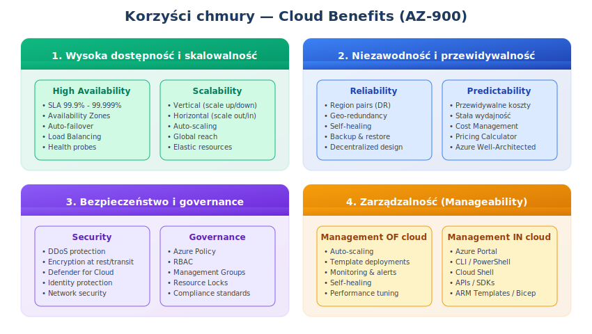

### 1. Wysoka dostępność i skalowalność (High Availability & Scalability)

**Wysoka dostępność (HA):**
- Usługi chmurowe działają w wielu strefach i regionach, minimalizując ryzyko przestojów.
- SLA gwarantujące dostępność od 99.9% do 99.999%.
- Automatyczny failover i load balancing.

**Skalowalność:**
- **Vertical Scaling** — zwiększanie mocy pojedynczego zasobu (CPU, RAM).
- **Horizontal Scaling** — dodawanie kolejnych instancji.
- **Elastyczność** — skalowanie w górę i w dół w zależności od obciążenia.

### 2. Niezawodność i przewidywalność (Reliability & Predictability)

**Niezawodność (Reliability):**
- Decentralizowana architektura — awaria jednego komponentu nie wpływa na cały system.
- Region pairs i geo-redundancy zapewniają disaster recovery.
- Self-healing — automatyczne zastępowanie uszkodzonych instancji.

**Przewidywalność (Predictability):**
- **Przewidywalność wydajności** — autoskalowanie i load balancing gwarantują stabilną wydajność.
- **Przewidywalność kosztów** — Cost Management, budgety, alerty i Pricing Calculator pozwalają planować wydatki.
- Azure Well-Architected Framework dostarcza sprawdzone wzorce.

### 3. Bezpieczeństwo i governance (Security & Governance)

**Bezpieczeństwo:**
- Wbudowana ochrona DDoS, firewalle, szyfrowanie danych w spoczynku i w tranzycie.
- Microsoft Defender for Cloud — ciągła analiza i rekomendacje bezpieczeństwa.
- Zero Trust, MFA, Conditional Access.

**Governance:**
- Azure Policy wymusza standardy organizacyjne.
- RBAC ogranicza dostęp zgodnie z zasadą least privilege.
- Resource Locks chronią przed przypadkowym usunięciem.
- Management Groups umożliwiają centralne zarządzanie wieloma subskrypcjami.

### 4. Zarządzalność (Manageability)

**Management OF the cloud** — jak chmura zarządza zasobami:
- Autoskalowanie zasobów na podstawie obciążenia.
- Wdrażanie z szablonów (ARM Templates, Bicep).
- Automatyczne monitorowanie i alerty.
- Self-healing i auto-recovery.

**Management IN the cloud** — jak zarządzasz chmurą:
- **Azure Portal** — graficzny interfejs webowy.
- **Azure CLI / PowerShell** — automatyzacja i skrypty.
- **Cloud Shell** — terminal w przeglądarce.
- **APIs / SDKs** — programowy dostęp.
- **Infrastructure as Code** — ARM Templates, Bicep, Terraform.

---

## CAPEX vs OPEX i model konsumpcyjny

- **CAPEX** – wydatki inwestycyjne (zakup serwerów, sprzętu, licencji z góry).
- **OPEX** – wydatki operacyjne (płatność cykliczna za faktyczne zużycie usług).
- **Azure działa głównie w modelu OPEX / pay‑as‑you‑go** – płacisz za wykorzystane zasoby, a nie za utrzymywanie własnego hardware.

**Na egzamin AZ‑900:** cloud zwykle redukuje CAPEX, zwiększa elastyczność kosztów i skraca czas wdrożeń.

---

## Modele cenowe Azure (Cloud Pricing Models)

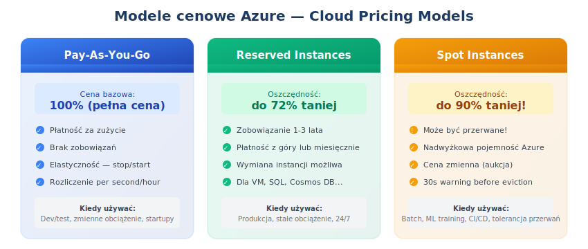

Azure oferuje trzy główne modele cenowe dla zasobów compute:

| Model | Oszczędność | Zobowiązanie | Kiedy używać |
|-------|-------------|--------------|--------------|
| **Pay-As-You-Go** | 0% (cena bazowa) | Brak | Dev/test, zmienne obciążenie |
| **Reserved Instances** | do 72% | 1-3 lata | Produkcja, stałe obciążenie 24/7 |
| **Spot Instances** | do 90% | Brak, ale może być przerwane | Batch, ML training, tolerancja przerwań |

**Dodatkowe sposoby na oszczędności:**
- **Azure Hybrid Benefit** — wykorzystanie istniejących licencji Windows/SQL Server (do 40% oszczędności).
- **Dev/Test Pricing** — tańsze ceny dla środowisk developerskich (wymaga subskrypcji VS).
- **Azure Savings Plans** — zobowiązanie do określonej kwoty/h przez 1-3 lata (elastyczniej niż RI).

---

## Skalowanie i elastyczność

### **Vertical Scaling (Scale Up / Scale Down)**
Zwiększanie lub zmniejszanie *mocy pojedynczej instancji* zasobu — np. większy rozmiar VM (więcej CPU/RAM/dysk), mocniejsza baza danych, większy plan App Service.


**Charakterystyka:**
- Skalowanie „w górę” = mocniejsza maszyna.
- Skalowanie „w dół” = tańsza/słabsza maszyna.
- Zwykle **wymaga restartu** (przestój zależny od usługi).
- Ograniczenia sprzętowe — istnieje „sufit” skali.

**Kiedy używać:** bazy danych, monolity, workloady zależne od pojedynczego węzła.

---

### **Horizontal Scaling (Scale Out / Scale In)**
Dodawanie lub usuwanie *instancji zasobu*. Zamiast jednej mocnej maszyny — wiele mniejszych pracujących równolegle.


**Charakterystyka:**
- Scale out = dodawanie instancji.
- Scale in = usuwanie instancji.
- **Brak przestojów** — nowa instancja dołącza automatycznie.
- Wymaga stateless lub odpowiedniego przechowywania sesji.

**Przykłady:**  
- VMSS (Virtual Machine Scale Sets)  
- App Service z wieloma instancjami  
- Kubernetes / AKS (HPA, VPA, node autoscaling)

**Kiedy używać:** API, web, mikroserwisy, obciążenia rozproszone.

---

### **Autoskalowanie (Automatic Scaling / Auto‑Scale)**
Automatyczne zwiększanie/zmniejszanie liczby instancji lub mocy zasobu na podstawie *metryk, progów i reguł*.


**Rodzaje autoskalowania:**
- **Metric-based** – CPU, RAM, latency, queue depth, request count.
- **Schedule-based** – konkretne godziny/dni (np. nocne / weekendy).
- **Event-based** – zdarzenia aplikacyjne (np. komunikat w kolejce).
- **Predictive autoscaling** – AI/ML przewiduje obciążenie (np. Azure Functions Premium, App Service Premium).

**Co potrafi autoscaler:**
- Dynamicznie dołącza/usuwa instancje VM / kontenerów / workerów.
- Reaguje na przeciążenia i koszt.
- Zapewnia odporność — jeśli instancja padnie, zostaje automatycznie odtworzona.

**Kiedy używać:** zmienne obciążenia, obciążenia sezonowe, systemy o ruchu skokowym (e‑commerce, IoT, integracje).

---

### **Additional Concepts (warto dodać w chmurze)**

#### **Bursting**
Tymczasowe podniesienie mocy zasobu ponad nominalną (np. Azure Premium Disks, niektóre VM).

#### **Load Balancing**
Load balancer rozprowadza ruch między instancjami, umożliwiając skuteczne scale-out.

#### **Stateless Architecture**
Wymagana do efektywnego autoskalowania — stan przechowywany poza instancjami (cache/DB/redis).

- Ważna różnica:
  - **Stateless** to serwer, który nie pamięta niczego między żądaniami.
  - **Stateful** to serwer, który musi pamiętać stan, więc kolejne żądania muszą wracać do niego.

#### **Throttling / Rate Limiting**
Kontrola obciążenia aplikacji i API w czasie autoskalowania — ochrona przed lawinowym ruchem.

---

## Odporność, Wysoka Dostępność i Disaster Recovery

### **High Availability (HA) – Wysoka dostępność**
Projektowanie infrastruktury w taki sposób, aby usługa pozostawała dostępna mimo awarii pojedynczych elementów.


**Kluczowe mechanizmy:**
- **Redundancja zasobów** – co najmniej 2 instancje (VM, kontenery, App Service) pracujące równolegle.
- **Availability Zones (AZ)** – fizycznie odseparowane strefy w regionie, każda z własnym zasilaniem, chłodzeniem i siecią.
- **Load Balancing** – równoważenie ruchu między instancjami (L4/L7).
- **Health probes** – automatyczne wykrywanie niedziałających instancji i wyłączanie ich z rotacji.
- **Autoskalowanie** – dodawanie instancji, aby uniknąć przeciążeń.

**Cel:** minimalizacja przestojów (downtime) w obrębie *jednego regionu*.

---

### **Fault Tolerance – Odporność na awarie**
System działa nawet wtedy, gdy część komponentów ulegnie całkowitej awarii — bez utraty usługi i bez przerwy.


**Cechy architektury odpornej na awarie:**
- **Brak pojedynczego punktu awarii (SPOF)** — każdy element ma co najmniej jeden duplikat.
- **Active/Active** – wszystkie instancje stale działają i są gotowe przejąć ruch.
- **Self‑healing** – automatyczne zastępowanie uszkodzonych zasobów (VMSS, Kubernetes).
- **Dane replikowane synchronicznie** – brak utraty danych przy padzie jednego węzła (np. ZRS dla storage).

**Cel:** ciągłość działania przy awariach sprzętu, instancji, stref AZ lub fragmentów infrastruktury.

---

### **Disaster Recovery (DR) – Odzyskiwanie po awarii**
Zabezpieczenie na wypadek katastrofalnej awarii całego regionu lub utraty danych.  
Skupia się na **przywróceniu pracy systemu w innym regionie**.


**Podstawowe pojęcia:**
- **RTO (Recovery Time Objective)** – jak szybko system musi zostać przywrócony (czas).
- **RPO (Recovery Point Objective)** – ile danych można stracić (czas od ostatniej replikacji).

**Techniki w Azure:**
- **Region Pairs** – każdy region ma sparowany region w tej samej geografii (szybsze przywracanie, chroniona aktualizacja).
- **Asynchroniczna replikacja danych** – Storage GRS/RA‑GRS, SQL Geo-Replication, Cosmos DB multi-region.
- **Azure Site Recovery (ASR)** – automatyczna replikacja VM, odtwarzanie aplikacji, orchestracja failover.
- **Backupy i snapshoty** – dane krytyczne przechowywane niezależnie od głównej infrastruktury.

**Scenariusze DR:**
- **Cold Standby** – zasoby odtwarzane dopiero po awarii (najtańsze).
- **Warm Standby** – ograniczona liczba maszyn działa w regionie zapasowym.
- **Hot Standby / Active-Passive** – pełna gotowość, ale ruch idzie tylko do jednego regionu.
- **Active-Active Multi‑Region** – oba regiony obsługują ruch jednocześnie.

**Cel:** utrzymanie pracy biznesu nawet w przypadku utraty całego regionu.

---

### **Podsumowanie różnic**

| Mechanizm            | Ochrona przed awarią | Poziom geograficzny | Przestój | Koszt |
|----------------------|----------------------|----------------------|----------|-------|
| **High Availability** | awaria instancji, AZ | 1 region             | bardzo niski | średni |
| **Fault Tolerance**  | pełna odporność       | 1 region (Active/Active) | praktycznie brak | wysoki |
| **Disaster Recovery** | awaria regionu        | 2+ regiony           | zależny od RTO | zróżnicowany |

---

### **Dobre praktyki odporności systemów**
- Projektuj **stateless** — stan w DB, cache, storage.
- Używaj **multi-zone** dla HA i **multi-region** dla DR.
- Testuj **regularnie failover** i aktualizuj runbooki DR.
- Wymuszaj **replikację danych** zgodnie z RPO.
- Zapewnij **monitoring + alerty** (Azure Monitor, KQL).

---

<a id="sec-02-azure-architecture"></a>
## 2. Azure Architecture (Architektura i hierarchia)
**Hierarchia i scope:**

**Hierarchia i scope — logika porządkowania zasobów w Azure**

Poniższy diagram przedstawia pełną hierarchię zarządzania w Azure — od najwyższego poziomu tożsamości (Tenant), przez struktury organizacyjne (Management Groups), aż po subskrypcje, grupy zasobów i pojedyncze zasoby.


### Hierarchia definiuje:
- **zakres (scope)**, na którym można przypisywać uprawnienia (RBAC),
- **miejsce stosowania polityk** (Azure Policy),
- **jak organizować zasoby** w skali całej organizacji,
- **gdzie przebiegają granice rozliczeń i odpowiedzialności**.

<br>

---

Ta struktura jest fundamentem pracy z Azure — wpływa na **uprawnienia, governance, koszty, compliance**, a nawet na sposób planowania architektury i CI/CD.

## Struktura Azure

- **Tenant (Microsoft Entra ID)** – główny kontener tożsamości całej organizacji. Zawiera użytkowników, grupy i zasady bezpieczeństwa.
- **Management Group** – umożliwia grupowanie wielu subskrypcji oraz nakładanie wspólnych polityk na poziomie organizacji.
- **Subscription** – określa sposób rozliczeń, limity oraz stanowi granicę uprawnień administracyjnych.
- **Resource Group (RG)** – logiczny kontener na powiązane ze sobą zasoby (np. aplikację i jej bazę danych).
- **Resource** – pojedynczy zasób lub usługa, np. VM, VNet, konto Storage, App Service itd.


- Jeden **Resource** może należeć tylko do jednej **Resource Group**.

## Globalna infrastruktura Azure


- **Geography** – obszar składający się z jednego lub kilku regionów, stanowiący granicę rezydencji i zgodności danych (np. EU, US).

- **Region** – zestaw współpołączonych centrów danych działających jako jedna lokalizacja dostarczająca usługi Azure.

- **Azure Datacenters** – fizyczne obiekty Microsoft z infrastrukturą serwerową, sieciową i zasilaniem. Są podstawą regionów oraz stref AZ, ale klienci nie zarządzają nimi bezpośrednio.

- **Regions** to miejsca na świecie, w których Azure ma swoje centra danych — dzięki temu usługi działają szybciej, bliżej użytkowników i zgodnie z lokalnymi przepisami.

  - **Public Regions**
  - Standardowe regiony Azure dostępne globalnie dla wszystkich klientów i uruchamiające pełny zestaw usług.

  - **Restricted Regions**
  - Regiony o ograniczonym dostępie, dostępne wyłącznie po akceptacji Microsoft w specjalnych scenariuszach biznesowych.

  - **Upcoming Regions**
  - Nowo ogłoszone, budowane regiony, które poszerzą globalny zasięg i spełnią lokalne wymogi rezydencji danych.

  - **Sovereign Regions** (Azure Government / China)
  - Oddzielone, suwerenne regiony przeznaczone dla rządów i krajów o szczególnych regulacjach jak USA Gov lub Chiny.

- **Availability Zone (AZ)** – fizycznie odseparowane centra danych w obrębie jednego regionu (oddzielne zasilanie, chłodzenie, sieć) zapewniające wysoki poziom odporności.

- **Region Pair** – dwa regiony w tej samej geografii sparowane ze sobą w celu zapewnienia odporności, planowania aktualizacji i disaster recovery.

## ARM (Azure Resource Manager) – warstwa zarządzania

**Azure Resource Manager (ARM)** to centralna warstwa zarządzania platformą Azure.  
Odpowiada za spójne, bezpieczne i powtarzalne zarządzanie zasobami — niezależnie od tego, z jakiego narzędzia korzystasz.


- **Spójne API** – ujednolicony mechanizm zarządzania zasobami Azure.

  Niezależnie od tego, czy korzystasz z Portalu, Azure CLI, PowerShell czy REST API, wszystkie operacje trafiają do tej samej warstwy zarządzającej. Dzięki temu działania są przewidywalne i działają tak samo w każdym narzędziu.

- **Deklaratywne wdrożenia** – możliwość opisywania infrastruktury w formie deklaratywnej, czyli definiujesz *co* ma powstać, a nie *jak to tworzyć*.  

  Azure realizuje to poprzez **ARM Templates (JSON)** oraz **Bicep**, umożliwiając automatyczne, powtarzalne i kontrolowane wdrożenia w modelu Infrastructure as Code.

        {
        "$schema": "https://schema.management.azure.com/schemas/2019-04-01/deploymentTemplate.json#",
        "contentVersion": "1.0.0.0",

        "parameters": {
            "storageAccountName": {
            "type": "string",
            "metadata": {
                "description": "Nazwa tworzonego konta Storage."
            }
            },
            "storageSku": {
            "type": "string",
            "defaultValue": "Standard_LRS",
            "allowedValues": [
                "Standard_LRS",
                "Standard_GRS",
                "Standard_ZRS",
                "Premium_LRS"
            ],
            "metadata": {
                "description": "SKU konta Storage."
            }
            }
        },

        "resources": [
            {
            "type": "Microsoft.Storage/storageAccounts",
            "apiVersion": "2022-05-01",
            "name": "[parameters('storageAccountName')]",
            "location": "[resourceGroup().location]",
            "sku": {
                "name": "[parameters('storageSku')]"
            },
            "kind": "StorageV2",
            "properties": {
                "accessTier": "Hot"
            }
            }
        ],

        "outputs": {
            "storageAccountId": {
            "type": "string",
            "value": "[resourceId('Microsoft.Storage/storageAccounts', parameters('storageAccountName'))]"
            }
        }
        }

- **Organizacja zasobów** – możliwość nadawania zasobom struktury i zabezpieczeń.  

    Przykłady organizacji zasobów:

    - **Podziel subskrypcje** według środowisk (np. Dev / Test / Prod) lub jednostek biznesowych.
    - **Używaj Resource Groups** jako kontenerów dla jednego rozwiązania lub aplikacji — zasoby o wspólnym cyklu życia powinny być razem.
    - **Dodawaj tagi**, aby oznaczać koszty, właścicieli, środowiska i elementy automatyzacji.
    - **Dodawaj blokady (locks)**, aby chronić ważne lub krytyczne zasoby przed przypadkowym usunięciem lub zmianą.
    - **Stosuj Azure Policy**, aby wymuszać standardy organizacji, np. obowiązkowe tagi, dozwolone regiony, typy zasobów.
    - **Trzymaj się konwencji nazw**, aby zasoby były łatwe do odnalezienia, filtrowania i automatyzacji.

- **Tags** służą do dodawania metadanych (np. koszt centrum, właściciel, projekt) dla naszych zasobów,  

    Najczęstsze zastosowania:

    - **Rozliczenia i kosztorysowanie** – tagi pozwalają przypisać koszt zasobów do projektu, działu, środowiska lub zespołu. Dzięki temu raporty kosztów są czytelne i dokładne.  
    Przykłady: `CostCenter=IT01`, `Project=Ecommerce`, `Environment=Prod`

    - **Zarządzanie i porządkowanie zasobów** – ułatwiają odnajdywanie i grupowanie powiązanych elementów w dużych subskrypcjach.  
    Przykłady: `Owner=Jan.Kowalski`, `Service=BackendAPI`

    - **Automatyzacja i polityki** – tagi mogą być używane przez Azure Policy, Automation, zaplanowane skrypty i governance.  
    Przykłady: automatyczne wyłączanie maszyn z tagiem `AutoShutdown=True`

    - **Bezpieczeństwo i odpowiedzialność** – jasne wskazanie właściciela lub kontaktu sprawia, że wiadomo, kto odpowiada za utrzymanie zasobu.  
    Przykład: `OwnerEmail=devops-team@example.com`

    - **Zarządzanie cyklem życia** – tagi mogą określać datę wygaśnięcia, przeglądu lub planowanego usunięcia.  
    Przykład: `ExpiryDate=2026-06-30`

- **Locks** (`Delete` / `ReadOnly`) chronią zasoby przed przypadkowym usunięciem lub modyfikacją, co jest kluczowe w utrzymaniu porządku i bezpieczeństwa w środowisku.

    **Po co?**  
    Aby chronić zasoby przed przypadkowym usunięciem lub zmianą.

    **Rodzaje blokad:**
    - **Delete** – uniemożliwia usunięcie zasobu; konfigurację nadal można zmieniać.  
    - **ReadOnly** – blokuje usuwanie i jakiekolwiek modyfikacje; zasób działa tylko w trybie odczytu.

    **Gdzie można je stosować?**
    - na poziomie: **subscription**, **resource group**, **resource**
    - blokady dziedziczą się w dół (lock na RG obejmuje wszystkie zasoby w środku)

    **Kto może je zdjąć?**
    - tylko role uprzywilejowane (np. **Owner**)

    **Kiedy stosować?**
    - zasoby krytyczne (produkcyjne sieci, Key Vault, Storage z backupami)  
    - elementy, których nie wolno usuwać ani zmieniać

    **Dlaczego to ważne?**  
    Locki chronią środowisko przed błędami administratorów i pipeline’ów automatyzacji — zapewniają porządek i bezpieczeństwo operacyjne.

---

<a id="sec-03-compute-services"></a>
## 3. Compute Services (Usługi obliczeniowe)

- **Virtual Machines (VM)**  

    Elastyczne maszyny wirtualne w wielu seriach (B, Dv5/Ev5, pamięciochłonne, obliczeniowe, GPU).  
    Obsługują **managed disks**, **VM Extensions** i dowolne systemy operacyjne.

    

    **Managed disks** czyli niezawodne dyski zarządzane dla maszyny wirtualnej.

    **VM Extensions** czyli dodatki instalowane w VM, które automatyzują konfigurację.

    **Zasoby wymagane dla VM (egzaminowo):**
    - Compute (vCPU/RAM),
    - Storage (OS Disk + opcjonalne Data Disks),
    - Networking (VNet/Subnet/NIC/IP),
    - Security/Access (NSG, role RBAC, klucze/hasła, opcjonalnie Bastion).

- **Availability Sets**  

    Zapewniają odporność na awarie dzięki podziałowi na **Fault Domains** i **Update Domains**.  
    Chronią przed skutkami awarii sprzętu oraz planowanych aktualizacji.

    

    **Fault Domains** czyli niezależne fizyczne strefy (różne racki, zasilanie, sieć).  

    **Update Domains** czyli logiczne grupy aktualizacji, restartowane osobno.

    - **VM Scale Sets (VMSS)**  

    **VM Scale Sets** to usługa umożliwiająca automatyczne uruchamianie, skalowanie i zarządzanie wieloma identycznymi maszynami wirtualnymi (VM). Wszystkie instancje oparte są na jednym *modelu* konfiguracji, co zapewnia spójność środowiska przy dużej skali.

    

  - **Autoscaling** – automatyczne zwiększanie lub zmniejszanie liczby VM na podstawie metryk (CPU, RAM, Queue Length, HTTP load) lub harmonogramów.

    - **Rolling Upgrades** – bezpieczne wdrażanie aktualizacji poprzez stopniową wymianę instancji (grupami – Update Domains), bez przestojów całego systemu.

    - **Load Balancer Integration** – natywne połączenie z Azure Load Balancer lub Application Gateway, które równomiernie rozdzielają ruch na instancje.

    - **Instance Model (VM Template)** – wzorzec definiujący obraz systemu (image), rozmiar VM, dyski, konfiguracje sieciowe, rozszerzenia i bootstrap (cloud-init/UserData).

    - **High Availability** – instancje automatycznie rozkładane są między **Fault Domains / Update Domains**, zwiększając odporność na awarie.

    - **Orchestracja** – dwa tryby:  
            - *Uniform* (domyślny): wszystkie VM są identyczne i zarządzane centralnie.  
            - *Flexible*: większa elastyczność, np. do scenariuszy z różnymi typami VM lub strefami dostępności (AZ).

    VMSS pozwala budować skalowalne, wysoko dostępne farmy serwerów opartych o identyczne VM, z automatycznym balansowaniem obciążenia i kontrolowanymi aktualizacjami.

- **App Service**  

    Zarządzana platforma do uruchamiania aplikacji Web, API i Mobile — bez konieczności zarządzania infrastrukturą.  

    

    Umożliwia łatwe wdrażanie aplikacji, obsługuje **deployment slots**, integruje się z CI/CD  
    (GitHub Actions, Azure DevOps) i zapewnia automatyczne skalowanie instancji w zależności od obciążenia.

- **Azure Functions**

    **Serverless compute** uruchamiany „na żądanie” — kod wykonuje się tylko wtedy, gdy pojawi się zdarzenie, a Ty płacisz wyłącznie za czas wykonania.
   
    Funkcje działają w planach **Consumption** (auto‑skalowanie, płatność za wykonania) oraz **Premium** (stałe instancje, VNET, dłuższe timeouty), obsługując dziesiątki triggerów i bindingów.

    

    Azure Functions = event‑driven + serverless + automatyczne skalowanie + bogaty ekosystem triggerów i bindingów.

    ### Plany hostingowe (Hosting Plans)

    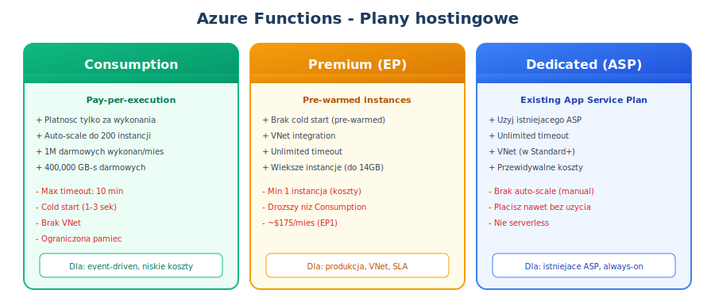

    | Plan | Cold Start | Timeout | VNet | Skalowanie | Kiedy używać |
    |------|------------|---------|------|------------|--------------|
    | **Consumption** | Tak (1-3s) | 10 min | Nie | Auto (200) | Event-driven, niskie koszty |
    | **Premium (EP)** | Nie | Unlimited | Tak | Auto + pre-warmed | Produkcja, SLA, VNet |
    | **Dedicated (ASP)** | Nie | Unlimited | Tak (Standard+) | Manual | Istniejący ASP, always-on |

    **Ceny (szacunkowe):**
    - **Consumption**: 1M wykonań/mies FREE, potem ~$0.20/1M + $0.000016/GB-s
    - **Premium EP1**: ~$175/mies (1 vCPU, 3.5GB RAM)
    - **Dedicated**: zależy od App Service Plan

    ### Triggers i Bindings

    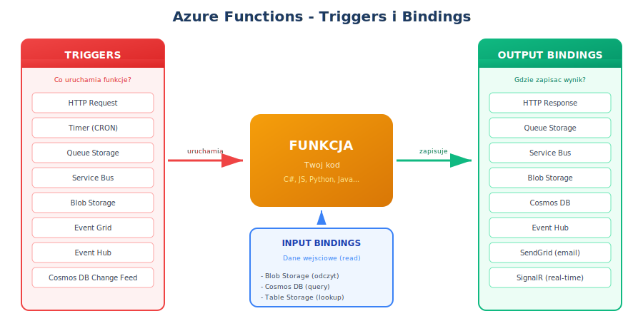

    **Triggers** – zdarzenia uruchamiające funkcję:
    | Trigger | Opis | Przykład użycia |
    |---------|------|-----------------|
    | **HTTP** | Request REST/webhook | API endpoint, webhook receiver |
    | **Timer** | CRON schedule | Scheduled jobs, cleanup tasks |
    | **Queue Storage** | Message w kolejce | Background processing |
    | **Service Bus** | Queue/Topic message | Enterprise messaging |
    | **Blob Storage** | Nowy/zmieniony blob | Image processing, file import |
    | **Event Grid** | Azure events | React to Azure resource changes |
    | **Cosmos DB** | Change feed | Real-time data sync |

    **Input/Output Bindings** – deklaratywne powiązania z usługami Azure, bez pisania boilerplate.

    ### Kluczowe komponenty

    - **Triggers** – zdarzenia uruchamiające funkcję (np. HTTP, Timer, Queue, Service Bus, Blob, Event Grid).

    - **Input/Output Bindings** – deklaratywne powiązania z usługami Azure, bez pisania boilerplate (np. zapis do Blob Storage albo pobranie wiadomości z Queue).

    - **Function App** – kontener logiczny grupujący funkcje, ich konfigurację, connection strings i runtime.

    - **Host.json** – konfiguracja środowiskowa, retry, batch size, integracje.

    - **Application Settings** – klucze, connection stringi, konfiguracja runtime.

    - **Monitoring** – wbudowana integracja z Application Insights.

    ### Rodzaje Functions
    - **Standard** functions
        
        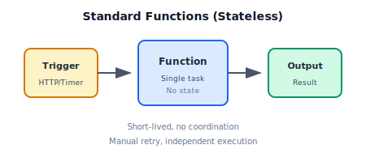
        
        - Brak stanu (Stateless)
        - Krótki stan działania
        - Brak koordynacji, ręczna koordynacja
        - Brak wbudowanego retry
        - Brak natywnego wsparcia dla workflow
    - **Durable** functions
        
        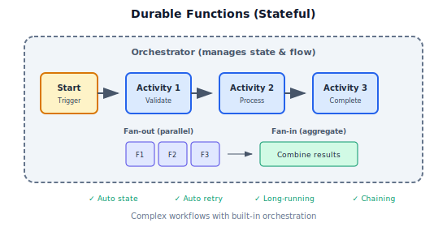
        
        - Stan zapisywany automatycznie
        - Mogą działać długo
      - Wbudowany orchestrator
        - Automatyczne retry
      - Wzorce workflow (chaining, fan-in/fan-out)
      - **Function Chaining** - wykonywanie funkcji jednej po drugiej w łańcuchu (wynik wykonania poprzedniej funkcji jest wejściem do następnej), np. ValidateOrder -> ChargePayment -> PrepareShipment -> SendConfirmation (orchestrator pilnuje kolejności wykonania funkcji w łańcuchu).
      - **FAN-IN** - wzorzec, który czeka aż wszystkie funkcje się zakończą i łączy ich wynik (agregacja)
      - **FAN-OUT** - to wzorzec pozwalający uruchomić wiele funkcji równolegle (np. przetwarzanie wielu plików na raz)
              
      Durable Functions mają gotowe mechanizmy do budowania złożonych, wieloetapowych, równoległych i długotrwałych workflow, bez konieczności implementowania własnej logiki kolejek, retry, czekania czy przechowywania stanu.

    ### Implementacja - przykłady kodu

    **HTTP Trigger (C#):**
    ```csharp
    [FunctionName("HelloWorld")]
    public static async Task<IActionResult> Run(
        [HttpTrigger(AuthorizationLevel.Function, "get", "post")] HttpRequest req,
        ILogger log)
    {
        log.LogInformation("C# HTTP trigger function processed a request.");
        
        string name = req.Query["name"];
        
        return new OkObjectResult($"Hello, {name}!");
    }
    ```

    **Timer Trigger (co 5 minut):**
    ```csharp
    [FunctionName("CleanupJob")]
    public static void Run(
        [TimerTrigger("0 */5 * * * *")] TimerInfo timer,
        ILogger log)
    {
        log.LogInformation($"Cleanup executed at: {DateTime.Now}");
        // Twoja logika cleanup
    }
    ```
    
    **CRON expressions:**
    - `0 */5 * * * *` - co 5 minut
    - `0 0 * * * *` - co godzinę
    - `0 0 0 * * *` - codziennie o północy
    - `0 0 9 * * 1-5` - pon-pt o 9:00

    **Queue Trigger z Output Binding:**
    ```csharp
    [FunctionName("ProcessOrder")]
    public static void Run(
        [QueueTrigger("orders")] string orderJson,
        [Blob("processed/{rand-guid}.json")] out string outputBlob,
        [Queue("notifications")] out string notification,
        ILogger log)
    {
        var order = JsonSerializer.Deserialize<Order>(orderJson);
        
        // Zapisz do Blob Storage
        outputBlob = JsonSerializer.Serialize(order);
        
        // Wyślij notyfikację do kolejki
        notification = $"Order {order.Id} processed";
        
        log.LogInformation($"Processed order: {order.Id}");
    }
    ```

    **Cosmos DB Trigger (Change Feed):**
    ```csharp
    [FunctionName("CosmosDBTrigger")]
    public static void Run(
        [CosmosDBTrigger(
            databaseName: "mydb",
            containerName: "products",
            Connection = "CosmosDBConnection",
            LeaseContainerName = "leases")] IReadOnlyList<Product> changes,
        ILogger log)
    {
        foreach (var product in changes)
        {
            log.LogInformation($"Product changed: {product.Name}");
            // Synchronizuj z innym systemem, indeksuj w Search, etc.
        }
    }
    ```

    ### Tworzenie przez Azure CLI

    ```bash
    # Utworzenie Resource Group
    az group create --name myFuncRG --location westeurope

    # Utworzenie Storage Account (wymagane dla Functions)
    az storage account create --name myfuncstorage123 \
        --resource-group myFuncRG --sku Standard_LRS

    # Utworzenie Function App (Consumption plan)
    az functionapp create --name myfunc123 \
        --resource-group myFuncRG \
        --storage-account myfuncstorage123 \
        --consumption-plan-location westeurope \
        --runtime dotnet --runtime-version 8 \
        --functions-version 4

    # Wdrożenie kodu (ZIP deploy)
    az functionapp deployment source config-zip \
        --resource-group myFuncRG --name myfunc123 \
        --src ./publish.zip
    ```

    ### Best Practices

    | Praktyka | Opis |
    |----------|------|
    | **Krótkie wykonanie** | Funkcje powinny być szybkie (sekundy, nie minuty) |
    | **Stateless** | Nie przechowuj stanu między wywołaniami |
    | **Idempotentność** | Funkcja powinna dawać ten sam wynik przy wielokrotnym wywołaniu |
    | **Connection pooling** | Używaj static HttpClient, reuse connections |
    | **Environment variables** | Sekrety w Application Settings, nie w kodzie |
    | **Structured logging** | Używaj ILogger z kontekstem |

- **Azure Container Instances (ACI)**  

    Azure Container Instances to najszybszy sposób uruchamiania kontenerów w Azure bez potrzeby tworzenia lub zarządzania klastrem Kubernetes.

    

    Idealne do krótkotrwałych, jednorazowych lub prostych workloadów — batch jobs, API workers, testów, automatyzacji.

    Kluczowe cechy:
    - start kontenera w kilka sekund (bez orkiestracji)
    - płatność tylko za czas działania CPU/RAM kontenera
    - obsługa obrazów z Azure Container Registry (ACR) i Docker Hub
    - wsparcie dla sidecar containers i grup kontenerów (Container Groups)
    - integracja z VNet (opcjonalnie)
    - idealne do: jobów, event-driven tasks, ETL, automatyzacji, szybkich micro‑API

  - **Azure Container Apps (ACA)**

    Zarządzana platforma do uruchamiania kontenerów bez zarządzania klastrem Kubernetes.

    Najważniejsze cechy:
    - serverless containers (skalowanie do zera i szybkie scale-out)
    - obsługa HTTP, event-driven (KEDA), revision-based deployment
    - dobre do mikroserwisów, API i background workerów

    **Różnica egzaminacyjna (skrót):**
    - **ACI** = pojedyncze/krótkie zadania kontenerowe
    - **ACA** = aplikacje kontenerowe z autoskalowaniem i prostym modelem mikroserwisów
    - **AKS** = pełna orkiestracja Kubernetes

- **AKS (Azure Kubernetes Service)**  

    Zarządzany Kubernetes w Azure, który automatyzuje większość złożonych zadań administracyjnych — takich jak aktualizacje węzłów, skalowanie, bezpieczeństwo i integracja z ekosystemem Azure.  

    

    Umożliwia uruchamianie kontenerów w modelu produkcyjnym bez konieczności samodzielnego zarządzania control plane.
    
    **Kluczowe elementy AKS:**
    - **Zarządzany control plane** – Kubernetes API server, scheduler, controller manager utrzymywane przez Azure.
    - **Node Pools (agent nodes)** – węzły robocze, na których działają pody (VM‑ki w tle).
    - **Autoscaling** – Cluster Autoscaler (CA) + Horizontal Pod Autoscaler (HPA).
    - **Integracja z ACR** – bezpośrednie pobieranie obrazów kontenerów z Azure Container Registry.
    - **Network model** – Kubenet lub Azure CNI (pełna integracja z VNet).
    - **Load Balancing** – automatyczne tworzenie Load Balancera dla usług typu LoadBalancer.
    - **AKS Add‑ons** – monitoring, logi, Application Gateway Ingress, Azure Policy, KEDA.
    - **Bezpieczeństwo** – MSI, Azure RBAC, polityki, OIDC, secret store CSI driver.

    **AKS** to w pełni zarządzany Kubernetes + automatyczne aktualizacje + skalowanie + integracje Azure (ACR, VNet, RBAC).

- **Azure Bastion**  

    Azure Bastion umożliwia bezpieczne połączenia RDP i SSH do maszyn wirtualnych **bez potrzeby wystawiania publicznych adresów IP**.  

    

    Działa przez przeglądarkę (HTML5), minimalizuje powierzchnię ataku, usuwa konieczność otwierania portów 3389/22. 

    Zapewnia dostęp w pełni przez sieć prywatną (VNet).

---

<a id="sec-04-networking"></a>
## 4. Networking (Sieci i łączność)

---

### **VNet / Subnets / UDR**

Podstawowa sieć prywatna w Azure – kontrola adresacji, segmentacji oraz tras statycznych (UDR) do kierowania ruchu.

- **VNet (Virtual Network)**  
  Logiczna sieć prywatna w Azure, działająca podobnie do klasycznej sieci LAN.  
  Umożliwia pełną kontrolę nad adresacją IP, komunikacją między zasobami, integracją z siecią on‑prem oraz izolacją środowisk.

- **Subnets**  
  Podział VNet na mniejsze logiczne segmenty w celu separacji usług, zwiększenia bezpieczeństwa i kontroli dostępu.  
  Pozwalają przypisywać różne NSG, UDR i zasady per segment, np. subnet „App”, „DB”, „Gateway”.

- **UDR (User Defined Routes)**  
  Niestandardowe trasy wymuszające kierowanie ruchu przez określone urządzenia, np. firewall NVA.


Najczęstsze zastosowania:
- kierowanie ruchu przez firewall (NVA / Azure Firewall)  
- wymuszenie ruchu między subnetami  
- tunelowanie ruchu do on‑prem / VPN / ExpressRoute  
- blokowanie lub przekierowanie wybranych sieci

### **Azure DNS**

Usługa hostowania stref DNS w Azure:
- public DNS zones dla rekordów dostępnych z Internetu,
- private DNS zones dla rozwiązywania nazw wewnątrz VNet,
- integracja z Private Endpoint (rekordy `privatelink`).

Egzaminowo: **Azure DNS odpowiada za rozwiązywanie nazw**, a nie za filtrowanie ruchu czy balansowanie L7.

---

### **NSG (Network Security Groups)**


**NSG (Network Security Group)** to podstawowy firewall warstwy 3/4 (L3/L4) filtrujący ruch sieciowy na poziomie IP i portów. Może być przypisany do subnetu lub bezpośrednio do karty sieciowej (NIC) maszyny wirtualnej.

**Elementy reguły NSG:**

| Element | Opis | Przykład |
|---------|------|----------|
| **Priority** | 100-4096; niższy = wyższy priorytet | 100, 200, 300 |
| **Name** | Unikalna nazwa reguły | AllowSSH, DenyAll |
| **Source** | IP, zakres CIDR, Service Tag, ASG | 10.0.0.0/24, Internet |
| **Source Port** | * lub konkretny port | *, 443 |
| **Destination** | IP, zakres CIDR, Service Tag, ASG | VirtualNetwork |
| **Destination Port** | Port lub zakres portów | 22, 80, 443, 8080-8090 |
| **Protocol** | TCP, UDP, ICMP, Any | TCP |
| **Action** | Allow / Deny | Allow |

**Domyślne reguły (nie można usunąć):**

| Priority | Nazwa | Kierunek | Źródło | Cel | Akcja |
|----------|-------|----------|--------|-----|-------|
| 65000 | AllowVnetInBound | Inbound | VirtualNetwork | VirtualNetwork | Allow |
| 65001 | AllowAzureLoadBalancerInBound | Inbound | AzureLoadBalancer | * | Allow |
| 65500 | DenyAllInBound | Inbound | * | * | **Deny** |
| 65000 | AllowVnetOutBound | Outbound | VirtualNetwork | VirtualNetwork | Allow |
| 65001 | AllowInternetOutBound | Outbound | * | Internet | Allow |
| 65500 | DenyAllOutBound | Outbound | * | * | **Deny** |

**Ewaluacja reguł:**

```
Ruch przychodzący → Priority 100 → (match?) → ALLOW/DENY
                          ↓ (no match)
                    Priority 200 → (match?) → ALLOW/DENY
                          ↓ (no match)
                    Priority 300 → ...
                          ↓ (no match)
                    Priority 65500 → DENY (domyślna)
```

**Gdzie przypisać NSG?**

| Poziom | Zalety | Wady | Kiedy używać |
|--------|--------|------|--------------|
| **Subnet** | Jedna konfiguracja dla wszystkich VM | Mniej granularna kontrola | Wspólne reguły dla grupy VM |
| **NIC** | Granularna kontrola per VM | Więcej zarządzania | Specyficzne wymagania VM |
| **Oba** | Maksymalna kontrola | Złożoność, trudniejszy debug | Wielowarstwowa ochrona |

> **Uwaga:** Gdy NSG jest na obu poziomach, ruch musi przejść przez **OBA** - najpierw subnet NSG, potem NIC NSG.

**Service Tags - predefiniowane grupy IP:**

| Service Tag | Opis |
|-------------|------|
| **Internet** | Cała przestrzeń publiczna IP |
| **VirtualNetwork** | Wszystkie adresy w VNet + peered VNets |
| **AzureLoadBalancer** | Health probes Load Balancera |
| **Storage** | Wszystkie adresy Azure Storage |
| **Sql** | Adresy Azure SQL Database |
| **AzureActiveDirectory** | Adresy Microsoft Entra ID |
| **AzureMonitor** | Adresy Azure Monitor/Log Analytics |
| **AzureKeyVault** | Adresy Azure Key Vault |

**Tworzenie NSG przez CLI:**

```bash
# Utworzenie NSG
az network nsg create --name myNSG \
    --resource-group myRG --location westeurope

# Dodanie reguły Allow SSH
az network nsg rule create --nsg-name myNSG \
    --resource-group myRG --name AllowSSH \
    --priority 100 --direction Inbound \
    --source-address-prefixes Internet \
    --destination-port-ranges 22 \
    --protocol Tcp --access Allow

# Dodanie reguły Allow HTTP/HTTPS
az network nsg rule create --nsg-name myNSG \
    --resource-group myRG --name AllowWeb \
    --priority 200 --direction Inbound \
    --source-address-prefixes Internet \
    --destination-port-ranges 80 443 \
    --protocol Tcp --access Allow

# Dodanie reguły dla Storage (Service Tag)
az network nsg rule create --nsg-name myNSG \
    --resource-group myRG --name AllowStorageOutbound \
    --priority 100 --direction Outbound \
    --destination-address-prefixes Storage \
    --destination-port-ranges 443 \
    --protocol Tcp --access Allow

# Przypisanie NSG do subnetu
az network vnet subnet update --vnet-name myVNet \
    --name mySubnet --resource-group myRG \
    --network-security-group myNSG

# Przypisanie NSG do NIC
az network nic update --name myVM-NIC \
    --resource-group myRG \
    --network-security-group myNSG
```

**Diagnostyka NSG:**

```bash
# Sprawdzenie effective rules (suma subnet + NIC)
az network nic show-effective-nsg --name myVM-NIC \
    --resource-group myRG

# NSG Flow Logs (wymaga Network Watcher)
az network watcher flow-log create --name myFlowLog \
    --resource-group myRG --nsg myNSG \
    --storage-account myStorageAccount --enabled true
```

**Porównanie NSG vs Azure Firewall:**

| Aspekt | NSG | Azure Firewall |
|--------|-----|----------------|
| **Warstwa** | L3/L4 (IP, porty) | L3/L4 + L7 (aplikacja) |
| **Zasięg** | Subnet/NIC | Cały VNet/Hub |
| **FQDN filtering** | ❌ Nie | ✅ Tak |
| **Threat Intelligence** | ❌ Nie | ✅ Tak |
| **TLS inspection** | ❌ Nie | ✅ Tak (Premium) |
| **Centralny** | ❌ Nie | ✅ Tak |
| **Koszt** | Darmowy | ~$900+/miesiąc |
| **Use case** | Podstawowa filtracja | Enterprise security |

**Dobre praktyki NSG:**

| Praktyka | Opis |
|----------|------|
| **Używaj Service Tags** | Zamiast hardkodować IP Microsoft |
| **Nazywaj reguły opisowo** | AllowSSH, DenyInternet, nie Rule1 |
| **Zostawiaj gaps w Priority** | 100, 200, 300 - nie 100, 101, 102 |
| **Włącz Flow Logs** | Do audytu i troubleshootingu |
| **NSG na subnet** | Jako baseline, NIC dla wyjątków |
| **Dokumentuj reguły** | Dlaczego ta reguła istnieje? |

> **Egzamin:** NSG działa jak ACL – pozwala/blokuje ruch, ale go **nie inspektuje**. Dla inspekcji L7 użyj Azure Firewall.

---

### **ASG (Application Security Groups)**


**ASG (Application Security Groups)** to logiczne grupowanie maszyn wirtualnych według ich funkcji w aplikacji. Zamiast pisać reguły NSG z konkretnymi adresami IP, używasz nazw grup aplikacyjnych.

**Problem bez ASG:**
```
Reguła 1: Allow 10.0.1.5 → 10.0.2.10:443
Reguła 2: Allow 10.0.1.5 → 10.0.2.11:443
Reguła 3: Allow 10.0.1.6 → 10.0.2.10:443
Reguła 4: Allow 10.0.1.6 → 10.0.2.11:443
... dziesiątki reguł do zarządzania!
```

**Rozwiązanie z ASG:**
```
Reguła 1: Allow WebServers-ASG → ApiServers-ASG:443
Jedna reguła zamiast wielu!
```

**Kluczowe zalety:**

| Zaleta | Opis |
|--------|------|
| **Uproszczone reguły** | Zamiast IP używasz logicznych nazw grup |
| **Dynamiczne członkostwo** | Nowa VM automatycznie dziedziczy reguły po przypisaniu do ASG |
| **Czytelność** | Reguły opisują intencję (WebServers→ApiServers) |
| **Mniej błędów** | Nie musisz aktualizować reguł przy zmianie IP |
| **Skalowalność** | Dodanie VM = przypisanie do ASG, bez zmian w NSG |

**Typowa architektura 3-warstwowa:**

| ASG | Członkowie | Dozwolony ruch przychodzący |
|-----|------------|----------------------------|
| **WebServers-ASG** | Web VM 1, Web VM 2, ... | Internet → port 80, 443 |
| **ApiServers-ASG** | API VM 1, API VM 2, ... | WebServers-ASG → port 8080 |
| **DbServers-ASG** | SQL VM 1, SQL VM 2, ... | ApiServers-ASG → port 1433 |

**Tworzenie ASG przez CLI:**

```bash
# Utworzenie ASG
az network asg create --name WebServers-ASG \
    --resource-group myRG --location westeurope

az network asg create --name ApiServers-ASG \
    --resource-group myRG --location westeurope

az network asg create --name DbServers-ASG \
    --resource-group myRG --location westeurope

# Przypisanie VM do ASG (przez NIC)
az network nic update --name myWebVM-NIC \
    --resource-group myRG \
    --application-security-groups WebServers-ASG

# Reguła NSG używająca ASG
az network nsg rule create --nsg-name myNSG \
    --resource-group myRG --name AllowWebToApi \
    --priority 100 --direction Inbound \
    --source-asgs WebServers-ASG \
    --destination-asgs ApiServers-ASG \
    --destination-port-ranges 8080 \
    --protocol Tcp --access Allow

az network nsg rule create --nsg-name myNSG \
    --resource-group myRG --name AllowApiToDb \
    --priority 110 --direction Inbound \
    --source-asgs ApiServers-ASG \
    --destination-asgs DbServers-ASG \
    --destination-port-ranges 1433 \
    --protocol Tcp --access Allow
```

**Ograniczenia ASG:**

| Ograniczenie | Wartość |
|--------------|---------|
| ASG per subscription | 3000 |
| NIC może należeć do | Wielu ASG |
| ASG musi być w tym samym | Regionie co VM |
| Członkowie ASG muszą być w | Tym samym VNet |
| Mieszanie ASG i IP w jednej regule | NIE dozwolone |

**Porównanie: ASG vs bez ASG**

| Aspekt | Bez ASG (IP-based) | Z ASG |
|--------|-------------------|-------|
| Reguły w NSG | Wiele (per IP) | Pojedyncze (per grupa) |
| Nowa VM | Aktualizacja reguł | Tylko przypisanie do ASG |
| Zmiana IP VM | Aktualizacja reguł | Brak zmian |
| Czytelność | Niska (adresy IP) | Wysoka (nazwy logiczne) |
| Błędy | Częste | Rzadkie |

> **Egzamin:** ASG to logiczne grupowanie VM dla uproszczenia reguł NSG. NIE jest to firewall - to sposób organizacji reguł w NSG.

---

### **Azure Firewall**


**Azure Firewall** to w pełni zarządzany, stanowy firewall warstwy L3–L7, wdrażany jako usługa PaaS w dedykowanym subnecie (`AzureFirewallSubnet`).

**Kluczowe funkcje:**
| Funkcja | Opis |
|---------|------|
| **FQDN Filtering** | Filtrowanie po nazwach domenowych (np. `*.microsoft.com`) |
| **URL Filtering** | Filtrowanie po pełnych URL (Premium) |
| **Web Categories** | Blokowanie kategorii stron (gambling, adult, etc.) |
| **Threat Intelligence** | Automatyczne blokowanie znanych malicious IPs |
| **TLS Inspection** | Deszyfrowanie i inspekcja HTTPS (Premium) |
| **SNAT/DNAT** | Source/Destination NAT dla ruchu sieciowego |
| **IDPS** | Intrusion Detection & Prevention (Premium) |

#### Warstwy Azure Firewall

| Cecha | Standard | Premium |
|-------|----------|---------|
| L3-L4 filtering | Tak | Tak |
| FQDN filtering | Tak | Tak |
| Threat Intelligence | Alert/Deny | Alert/Deny |
| TLS Inspection | Nie | Tak |
| IDPS | Nie | Tak |
| URL Filtering | Nie | Tak |
| Web Categories | Podstawowe | Rozszerzone |
| Cena | ~$1.25/godz | ~$1.75/godz |

#### Kolekcje reguł (Rule Collections)

Reguły są przetwarzane w kolejności priorytetu (niższy numer = wyższy priorytet):

**1. NAT Rules (DNAT)** - priorytet 100-300
```
Przekierowanie ruchu przychodzącego z Internetu do wewnętrznych zasobów.

Przykład:
  Source: * (Internet)
  Destination: Firewall Public IP:443
  Translated: 10.0.1.5:443 (internal web server)
```

**2. Network Rules (L3/L4)** - priorytet 200-65000
```
Filtrowanie po IP, porcie i protokole.

Przykład:
  Source: 10.0.0.0/16 (VNet)
  Destination: 8.8.8.8
  Port: 53
  Protocol: UDP
  Action: Allow
```

**3. Application Rules (L7)** - priorytet 200-65000
```
Filtrowanie HTTP/HTTPS po FQDN lub URL.

Przykład:
  Source: 10.0.0.0/16
  Target FQDNs: *.windowsupdate.com, *.microsoft.com
  Protocol: Https:443
  Action: Allow
```

#### Konfiguracja przez Azure CLI

```bash
# Utworzenie Resource Group i VNet
az group create --name myFWRG --location westeurope
az network vnet create --name myVNet --resource-group myFWRG \
    --address-prefix 10.0.0.0/16

# Utworzenie AzureFirewallSubnet (wymagana nazwa!)
az network vnet subnet create --name AzureFirewallSubnet \
    --resource-group myFWRG --vnet-name myVNet \
    --address-prefix 10.0.1.0/26

# Utworzenie Public IP dla Firewall
az network public-ip create --name myFW-PIP --resource-group myFWRG \
    --sku Standard --allocation-method Static

# Utworzenie Azure Firewall
az network firewall create --name myFirewall \
    --resource-group myFWRG --location westeurope

# Konfiguracja IP
az network firewall ip-config create --firewall-name myFirewall \
    --name myFWConfig --public-ip-address myFW-PIP \
    --resource-group myFWRG --vnet-name myVNet

# Dodanie Network Rule Collection
az network firewall network-rule create \
    --firewall-name myFirewall --resource-group myFWRG \
    --collection-name "AllowDNS" --priority 200 \
    --action Allow --name "DNS" \
    --source-addresses "10.0.0.0/16" \
    --destination-addresses "8.8.8.8" "8.8.4.4" \
    --destination-ports 53 --protocols UDP

# Dodanie Application Rule Collection
az network firewall application-rule create \
    --firewall-name myFirewall --resource-group myFWRG \
    --collection-name "AllowWeb" --priority 300 \
    --action Allow --name "MicrosoftUpdates" \
    --source-addresses "10.0.0.0/16" \
    --target-fqdns "*.windowsupdate.com" "*.microsoft.com" \
    --protocols Https=443
```

#### Firewall Policy (zalecane)

Firewall Policy to centralny obiekt zarządzania regułami, który można przypisać do wielu firewalli:

```bash
# Utworzenie Firewall Policy
az network firewall policy create --name myPolicy \
    --resource-group myFWRG --location westeurope

# Utworzenie Rule Collection Group
az network firewall policy rule-collection-group create \
    --name DefaultRuleCollectionGroup \
    --policy-name myPolicy --resource-group myFWRG \
    --priority 100

# Przypisanie Policy do Firewall
az network firewall update --name myFirewall \
    --resource-group myFWRG \
    --firewall-policy myPolicy
```

#### Hub-Spoke Architecture


**Hub-Spoke** to najpopularniejsza architektura sieciowa w Azure dla środowisk enterprise. Opiera się na centralnym VNecie (Hub), który łączy się z wieloma VNetami aplikacyjnymi (Spokes) za pomocą VNet Peering.

**Koncepcja:**
- **Hub VNet** = centralny węzeł z usługami współdzielonymi
- **Spoke VNets** = izolowane VNety dla różnych aplikacji/środowisk
- **VNet Peering** = połączenie Hub ↔ Spoke (bez tranzytywności!)

**Co umieszczamy w Hub:**
| Usługa | Rola |
|--------|------|
| **Azure Firewall** | Centralny firewall dla całego ruchu |
| **VPN Gateway** | Połączenie z on-premises |
| **ExpressRoute Gateway** | Dedykowane połączenie z on-prem |
| **Azure Bastion** | Bezpieczny dostęp RDP/SSH |
| **DNS Server** | Centralne rozwiązywanie nazw |
| **NVA** | Network Virtual Appliances (3rd party) |

**Co umieszczamy w Spokes:**
- Aplikacje produkcyjne (Spoke: Production)
- Środowiska deweloperskie (Spoke: Development)
- Bazy danych (Spoke: Databases)
- Zarządzanie i monitoring (Spoke: Management)

**Dlaczego Hub-Spoke?**

| Zaleta | Opis |
|--------|------|
| **Izolacja** | Każdy Spoke jest oddzielony od innych |
| **Centralne bezpieczeństwo** | Jeden Firewall kontroluje cały ruch |
| **Koszt** | Współdzielone usługi (VPN GW, Firewall) zamiast duplikacji |
| **Skalowalność** | Łatwe dodawanie nowych Spokes |
| **Compliance** | Różne regulacje dla różnych Spokes |

**Ważne: VNet Peering NIE jest tranzytywny!**

```
Spoke1 ←→ Hub ←→ Spoke2

Spoke1 NIE może rozmawiać z Spoke2 bezpośrednio przez peering!
Ruch musi przejść przez Hub (np. przez Azure Firewall lub NVA).
```

**Rozwiązania dla komunikacji Spoke-to-Spoke:**
1. **Azure Firewall/NVA** - ruch routowany przez Hub (UDR)
2. **Virtual WAN** - natywna tranzytywność
3. **Bezpośredni peering** - Spoke ↔ Spoke (dodatkowy koszt, brak kontroli)

**Przykładowa konfiguracja sieci:**
```
Hub VNet:        10.0.0.0/16
  ├── AzureFirewallSubnet:  10.0.1.0/26
  ├── GatewaySubnet:        10.0.2.0/27
  └── AzureBastionSubnet:   10.0.3.0/26

Spoke1 (Prod):   10.1.0.0/16
Spoke2 (Dev):    10.2.0.0/16
Spoke3 (DB):     10.3.0.0/16
On-premises:     192.168.0.0/16
```

**Konfiguracja UDR dla Spoke-to-Spoke przez Firewall:**

```bash
# Route Table dla każdego Spoke
az network route-table create --name Spoke1-RT --resource-group myRG

# Route do innych Spokes przez Firewall
az network route-table route create --name ToSpoke2 \
    --route-table-name Spoke1-RT --resource-group myRG \
    --address-prefix 10.2.0.0/16 \
    --next-hop-type VirtualAppliance \
    --next-hop-ip-address 10.0.1.4  # Firewall private IP

# Route do on-premises przez Firewall
az network route-table route create --name ToOnPrem \
    --route-table-name Spoke1-RT --resource-group myRG \
    --address-prefix 192.168.0.0/16 \
    --next-hop-type VirtualAppliance \
    --next-hop-ip-address 10.0.1.4

# Default route (Internet) przez Firewall
az network route-table route create --name ToInternet \
    --route-table-name Spoke1-RT --resource-group myRG \
    --address-prefix 0.0.0.0/0 \
    --next-hop-type VirtualAppliance \
    --next-hop-ip-address 10.0.1.4
```

**Porównanie: Hub-Spoke vs Virtual WAN**

| Cecha | Hub-Spoke (manual) | Azure Virtual WAN |
|-------|-------------------|-------------------|
| Tranzytywność | UDR + Firewall/NVA | Natywna |
| Zarządzanie | Ręczne | Automatyczne |
| Skalowalność | Do ~100 Spokes | Do 1000+ |
| Koszt | Niższy (DIY) | Wyższy (managed) |
| Złożoność | Średnia | Niska |
| Multi-region | Wymaga konfiguracji | Wbudowane |

> **Egzamin:** Hub-Spoke to wzorzec architektoniczny, nie usługa Azure. Virtual WAN to managed service, który implementuje Hub-Spoke automatycznie.

#### Porównanie z NSG

| Cecha | NSG | Azure Firewall |
|-------|-----|----------------|
| Warstwa | L3/L4 | L3-L7 |
| Stateful | Tak | Tak |
| FQDN filtering | Nie | Tak |
| URL filtering | Nie | Tak (Premium) |
| Threat Intelligence | Nie | Tak |
| TLS Inspection | Nie | Tak (Premium) |
| Centralne zarządzanie | Nie | Tak (Policy) |
| Logging | Flow Logs | Azure Monitor |
| Koszt | Darmowe | ~$1.25-1.75/godz |
| Kiedy używać | Per-subnet ACL | Centralny firewall |

> **Egzamin:** NSG = prosty ACL na poziomie subnet/NIC, Azure Firewall = enterprise-grade firewall z inspekcją ruchu.

---

### **VNet Peering**

Bezpośrednie, szybkie połączenie dwóch VNetów **bez tuneli, NAT i VPN**.


Cechy:
- komunikacja IP‑to‑IP po prywatnym backbone Azure,  
- bardzo niskie opóźnienia,  
- brak NAT,  
- globalny peering między regionami.

---

### **VPN Gateway**

Brama VPN umożliwiająca szyfrowane połączenia IPsec.


#### **Site‑to‑Site (S2S)**
- Używasz S2S, gdy chcesz połączyć całą sieć on‑prem z Azure.
- tunel router ↔ Azure (cała sieć ↔ VNet),  
- wymaga publicznego IP po stronie on‑prem.

#### **Point‑to‑Site (P2S)**  
- VPN dla pojedynczego użytkownika (OpenVPN / IKEv2 / Azure VPN Client),  
- nie wymaga infrastruktury po stronie użytkownika.


---

### **ExpressRoute**

Prywatne łącze WAN do Azure, całkowicie poza publicznym Internetem.


Cechy:
- 50 Mbps – 100 Gbps,  
- stabilne parametry i SLA operatorskie,  
- private peering (VNet), Microsoft peering (wybrane usługi publiczne Microsoft),  
- idealny do krytycznych aplikacji i masowych migracji.
- połączenie jest prywatne, ale nie szyfrowane.

Rodzaje:
- **Standard** – połączenia do regionu w tym samym obszarze geograficznym.
- **Premium** – dostęp do wszystkich regionów + większe limity VNetów/tras.

---

### **Public Endpoint / Private Endpoint / Service Endpoint**


#### **Public Endpoint**
- publiczny adres IP usługi PaaS,
- dostęp przez Internet (można ograniczyć firewallami / Access Restrictions),
- brak izolacji sieciowej — ruch zawsze trafia na publiczny endpoint.

#### **Private Endpoint**
- prywatny IP w Twoim VNet (z subnetu),
- dostęp przez Azure Private Link (prywatny backbone),
- wymaga prywatnych stref DNS (privatelink.azure.com),
- najwyższy poziom izolacji (pełne odcięcie Internetu).

#### **Service Endpoint**
- nie tworzy prywatnego IP,
- ruch do PaaS przechodzi po prywatnym backbone Azure,
- nadal używa publicznego endpointu usługi,
- mniej izolacji niż Private Endpoint.

Pułapki:
- Public Endpoint + złe reguły = przypadkowe wystawienie danych do Internetu
- Private Endpoint może „schować” usługę przed światem (konieczny poprawny DNS)
- Service Endpoint nie działa cross‑tenant
- Private Endpoint blokuje publiczny dostęp przy ustawieniu Deny public network access
- Service Endpoint nie korzysta z NAT — usługa widzi regionalny adres źródłowy Azure

---

### **Public IP (Basic vs Standard)**

- **Basic**
  - brak stref AZ,  
  - mniej bezpieczne,  
  - brak SLA.

- **Standard**
  - strefowy (zone‑redundant),  
  - domyślnie „secure by default”,  
  - płatny za sam przydział.

---

### **NAT Gateway**

Zalecane rozwiązanie dla wychodzącego ruchu Internetowego (egress).

Cechy:
- jedno źródło ruchu (stały publiczny IP/prefix),  
- wysoka skalowalność (miliony SNAT),  
- lepsze niż SNAT na Load Balancer.

---

### **DDoS Protection**

- **Basic** – zawsze włączone, automatyczne.  
- **Standard** – ochrona warstw **L3/L4**: wolumetria, SYN flood, UDP flood.

> DDoS Standard nie chroni L7 — od tego jest **WAF**.

---

### **WAF (Web Application Firewall)**

Firewall L7 (HTTP/S), ochrona webowych aplikacji przed:
- OWASP Top 10,  
- botami,  
- wstrzykiwaniem,  
- anomaliami.

Dostępny jako:
- WAF on Application Gateway (regionalny),  
- WAF on Azure Front Door (globalny edge).

---

### **Load Balancing i Edge Networking**

#### **Azure Load Balancer (L4)**  


Warstwa 4 – TCP/UDP. Szybki, prosty, idealny dla VM/VMSS.

#### **Application Gateway (L7 + WAF)**  


Warstwa 7 – routing HTTP/S, WAF, SSL termination, cookie affinity.

#### **Traffic Manager (DNS LB)**  


Stosowany na poziomie DNS – georouting, failover, weighted.

#### **Azure Front Door (L7 Edge)**   


Globalny CDN + smart routing L7 + WAF na edge.

---

### **Porównanie usług LB (skrót)**

| Usługa | Warstwa | Zastosowania | Zakres |
|--------|---------|--------------|--------|
| Load Balancer | L4 | VM/VMSS, TCP/UDP | Regional |
| Application Gateway | L7 | Web apps + WAF | Regional |
| Traffic Manager | DNS | Global routing DNS | Global |
| Front Door | L7 Edge | Global web apps, WAF, caching | Global |

---

### **Network Watcher**

Narzędzia do diagnostyki:
- IP Flow Verify,  
- NSG Flow Logs,  
- Connection Troubleshoot,  
- Packet Capture.

Umożliwia analizę ruchu i debugowanie problemów sieciowych.

---

<a id="sec-05-storage"></a>
## 5. Storage (Przechowywanie danych)

**Azure Storage** to zestaw usług do przechowywania plików, obiektów, danych NoSQL oraz dysków dla maszyn wirtualnych. 

Poniżej znajdziesz jasne i zrozumiałe wyjaśnienie, czym są poszczególne typy storage, po co się ich używa oraz jak działa redundancja danych.


---

## **Typy danych i ich zastosowania**

**Blob Storage** (obiekty / pliki)
Najbardziej uniwersalne miejsce na duże, niestrukturalne dane.

- **Hot** najczęściej używane dane, najwyższy koszt przechowywania, najniższy koszt dostępu.
- **Cool** dane rzadziej używane (dni–miesiące).
- **Cold** dane używane bardzo rzadko (miesiące–lata), tańsze od Cool, droższe od Archive pod względem odczytu.
- **Archive** dane długoterminowe, najniższy koszt przechowywania, ale bardzo drogi i wolny odczyt (kilka godzin).

Zastosowania: kopie zapasowe, logi, obrazy, filmy, dane ML, statyczne pliki

---

**Azure Files** (udzialy sieciowe)
Chmurowy odpowiednik klasycznego Windows File Server.

- SMB/NFS udziały sieciowe  
- Azure File Sync do synchronizacji z lokalnym serwerem plików  
- Zastosowania: udziały użytkowników, zasoby współdzielone, migracje serwerów plików

**Access Tiers** dla Azure Files
Azure Files obsługuje warstwy wydajności i warstwy dostępu, podobnie jak Blob Storage — ale inaczej działające.

Warstwy wydajności (Performance Tiers):
- **Standard** (HDD/SSD) – najtańszy, idealny dla klasycznych udziałów SMB/NFS
- **Premium** (SSD) – wysoka przepustowość i niski latency (np. FSLogix, intensywne I/O)

---

**Queue Storage** (kolejki wiadomości)
Prosta, skalowalna kolejka komunikatów dla architektur event‑driven.

- komunikacja asynchroniczna między usługami  
- idealna dla mikroserwisów, workerów, batch processing

---

**Table Storage** (NoSQL key‑value)
Tania, szybka i schematless baza NoSQL do ogromnych ilości danych.

- dane w formie PartitionKey + RowKey  
- idealne dla logów, metadanych, telemetrii, konfiguracji  
- alternatywa: Cosmos DB Table API

---

**Managed Disks** (dyski dla VM)
Dyski zarządzane przez Azure, wykorzystywane przez maszyny wirtualne.

- Premium SSD — produkcja, wysokie IOPS  
- Standard SSD — solidny kompromis cena/wydajność  
- Standard HDD — archiwizacja, testy  
- Ultra SSD — bardzo wysokie IOPS i throughput  
- OS Disk / Data Disk / Temp Disk (lokalny, nietrwały)

---

## **Redundancja danych (odporność na awarie)**


**LRS — Locally Redundant Storage**
- 3 kopie danych w jednym datacenter  
- najniższy koszt  
- odporność tylko w obrębie pojedynczego DC

**ZRS — Zone Redundant Storage**
- replikacja między 3 strefami Availability Zone  
- ochrona przed awarią całej strefy  
- stabilny wybór dla środowisk produkcyjnych

**GRS — Geo Redundant Storage**
- LRS + kopia do regionu pary  
- 6 kopii danych łącznie  
- ochrona przed awarią całego regionu

**RA‑GRS — Read‑Access GRS**
- jak GRS, ale region zapasowy jest możliwy do odczytu  
- idealne dla globalnych aplikacji, które potrzebują dostępu read-only w czasie awarii

### Storage account options (skrót)

- **Performance tiers**: `Standard` (HDD/SSD) oraz `Premium` (SSD).
- **Redundancy options**: LRS, ZRS, GRS, RA‑GRS (zależnie od typu konta i regionu).
- **Access model**: public endpoint, private endpoint, firewall/VNet rules.
- **Security options**: szyfrowanie at-rest (Microsoft-managed keys lub customer-managed keys), soft delete, immutability (dla wybranych scenariuszy).

Na AZ‑900 kluczowe jest dobranie konta pod: koszt, wydajność, wymagania sieciowe i odporność.

### Backup vs Replication (częsta pułapka)

- **Replication** (LRS/ZRS/GRS/RA‑GRS) zwiększa dostępność i trwałość danych, ale **nie zastępuje backupu**.
- **Backup** służy do odtworzenia danych po błędach logicznych (np. przypadkowe usunięcie, ransomware, nadpisanie).
- Egzaminowo: replikacja chroni głównie przed awarią infrastruktury, backup chroni przed utratą danych z powodów operacyjnych i bezpieczeństwa.

### Dostęp do Storage: Entra RBAC vs SAS vs Access Keys

| Metoda | Kiedy używać | Ryzyko / uwaga |
|---|---|---|
| Entra ID + RBAC | domyślnie dla użytkowników i aplikacji | najlepszy model least privilege |
| SAS Token | delegowany, czasowy dostęp do konkretnego obiektu/zakresu | kontroluj TTL i uprawnienia (Read/Write/List) |
| Access Keys | tylko gdy nie da się użyć RBAC/SAS | szerokie uprawnienia; wymaga rotacji kluczy |

Rekomendacja praktyczna: **najpierw RBAC**, potem **SAS** dla delegacji, a **Access Keys** traktuj jako opcję awaryjną/legacy.

---

## **Narzędzia i migracje**

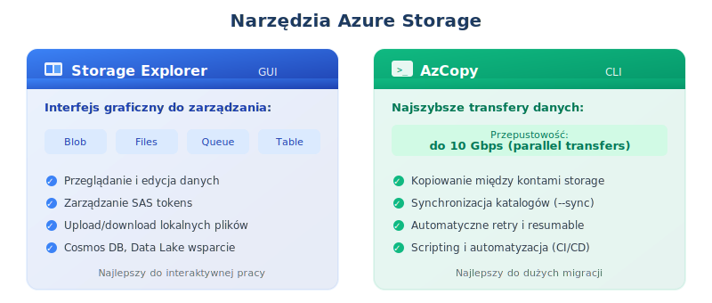

**Storage Explorer**
Narzędzie GUI do zarządzania Blob/Files/Queue/Table.

- przeglądanie i edycja danych  
- zarządzanie dostępem (SAS)  
- wygodne operacje na dużych strukturach plików  

**AzCopy**
Najszybsze narzędzie do przesyłania danych do/z Azure Storage.

- praca w CLI  
- wysoka wydajność  
- idealne do migracji dużych wolumenów

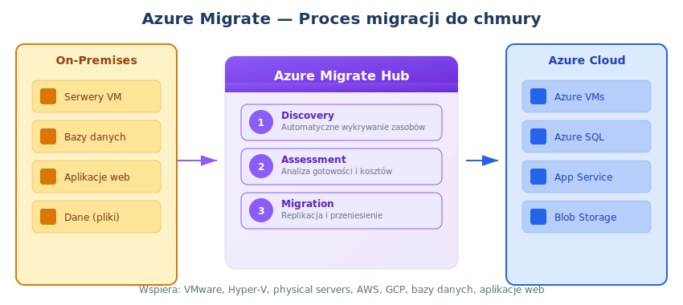

**Azure Migrate**
Aplikacje, VM‑ki i dane mogą być analizowane i migrowane do Azure.

- automatyczne rekomendacje  
- integracja z Azure Storage (np. blob staging)


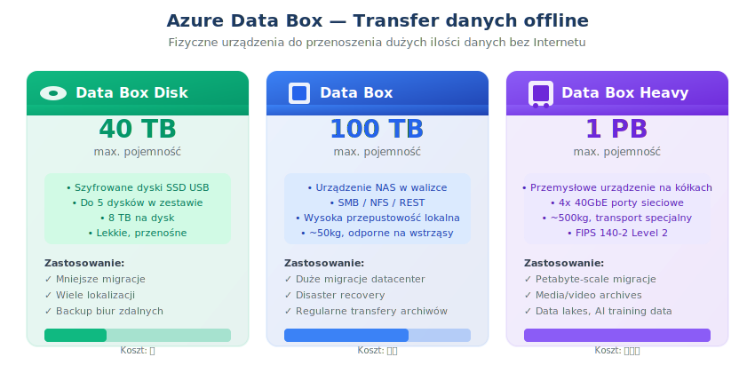

**Data Box**  
Fizyczne urzadzenia Azure do przenoszenia bardzo duzych ilosci danych **offline**, bez wykorzystania Internetu.  
Stosowane wtedy, gdy lacze sieciowe jest zbyt wolne, niestabilne lub kosztowne.

- **Data Box Disk** – do ok. 40 TB; zestaw szyfrowanych dyskow SSD USB.  
  Szybkie wdrozenie, lekkie migracje, wiele lokalizacji.

- **Data Box** – do ok. 100 TB; pełne urządzenie NAS w formie walizki.  
  Wysoka przepustowosc lokalna, SMB/NFS/REST, duze migracje danych.

- **Data Box Heavy** – do ok. 1 PB; przemyslowe urzadzenie na kolach.  
  Bardzo duze migracje (archiwa, data lakes, media), transfery wielogigabitowe.
 
---

<a id="sec-06-identity-access"></a>
## 6. Identity & Access (Microsoft Entra)

**Microsoft Entra ID**  
Centralny system tożsamości w Azure i Microsoft 365. Odpowiada za uwierzytelnianie użytkowników, aplikacji i urządzeń. 


 
Kluczowe funkcje:
- **SSO (Single Sign-On)** – jedno logowanie do wielu aplikacji (SaaS, on-prem, Azure).  
- **MFA (Multi-Factor Authentication)** – dodatkowe potwierdzenie tożsamości (aplikacja, SMS, klucz FIDO2).  
- **External Identities** – bezpieczny dostęp dla partnerów/klientów bez tworzenia kont wewnętrznych.  
- **Passwordless** – logowanie bez hasła (Windows Hello, FIDO2, Phone Sign-in).  
- **Directory roles** – role administracyjne dla zarządzania tożsamością.

**Microsoft Entra Domain Services (Entra DS)**
- zarządzane usługi domenowe kompatybilne z AD (LDAP, Kerberos, NTLM),
- przydatne dla starszych aplikacji wymagających klasycznych mechanizmów domenowych,
- działa jako usługa zarządzana — bez stawiania własnych kontrolerów domeny.

Egzaminowo: **Entra ID ≠ Entra Domain Services** (inne cele i funkcje).

**Jak Entra ID uwierzytelnia użytkownika**?


Proces logowania przebiega w kilku krokach:
1. **Identyfikacja** – użytkownik podaje login (UPN), Entra ID ustala tenant i polityki.  
2. **Uwierzytelnienie** – hasło, passwordless (FIDO2/Hello), certyfikat lub SSO z urządzenia.  
3. **Kontrole dostępu** (Conditional Access) – Entra ID ocenia ryzyko logowania, lokalizację, stan urządzenia, zgodność z politykami oraz wymaga MFA jeśli to konieczne.  
4. **Wydanie tokenów** – po pozytywnym potwierdzeniu wydawane są ID Token, Access Token i Refresh Token (OAuth2/OIDC), które aplikacje wykorzystują do autoryzacji.

**Access Token** i **ID Token** zwykle wygasają po około **1 godzinie**, a **Refresh Token** działa dłużej (typowo do **90 dni nieaktywności**) — dokładny czas zależy od polityk bezpieczeństwa i konfiguracji tenantu.

**Jak uwierzytelniane są aplikacje?**


Aplikacje korzystają z własnej tożsamości aplikacyjnej:
- sekret klienta,  
- certyfikat,  
- lub **Managed Identity** (najbardziej bezpieczny model, bez sekretów).  

**Managed Identity** to mechanizm nadawania aplikacjom tożsamości zarządzanej w pełni przez Azure — bez sekretów, bez haseł, bez certyfikatów.  


**Jak działa Managed Identity**:
- aplikacja nie przechowuje żadnych sekretów ani kluczy  
- uwierzytelnia się poprzez lokalny endpoint MSI dostępny tylko wewnątrz usługi  
- Azure potwierdza, że aplikacja ma tożsamość MI oraz sprawdza jej role RBAC  
- Entra ID wystawia **Access Token** dla konkretnej usługi  
- aplikacja dodaje token: `Authorization: Bearer <token>` i łączy się z zasobem

**Rodzaje Managed Identity**:
- **System-assigned** – tożsamość jest związana z jednym zasobem; tworzy sie sama i znika wraz z zasobem.  
- **User-assigned** – osobny zasób tożsamości, który można przypisac do wielu aplikacji; bardziej elastyczne.

Aplikacja uwierzytelnia sie w Entra ID, a nastepnie otrzymuje **Access Token** do zasobów takich jak Storage, Key Vault, SQL, Event Hub itd.

**Jak uwierzytelniane są urządzenia?**


Urządzenia mogą być:
- Azure AD Registered (BYOD),  
- Azure AD Joined (urządzenia firmowe),  
- Hybrid Joined (AD on‑prem + Entra ID).  

Entra ID sprawdza:
- czy urządzenie jest zapisane w katalogu,  
- czy jest zgodne (Intune compliance),  
- czy spełnia polityki bezpieczeństwa organizacji.  

Dzięki temu możliwe jest SSO, wymuszanie MFA, lub blokada dostępu dla niezaufanych urządzeń.

---

**RBAC (Role-Based Access Control)**  
Mechanizm autoryzacji w Azure oparty na rolach przypisywanych do określonych zakresów zasobów (scope).  
Umożliwia precyzyjne kontrolowanie, kto co może zrobić w danym zasobie — zgodnie z zasadą least privilege.


Najważniejsze elementy:

- **Role wbudowane**  
  Podstawowe role obejmują:  
  - **Owner** – pełna administracja zasobami + zarządzanie dostępem  
  - **Contributor** – pełna administracja zasobami, ale bez nadawania uprawnień  
  - **Reader** – tylko odczyt  

  Dodatkowo istnieją setki **ról specjalistycznych**, np. Storage Blob Reader, Key Vault Secrets Officer, Virtual Machine Contributor.

- **Custom roles**  
  Gdy role wbudowane są zbyt szerokie, można tworzyć role **niestandardowe** oparte na pojedynczych akcjach (actions / notActions), 
  np. tylko „odczyt sekretów Key Vault” lub „restart VM bez możliwości kasowania”.

- **Scope (zakres) i dziedziczenie**  
  Scope definiuje, do czego rola ma zastosowanie:  
  - **Subscription** → dziedziczy na wszystkie Resource Groups i zasoby  
  - **Resource Group** → dziedziczy na zasoby w tej grupie  
  - **Resource** → dotyczy tylko jednego zasobu  
  Uprawnienia przypisane wyżej **zawsze dziedziczą w dół**, dlatego zaleca się przypisywanie ról na możliwie najniższym poziomie.

- **Model decyzyjny**  
  Jeżeli użytkownik ma wiele ról w danym scope, sumują się one (model additive).  
  Blokady resource lock **nie są** elementem RBAC — działają oddzielnie.

- **Zastosowania mechanizmu RBAC**  
  RBAC jest kluczowe dla bezpieczeństwa:  
  - ogranicza nadmiarowe uprawnienia  
  - zapewnia podział obowiązków (SoD)  
  - precyzyjnie definiuje, kto może zarządzać Storage, VM, SQL, App Service, Key Vault itd.  
  - integruje się z **Managed Identity**, dzięki czemu aplikacje również korzystają z RBAC zamiast sekretów

---

**Conditional Access**
Mechanizm kontroli dostępu, który ocenia kontekst logowania i decyduje, czy użytkownik powinien uzyskać dostęp, zostać zablokowany, czy wykonać dodatkową akcję (np. MFA).  

Jest to kluczowy element modelu **Zero Trust — zasada: „never trust, always verify”**.


**Kluczowe atrybuty oceniane podczas logowania:**
- **Ryzyko logowania / ryzyko użytkownika** – wykrywanie anomalii, podejrzanych lokalizacji, nietypowych zachowań.  
- **Lokalizacja** – kraje, zakresy IP, sieci zaufane, VPN, corporate network.  
- **Stan urządzenia** – zgodność z Intune (compliant / non-compliant), typ OS, poziom zabezpieczeń.  
- **Typ aplikacji i klienta** – przeglądarka, aplikacja mobilna, desktopowa, klient legacy, API.  
- **Typ zasobu** – niektóre aplikacje lub API mogą wymagać mocniejszych zasad.  

**Dzialania (akcje) podejmowane przez zasady:**
- **Wymuszenie MFA** – dodatkowy czynnik potwierdzenia tożsamości.  
- **Blokada dostępu** – gdy ryzyko jest zbyt duże lub warunki nie są spełnione.  
- **Wymuszenie zgodnego urzadzenia** – tylko urządzenia spełniające wymagania Intune.  
- **Wymuszenie sesji bezhaslowej** – logowanie passwordless.  
- **Sesje z ograniczeniami** – np. zakaz pobierania plikow (MCAS/Defender for Cloud Apps).  

---

**PIM (Privileged Identity Management)**  
Mechanizm nadawania uprawnien administracyjnych na zasadzie JIT (Just‑In‑Time).

Najwazniejsze funkcje:
- Tymczasowa aktywacja roli tylko na okres wykonywanych zadan.  
- Wymuszenie uzasadnienia, zgody (approval) lub MFA przed nadaniem roli.  
- Audyt aktywacji, notyfikacje i alerty.  
- Minimalizacja ryzyka naduzyc przez stale podniesione uprawnienia.

---

**Managed Identities**  
Tożsamość systemowa dla aplikacji działających w Azure — bez kluczy, bez haseł, bez sekretów.  

Zastosowania:
- Dostęp aplikacji do Azure Storage, Key Vault, SQL, Event Hub itp.  
- Obsługa wbudowana w usługi Azure (VM, App Service, Functions, Logic Apps).  
- Kluczowe korzysci:
  - automatyczne zarządzanie tożsamością przez Azure  
  - brak potrzeby przechowywania i rotowania sekretow  
  - zgodnosc z Zero Trust  

Rodzaje:
- **System-assigned** – tożsamość przypisana do jednego zasobu  
- **User-assigned** – tożsamość tworzona jako oddzielny zasób, współdzielona między aplikacjami

---

<a id="sec-07-security"></a>
## 7. Security (Bezpieczeństwo)

### Defense-in-depth (model warstwowy)

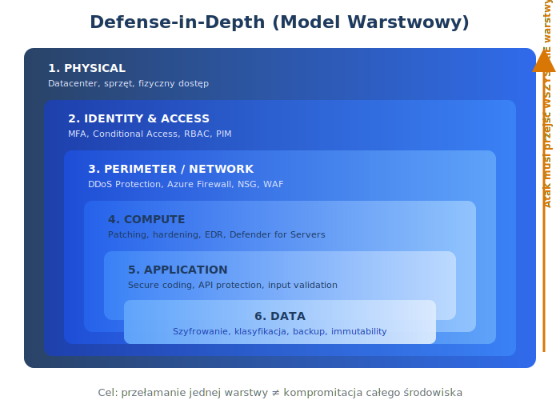

Bezpieczeństwo realizowane przez wiele warstw ochrony:
- **Physical** (DC),
- **Identity & Access** (MFA, CA, RBAC, PIM),
- **Perimeter/Network** (DDoS, Firewall, NSG, WAF),
- **Compute** (patching, hardening, EDR),
- **Application** (secure coding, API protection),
- **Data** (szyfrowanie, klasyfikacja, backup, immutability).

Cel: przełamanie jednej warstwy nie powinno oznaczać kompromitacji całego środowiska.

- **Microsoft Defender for Cloud**  
  Kompleksowa platforma zabezpieczeń chmurowych zapewniająca:
  - **Secure Score** – miernik poziomu bezpieczeństwa środowiska z rekomendacjami działań naprawczych.
  - **Rekomendacje bezpieczeństwa** – zalecenia dot. konfiguracji, podatności i zgodności ze standardami (CIS, NIST, ISO).
  - **Ochrona obciążeń (Cloud Workload Protection):**
    - **VM** – wykrywanie zagrożeń, analiza zachowań, agentless scanning.
    - **Bazy danych** – ochrona SQL/PostgreSQL/MySQL, wykrywanie anomalii.
    - **Storage** – skanowanie pod kątem malware, identyfikacja niepoprawnych konfiguracji.
  - **Defender for Containers** – analiza obrazów, runtime protection, integracja z AKS.
  - **Defender for APIs** – wykrywanie ryzyk i nadużyć API.

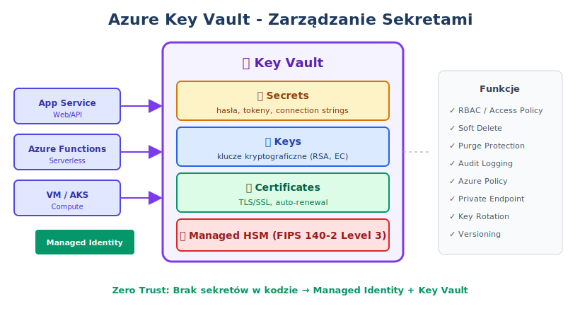

- **Key Vault**  
  Bezpieczne przechowywanie i zarządzanie:
  - **Secrets** – hasła, tokeny, connection stringi.
  - **Keys** – klucze kryptograficzne do szyfrowania i podpisywania.
  - **Certificates** – pełny cykl życia certyfikatów, automatyczne odnowienia.
  - **HSM (Managed HSM)** – sprzętowe moduły kryptograficzne FIPS 140-2 Level 3.

- **DDoS Protection**  
  Ochrona przed atakami DDoS:
  - **Basic** – automatyczna ochrona dla wszystkich usług publicznych Azure.
  - **Standard** – zaawansowana ochrona (L3/L4), adaptacyjne profile ruchu, automatyczne łagodzenie, alerty, raporty, **DDoS Rapid Response (DRR)** oraz SLA finansowe.

- **WAF (Web Application Firewall)**  
  Ochrona aplikacji webowych przed atakami (OWASP Top 10):
  - **Application Gateway WAF** – filtrowanie L7, Managed/Custom Rules, bot protection, TLS termination.
  - **Azure Front Door WAF** – globalna ochrona na edge, rate limiting, szybkie reagowanie.
  - Wspólne polityki, integracja z Log Analytics i Sentinel.

---

<a id="sec-08-governance-compliance"></a>
## 8. Governance & Compliance

Governance w Azure to **zestaw zasad i narzędzi**, które pomagają utrzymać porządek, bezpieczeństwo i kontrolę nad zasobami w chmurze.

### Azure Policy


Mechanizm wymuszający zgodność konfiguracji zasobów z wymaganiami organizacji.

- **Policy Definition** – pojedyncza reguła (np. „wymagaj tagu Environment”, „blokuj publiczne IP”).
- **Policy Initiative** – zestaw wielu reguł grupowanych w standardy (np. CIS, NIST, ISO, Zero Trust).

#### Effects (działania polityk)
- **Deny** – blokuje wdrożenie **(Owner również nie może ominąć Deny)**.
- **Audit** – oznacza zasób jako niezgodny, ale nie blokuje wdrożenia.
- **Append** – dodaje brakujące właściwości (np. tagi).
- **Modify** – automatycznie poprawia konfigurację podczas wdrażania.
- **DeployIfNotExists** – tworzy brakujące zasoby towarzyszące (np. diag settings).

#### Exemptions (wyjątki)
Tymczasowe wyłączenie polityki dla wybranego scope — bez jej usuwania.  
Stosowane w okresach migracji, wyjątkach biznesowych lub scenariuszach legacy.

#### Remediation Tasks
Automatyczne zadania naprawcze działające na istniejących zasobach:
- poprawiają konfigurację (Modify),
- doinstalowują wymagane elementy (DeployIfNotExists).

#### Scope i dziedziczenie
Management Group → Subscription → Resource Group → Resource  
(polityki dziedziczą się **wyłącznie w dół**)

---

### Resource Locks


Zabezpieczają zasoby przed przypadkowym usunięciem lub edycją.

- **Delete** – blokada usunięcia zasobu.
- **ReadOnly** – blokada usunięcia i modyfikacji (tylko odczyt).

Stosowane szczególnie dla:
- Key Vault,  
- Storage (backupy),  
- VNet / Firewall,  
- Log Analytics Workspace.

---

### Tags


To specjalne **metadane** przypisywane do zasobów w celu:
- mają klucz i wartość
- **maksymalnie 50 tagów** na resource
- organizacji i klasyfikacji (Environment, Owner, Project),
- chargeback/showback (koszty per projekt/dział),
- automatyzacji (np. auto‑shutdown),
- wymuszania governance (Azure Policy może wymagać tagów).

Ważne!
- Management Groups **nie mogą mieć** tagów.

---

### Microsoft Purview

**Microsoft Purview** wspiera governance danych i compliance:
- katalogowanie i odkrywanie źródeł danych,
- klasyfikację danych (wrażliwe/PII),
- data lineage (śledzenie przepływu danych),
- polityki i kontrolę dostępu do danych.

Na AZ‑900: Purview to narzędzie do **zarządzania ładem danych**, nie zamiennik dla Azure Policy.

---

### Azure Blueprints

Blueprint pozwala w jednym, powtarzalnym procesie stworzyć całe środowisko Azure zgodne ze standardami organizacji — od zasad i uprawnień po strukturę zasobów.


Pakiet governance łączący:
- Azure Policy,  
- RBAC,  
- ARM/Bicep templates,  
- strukturę Resource Groups,

w jedno spójne, powtarzalne środowisko (np. Landing Zone).

Idealne dla enterprise i audytowalnych wdrożeń.

Uwaga!
- Obecnie Blueprints są przestarzałe, a zalecanym podejściem jest **Azure Landing Zones** + Bicep/ARM + Policy + GitOps.

**Azure Landing Zones (ALZ)** to kompletna, gotowa architektura i zestaw najlepszych praktyk, które pozwalają szybko i poprawnie zbudować bezpieczne, skalowalne środowisko chmurowe zgodne z CAF.

---

### Azure Arc

**Azure Arc** to usługa, która pozwala zarządzać serwerami, Kubernetesem i usługami działającymi poza Azure tak, jakby były natywnymi zasobami Azure.


Rozszerza Azure na środowiska:
- on‑premise,  
- multi‑cloud,  
- edge.

Umożliwia:
- nakładanie Azure Policy poza Azure,  
- zarządzanie serwerami, Kubernetes, SQL spoza Azure,  
- zbieranie logów/telemetrii z różnych środowisk,  
- utrzymanie spójnego governance.

---

### Shared Responsibility Model


Podział odpowiedzialności między Azure a klientem.

#### Azure odpowiada za:
- fizyczną infrastrukturę (DC, sieć, hypervisor),
- platformę PaaS oraz jej aktualizacje,
- dostępność usług i SLA,
- bezpieczeństwo warstw poniżej OS (w modelu PaaS).

#### Klient odpowiada za:
- tożsamość i dostęp (MFA, CA, RBAC, PIM),
- dane (szyfrowanie, backup, klasyfikacja),
- konfiguracje usług (NSG, firewall, KV access),
- bezpieczeństwo aplikacji,
- rotację kluczy, SAS, tokenów,
- aktualizacje OS w VM (IaaS).

---

### Service Trust, Compliance i Rezydencja Danych

**Service Trust Portal** służy do szybkiego sprawdzania, jak Microsoft spełnia wymagania bezpieczeństwa i zgodności, co ułatwia audyty i ocenę ryzyka.


- **Microsoft Service Trust Portal** – raporty zgodności (ISO, SOC, PCI), audyty, certyfikaty.
- **Data Residency (rezydencja danych)** – dane pozostają w wybranej geografii (np. EU).
- **Azure Government / Azure China** – suwerenne regiony dla wymagań regulacyjnych.

---

### Well‑Architected Framework (WAF – 5 filarów)


1. **Cost Optimization** – eliminacja marnotrawstwa, right‑size, automatyzacja kosztów.  
2. **Operational Excellence** – automatyzacja, CI/CD, versioning, monitoring.  
3. **Performance Efficiency** – wybór właściwych usług, autoscaling, cache.  
4. **Reliability** – HA, DR, self‑healing, multi‑zone/multi‑region.  
5. **Security** – Zero Trust, least privilege, szyfrowanie, segmentacja.

---

### Cloud Adoption Framework & Landing Zone

**CAF** obejmuje:
- strategię i uzasadnienie biznesowe,  
- plan migracji,  
- przygotowanie organizacji,  
- governance (Policy, RBAC, MG),  
- operacje (monitoring, DevOps).

**Landing Zone** = gotowy wzorzec środowiska produkcyjnego:
- hierarchia Management Groups,
- polityki bezpieczeństwa,
- sieć hub/spoke,
- RBAC baseline,
- logowanie i monitoring,
- zgodność z CAF i WAF.

---

### Support Plans (wsparcie techniczne)

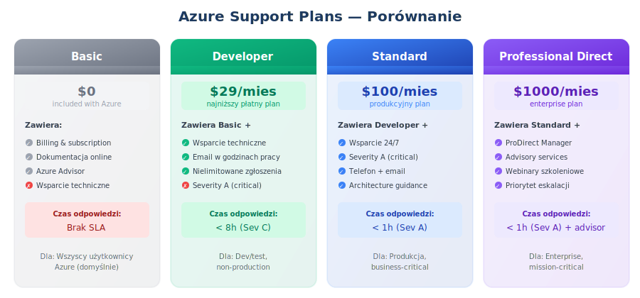

Na AZ‑900 warto znać różnicę między planami wsparcia:

- **Basic** – podstawowe wsparcie dla billing/subscription i dokumentacja; brak wsparcia technicznego 1:1 dla problemów produkcyjnych.
- **Developer** – najniższy płatny plan techniczny, dobry do środowisk dev/test.
- **Standard** – szybsze czasy reakcji i wsparcie dla workloadów produkcyjnych.
- **Professional Direct** – najwyższy poziom komercyjnego wsparcia Azure (advisory + szybsza obsługa krytycznych zgłoszeń).

W dużych organizacjach spotkasz też model **Unified Support** (enterprise), ale na poziomie AZ‑900 zwykle wystarczy zrozumienie powyższych poziomów.

---

### Service Lifecycle (Preview vs GA)

- **Public Preview** – funkcja testowa, zwykle bez pełnego SLA i z możliwymi zmianami API/feature.
- **General Availability (GA)** – usługa produkcyjna, stabilna i objęta standardowymi zasadami SLA.
- **Retirement / Deprecation** – usługa lub funkcja wycofywana; Microsoft publikuje harmonogram migracji.

Egzaminowo: **preview ≠ produkcja krytyczna**; do workloadów produkcyjnych preferuj funkcje **GA**.

---

<a id="sec-09-monitoring-logging"></a>
## 9. Monitoring & Logging

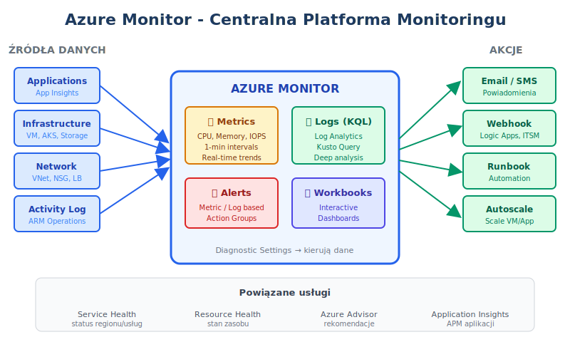

- **Azure Monitor**
  Centralna platforma monitoringu w Azure, która zbiera, przechowuje, analizuje i wizualizuje dane operacyjne z zasobów.
  
  - **Metrics (metryki czasowe)**
    Dane numeryczne zbierane w krótkich odstępach czasu (np. CPU %, pamięć, IOPS, opóźnienia).
    - przeznaczone do szybkiej analizy trendów,
    - idealne do alertów w czasie zbliżonym do rzeczywistego,
    - przechowywane w wysokiej rozdzielczości (1-minutowe interwały).

  - **Logs (KQL / Log Analytics)**
    Dane o wysokiej szczegółowości zapisywane w Log Analytics Workspace.
    - logi strukturalne i niestandardowe,
    - analiza poprzez **Kusto Query Language (KQL)**,
    - możliwość łączenia danych z wielu usług,
    - fundament dla Security, Monitoring, Governance.

  - **Alerts**
    Mechanizm powiadamiania o problemach, oparty na:
    - metrykach (np. CPU > 80% przez 5 min),
    - zapytaniach KQL (np. błędy 500 w ostatnich 10 minutach),
    - logach aktywności, logach zasobów,
    - integracji z Action Groups (e-mail, Teams, webhook, ITSM).

- **Azure Advisor**

**Azure Advisor** to wbudowany doradca dla platformy Azure, analizujący środowisko pod kątem najlepszych praktyk Microsoft i generujący konkretne rekomendacje dotyczące optymalizacji kosztów, wydajności, bezpieczeństwa, niezawodności i operacyjności.


### Kategorie rekomendacji
- **Cost** – redukcja kosztów (right-size, wyłączanie nieużywanych zasobów, Reserved Instances, Azure Hybrid Benefit).  
- **Security** – rekomendacje z Defender for Cloud zwiększające poziom zabezpieczeń.  
- **Reliability** – wskazówki dotyczące wysokiej dostępności, redundancji, odporności i usunięcia SPOF.  
- **Operational Excellence** – automatyzacja, kopie zapasowe, poprawa procesów operacyjnych.  
- **Performance** – optymalizacja wydajności (autoscale, właściwe SKU, zwiększanie przepustowości).

### Przykładowe rekomendacje
- Zmniejszenie przewymiarowanych VM lub wyłączanie ich poza godzinami pracy.  
- Dodanie redundancji (np. wdrożenia w wielu strefach AZ).  
- Migracja storage do wydajniejszych SKU (np. Premium SSD).  
- Dodanie tagów wymaganych przez governance.  

Azure Advisor jest narzędziem **proaktywnym**, często wskazywanym na egzaminie AZ‑900 jako źródło rekomendacji dotyczących kosztów, bezpieczeństwa, wydajności oraz utrzymania środowiska.

- **Service Health**
  Informacje o stanie platformy Azure dotyczące:
  - trwających incydentów,
  - planowanych prac konserwacyjnych,
  - degradacji usług w wybranych regionach.
  Można konfigurować alerty na awarie wpływające na konkretne zasoby.

- **Resource Health**
  Stan konkretnego zasobu (np. pojedynczej VM, SQL DB, App Service):
  - czy problem wynika z platformy Azure,
  - czy z konfiguracji po stronie klienta,
  - historia zmian stanu i rekomendacje działań.

**Service Health vs Resource Health (skrót egzaminowy):**

| Narzędzie | Zakres | Typowe pytanie egzaminacyjne |
|---|---|---|
| Service Health | usługi/regiony/subskrypcja | „Czy w regionie jest incydent Azure?” |
| Resource Health | pojedynczy zasób | „Dlaczego ta konkretna VM/app nie działa?” |

- **Activity Log**
  Log operacyjny na poziomie subskrypcji, zawierający:
  - **kto** wykonał operację,
  - **co** zmieniono,
  - **kiedy** i **z jakiego źródła**,
  - dotyczy głównie operacji ARM (tworzenie/usuwanie/aktualizacje zasobów).
  Jest podstawą audytów i analizy zmian.

- **Resource Logs**
  Szczegółowe logi działania konkretnych usług (np. Storage Access Logs, Key Vault Audit Logs).
  - wymagają włączenia **Diagnostic Settings**,
  - można je wysłać do:
    - Log Analytics Workspace,
    - Event Hub,
    - Storage Account,
  - pozwalają analizować zachowanie aplikacji, ruch, błędy, opóźnienia, dostęp.

- **Workbooks**
  Zaawansowane interaktywne dashboardy:
  - łączą wizualizacje, tekst, parametry, zapytania KQL,
  - nadają się do tworzenia raportów operacyjnych, security, SRE/DevOps,
  - w pełni konfigurowalne (heatmapy, wykresy, tabele, integracja z Azure Monitor).

---

<a id="sec-10-costs-billing"></a>
## 10. Costs & Billing (Koszty i rozliczenia)

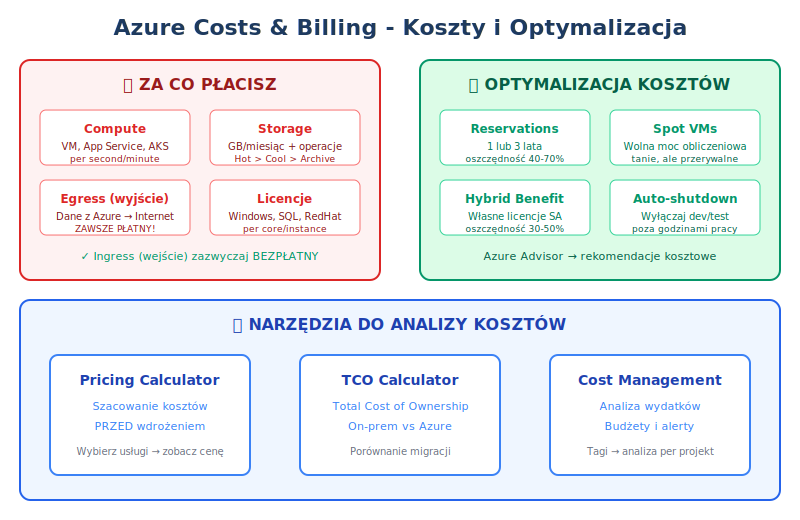

**Za co płacisz w Azure:**
- **Compute (czas działania)**  
  Opłaty za czas pracy zasobów obliczeniowych (VM, App Service, AKS node pools, Functions).  
  Rozliczanie zwykle „pay‑as‑you‑go” — za sekundę lub minutę działania.

- **Storage (GB / miesiąc)**  
  Koszt zależny od ilości przechowywanych danych oraz liczby operacji.  
  Uwzględnia typ przestrzeni dyskowej (Hot / Cool / Archive), replikację (LRS/ZRS/GRS) oraz transakcje.

- **Egress sieci (wyjście z Azure)**  
  Dane *opuszczające* Azure — np. wysyłane do Internetu, do lokalnego datacenter lub między regionami.  
  To jedno z najczęstszych „ukrytych” źródeł kosztów, bo transfer wychodzący jest **zawsze płatny**.

- **Ingress sieci (wejście do Azure)**  
  Dane *wchodzące* do Azure — np. upload plików, dane z on‑prem, ruch przychodzący z Internetu.  
  W modelu transferu sieciowego Azure **ingress jest zazwyczaj bezpłatny**.  
  W praktyce: za pobieranie z Azure płacisz, za wysyłanie do Azure — nie.

- **Licencje**  
  Płatne modele licencji dla Windows Server, SQL Server, RedHat, SUSE, a także usług takich jak Defender.  
  Rozliczane per rdzeń, instancję lub użytkownika.

---

### **Optymalizacja kosztów:**

- **Reservations (1 lub 3 lata)**  
  Rezerwacje na VM, SQL, Cosmos DB i inne usługi.  
  Oszczędność 40–70% — idealne dla stabilnych workloadów produkcyjnych.

- **Spot VMs**  
  Tanie VM działające, gdy dostępna jest wolna moc obliczeniowa.  
  Mogą zostać przerwane — dobre do batch jobs, CI/CD, symulacji, renderingu.

- **Azure Hybrid Benefit (AHB)**  
  Możliwość wykorzystania posiadanych licencji Windows/SQL z Software Assurance.  
  Obniża koszt VM i SQL PaaS nawet o 30–50%.

---

### **Narzędzia do kosztów i analizy:**

- **Pricing Calculator**  
  Kalkulator kosztów — pozwala wyliczyć przewidywane koszty architektury przed wdrożeniem.

- **TCO (Total Cost of Ownership) Calculator**  
  Porównanie kosztów on‑premise vs Azure (sprzęt, energia, zarządzanie, amortyzacja).  
  Pomocny przy planowaniu migracji i budowaniu business case.

- **Cost Management**  
  Wbudowane narzędzie do analizy i kontroli wydatków:
  - budżety i alerty,
  - analiza kosztów po tagach, subskrypcjach i zasobach,
  - prognozy wydatków,
  - rekomendacje optymalizacyjne (np. niewykorzystywane IP/VM/dyski).

---

<a id="sec-11-iac-automation"></a>
## 11. IaC & Automation (Infrastruktura jako kod)

**IaC (Infrastructure as Code)** to podejście, w którym całą infrastrukturę — serwery, sieci, bazy, konfiguracje — definiuje się i zarządza nią za pomocą plików kodu, zamiast ręcznych kliknięć w portal, co zapewnia automatyzację, powtarzalność i pełną kontrolę wersji.


- **ARM Templates (JSON) / Bicep**
  Deklaratywne podejście do definiowania infrastruktury:
  - **Deklaratywność** – opisujesz *jaki* ma być stan zasobów, a Azure zajmuje się wdrożeniem.
  - **Idempotencja** – wielokrotne uruchamianie tych samych szablonów daje ten sam efekt; brak ryzyka duplikacji.
  - **GitOps** – idealne do łączenia z CI/CD; kod infrastruktury w repozytorium pozwala na kontrolę wersji, PR review i automatyczne wdrażanie.
  - **ARM (JSON)** – niskopoziomowe, bardziej szczegółowe, natywne dla Azure.
  - **Bicep** – nowszy, prostszy i czytelniejszy język, który kompiluje się do ARM; wspiera moduły, lepszą walidację i łatwiejsze utrzymanie.

  Uwaga!
  - **ARM templates** definiują co wdrożyć — konkretne zasoby i ich konfigurację.
  - **Blueprints** definiują całe środowisko — mogą zawierać ARM templates plus polityki, RBAC i strukturę zasobów, czyli pełny pakiet governance.

- **Terraform**
  Popularne i uniwersalne narzędzie IaC działające w modelu multi‑cloud:
  - **Provider AzureRM** – umożliwia pełne zarządzanie zasobami Azure.
  - **Stan (state)** – Terraform śledzi zmiany infrastruktury i porównuje stan bieżący z planowanym.
  - **Plan → Apply** – weryfikacja zmian przed wdrożeniem (co zostanie utworzone, zmodyfikowane lub usunięte).
  - **Multi‑cloud** – jedna składnia dla Azure, AWS, GCP, VMware, K8s.
  - Świetny wybór dla organizacji działających w wielu środowiskach lub chcących odseparować IaC od konkretnego dostawcy.

- **DSC (Desired State Configuration)**
  Mechanizm konfiguracji hostów Windows (i częściowo Linux):
  - Definiujesz docelowy stan systemu (np. zainstalowane role, pliki, serwisy).
  - DSC zapewnia **wymuszanie i utrzymanie** zadeklarowanego stanu.
  - Używany głównie do konfiguracji serwerów, VM, środowisk hybrydowych.
  - Integruje się z Azure Automation State Configuration.

- **Automation**
  Zestaw narzędzi do automatyzacji operacji i zarządzania:
  - **Runbooki** – skrypty PowerShell i Python wykonywane w chmurze; idealne do automatyzacji operacji, cleanupów, rotacji kluczy.
  - **Update Management** – automatyczne instalowanie poprawek dla VM (Windows i Linux) bez potrzeby własnej infrastruktury patchowania.
  - **Change Tracking & Inventory** – monitorowanie zmian plików, rejestru, usług, pakietów oraz zbieranie szczegółowej inwentaryzacji serwerów.
  - Świetne do operacji typu: harmonogramy, cykliczne zadania, utrzymanie zgodności środowisk.

---

<a id="sec-12-extended-services"></a>
## 12. Extended Azure Services (Usługi rozszerzone)

### Integracja i zdarzenia

- **Azure Service Bus**  
  Broker komunikatów klasy enterprise — **niezawodne kolejki** (1:1) oraz publish/subscribe (1→n), z obsługą transakcji, DLQ i protokołu AMQP. Idealny do integracji mikroserwisów oraz scenariuszy wymagających trwałego kolejkowania.

  

- **Azure Event Hub**  
  Platforma do zbierania i przetwarzania **strumieni danych** na ogromną skalę (telemetria, logi, IoT), nawet miliony zdarzeń na sekundę. Świetnie współpracuje z Databricks, Spark, Stream Analytics i może działać jako Kafka‑as‑a‑Service.

  

- **Azure Event Grid**  
  Lekki **router zdarzeń** typu push, idealny do budowania architektur event‑driven o niskich opóźnieniach. Umożliwia reagowanie na zdarzenia z usług Azure (np. BlobCreated → Function) i integrację systemów poprzez eventy.

  

---

### API i edge

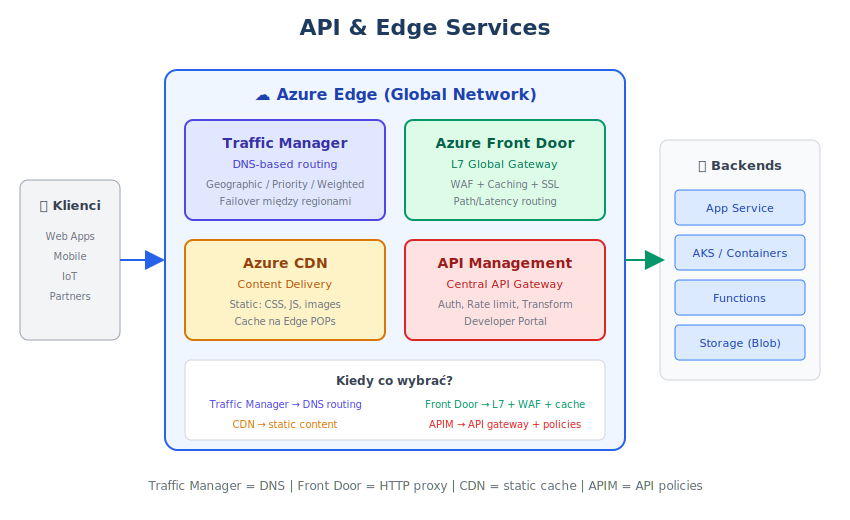

**API Management (APIM)**
APIM to centralny *API Gateway*, który pozwala w jednym miejscu wystawiać, zabezpieczać i zarządzać wszystkimi API w organizacji.

Zapewnia m.in.:
- **transformacje request/response** (np. JSON ↔ XML, dodawanie nagłówków),
- **bezpieczeństwo i autoryzację** (OAuth2, OpenID Connect, JWT, certyfikaty),
- **rate‑limiting i throttling** – ochrona backendów przed przeciążeniem,
- **polityki (Policies)** działające bez zmian w kodzie aplikacji,
- **Developer Portal** – dokumentacja, testowanie API i zarządzanie kluczami,
- **wersjonowanie i lifecycle management** API.

Idealny jako warstwa pośrednia między aplikacjami klienckimi a backendami.

---

#### **Front Door / CDN / Traffic Manager**

**Azure Front Door**
Globalny gateway warstwy L7 działający na edge Microsoftu.

Oferuje:
- inteligentny routing HTTP/HTTPS (latency‑based, path‑based, failover),
- **WAF** na edge,
- **globalne load balancing**,
- **caching** i akcelerację aplikacji,
- **TLS termination** blisko użytkownika.

Świetny dla aplikacji działających globalnie, wymagających wysokiej wydajności i ochrony.

**Azure CDN**
Content Delivery Network przeznaczony do:

- szybkiego dostarczania statycznych treści (CSS, JS, obrazy, wideo),
- redukcji obciążenia backendu poprzez cache na edge,
- poprawy czasu ładowania aplikacji.

Działa świetnie samodzielnie lub jako uzupełnienie Front Door.

**Azure Traffic Manager**
Globalny load balancer oparty o **DNS** (nie przetwarza sam ruchu HTTP).  

Obsługuje:
- routing geograficzny (np. kierowanie użytkowników do najbliższego regionu),
- **failover** między regionami,
- **weighted routing** (kontrolowany podział ruchu),
- scenariusze blue/green i A/B.

Używany, gdy potrzebne jest sterowanie ruchem na poziomie DNS i niezależnie od protokołu.

---

### Azure Marketplace

**Azure Marketplace** to katalog gotowych rozwiązań (obrazy VM, aplikacje, appliance’y, SaaS), które można szybko wdrożyć w swojej subskrypcji.

Kiedy używać:
- gdy potrzebujesz gotowego rozwiązania produkcyjnego bez budowania od zera,
- gdy chcesz przyspieszyć PoC lub migrację,
- gdy potrzebujesz komercyjnego wsparcia dostawcy rozwiązania.

Na egzaminie: Marketplace to przede wszystkim **szybkie wdrażanie gotowych ofert partnerów** + rozliczenie przez Azure.

---

### AI i Data

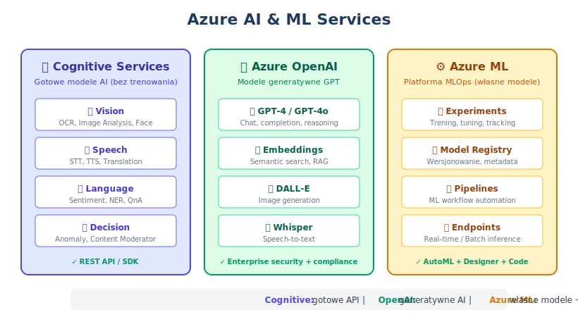

**Cognitive Services / Azure OpenAI / Azure ML**

- **Cognitive Services**  
  Gotowe modele AI bez trenowania: OCR, analiza obrazów, rozpoznawanie mowy, tłumaczenia, sentiment, wykrywanie anomalii.

- **Azure OpenAI**  
  Modele generatywne (GPT, embeddings): generowanie tekstu, podsumowania, chatboty, wyszukiwanie semantyczne, automatyzacja procesów.

- **Azure Machine Learning (Azure ML)**  
  Platforma MLOps: trening modeli, eksperymenty, rejestr modeli, pipeline’y, wdrożenia do endpointów, monitorowanie jakości i driftu.

---

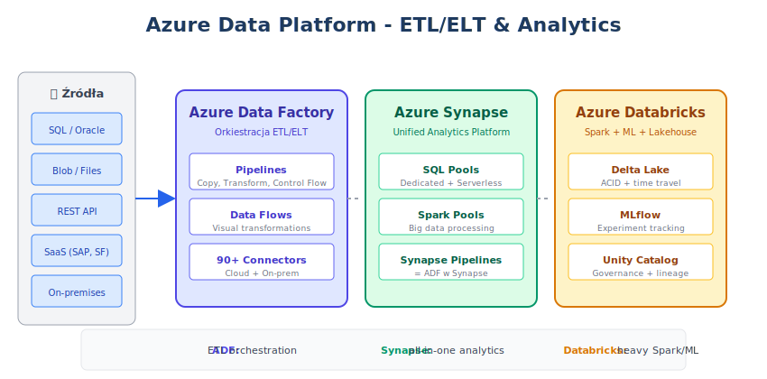

**Data Factory / Synapse Pipelines / Databricks**

- **Azure Data Factory (ADF)**  
  Narzędzie do budowania i uruchamiania przepływów ETL/ELT między różnymi źródłami danych.

- **Synapse Pipelines**  
  Pipeline’y działające w ekosystemie Synapse, idealne do orkiestracji danych w Synapse i Data Lake.

- **Databricks**  
  Platforma oparta na Spark do skalowalnego przetwarzania danych, analityki i uczenia maszynowego.

---

### IoT (Internet of Things)

**IoT (Internet of Things)** to koncepcja, w której fizyczne urządzenia łączą się z internetem, wymieniają dane i pozwalają zdalnie monitorować oraz sterować realnym światem w sposób automatyczny i inteligentny.


**IoT Hub**
Zarządzany hub komunikacyjny IoT obsługujący MQTT/AMQP/HTTPS, z dwukierunkową komunikacją między urządzeniami a chmurą.  
Zapewnia telemetrię, komendy, konfigurację oraz **Device Twin** do przechowywania stanu i metadanych urządzeń.

**IoT Central**
Platforma IoT typu SaaS, która eliminuje potrzebę tworzenia backendu.  
Oferuje gotowe dashboardy, analitykę, alerty, zarządzanie urządzeniami i szybkie wdrożenia IoT bez programowania infrastruktury.

**Azure Digital Twins**
Silnik do modelowania cyfrowych reprezentacji obiektów i ich relacji (digital twins).  
Umożliwia odwzorowanie budynków, fabryk, urządzeń i procesów, analizę stanów, symulacje i integrację z telemetrią IoT Hub.

**Azure Sphere**
Kompletny i bezpieczny ekosystem IoT: specjalne MCU, zabezpieczony Linux OS oraz usługa bezpieczeństwa zapewniająca aktualizacje, certyfikację i ochronę urządzeń.  
Idealny dla urządzeń wymagających najwyższego poziomu bezpieczeństwa.

---

### Inne przydatne

**Azure Bastion**
Bezpieczny dostęp RDP/SSH do VM bez publicznych IP – działa przez portal i eliminuje potrzebę otwierania portów.

**Azure Load Testing**
Testy obciążeniowe w oparciu o JMeter, analiza wydajności i integracja z CI/CD bez utrzymywania własnej infrastruktury.

**Azure Cache for Redis**
Szybki in‑memory distributed cache do sesji, kolejek, pub/sub, ograniczania ruchu na bazach i niskich opóźnień.

**App Configuration / Feature Flags**
Centralna konfiguracja i kontrolowane wdrażanie funkcji (feature flags), z wersjonowaniem i pełną integracją z aplikacjami.

**AKS Fleet**
Zarządzanie wieloma klastrami AKS: governance, rollouty, multi‑cluster services, idealne dla środowisk enterprise.

**Container Registry (ACR)**
Prywatny rejestr OCI/Docker z buildami (ACR Tasks), skanowaniem podatności, replikacją geo i integracją z AKS.

**Azure Lighthouse**
Delegowane zarządzanie subskrypcjami i tenantami – doskonałe dla MSP, DevOps i scenariuszy multi‑tenant.

**Azure Virtual Desktop**
Wirtualne desktopy i aplikacje Windows w chmurze: multisession, FSLogix, autoscaling.

---

### Dodatkowe przydatne usługi

**Azure Private Link**
Prywatny dostęp do usług Azure (SQL, Storage, Key Vault) w ramach sieci bez ruchu publicznego.

**Managed HSM**
Sprzętowe moduły bezpieczeństwa (HSM) do generowania i przechowywania kluczy zgodnie z FIPS 140‑2.

**Azure Monitor / Application Insights**
Monitoring metryk, logów, zależności i wydajności aplikacji – podstawa obserwowalności.

**Logic Apps Standard**
Serverless workflowy i automatyzacje z setkami konektorów (SAP, SQL, Salesforce, EDI, B2B).

---

<a id="sec-13-pytania-az900"></a>
## 13. Podchwytliwe pytania AZ‑900
| Pytanie | Odpowiedź |
|---|---|
| Czy subskrypcja ma „swój” koszt? | **Nie.** Płacisz za zasoby; subskrypcja to granica rozliczeń i uprawnień. |
| Czy Region = Availability Zone? | **Nie.** Region to zestaw DC; AZ to separowane DC w regionie. |
| Czy Resource Group musi być w tym samym regionie co zasoby? | **Nie.** Lokalizacja RG to metadane – zasoby mogą być w innych regionach (z wyjątkami usług). |
| Czy RBAC działa „w górę” hierarchii? | **Nie.** Uprawnienia dziedziczą **w dół** (MG → Sub → RG → Resource). |
| Czy Bastion wymaga publicznego IP VM? | **Nie.** Działa przez portal bez publicznego IP. |
| Czy Azure Policy zawsze blokuje wdrożenie? | **Nie.** Zależy od **Effect** (np. Audit nie blokuje). |
| Czy Availability Set = Availability Zone? | **Nie.** Set to logiczne FD/UD; AZ to fizyczna separacja DC. |
| Czy outbound (egress) ruch sieci jest darmowy? | **Nie.** Egress jest rozliczany. |

---

<a id="sec-14-glosariusz"></a>
## 14. Glosariusz skrócony

| Pojęcie | Definicja |
|--------|-----------|
| Tenant (Entra ID) | Instancja tożsamości dla organizacji. |
| Directory | Katalog użytkowników, grup i aplikacji. |
| Subscription | Granica rozliczeń, limitów i uprawnień. |
| Management Group | Hierarchiczne grupowanie subskrypcji. |
| Resource Group | Kontener logiczny dla zasobów. |
| Resource | Pojedynczy zasób Azure (VM, VNet, Storage itd.). |
| Tag | Metadana opisująca zasób. |
| Resource Lock | Blokada Delete/ReadOnly chroniąca zasoby. |
| Scope | Poziom przypisywania RBAC/polityk (MG→Sub→RG→Resource). |
| Region | Fizyczna lokalizacja centrum danych. |
| Availability Zone | Strefa niezależna w regionie. |
| Zone Redundant Services | Usługi działające w wielu AZ. |
| Geography | Zestaw regionów w jednej jurysdykcji. |
| Region Pair | Sparowane regiony DR. |
| Edge Location | Punkt POP dla CDN/Front Door. |
| SLA | Gwarancja dostępności. |
| HA (High Availability) | Wysoka dostępność rozwiązania. |
| DR (Disaster Recovery) | Odtwarzanie po awarii. |
| Entra ID (Azure AD) | Usługa tożsamości i uwierzytelniania. |
| User | Użytkownik w katalogu. |
| Group | Grupa uprawnień. |
| Role / RBAC | Role definiujące dostęp do zasobów. |
| Service Principal | Tożsamość aplikacji. |
| Managed Identity | Systemowa tożsamość bez kluczy. |
| Conditional Access | Dostęp zależny od warunków (lokacja, urządzenie). |
| PIM | Zarządzanie rolami uprzywilejowanymi. |
| App Registration | Rejestracja aplikacji w Entra ID. |
| VNet | Prywatna sieć w Azure. |
| Subnet | Segmentacja sieci. |
| NSG | Reguły sieciowe L3–L4. |
| ASG | Grupy aplikacyjne VM. |
| UDR (Route Table) | Niestandardowy routing. |
| VNet Peering | Połączenie prywatne między VNetami. |
| Private Endpoint | Prywatny endpoint do usług PaaS. |
| Private Link | Prywatny dostęp do usług Azure. |
| Azure Firewall | Firewall warstw L3–L7. |
| WAF | Firewall aplikacyjny L7. |
| Load Balancer | Load balancing L4. |
| Application Gateway | Load balancing L7 + WAF. |
| Front Door | Globalny routing HTTP(S). |
| Traffic Manager | DNS load balancing. |
| VPN Gateway | Tunel IPsec Azure ↔ on‑prem. |
| ExpressRoute | Prywatna łączność MPLS z Azure. |
| Bastion | Bezpieczny RDP/SSH bez publicznych IP. |
| VM (Virtual Machine) | Maszyna wirtualna. |
| VMSS | Skalowanie grup VM. |
| Availability Set | Separacja VM w domenach awarii. |
| App Service | Hosting aplikacji Web/API. |
| Function App | Serverless oparty o trigerry. |
| Container Apps | Zarządzane kontenery serverless. |
| AKS | Zarządzany Kubernetes. |
| ACR | Prywatny rejestr obrazów OCI. |
| Logic Apps | Workflow integracyjny. |
| Batch | Przetwarzanie wsadowe/HPC. |
| AVD | Wirtualne desktopy Windows. |
| Dedicated Host | Fizyczny host tylko dla jednego klienta. |
| Storage Account | Konto usług magazynowych. |
| Blob Storage | Obiektowy magazyn danych. |
| Azure Files | Udostępnione SMB/NFS. |
| Queue Storage | Proste kolejki komunikatów. |
| Table Storage | NoSQL key‑value. |
| Disk Storage | Dyski VM. |
| Azure SQL Database | Zarządzana baza SQL. |
| SQL Managed Instance | Prawie pełna instancja SQL w PaaS. |
| Cosmos DB | Globalna baza NoSQL z niskimi opóźnieniami. |
| PostgreSQL Flexible Server | Zarządzany PostgreSQL. |
| MySQL Flexible Server | Zarządzany MySQL. |
| MariaDB | PaaS MariaDB. |
| Synapse Analytics | Lakehouse + SQL + Spark. |
| Databricks | Spark + Delta Lake + MLflow. |
| Redis Cache | In-memory distributed cache. |
| Service Bus | Messaging enterprise (kolejki/topics). |
| Event Hub | Streaming telemetrii i big‑data. |
| Event Grid | Routing zdarzeń serverless. |
| Storage Queue | Kolejki w Storage. |
| API Management | API Gateway. |
| App Configuration | Centralna konfiguracja. |
| Feature Flags | Przełączniki funkcji w aplikacji. |
| Azure Monitor | Centralny monitoring zasobów. |
| Metrics | Metryki czasowe. |
| Logs | Logi w KQL. |
| Activity Log | Operacje zarządcze. |
| Diagnostic Settings | Kierowanie logów/metryk. |
| Application Insights | Telemetria i APM. |
| Alerts | Alerty metryczne/logowe. |
| Workbooks | Dashboardy i wizualizacje. |
| Change Tracking | Zmiany konfiguracji VM. |
| Update Management | Aktualizacje systemów. |
| Azure Policy | Wymuszanie konfiguracji zasobów. |
| Policy Definition | Pojedyncza reguła. |
| Initiative | Zestaw reguł. |
| Blueprints | Szablony governance. |
| Defender for Cloud | Bezpieczeństwo i Secure Score. |
| Key Vault | Sekrety, klucze i certyfikaty. |
| Managed HSM | Sprzętowy moduł kryptograficzny. |
| DDoS Protection | Ochrona przed atakami wolumetrycznymi. |
| IAM | Identity & Access Management. |
| Zero Trust | Model bezpieczeństwa „never trust, always verify”. |
| Azure DevOps | Repos, Boards, Pipelines, Artifacts. |
| GitHub Actions | CI/CD jako usługa. |
| Pipelines | Procesy budowania i wdrażania. |
| Artifacts | Rejestr paczek. |
| ARM Templates | Deklaratywne szablony JSON. |
| Bicep | DSL IaC dla ARM. |
| Terraform | Multi-cloud IaC. |
| GitOps | Model declarative + repository-driven. |
| Runbook | Automatyczne skrypty. |
| DSC | Wymuszanie stanu konfiguracji. |
| Azure Machine Learning | MLOps i trening modeli. |
| Azure OpenAI | Modele generatywne GPT. |
| Cognitive Services | Gotowe modele AI (Vision/Speech/Language). |
| Data Factory | ETL/ELT i integracja danych. |
| Synapse Pipelines | Orkiestracja danych w Synapse. |
| Databricks | Spark + ML + Lakehouse. |
| Power BI Embedded | Wizualizacja danych w aplikacjach. |
| IoT Hub | Dwukierunkowa komunikacja IoT. |
| Device Twin | Stan i właściwości urządzeń. |
| IoT Edge | Moduły kontenerowe na urządzeniach. |
| IoT Central | Platforma IoT SaaS. |
| Device Provisioning Service | Automatyczna rejestracja urządzeń IoT. |
| Azure Digital Twins | Modele i relacje obiektów fizycznych. |
| Azure Sphere | Bezpieczny MCU i OS IoT. |
| Cost Management | Analiza kosztów i budżety. |
| Reservations | Rezerwacje na 1/3 lata. |
| Azure Hybrid Benefit | Wykorzystanie własnych licencji. |
| Spot VM | Tanie, przerywalne VM. |
| Egress | Ruch wychodzący z chmury (płatny). |
| Ingress | Ruch przychodzący (bezpłatny). |
| TCO Calculator | Porównanie kosztów on‑prem vs Azure. |
| Soft Delete | Odzyskiwanie skasowanych zasobów. |
| Immutable Storage | Nie­zmienialne dane (compliance). |
| Hot/Cool/Archive | Warstwy przechowywania danych. |
| Autoscale | Automatyczne skalowanie zasobów. |
| Replica | Kopia danych. |
| Shard | Partycja danych. |
| SAS Token | Delegowany dostęp do Storage. |
| CORS | Polityki cross-origin. |
| CDN | Sieć dostarczania treści. |

---

<a id="sec-15-free-account"></a>
## 15. Azure Free Account (Free Tier)

- **US$200 kredytu** na pierwszy miesiąc (trial).
- Po wyczerpaniu – świadomie przejdź na PAYG lub wyłącz zasoby.
- Wybrane usługi mają **12‑miesięczny Free Tier** (limity darmowe).

---

<a id="sec-16-sla"></a>
## 16. SLA (Service Level Agreement)


- Każda usługa ma własne SLA (np. 99,9 / 99,95 / 99,99%).
- Złożone SLA ≈ iloczyn SLA składników (przy niezależności awarii).
- Przykład: 99,95% × 99,9% ≈ 99,85%.
- Rozmieszczenie w wielu **AZ (Availability Zones)** zwykle podnosi SLA (np. VM).

---

<a id="sec-17-databases"></a>
## 17. Bazy danych (Databases)

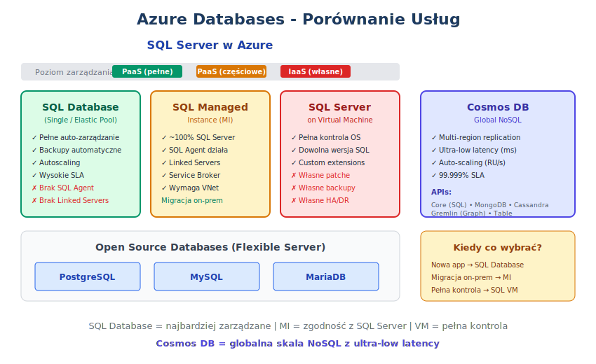

Azure oferuje kilka modeli baz danych dostępnych jako IaaS, PaaS lub globalne, skalowalne systemy NoSQL. Poniżej najważniejsze usługi wymagane na poziomie AZ‑900.

### **Azure SQL Database (Single / Elastic Pool)**
W pełni zarządzana baza danych SQL w modelu PaaS.

- automatyczne backupy, patchowanie, aktualizacje
- wysokie SLA, autoskalowanie, brak zarządzania OS
- modele: Single Database lub Elastic Pool (wspólne zasoby dla wielu DB)
- najlepsza opcja dla nowych aplikacji cloud‑native
- brak pełnego wsparcia SQL Agent / cross‑instance features (w porównaniu z MI)

### **SQL Managed Instance (MI)**
Zarządzana instancja SQL z niemal 100% zgodnością z SQL Server on‑prem.

- wsparcie dla SQL Agent, Linked Servers, Service Broker
- PaaS z automatyzacją, ale zachowuje funkcje instancyjne
- idealny do migracji aplikacji, które wymagają pełnej zgodności z SQL Server
- sieciowo wymaga VNet (bez public endpoint domyślnie)

### **SQL Server on Virtual Machine (SQL on VM)**
Pełny SQL Server działający na maszynie wirtualnej (IaaS).

- pełna kontrola nad OS, wersją SQL, konfiguracją, agentami
- wymaga własnego patchowania, backupów, HA
- najlepsze dla scenariuszy, które wymagają pełnego dostępu do instancji lub niestandardowych rozszerzeń

### **Cosmos DB (NoSQL, global distribution)**

#### Spis treści - Cosmos DB
- [Co to jest Cosmos DB?](#cosmosdb-intro)
- [Architektura globalna](#cosmosdb-architecture)
- [Multi-Model APIs](#cosmosdb-apis)
- [Request Units (RU/s)](#cosmosdb-ru)
- [Consistency Levels](#cosmosdb-consistency)
- [Partitioning](#cosmosdb-partitioning)
- [Porównanie z innymi bazami](#cosmosdb-comparison)
- [Kiedy wybrać Cosmos DB?](#cosmosdb-when)

---

<a id="cosmosdb-intro"></a>
#### Co to jest Cosmos DB?

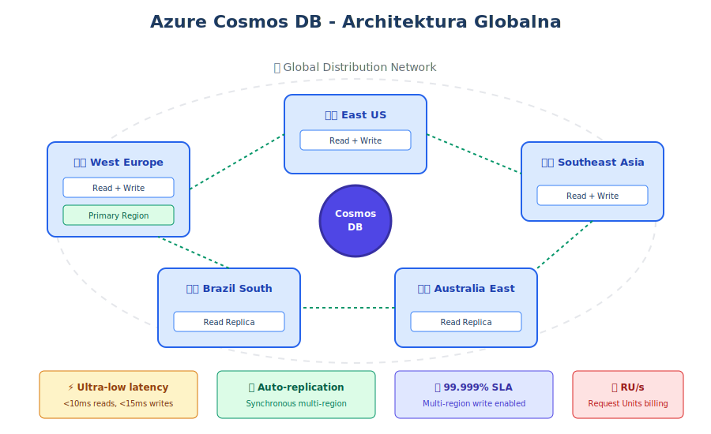

**Azure Cosmos DB** to w pełni zarządzana, globalnie rozproszona baza danych NoSQL, zaprojektowana dla aplikacji wymagających:
- **Ultra-niskich opóźnień** (single-digit milliseconds)
- **Globalnej dystrybucji** danych w wielu regionach
- **Elastycznego skalowania** bez przestojów
- **Wysokiej dostępności** (99.999% SLA)

Cosmos DB to **baza planet-scale** — idealna dla aplikacji działających globalnie, IoT, gaming, e-commerce i real-time analytics.

---

<a id="cosmosdb-architecture"></a>
#### Architektura globalna

Cosmos DB automatycznie replikuje dane do wybranych regionów Azure:

| Funkcja | Opis |
|---------|------|
| **Multi-region writes** | Zapis w dowolnym regionie, automatyczna synchronizacja |
| **Automatic failover** | Przełączenie w przypadku awarii regionu |
| **Conflict resolution** | Last-Write-Wins lub custom policies |
| **Turnkey global distribution** | Dodanie regionu jednym kliknięciem |

**Przykład:** Użytkownik w Europie łączy się z West Europe, użytkownik w Azji z Southeast Asia — obaj mają dostęp do tych samych danych z minimalnym opóźnieniem.

---

<a id="cosmosdb-apis"></a>
#### Multi-Model APIs

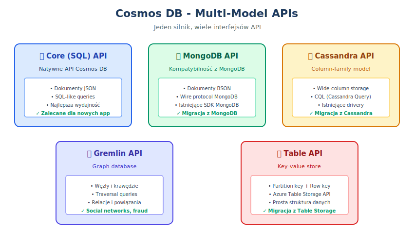

Cosmos DB obsługuje **5 różnych interfejsów API** — wybierasz ten, który pasuje do Twojej aplikacji:

| API | Model danych | Kiedy używać |
|-----|--------------|--------------|
| **Core (SQL)** | Dokumenty JSON | Nowe aplikacje, najlepsza wydajność |
| **MongoDB** | Dokumenty BSON | Migracja z MongoDB, istniejący kod |
| **Cassandra** | Wide-column | Migracja z Apache Cassandra |
| **Gremlin** | Graf (węzły/krawędzie) | Social networks, recommendation engines |
| **Table** | Key-Value | Prosta struktura, migracja z Table Storage |

**Ważne:** Wybór API następuje **przy tworzeniu konta** Cosmos DB i nie można go później zmienić!

---

<a id="cosmosdb-ru"></a>
#### Request Units (RU/s) — Model rozliczeń

Cosmos DB używa **Request Units (RU)** jako abstrakcyjnej jednostki kosztu operacji:

```
1 RU = koszt odczytu 1 dokumentu 1KB przez ID
```

**Przykładowe koszty RU:**
| Operacja | Koszt RU |
|----------|----------|
| Odczyt 1KB dokumentu po ID | ~1 RU |
| Zapis 1KB dokumentu | ~5 RU |
| Query z filtrem | ~3-10+ RU |
| Query z agregacją | ~10-100+ RU |

**Tryby provisioning:**
- **Provisioned throughput** — deklarujesz RU/s z góry (tańsze przy przewidywalnym ruchu)
- **Autoscale** — automatyczne skalowanie 10-100% zadeklarowanego max
- **Serverless** — płacisz tylko za zużyte RU (dobre dla dev/test)

---

<a id="cosmosdb-consistency"></a>
#### Consistency Levels (Poziomy spójności)

Cosmos DB oferuje **5 poziomów spójności** — balans między wydajnością a gwarancjami:

| Poziom | Gwarancja | Latency | Kiedy używać |
|--------|-----------|---------|--------------|
| **Strong** | Zawsze najnowsze dane | Najwyższa | Finanse, krytyczne dane |
| **Bounded Staleness** | Max opóźnienie K operacji lub T czasu | Wysoka | Gaming leaderboards |
| **Session** | Spójność w ramach sesji | Średnia | **Domyślny, najczęściej używany** |
| **Consistent Prefix** | Kolejność operacji zachowana | Niska | Analityka, logi |
| **Eventual** | Brak gwarancji kolejności | Najniższa | Liczniki, statystyki |

**Session consistency** zapewnia, że użytkownik widzi swoje własne zmiany natychmiast, a zmiany innych użytkowników z minimalnym opóźnieniem.

---

<a id="cosmosdb-partitioning"></a>
#### Partitioning — Klucz do wydajności

Cosmos DB automatycznie **partycjonuje dane** na podstawie **Partition Key**:

```json
{
  "id": "order-123",
  "customerId": "CUST-456",  // ← Partition Key
  "items": [...],
  "total": 99.99
}
```

**Zasady wyboru Partition Key:**
| Dobre praktyki | Złe praktyki |
|----------------|---------------|
| Wysoka kardynalność (dużo unikalnych wartości) | Status: "active/inactive" (tylko 2 wartości) |
| Query najczęściej filtrują po tym kluczu | Timestamp (hot partition) |
| Równomierna dystrybucja danych | ID użytkownika VIP (80% danych w 1 partycji) |

**Limit:** Jedna partycja logiczna = max **20 GB** danych.

---

<a id="cosmosdb-comparison"></a>
#### Porównanie z innymi bazami NoSQL w Azure


| Cecha | Cosmos DB | Table Storage | Redis Cache | MongoDB Atlas |
|-------|-----------|---------------|-------------|---------------|
| **Typ** | Multi-model NoSQL | Key-Value | In-memory cache | Document DB |
| **Global dist.** | Tak (native) | Nie (single region) | Premium only | Tak (self-managed) |
| **Latency SLA** | <10ms P99 | Brak | <1ms | Brak |
| **Multi-region write** | Tak | Nie | Nie | Tak |
| **SLA availability** | 99.999% | 99.9% | 99.9% | 99.95% |
| **Koszt** | Wysoki | Niski | Średni | Średni |

---

<a id="cosmosdb-when"></a>
#### Kiedy wybrać Cosmos DB?

**Wybierz Cosmos DB gdy:**
- Potrzebujesz **globalnej dystrybucji** z niskimi opóźnieniami
- Aplikacja wymaga **99.999% SLA**
- Masz **zmienny, nieprzewidywalny ruch** (autoscale)
- Potrzebujesz **wielu modeli danych** (dokumenty, grafy, key-value)
- Budujesz aplikacje **IoT, gaming, e-commerce, real-time**

**Nie wybieraj Cosmos DB gdy:**
- Potrzebujesz prostego, taniego storage → **Table Storage**
- Potrzebujesz cache w pamięci → **Redis Cache**
- Masz relacyjne dane z transakcjami ACID → **Azure SQL**
- Budżet jest bardzo ograniczony (Cosmos DB jest drogi!)

---

#### Podsumowanie Cosmos DB

| Aspekt | Wartość |
|--------|---------|
| **Typ** | Globally distributed NoSQL |
| **APIs** | Core SQL, MongoDB, Cassandra, Gremlin, Table |
| **SLA** | 99.999% (multi-region) |
| **Latency** | <10ms reads, <15ms writes (P99) |
| **Scaling** | Automatic partitioning, unlimited |
| **Pricing** | RU/s + Storage (pay-per-use) |
| **Best for** | Global apps, IoT, gaming, e-commerce |

---

### **Azure Database for PostgreSQL / MySQL (Flexible Server)**
Zarządzane instancje popularnych baz open‑source.

- automatyczne backupy, maintenance, skalowanie
- tryby: Single Server (legacy) i Flexible Server (zalecany)
- idealne dla aplikacji korzystających z open‑source DB

---

<a id="sec-18-subscription-models"></a>
## 18. Subskrypcje (Subscription Models)

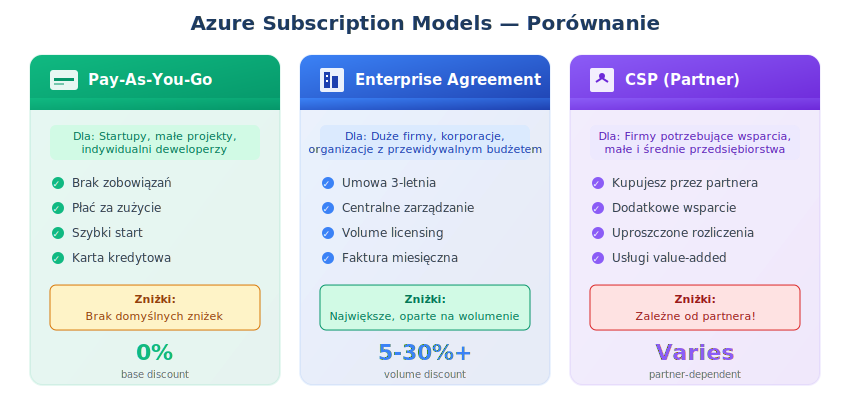

**Azure Subscription Models**
Azure oferuje różne modele subskrypcji w zależności od tego, jak organizacja chce kupować i rozliczać usługi chmurowe.

**Pay-As-You-Go (PAYG)**
- Płacisz tylko za zużycie, bez umów i zobowiązań — idealne na start i małe projekty.
- PAYG nie daje żadnych stałych zniżek, ale można obniżyć koszty poprzez Reservations lub Azure Hybrid Benefit.

**Enterprise Agreement (EA)**
- Długoterminowa umowa dla dużych firm, dająca zniżki i centralne zarządzanie kosztami.
- EA daje największe zniżki, bo są oparte na wolumenie i deklarowanym wydatku organizacji.

**CSP (Cloud Solution Provider)**
- Kupujesz Azure przez partnera, który zapewnia rozliczenia i dodatkowe wsparcie.
- W CSP zniżki zależą od partnera, a nie od Microsoft — partner może dać rabat lub własne ceny.

---

<a id="sec-19-azure-cli"></a>
## 19. Azure CLI

Azure CLI to **narzędzie wiersza poleceń**, które pozwala zarządzać usługami Azure z terminala — szybciej i wygodniej niż przez portal.

Jest cross‑platform (Windows, Linux, macOS), działa też w Azure Cloud Shell.

Pozwala wykonywać polecenia administracyjne oraz automatyzować zadania w skryptach.

### Inne narzędzia zarządzania Azure

- **Azure Portal** – GUI do administracji i szybkiej konfiguracji zasobów.
- **Azure PowerShell** – automatyzacja i administracja skryptami PowerShell.
- **Azure Cloud Shell** – gotowe środowisko CLI/PowerShell w przeglądarce, bez instalacji lokalnej.
- **Azure Mobile App** – podgląd alertów i podstawowe operacje administracyjne z telefonu.

### **Oficjalne API** Microsoft tutaj:
- https://learn.microsoft.com/en-us/cli/azure/reference-index?view=azure-cli-latest

### Microsoft opisuje schemat jako:
- az <grupa> <podgrupa> <komenda> --parametr wartość

### LOGIN
- az login
- az account set --subscription "<SUB>"

### RESOURCE GROUP
- az group create --name MyRG --location westeurope
- az group delete --name MyRG --yes --no-wait

### VM
- az vm create --resource-group MyRG --name MyVM --image UbuntuLTS
- az vm start --resource-group MyRG --name MyVM
- az vm stop --resource-group MyRG --name MyVM
- az vm delete --resource-group MyRG --name MyVM --yes

### STORAGE
- az storage account create --name mystorage --resource-group MyRG --sku Standard_LRS

### NETWORK
- az network vnet create --resource-group MyRG --name MyVNet
- az network public-ip create --resource-group MyRG --name MyIP

### WEB APP
- az appservice plan create --name MyPlan --resource-group MyRG --sku B1
- az webapp create --resource-group MyRG --plan MyPlan --name mywebapp123

### AKS
- az aks create --resource-group MyRG --name MyAKS --node-count 3
- az aks get-credentials --resource-group MyRG --name MyAKS

### RBAC
- az role assignment create --assignee <USER> --role Reader --scope /subscriptions/<SUB>

---

<a id="sec-20-redis-cache"></a>
## 20. Azure Cache for Redis

**Azure Cache for Redis** to w pełni zarządzana usługa cache w pamięci, oparta na popularnym silniku Redis. Umożliwia drastyczne przyspieszenie aplikacji poprzez przechowywanie często używanych danych w szybkiej pamięci zamiast odpytywania bazy danych.

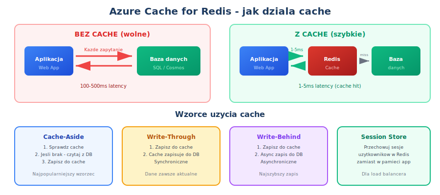

### 20.1 Po co uzywac cache?

| Problem | Rozwiazanie z Redis |
|---------|--------------------|
| Wolne odpowiedzi z bazy danych | Cache przechowuje dane w pamieci (1-5ms vs 100-500ms) |
| Wysokie obciazenie bazy | Redis przejmuje 80-90% odczytow |
| Sesje uzytkownikow rozrzucone | Centralne przechowywanie sesji |
| Kosztowne obliczenia | Cache wynikow, nie powtarzaj obliczen |
| Limity połączeń do DB | Mniej zapytań = mniej połączeń |

### 20.2 Typowe przypadki uzycia

**1. Cache danych (Data Caching)**
- Wyniki zapytan SQL/NoSQL
- Odpowiedzi z zewnetrznych API
- Dane konfiguracyjne

**2. Session Store**
- Sesje uzytkownikow dla load-balanced aplikacji
- Koszyki zakupowe
- Tokeny uwierzytelniania

**3. Message Broker**
- Pub/Sub dla real-time powiadomien
- Kolejki zadan (job queues)
- Event streaming

**4. Leaderboards / Counting**
- Rankingi w grach (sorted sets)
- Liczniki odwiedzin, lajkow
- Rate limiting

### 20.3 Warstwy cenowe (Tiers)

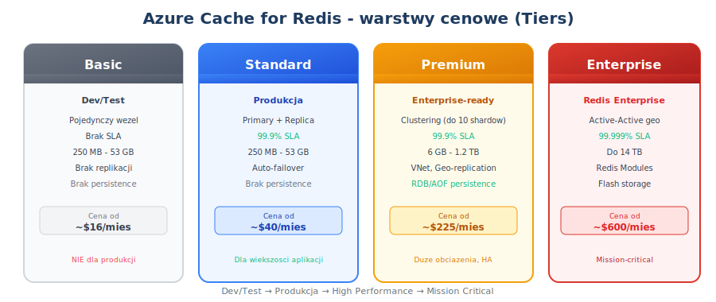

| Tier | SLA | Replikacja | Persistence | Clustering | Kiedy uzywac |
|------|-----|------------|-------------|------------|-------------|
| **Basic** | Brak | Brak | Nie | Nie | Dev/Test |
| **Standard** | 99.9% | Primary + Replica | Nie | Nie | Wiekszosc produkcji |
| **Premium** | 99.9% | P + R + Geo | RDB/AOF | Do 10 shardow | Duze obciazenia |
| **Enterprise** | 99.999% | Active-Active | Pełna | Tak | Mission-critical |

### 20.4 Kluczowe funkcje

**Persistence (tylko Premium+):**
- **RDB** - snapshoty w regularnych odstepach
- **AOF** - zapisuje kazda operacje zapisu (wiecej danych, mniej utraty)

**Clustering (tylko Premium+):**
- Rozdziela dane na wiele shardow
- Do 1.2 TB danych (Premium) / 14 TB (Enterprise)
- Automatyczne resharding

**Geo-replication:**
- Premium: Active-Passive (DR)
- Enterprise: Active-Active (multi-region write)

**VNet Integration (Premium+):**
- Redis w prywatnej sieci
- Brak publicznego IP
- Private Endpoints

### 20.5 Wzorce cache - szczegoly

**Cache-Aside (Lazy Loading):**

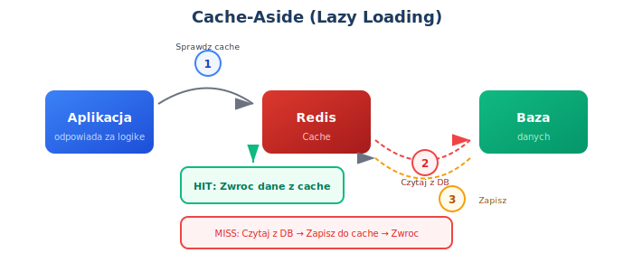

Najpopularniejszy wzorzec. Aplikacja jest odpowiedzialna za logike cache:
1. App sprawdza cache
2. **Cache HIT** → zwroc dane natychmiast (1-5ms)
3. **Cache MISS** → czytaj z DB → zapisz do cache → zwroc

| Zalety | Wady |
|--------|------|
| Tylko potrzebne dane w cache | Pierwsze zapytanie zawsze wolne (cold start) |
| Odporne na awarie cache | Dane moga byc nieaktualne (stale data) |
| Proste w implementacji | Wymaga logiki w aplikacji |

---

**Write-Through (zapis synchroniczny):**

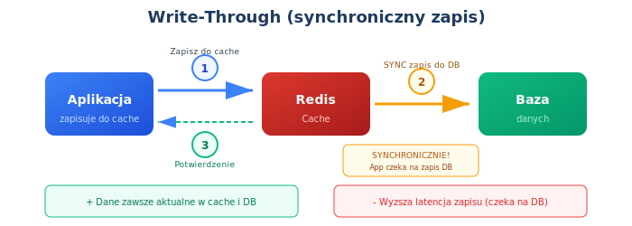

Cache dziala jako posrednik przy zapisie:
1. App zapisuje do cache
2. Cache **synchronicznie** zapisuje do DB (App czeka!)
3. Potwierdzenie dla App

| Zalety | Wady |
|--------|------|
| Dane zawsze aktualne w cache i DB | Wyzsza latencja zapisu |
| Brak niespojnosci | Kazdy zapis to 2 operacje |
| Proste odczyty | Wymaga wsparcia cache |

---

**Write-Behind / Write-Back (zapis asynchroniczny):**

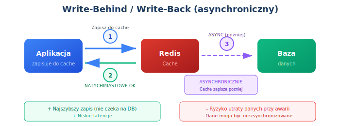

Najszybszy zapis - cache potwierdza natychmiast:
1. App zapisuje do cache
2. Cache **natychmiast** potwierdza (App nie czeka!)
3. Cache **asynchronicznie** zapisuje do DB (pozniej, w tle)

| Zalety | Wady |
|--------|------|
| Najszybszy zapis | Ryzyko utraty danych przy awarii |
| Niskie latencje | Dane moga byc niezsynchronizowane |
| Batching zapisow do DB | Zlozona implementacja |

---

### 20.6 Tworzenie przez CLI

```bash
# Utworzenie Resource Group
az group create --name myRG --location westeurope

# Utworzenie Redis Cache (Standard C1)
az redis create --name myrediscache --resource-group myRG \
    --location westeurope --sku Standard --vm-size C1

# Pobranie connection string
az redis list-keys --name myrediscache --resource-group myRG

# Wynik:
# primaryKey: "abc123..."
# secondaryKey: "xyz789..."
```

**Connection string format:**
```
myrediscache.redis.cache.windows.net:6380,password=<primaryKey>,ssl=True,abortConnect=False
```

### 20.7 Przyklad uzycia w kodzie (.NET)

```csharp
// NuGet: StackExchange.Redis
var redis = ConnectionMultiplexer.Connect("myrediscache.redis.cache.windows.net:6380,password=xxx,ssl=True");
var db = redis.GetDatabase();

// Zapis
db.StringSet("user:123", JsonSerializer.Serialize(user), TimeSpan.FromMinutes(30));

// Odczyt
var cached = db.StringGet("user:123");
if (cached.HasValue)
{
    return JsonSerializer.Deserialize<User>(cached);
}
```

### 20.8 Best Practices

**Klucze:**
- Uzywaj prefixow: `user:123`, `product:456`, `session:abc`
- Unikaj bardzo długich kluczy (max 1KB, optymalnie < 100 bajtów)

**TTL (Time To Live):**
- Zawsze ustawiaj TTL dla danych cache
- Typowe wartosci: 5-60 minut dla danych, 30 min - 24h dla sesji

**Eviction Policy:**
- `volatile-lru` - usun najstarsze klucze z TTL (domyslne)
- `allkeys-lru` - usuń najstarsze ze wszystkich kluczy
- `noeviction` - blad gdy brak pamieci

**Monitoring:**
- Azure Monitor dla metryk (hits, misses, memory)
- Cache Hit Ratio powinna byc > 90%
- Alerts na wysokie uzycie pamieci

---

<a id="sec-21-deployment"></a>
## 21. Wdrażanie aplikacji na Azure (Deployment)

Wdrażanie (deployment) to proces przeniesienia aplikacji ze środowiska deweloperskiego do produkcji. Azure oferuje wiele metod wdrażania, od prostych (przez portal) po zaawansowane (CI/CD pipelines).

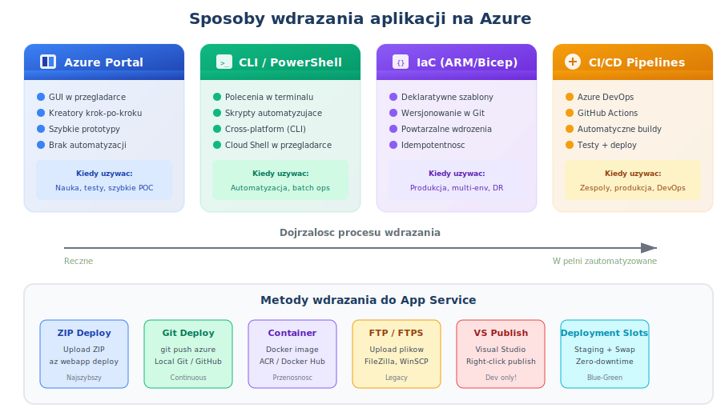

### 20.1 Metody wdrażania - przegląd

| Metoda | Zalety | Wady | Kiedy używać |
|--------|--------|------|--------------|
| **Azure Portal** | Wizualny, łatwy start | Nieskalowalny, brak automatyzacji | Nauka, testy, jednokrotne wdrożenia |
| **Azure CLI / PowerShell** | Skryptowalny, powtarzalny | Wymaga znajomości składni | Automatyzacja prostych zadań |
| **ARM Templates / Bicep (IaC)** | Pełna powtarzalność, wersjonowanie | Krzywa uczenia się | Infrastruktura produkcyjna |
| **CI/CD Pipelines** | Pełna automatyzacja, testy | Złożona konfiguracja | Profesjonalne projekty |

### 20.2 Wdrażanie przez Azure Portal

Najprostsza metoda, idealna do nauki:

1. **Azure Portal → Create a resource**
2. Wybierz typ zasobu (np. Web App, VM)
3. Wypełnij formularz (nazwa, region, pricing tier)
4. **Review + Create → Create**

**Przykład wdrożenia Web App:**
- Resource Group → Wybierz lub utwórz
- Name → unikalna nazwa (myapp.azurewebsites.net)
- Runtime stack → np. .NET 8, Node 20, Python 3.12
- Region → np. West Europe
- Pricing plan → Free F1 (do testów) lub B1/S1 (produkcja)

### 20.3 Wdrażanie przez Azure CLI

Skryptowalny sposób wdrażania, idealny do automatyzacji:

```bash
# Logowanie do Azure
az login

# Utworzenie Resource Group
az group create --name myResourceGroup --location westeurope

# Utworzenie App Service Plan
az appservice plan create --name myAppServicePlan \
    --resource-group myResourceGroup \
    --sku B1 --is-linux

# Utworzenie Web App
az webapp create --name myUniqueAppName \
    --resource-group myResourceGroup \
    --plan myAppServicePlan \
    --runtime "DOTNET|8.0"

# Wdrożenie kodu z ZIP
az webapp deploy --resource-group myResourceGroup \
    --name myUniqueAppName \
    --src-path ./publish.zip --type zip
```

### 20.4 Infrastructure as Code (IaC)

**ARM Templates** - JSON opisujący infrastrukturę:
```json
{
  "$schema": "https://schema.management.azure.com/schemas/2019-04-01/deploymentTemplate.json#",
  "resources": [{
    "type": "Microsoft.Web/sites",
    "apiVersion": "2022-09-01",
    "name": "[parameters('appName')]",
    "location": "[resourceGroup().location]"
  }]
}
```

**Bicep** - uproszczona składnia (kompiluje się do ARM):
```bicep
resource webApp 'Microsoft.Web/sites@2022-09-01' = {
  name: appName
  location: resourceGroup().location
  properties: {
    serverFarmId: appServicePlan.id
  }
}
```

| Cecha | ARM Templates | Bicep |
|-------|---------------|-------|
| Składnia | JSON (verbose) | DSL (zwięzły) |
| Krzywa uczenia | Stroma | Łagodniejsza |
| IntelliSense | Ograniczony | Pełny (VS Code) |
| Modularność | Linked templates | Natywne moduły |

### 20.5 CI/CD Pipelines

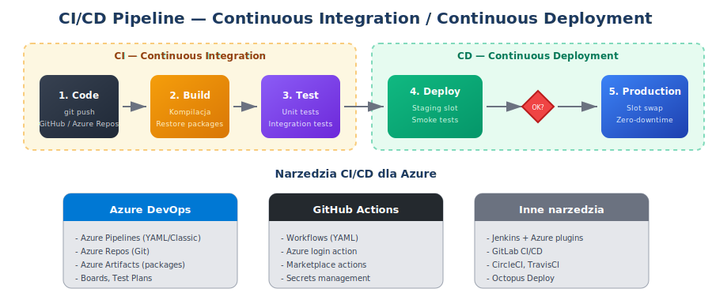

**CI (Continuous Integration):**
- Automatyczne budowanie po każdym pushu
- Uruchamianie testów jednostkowych
- Analiza jakości kodu
- Tworzenie artefaktów (build output)

**CD (Continuous Deployment/Delivery):**
- Automatyczne wdrażanie na środowiska (dev → staging → prod)
- Testy integracyjne i E2E
- Approval gates przed produkcją
- Rollback w razie problemów

**Azure DevOps Pipeline (YAML):**
```yaml
trigger:
  - main

pool:
  vmImage: 'ubuntu-latest'

stages:
- stage: Build
  jobs:
  - job: BuildJob
    steps:
    - task: DotNetCoreCLI@2
      inputs:
        command: 'publish'
        publishWebProjects: true
        
- stage: Deploy
  jobs:
  - deployment: DeployWeb
    environment: 'production'
    strategy:
      runOnce:
        deploy:
          steps:
          - task: AzureWebApp@1
            inputs:
              appName: 'myapp'
```

**GitHub Actions:**
```yaml
name: Deploy to Azure
on:
  push:
    branches: [main]

jobs:
  build-and-deploy:
    runs-on: ubuntu-latest
    steps:
    - uses: actions/checkout@v4
    
    - name: Build
      run: dotnet publish -c Release
      
    - name: Deploy to Azure
      uses: azure/webapps-deploy@v2
      with:
        app-name: 'myapp'
        publish-profile: ${{ secrets.AZURE_PUBLISH_PROFILE }}
```

### 20.6 Deployment Slots (Blue-Green Deployment)

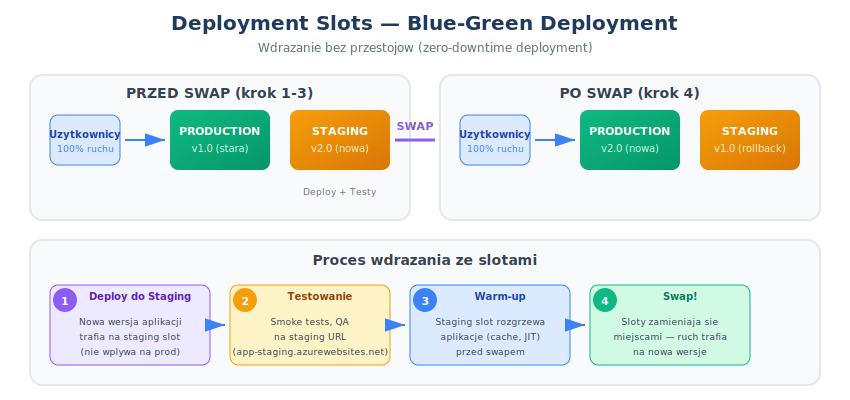

**Deployment Slots** to funkcja App Service pozwalająca na tzw. **blue-green deployment** - wdrażanie bez przestojów.

**Jak to działa:**
1. **Production slot** - aktualnie działająca wersja (np. v1.0)
2. **Staging slot** - nowa wersja do wdrożenia (np. v2.0)
3. Po testach wykonujesz **Swap** - zamiana slotów
4. Użytkownicy natychmiast widzą nową wersję
5. Jeśli problem → Swap z powrotem (instant rollback)

**Zalety:**
- **Zero-downtime deployments** - brak przerwy w działaniu
- **Warm-up** - staging slot jest już rozgrzany
- **Instant rollback** - jeden klik przywraca poprzednią wersję
- **Testowanie na produkcji** - staging może używać produkcyjnej konfiguracji

```bash
# Utworzenie staging slot
az webapp deployment slot create --name myapp \
    --resource-group myRG --slot staging

# Wdrożenie na staging
az webapp deploy --name myapp --slot staging \
    --src-path ./app.zip --type zip

# Swap staging <-> production
az webapp deployment slot swap --name myapp \
    --resource-group myRG --slot staging --target-slot production
```

### 20.7 Wdrażanie kontenerów

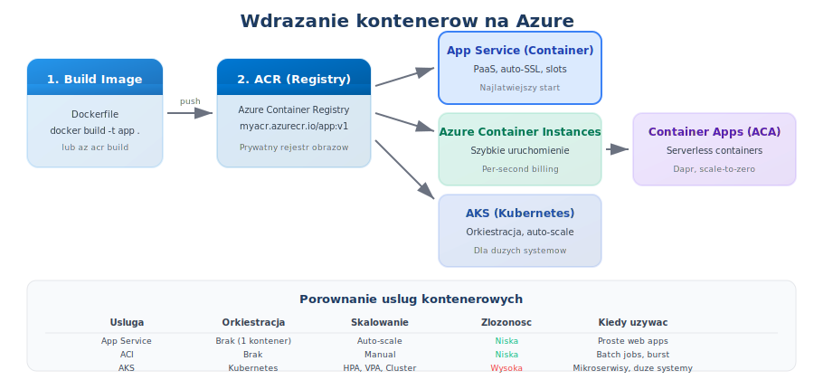

**Przepływ wdrożenia kontenera:**
1. **Build image** - `docker build -t myapp .`
2. **Push do ACR** - `docker push myacr.azurecr.io/myapp:v1`
3. **Deploy** - uruchom na wybranej usłudze

**Azure Container Registry (ACR):**
- Prywatny rejestr obrazów Docker
- Integracja z AKS, App Service, ACI
- Geo-replication dla HA
- Vulnerability scanning

```bash
# Utworzenie ACR
az acr create --name myacr --resource-group myRG --sku Basic

# Build i push w jednym kroku (bez lokalnego Dockera)
az acr build --registry myacr --image myapp:v1 .

# Uruchomienie na ACI
az container create --resource-group myRG \
    --name mycontainer \
    --image myacr.azurecr.io/myapp:v1 \
    --cpu 1 --memory 1 \
    --registry-login-server myacr.azurecr.io \
    --registry-username myacr \
    --registry-password <password>
```

### 20.8 Porównanie usług dla kontenerów

| Usługa | Typ | Orkiestracja | Kiedy używać |
|--------|-----|--------------|--------------|
| **App Service** | PaaS | Brak (1 kontener) | Proste web apps |
| **ACI** | CaaS | Brak | Batch jobs, szybkie testy |
| **AKS** | Kubernetes | Pełna | Mikroserwisy, duże systemy |
| **Container Apps** | Serverless | Dapr, KEDA | Scale-to-zero, eventy |

### 20.9 Dobre praktyki wdrażania

**Środowiska (Environments):**
- **Development** - dla programistów, częste wdrożenia
- **Staging** - kopia produkcji, testy UAT
- **Production** - dla użytkowników końcowych

**Strategie wdrażania:**
| Strategia | Opis | Ryzyko |
|-----------|------|--------|
| **Rolling** | Stopniowa wymiana instancji | Niskie |
| **Blue-Green** | Swap slotów/środowisk | Bardzo niskie |
| **Canary** | 5-10% ruchu na nową wersję | Bardzo niskie |
| **Big Bang** | Wszystko naraz | Wysokie |

**Checklist przed produkcją:**
- [ ] Wszystkie testy przeszły
- [ ] Code review zatwierdzony
- [ ] Backup bazy danych wykonany
- [ ] Monitoring skonfigurowany
- [ ] Rollback plan przygotowany
- [ ] Approval gate zatwierdzony

---

<a id="sec-22-last-minute-cram"></a>
## 22. Last-minute cram (pułapki + porównania)

### 40 najczęstszych pułapek egzaminacyjnych AZ‑900

1. Subskrypcja nie kosztuje sama w sobie — płacisz za zasoby.
2. Resource Group to kontener logiczny, nie granica sieci.
3. RBAC dziedziczy się tylko w dół hierarchii.
4. `Owner` może zarządzać dostępem, `Contributor` nie.
5. Azure Policy `Deny` blokuje wdrożenie.
6. `Audit` w Policy nie blokuje wdrożenia.
7. Lock `ReadOnly` blokuje zmiany i usunięcie.
8. Lock `Delete` blokuje tylko usuwanie.
9. Region to nie to samo co Availability Zone.
10. Availability Set to nie Availability Zone.
11. HA zwykle dotyczy 1 regionu, DR zwykle 2+ regionów.
12. RTO = czas odtworzenia, RPO = dopuszczalna utrata danych.
13. Egress jest płatny, ingress zazwyczaj bezpłatny.
14. ExpressRoute jest prywatny, ale nie szyfruje danych domyślnie.
15. VPN Site‑to‑Site łączy sieci, Point‑to‑Site pojedynczego użytkownika.
16. NSG to ACL L3/L4, nie pełny firewall aplikacyjny.
17. Azure Firewall to stateful firewall, NSG nie.
18. DDoS Standard chroni L3/L4, nie L7.
19. WAF chroni warstwę aplikacyjną HTTP(S), np. OWASP Top 10.
20. Private Endpoint daje prywatny IP, Service Endpoint nie.
21. Front Door działa globalnie na edge (L7).
22. Traffic Manager działa na DNS, nie proxy’uje ruchu HTTP.
23. Load Balancer działa na L4 (TCP/UDP).
24. Application Gateway działa na L7 i może mieć WAF.
25. Azure Functions = event-driven serverless; płatność za wykonania (Consumption).
26. Durable Functions służą do długich workflow ze stanem.
27. ACI to szybkie uruchomienie kontenera bez orkiestracji.
28. ACA jest wyżej poziomem niż ACI (mikroserwisy, scale-to-zero).
29. AKS daje pełną orkiestrację Kubernetes.
30. PaaS zmniejsza odpowiedzialność za OS i patchowanie.
31. W IaaS odpowiadasz m.in. za OS i hardening VM.
32. Entra ID to IAM, nie klasyczny AD Domain Services.
33. Conditional Access ocenia kontekst (user/device/location/risk).
34. PIM daje JIT/JEA dla ról uprzywilejowanych.
35. Managed Identity eliminuje potrzebę trzymania sekretów w kodzie.
36. Blob tiers: Hot/Cool/Cold/Archive różnią się kosztem zapisu i odczytu.
37. LRS/ZRS/GRS/RA‑GRS to poziomy redundancji storage.
38. Cosmos DB to globalny NoSQL z multi‑region i niskimi opóźnieniami.
39. Preview nie oznacza pełnej gotowości produkcyjnej i pełnego SLA.
40. GA oznacza stabilność produkcyjną i standardowe warunki wsparcia/SLA.

---

### Szybkie porównania usług (ściąga)

#### Compute

| Usługa | Kiedy wybierać | Kluczowa cecha |
|---|---|---|
| Virtual Machines | pełna kontrola nad OS | IaaS, największa elastyczność |
| App Service | web/API bez administrowania serwerami | PaaS dla aplikacji HTTP |
| Azure Functions | eventy, krótkie zadania | serverless, trigger + binding |
| Azure Container Apps | mikroserwisy/kontenery bez K8s | autoscaling + scale-to-zero |
| AKS | złożone kontenery na dużą skalę | pełny Kubernetes |

#### Integracja i zdarzenia

| Usługa | Wzorzec | Najlepsze zastosowanie |
|---|---|---|
| Service Bus | kolejki/topics (enterprise messaging) | niezawodna integracja systemów |
| Event Grid | routing eventów (push) | zdarzenia reaktywne w Azure |
| Event Hub | streaming telemetry | duży wolumen zdarzeń/IoT/logi |
| Storage Queue | prosta kolejka | lekkie scenariusze async |

#### Sieć i ruch web

| Usługa | Warstwa | Zastosowanie |
|---|---|---|
| Load Balancer | L4 | ruch TCP/UDP dla VM/VMSS |
| Application Gateway | L7 | routing HTTP(S) + opcjonalny WAF |
| Front Door | L7 Edge | globalne aplikacje web, accel + WAF |
| Traffic Manager | DNS | globalny routing/failover DNS |

#### Tożsamość i bezpieczeństwo

| Mechanizm | Co robi | Typowe użycie |
|---|---|---|
| RBAC | autoryzacja do zasobów | kto co może zrobić |
| Conditional Access | polityki dostępu zależne od kontekstu | wymuszenie MFA/compliance |
| PIM | czasowe role uprzywilejowane | JIT dla adminów |
| Managed Identity | tożsamość dla aplikacji bez sekretów | dostęp do KV/Storage/SQL |

#### Storage

| Typ | Charakter danych | Przykład |
|---|---|---|
| Blob | obiektowe, niestrukturalne | backupy, logi, media |
| Files | SMB/NFS share | udziały plików |
| Queue | wiadomości | komunikacja async |
| Table | NoSQL key-value | metadane, telemetria |
| Managed Disks | dyski VM | OS/Data disk dla IaaS |

---

### Jak używać tej sekcji 24h przed egzaminem

- Przerób 40 pułapek 2 razy (rano i wieczorem).
- Jeśli mylisz 2 usługi, wróć do odpowiedniej tabeli porównawczej.
- Skup się na różnicach: zakres odpowiedzialności, warstwa sieci, model płatności, poziom zarządzania.

### Exam-day strategy (pod pytania podchwytliwe)

- Najpierw szukaj słów‑kluczy w pytaniu: **global/regional**, **L3/L4/L7**, **IaaS/PaaS/SaaS**, **HA/DR**, **RBAC/Policy**.
- Eliminuj odpowiedzi absolutne typu „zawsze”, „nigdy”, jeśli scenariusz dopuszcza wyjątki.
- Jeśli pytanie dotyczy „kto odpowiada”, użyj modelu **Shared Responsibility**.
- Jeśli pytanie dotyczy „najmniej operacji”, wybieraj bardziej zarządzane usługi (PaaS/serverless).
- Zostaw trudne pytania na koniec i wróć po pierwszym przejściu.

---
<a id="sec-23-azure-key-vault"></a>
## 23. Azure Key Vault

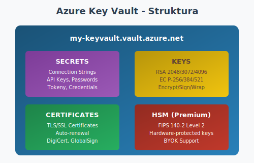

### Czym jest Azure Key Vault?

**Azure Key Vault** to w pełni zarządzana usługa do bezpiecznego przechowywania i zarządzania wrażliwymi danymi:
- **Secrets** – hasła, connection stringi, API keys, tokeny
- **Keys** – klucze kryptograficzne do szyfrowania i podpisywania
- **Certificates** – certyfikaty TLS/SSL z automatycznym odnowieniem

**Główne zalety:**
- Centralizacja sekretów w jednym miejscu
- Brak sekretów hardkodowanych w kodzie/configach
- Pełny audit trail (kto, kiedy, co)
- Integracja z Managed Identity (zero credentials w aplikacji)
- Szyfrowanie w spoczynku i w tranzycie
- Zgodność z regulacjami (FIPS, SOC, ISO, PCI)

---

### Typy obiektów w Key Vault

| Typ | Opis | Przykłady użycia |
|-----|------|------------------|
| **Secrets** | Dowolny ciąg znaków do 25KB | Connection stringi, API keys, hasła |
| **Keys** | Klucze kryptograficzne (RSA, EC) | Szyfrowanie danych, podpisywanie JWT |
| **Certificates** | Certyfikaty X.509 + klucz prywatny | TLS dla App Gateway, HTTPS binding |

**Keys - typy i algorytmy:**

| Typ klucza | Rozmiary | Użycie |
|------------|----------|--------|
| **RSA** | 2048, 3072, 4096 bit | Szyfrowanie, podpisywanie |
| **EC (Elliptic Curve)** | P-256, P-384, P-521 | Szybsze podpisy, mniejsze klucze |
| **oct (Symmetric)** | 128, 192, 256 bit | AES encryption (tylko HSM) |

**Operacje kryptograficzne:**
```
Encrypt / Decrypt    - szyfrowanie danych kluczem
Sign / Verify        - podpis cyfrowy i weryfikacja
Wrap / Unwrap        - owijanie kluczy (key encryption keys)
```

---

### Kontrola dostępu

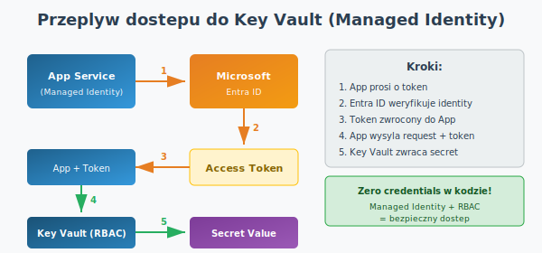

Key Vault obsługuje dwa modele dostępu:

**1. RBAC (Azure Role-Based Access Control) - ZALECANE**

| Rola | Uprawnienia |
|------|-------------|
| **Key Vault Administrator** | Pełne zarządzanie vault + zawartością |
| **Key Vault Secrets Officer** | Zarządzanie sekretami (CRUD) |
| **Key Vault Secrets User** | Tylko odczyt sekretów (Get, List) |
| **Key Vault Crypto Officer** | Zarządzanie kluczami |
| **Key Vault Crypto User** | Operacje kryptograficzne (Sign, Encrypt) |
| **Key Vault Certificates Officer** | Zarządzanie certyfikatami |

**Przykład przypisania roli:**
```bash
# Nadanie roli "Key Vault Secrets User" dla Managed Identity
az role assignment create \
    --role "Key Vault Secrets User" \
    --assignee <managed-identity-principal-id> \
    --scope /subscriptions/<sub>/resourceGroups/<rg>/providers/Microsoft.KeyVault/vaults/<vault-name>
```

**2. Access Policy (Legacy)**

Starszy model – przypisujesz uprawnienia per principal:
```bash
az keyvault set-policy --name myKeyVault \
    --object-id <app-object-id> \
    --secret-permissions get list
```

> **Uwaga:** Microsoft zaleca RBAC dla nowych wdrożeń. Access Policy nie integruje się z Conditional Access ani PIM.

---

### Tworzenie Key Vault przez CLI

```bash
# Utworzenie Key Vault (Standard tier)
az keyvault create --name myKeyVault \
    --resource-group myRG \
    --location westeurope \
    --sku standard \
    --enable-rbac-authorization true \
    --enable-soft-delete true \
    --soft-delete-retention-days 90 \
    --enable-purge-protection true

# Premium tier (HSM-backed keys)
az keyvault create --name myHSMVault \
    --resource-group myRG \
    --location westeurope \
    --sku premium \
    --enable-rbac-authorization true
```

---

### Zarządzanie sekretami

```bash
# Dodanie sekretu
az keyvault secret set --vault-name myKeyVault \
    --name "DatabaseConnectionString" \
    --value "Server=tcp:myserver.database.windows.net;..."

# Pobranie sekretu
az keyvault secret show --vault-name myKeyVault \
    --name "DatabaseConnectionString" \
    --query "value" -o tsv

# Lista sekretów
az keyvault secret list --vault-name myKeyVault -o table

# Usunięcie sekretu (soft delete)
az keyvault secret delete --vault-name myKeyVault \
    --name "DatabaseConnectionString"

# Odzyskanie usuniętego sekretu
az keyvault secret recover --vault-name myKeyVault \
    --name "DatabaseConnectionString"

# Trwałe usunięcie (purge) - wymaga uprawnień
az keyvault secret purge --vault-name myKeyVault \
    --name "DatabaseConnectionString"
```

---

### Wersjonowanie sekretów

Key Vault automatycznie wersjonuje każdy obiekt:

```
https://mykeyvault.vault.azure.net/secrets/DatabaseConnectionString
  └── /versions/abc123def456...  (wersja 1)
  └── /versions/xyz789ghi012...  (wersja 2 - aktualna)
```

**Pobieranie konkretnej wersji:**
```bash
az keyvault secret show --vault-name myKeyVault \
    --name "DatabaseConnectionString" \
    --version "abc123def456"
```

**Bez podania wersji** → zawsze zwraca **najnowszą aktywną** wersję.

---

### Integracja z aplikacjami

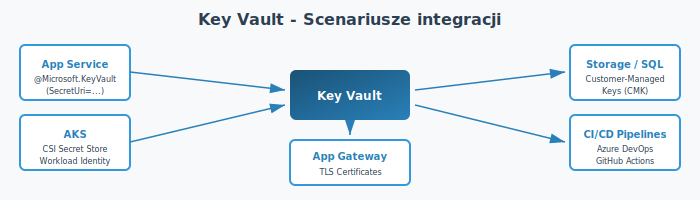

**1. App Service / Azure Functions (Key Vault Reference)**

W Application Settings zamiast wartości używasz referencji:
```
@Microsoft.KeyVault(SecretUri=https://mykeyvault.vault.azure.net/secrets/MySecret/)
```

Lub z konkretną wersją:
```
@Microsoft.KeyVault(SecretUri=https://mykeyvault.vault.azure.net/secrets/MySecret/abc123)
```

**Wymagania:**
- App Service musi mieć System-assigned Managed Identity
- Managed Identity musi mieć rolę "Key Vault Secrets User"

**2. Kod aplikacji (.NET)**

```csharp
// Używając Azure.Identity i Azure.Security.KeyVault.Secrets
using Azure.Identity;
using Azure.Security.KeyVault.Secrets;

var client = new SecretClient(
    new Uri("https://mykeyvault.vault.azure.net/"),
    new DefaultAzureCredential() // używa Managed Identity
);

KeyVaultSecret secret = await client.GetSecretAsync("DatabaseConnectionString");
string connectionString = secret.Value;
```

---

### Zarzadzanie certyfikatami

```bash
# Import istniejącego certyfikatu (PFX)
az keyvault certificate import --vault-name myKeyVault \
    --name "MyCert" \
    --file ./certificate.pfx \
    --password "pfx-password"

# Żądanie certyfikatu od CA (DigiCert, GlobalSign)
az keyvault certificate create --vault-name myKeyVault \
    --name "MyCert" \
    --policy @policy.json

# Self-signed certificate
az keyvault certificate create --vault-name myKeyVault \
    --name "SelfSignedCert" \
    --policy "$(az keyvault certificate get-default-policy)"

# Pobranie certyfikatu (public part)
az keyvault certificate show --vault-name myKeyVault \
    --name "MyCert"
```

**Auto-renewal:**
Key Vault może automatycznie odnawiać certyfikaty przed wygaśnięciem:
- Zintegrowane CA (DigiCert, GlobalSign) – pełna automatyzacja
- Self-signed – automatyczne regenerowanie
- Manual CA – wysyła powiadomienia

---

### Customer-Managed Keys (CMK)

Key Vault przechowuje klucze szyfrujące dane w innych usługach:

| Usługa | Jak używa Key Vault |
|--------|---------------------|
| **Azure Storage** | CMK do szyfrowania blob/file/queue |
| **Azure SQL** | TDE (Transparent Data Encryption) |
| **Azure Disk Encryption** | Szyfrowanie dysków VM |
| **Cosmos DB** | CMK dla danych at-rest |
| **Azure Backup** | Szyfrowanie backup vaults |

**Konfiguracja CMK dla Storage:**
```bash
# 1. Utworzenie klucza w Key Vault
az keyvault key create --vault-name myKeyVault \
    --name "storage-encryption-key" \
    --kty RSA --size 2048

# 2. Nadanie uprawnień Storage Account
az role assignment create \
    --role "Key Vault Crypto Service Encryption User" \
    --assignee <storage-account-principal-id> \
    --scope /subscriptions/.../vaults/myKeyVault

# 3. Konfiguracja Storage do używania CMK
az storage account update --name mystorageaccount \
    --resource-group myRG \
    --encryption-key-source Microsoft.Keyvault \
    --encryption-key-vault https://mykeyvault.vault.azure.net \
    --encryption-key-name storage-encryption-key
```

---

### Bezpieczeństwo Key Vault

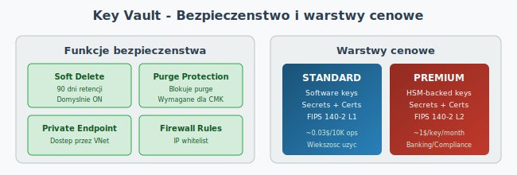

**Soft Delete (domyślnie włączone):**
- Usunięty vault/secret/key trafia do "soft deleted" state
- Można odzyskać przez 7-90 dni (default 90)
- Chroni przed przypadkowym usunięciem

**Purge Protection:**
- Blokuje trwałe usunięcie (purge) w okresie retencji
- **Wymagane** gdy używasz CMK dla innych usług
- Po włączeniu **nie można wyłączyć**

**Network Security:**

```bash
# Firewall - tylko wybrane IP
az keyvault update --name myKeyVault \
    --default-action Deny \
    --bypass AzureServices

az keyvault network-rule add --name myKeyVault \
    --ip-address 203.0.113.5

# Private Endpoint (zalecane dla produkcji)
az network private-endpoint create \
    --name myKVPrivateEndpoint \
    --resource-group myRG \
    --vnet-name myVNet \
    --subnet PrivateEndpointSubnet \
    --private-connection-resource-id <keyvault-resource-id> \
    --group-id vault \
    --connection-name myKVConnection
```

---

### Diagnostyka i monitoring

```bash
# Włączenie logów diagnostycznych
az monitor diagnostic-settings create \
    --name "KeyVaultLogs" \
    --resource <keyvault-resource-id> \
    --workspace <log-analytics-workspace-id> \
    --logs '[{"category":"AuditEvent","enabled":true}]'
```

**Kluczowe metryki:**
- **ServiceApiHit** – liczba żądań API
- **ServiceApiLatency** – czas odpowiedzi
- **ServiceApiResult** – sukces vs błędy

**Audit events logują:**
- Kto uzyskał dostęp (principal ID)
- Do jakiego obiektu (secret/key/cert)
- Jaka operacja (Get, Set, Delete)
- Czas i wynik operacji

---

### Porównanie warstw cenowych

| Aspekt | Standard | Premium |
|--------|----------|---------|
| **Secrets** | ✅ | ✅ |
| **Keys (software)** | ✅ | ✅ |
| **Keys (HSM)** | ❌ | ✅ |
| **Certificates** | ✅ | ✅ |
| **FIPS 140-2** | Level 1 | Level 2 |
| **Cena (10K ops)** | ~$0.03 | ~$0.03 + $1/klucz HSM |
| **Use case** | Większość scenariuszy | Banking, compliance |

---

### Managed HSM (osobna usługa)

Dla najwyższych wymagań compliance:
- **FIPS 140-2 Level 3** (vs Level 2 w Premium)
- **Single-tenant** dedicated HSM
- Pełna kontrola nad domeną bezpieczeństwa
- ~$3/godz (~$2200/miesiąc)

---

### Best Practices

| Praktyka | Opis |
|----------|------|
| **Używaj RBAC** | Zamiast Access Policy |
| **Managed Identity** | Zero credentials w kodzie |
| **Soft Delete + Purge Protection** | Zawsze włączone |
| **Private Endpoint** | Dla produkcji |
| **Osobny vault per środowisko** | Dev/Test/Prod izolowane |
| **Rotacja sekretów** | Automatyczna lub regularna |
| **Monitoruj dostęp** | Log Analytics + alerty |
| **Taguj zasoby** | Environment, Owner, Project |

---

### Podchwytliwe pytania egzaminacyjne

| Pytanie | Odpowiedź |
|---------|-----------|
| Gdzie przechowywać connection string do SQL? | **Key Vault** (nie App Settings!) |
| Co chroni przed przypadkowym usunięciem? | **Soft Delete** |
| Co wymagane dla CMK? | **Purge Protection** |
| Jaki tier dla HSM-backed keys? | **Premium** |
| Jak App Service czyta z Key Vault bez credentials? | **Managed Identity** |
| RBAC vs Access Policy? | **RBAC** jest zalecane |
| Czy Key Vault szyfruje dane? | Nie – przechowuje klucze, które szyfrują dane |

> **Egzamin:** Key Vault to centralne miejsce na sekrety, klucze i certyfikaty. Używaj Managed Identity dla dostępu aplikacji bez credentials w kodzie.

---

<a id="sec-24-debugging"></a>
## 24. Debugowanie aplikacji Azure

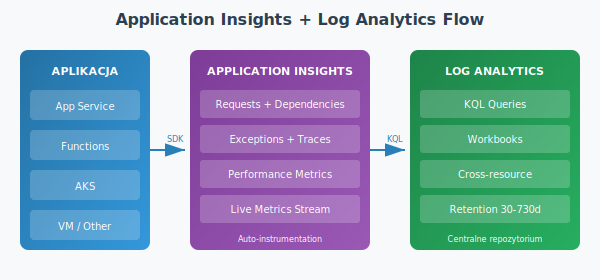

### Przegląd narzędzi do debugowania

Azure oferuje bogaty zestaw narzędzi do monitorowania, diagnostyki i debugowania aplikacji działających w chmurze.

---

### Application Insights

Główne narzędzie do monitorowania wydajności i diagnostyki aplikacji (APM - Application Performance Management).

**Co zbiera:**
- **Requests** - przychodzące żądania HTTP, czas odpowiedzi, status code
- **Dependencies** - wywołania do SQL, HTTP, Azure services
- **Exceptions** - nieobsłużone wyjątki z pełnym stack trace
- **Traces** - logi aplikacji (ILogger, Console.WriteLine)
- **Performance counters** - CPU, pamięć, GC
- **Custom events/metrics** - własne zdarzenia biznesowe

**Kluczowe funkcje:**

| Funkcja | Opis |
|---------|------|
| **Live Metrics** | Real-time monitoring (1s refresh) |
| **Application Map** | Wizualizacja zależności i flow |
| **Transaction Search** | Szukanie konkretnych requestów |
| **Failures** | Analiza błędów i wyjątków |
| **Performance** | Analiza czasów odpowiedzi |
| **Availability** | Testy ping z różnych lokalizacji |
| **Smart Detection** | Automatyczne wykrywanie anomalii |

**Konfiguracja w App Service:**

```bash
# Włączenie Application Insights dla App Service
az webapp config appsettings set --name myApp \
    --resource-group myRG \
    --settings APPLICATIONINSIGHTS_CONNECTION_STRING="InstrumentationKey=xxx;IngestionEndpoint=https://..."

# Lub przez extension
az monitor app-insights component create --app myAppInsights \
    --resource-group myRG --location westeurope

az webapp config appsettings set --name myApp \
    --resource-group myRG \
    --settings APPINSIGHTS_INSTRUMENTATIONKEY=$(az monitor app-insights component show \
        --app myAppInsights --resource-group myRG --query instrumentationKey -o tsv)
```

**Integracja w kodzie (.NET):**

```csharp
// Program.cs (.NET 6+)
builder.Services.AddApplicationInsightsTelemetry();

// Logowanie custom events
public class OrderController : ControllerBase
{
    private readonly TelemetryClient _telemetry;
    
    public OrderController(TelemetryClient telemetry)
    {
        _telemetry = telemetry;
    }
    
    [HttpPost]
    public IActionResult CreateOrder(Order order)
    {
        // Custom event
        _telemetry.TrackEvent("OrderCreated", new Dictionary<string, string>
        {
            { "OrderId", order.Id.ToString() },
            { "CustomerId", order.CustomerId }
        });
        
        // Custom metric
        _telemetry.TrackMetric("OrderValue", order.TotalAmount);
        
        return Ok();
    }
}
```

---

### Log Analytics i KQL

Centralne repozytorium logów z możliwością zaawansowanych zapytań.

**Przykłady zapytań KQL:**

```kusto
// Wszystkie wyjatki z ostatniej godziny
exceptions
| where timestamp > ago(1h)
| project timestamp, problemId, outerMessage, innermostMessage
| order by timestamp desc

// Top 10 najwolniejszych requestow
requests
| where timestamp > ago(24h)
| where success == true
| summarize avg(duration), count() by name
| top 10 by avg_duration desc

// Bledy HTTP 5xx
requests
| where timestamp > ago(1h)
| where resultCode startswith "5"
| summarize count() by bin(timestamp, 5m), resultCode
| render timechart

// Dependency failures (SQL, HTTP)
dependencies
| where timestamp > ago(1h)
| where success == false
| summarize count() by type, target, resultCode
| order by count_ desc

// Korelacja request -> dependencies -> exceptions
requests
| where timestamp > ago(1h)
| where success == false
| join kind=leftouter (dependencies | where success == false) on operation_Id
| join kind=leftouter (exceptions) on operation_Id
| project timestamp, request_name=name, dep_type=type, exception=outerMessage
```

---

### Kudu / SCM Console

Zaawansowana konsola diagnostyczna dla App Service.

**Dostęp:** `https://yourapp.scm.azurewebsites.net`

**Funkcje:**

| Funkcja | Opis |
|---------|------|
| **Debug Console** | CMD/PowerShell w przegladarce |
| **Process Explorer** | Lista procesow, handles, threads |
| **Log Stream** | Podglad logow w czasie rzeczywistym |
| **File Manager** | Przegladanie plikow aplikacji |
| **Deployment Logs** | Historia deploymentow |
| **Environment** | Zmienne srodowiskowe, wersje runtime |
| **Site Extensions** | Instalacja rozszerzen (np. profiler) |

**Przydatne ścieżki w Kudu:**

```
/api/dump                    - Memory dump
/api/processes               - Lista procesów
/api/processes/0/threads     - Threads głównego procesu
/api/vfs/                    - Virtual File System (browse files)
/api/logstream               - Log streaming endpoint
/DebugConsole                - Interaktywna konsola
```

---

### Remote Debugging

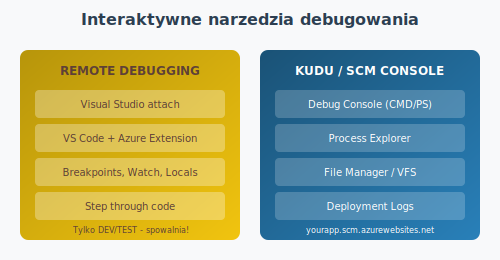

Debugowanie aplikacji bezpośrednio z Visual Studio.

**Włączenie Remote Debugging:**

```bash
# Włącz remote debugging dla App Service
az webapp config set --name myApp \
    --resource-group myRG \
    --remote-debugging-enabled true

# Sprawdź status
az webapp config show --name myApp \
    --resource-group myRG \
    --query remoteDebuggingEnabled
```

**W Visual Studio:**
1. View -> Cloud Explorer
2. Znajdź App Service
3. Right-click -> Attach Debugger
4. Ustaw breakpoint w kodzie
5. Wywołaj request do aplikacji

> **Uwaga:** Remote debugging spowalnia aplikacje! Używaj tylko w Dev/Test, NIE na produkcji.

---

### Snapshot Debugger

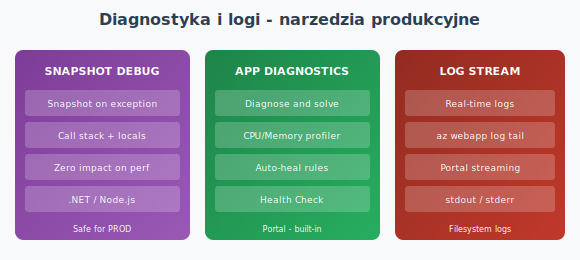

Przechwytuje stan aplikacji w momencie wyjątku - bez zatrzymywania produkcji.

**Jak działa:**
1. Aplikacja rzuca wyjątek
2. Snapshot Debugger przechwytuje:
   - Call stack
   - Wartości zmiennych lokalnych
   - Stan obiektów
3. Snapshot dostępny w Application Insights -> Failures

**Włączenie:**

```csharp
// NuGet: Microsoft.ApplicationInsights.SnapshotCollector

// Program.cs
builder.Services.AddApplicationInsightsTelemetry();
builder.Services.AddSnapshotCollector();
```

**appsettings.json:**
```json
{
  "ApplicationInsights": {
    "ConnectionString": "InstrumentationKey=xxx;..."
  },
  "SnapshotCollector": {
    "IsEnabled": true,
    "ThresholdForSnapshotting": 1,
    "MaximumSnapshotsRequired": 3
  }
}
```

---

### App Service Diagnostics

Wbudowany system diagnostyki "Diagnose and solve problems".

**Kategorie:**

| Kategoria | Co analizuje |
|-----------|-------------|
| **Availability** | Downtime, restarts, health checks |
| **Performance** | High CPU, memory, slow responses |
| **Configuration** | App settings, connection strings |
| **SSL/Certificates** | Certificate issues |
| **Deployment** | Deployment failures |

**Auto-Heal Rules:**

Automatyczne akcje naprawcze:

```bash
# Restart przy wysokim CPU
az webapp config set --name myApp \
    --resource-group myRG \
    --auto-heal-enabled true

# Konfiguracja reguł (w Portal lub ARM template)
# Triggers: slowRequests, memoryLimit, requestCount, statusCodes
# Actions: recycle, logEvent, customAction
```

---

### Log Streaming

Podgląd logów w czasie rzeczywistym.

**Azure CLI:**

```bash
# Stream logów App Service
az webapp log tail --name myApp --resource-group myRG

# Stream logów Functions
az functionapp log stream --name myFunc --resource-group myRG

# Włącz logowanie do filesystem
az webapp log config --name myApp \
    --resource-group myRG \
    --application-logging filesystem \
    --level verbose
```

**W Portal:** App Service -> Monitoring -> Log stream

---

### Health Checks

Monitorowanie zdrowia aplikacji przez Azure.

```bash
# Konfiguracja health check endpoint
az webapp config set --name myApp \
    --resource-group myRG \
    --generic-configurations '{"healthCheckPath": "/health"}'
```

**Endpoint w aplikacji (.NET):**

```csharp
// Program.cs
builder.Services.AddHealthChecks()
    .AddSqlServer(connectionString)
    .AddRedis(redisConnection)
    .AddUrlGroup(new Uri("https://api.external.com"), "external-api");

app.MapHealthChecks("/health");
```

---

### Alerts i powiadomienia

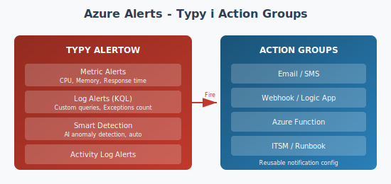

```bash
# Alert na wysokie CPU
az monitor metrics alert create --name HighCPUAlert \
    --resource-group myRG \
    --scopes /subscriptions/.../resourceGroups/myRG/providers/Microsoft.Web/sites/myApp \
    --condition "avg CpuPercentage > 80" \
    --window-size 5m \
    --evaluation-frequency 1m \
    --action /subscriptions/.../resourceGroups/myRG/providers/microsoft.insights/actionGroups/myActionGroup

# Alert na bledy HTTP 5xx (KQL)
az monitor scheduled-query create --name Http5xxAlert \
    --resource-group myRG \
    --scopes /subscriptions/.../resourceGroups/myRG/providers/microsoft.insights/components/myAppInsights \
    --condition "count > 10" \
    --condition-query "requests | where resultCode startswith '5'" \
    --window-size 5m
```

---

### Porównanie narzędzi

| Narzędzie | Use case | Wpływ na perf | Produkcja? |
|-----------|----------|---------------|------------|
| **Application Insights** | APM, metryki, logi | Minimalny | TAK |
| **Log Analytics** | Zaawansowane zapytania | Brak | TAK |
| **Remote Debugging** | Interaktywne debugowanie | WYSOKI | NIE |
| **Snapshot Debugger** | Debug exceptions | Minimalny | TAK |
| **Kudu Console** | Diagnostyka, pliki | Brak | Ostrożnie |
| **Log Streaming** | Real-time logi | Niski | TAK |
| **App Diagnostics** | Troubleshooting | Brak | TAK |

---

### Best Practices

| Praktyka | Opis |
|----------|------|
| **Włącz App Insights** | Dla każdej aplikacji produkcyjnej |
| **Structured logging** | Używaj ILogger z parametrami |
| **Correlation IDs** | Przekazuj przez cały pipeline |
| **Health checks** | Endpoint /health dla LB i Azure |
| **Alerts** | Na kluczowe metryki i błędy |
| **Retention policy** | Dostosuj do wymagań compliance |
| **Sampling** | Dla wysokiego ruchu (redukuje koszty) |

> **Egzamin:** Application Insights to główne narzędzie APM w Azure. Log Analytics umożliwia zapytania KQL. Remote debugging NIE powinno być używane na produkcji.

---

<a id="sec-25-service-bus"></a>
## 25. Azure Service Bus

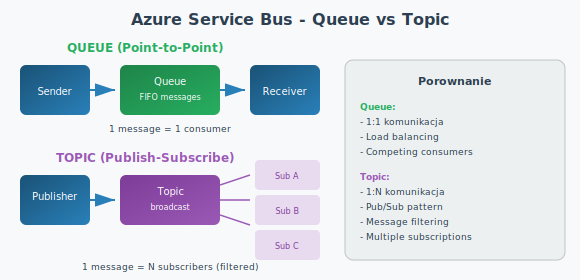

### Czym jest Azure Service Bus?

Azure Service Bus to w pełni zarządzana usługa **enterprise message broker** z kolejkami (queues) i tematami pub/sub (topics). Służy do **rozłączania aplikacji** i umożliwia niezawodną, asynchroniczną komunikację między komponentami.

**Kluczowe cechy:**
- Message queuing (FIFO)
- Publish/Subscribe (Topics + Subscriptions)
- At-least-once / At-most-once delivery
- Dead-letter queue (DLQ)
- Sessions (ordered processing)
- Scheduled messages
- Message deferral
- Duplicate detection
- Auto-forwarding

---

### Queue vs Topic - kiedy użyć?

| Scenariusz | Użyj | Dlaczego |
|------------|------|----------|
| 1 sender -> 1 receiver | **Queue** | Point-to-point |
| Load balancing między workerami | **Queue** | Competing consumers |
| 1 sender -> N receivers | **Topic** | Broadcast |
| Różne subskrypcje z filtrami | **Topic** | Message filtering |
| Event-driven architecture | **Topic** | Pub/Sub pattern |
| Background job processing | **Queue** | Work queue |

---

### Tiers - porównanie

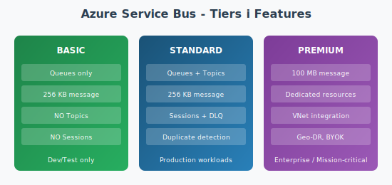

| Cecha | Basic | Standard | Premium |
|-------|-------|----------|---------|
| **Queues** | Tak | Tak | Tak |
| **Topics** | NIE | Tak | Tak |
| **Max message size** | 256 KB | 256 KB | 100 MB |
| **Sessions** | NIE | Tak | Tak |
| **Transactions** | NIE | Tak | Tak |
| **Duplicate detection** | NIE | Tak | Tak |
| **Geo-DR** | NIE | NIE | Tak |
| **VNet** | NIE | NIE | Tak |
| **BYOK encryption** | NIE | NIE | Tak |
| **Dedicated resources** | NIE | NIE | Tak |
| **Use case** | Dev/Test | Production | Enterprise |

> **Egzamin:** Basic tier NIE obsługuje Topics! Standard wystarcza dla większości scenariuszy produkcyjnych.

---

### Tworzenie Service Bus - Azure CLI

```bash
# Utwórz namespace (kontener dla queues/topics)
az servicebus namespace create --name myServiceBusNS \
    --resource-group myRG \
    --location westeurope \
    --sku Standard

# Utwórz queue
az servicebus queue create --name myQueue \
    --namespace-name myServiceBusNS \
    --resource-group myRG \
    --max-size 1024 \
    --default-message-time-to-live P14D \
    --lock-duration PT1M \
    --dead-lettering-on-message-expiration true

# Utwórz topic
az servicebus topic create --name myTopic \
    --namespace-name myServiceBusNS \
    --resource-group myRG \
    --max-size 1024

# Utwórz subscription dla topic
az servicebus topic subscription create --name mySubscription \
    --topic-name myTopic \
    --namespace-name myServiceBusNS \
    --resource-group myRG \
    --max-delivery-count 10

# Pobierz connection string
az servicebus namespace authorization-rule keys list \
    --name RootManageSharedAccessKey \
    --namespace-name myServiceBusNS \
    --resource-group myRG \
    --query primaryConnectionString -o tsv
```

---

### C# - Wysyłanie wiadomości do Queue

```csharp
using Azure.Messaging.ServiceBus;

// Connection string z Azure Portal lub CLI
string connectionString = "Endpoint=sb://myServiceBusNS.servicebus.windows.net/;SharedAccessKeyName=...";
string queueName = "myQueue";

// Utwórz klienta (thread-safe, reuse!)
await using var client = new ServiceBusClient(connectionString);

// Utwórz sender dla queue
await using var sender = client.CreateSender(queueName);

// Wyślij pojedynczą wiadomość
var message = new ServiceBusMessage("Hello Service Bus!");
Message.ApplicationProperties["Priority"] = "High";
message.ContentType = "application/json";
await sender.SendMessageAsync(message);

// Wyślij batch (wydajniej dla wielu wiadomości)
using ServiceBusMessageBatch batch = await sender.CreateMessageBatchAsync();
batch.TryAddMessage(new ServiceBusMessage("Message 1"));
batch.TryAddMessage(new ServiceBusMessage("Message 2"));
batch.TryAddMessage(new ServiceBusMessage("Message 3"));
await sender.SendMessagesAsync(batch);

Console.WriteLine("Messages sent!");
```

---

### C# - Odbieranie wiadomości z Queue

```csharp
using Azure.Messaging.ServiceBus;

string connectionString = "Endpoint=sb://...";
string queueName = "myQueue";

await using var client = new ServiceBusClient(connectionString);

// Sposób 1: ServiceBusProcessor (zalecany dla produkcji)
var processor = client.CreateProcessor(queueName, new ServiceBusProcessorOptions
{
    AutoCompleteMessages = false,  // Ręczne Complete/Abandon
    MaxConcurrentCalls = 2,        // Ile wiadomości naraz
    PrefetchCount = 10             // Pre-fetch dla wydajności
});

processor.ProcessMessageAsync += async args =>
{
    string body = args.Message.Body.ToString();
    Console.WriteLine($"Received: {body}");
    
    try
    {
        // Przetwórz wiadomość...
        await ProcessMessageAsync(body);
        
        // Oznacz jako przetworzoną (usuwa z queue)
        await args.CompleteMessageAsync(args.Message);
    }
    catch (Exception ex)
    {
        // Zwróć do queue (lub DLQ po max retries)
        await args.AbandonMessageAsync(args.Message);
    }
};

processor.ProcessErrorAsync += args =>
{
    Console.WriteLine($"Error: {args.Exception.Message}");
    return Task.CompletedTask;
};

await processor.StartProcessingAsync();
Console.WriteLine("Press any key to stop...");
Console.ReadKey();
await processor.StopProcessingAsync();
```

---

### C# - Publikowanie do Topic

```csharp
using Azure.Messaging.ServiceBus;

string connectionString = "Endpoint=sb://...";
string topicName = "myTopic";

await using var client = new ServiceBusClient(connectionString);
await using var sender = client.CreateSender(topicName);

// Wyślij wiadomość z properties (do filtrowania)
var orderMessage = new ServiceBusMessage(BinaryData.FromObjectAsJson(new 
{
    OrderId = 12345,
    CustomerId = "C001",
    TotalAmount = 299.99
}));

// Application properties używane do filtrowania w subscriptions
orderMessage.ApplicationProperties["OrderType"] = "Premium";
orderMessage.ApplicationProperties["Region"] = "Europe";
orderMessage.Subject = "NewOrder";  // Label
orderMessage.ContentType = "application/json";

await sender.SendMessageAsync(orderMessage);
Console.WriteLine("Order published to topic!");
```

---

### C# - Odbieranie z Subscription (z filtrem)

```csharp
using Azure.Messaging.ServiceBus;
using Azure.Messaging.ServiceBus.Administration;

string connectionString = "Endpoint=sb://...";
string topicName = "myTopic";
string subscriptionName = "PremiumOrders";

// Opcjonalnie: utwórz subscription z filtrem (lub w CLI/Portal)
var adminClient = new ServiceBusAdministrationClient(connectionString);

if (!await adminClient.SubscriptionExistsAsync(topicName, subscriptionName))
{
    await adminClient.CreateSubscriptionAsync(
        new CreateSubscriptionOptions(topicName, subscriptionName),
        new CreateRuleOptions("PremiumFilter", new SqlRuleFilter("OrderType = 'Premium'"))
    );
}

// Odbieraj wiadomości z subscription
await using var client = new ServiceBusClient(connectionString);
var processor = client.CreateProcessor(topicName, subscriptionName);

processor.ProcessMessageAsync += async args =>
{
    var order = args.Message.Body.ToObjectFromJson<dynamic>();
    Console.WriteLine($"Premium order received: {order.OrderId}");
    await args.CompleteMessageAsync(args.Message);
};

processor.ProcessErrorAsync += args =>
{
    Console.WriteLine($"Error: {args.Exception}");
    return Task.CompletedTask;
};

await processor.StartProcessingAsync();
```

---

### Subscription Filters

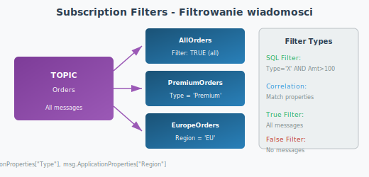

Filtrowanie wiadomości na poziomie subscription:

| Typ filtra | Opis | Przykład |
|------------|------|----------|
| **SQL Filter** | SQL-like WHERE | `OrderType = 'Premium' AND Amount > 100` |
| **Correlation Filter** | Property matching | Match on MessageId, Subject, To |
| **True Filter** | Wszystkie wiadomości | Default (brak filtra) |
| **False Filter** | Żadne wiadomości | Blokuje subscription |

```csharp
// SQL Filter
new SqlRuleFilter("Region = 'Europe' AND Priority > 5")

// Correlation Filter (wydajniejszy)
new CorrelationRuleFilter
{
    Subject = "NewOrder",
    ApplicationProperties = { { "OrderType", "Premium" } }
}
```

---

### Dead-Letter Queue (DLQ)

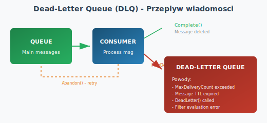

Wiadomości trafiają do DLQ gdy:
- Przekroczona liczba prób dostarczenia (MaxDeliveryCount)
- Wiadomość wygasła (TTL)
- Ręcznie przeniesiona przez aplikację
- Filter evaluation exception

```csharp
// Odbieranie z DLQ
var dlqProcessor = client.CreateProcessor(
    queueName, 
    new ServiceBusProcessorOptions { SubQueue = SubQueue.DeadLetter }
);

dlqProcessor.ProcessMessageAsync += async args =>
{
    // Sprawdź powód DLQ
    var reason = args.Message.DeadLetterReason;
    var description = args.Message.DeadLetterErrorDescription;
    
    Console.WriteLine($"DLQ Message: {args.Message.Body}");
    Console.WriteLine($"Reason: {reason}, Description: {description}");
    
    // Napraw i ponownie wyślij lub zloguj
    await args.CompleteMessageAsync(args.Message);
};
```

---

### Sessions (Ordered Processing)

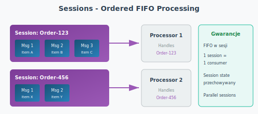

Sessions gwarantują FIFO processing dla wiadomości z tym samym SessionId:

```csharp
// Wysyłanie z SessionId
var message = new ServiceBusMessage("Order item 1")
{
    SessionId = "Order-12345"  // Wszystkie items tego zamówienia
};
await sender.SendMessageAsync(message);

// Odbieranie session messages
var sessionProcessor = client.CreateSessionProcessor(queueName, 
    new ServiceBusSessionProcessorOptions
    {
        MaxConcurrentSessions = 5,
        SessionIdleTimeout = TimeSpan.FromMinutes(1)
    });

sessionProcessor.ProcessMessageAsync += async args =>
{
    // args.SessionId - ID sesji
    // args.GetSessionStateAsync() - stan sesji
    Console.WriteLine($"Session: {args.SessionId}, Message: {args.Message.Body}");
    await args.CompleteMessageAsync(args.Message);
};
```

---

### Message TTL (Time-To-Live)

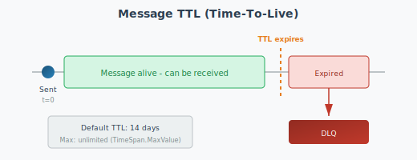

TTL określa jak długo wiadomość może pozostać w kolejce zanim wygaśnie.

**Default values:**

| Poziom | Default TTL | Max TTL |
|--------|-------------|---------|
| **Queue/Topic** | 14 dni | TimeSpan.MaxValue (unlimited) |
| **Message** | Dziedziczy z Queue | TimeSpan.MaxValue |
| **Subscription** | Dziedziczy z Topic | TimeSpan.MaxValue |

**Co się dzieje po wygaśnięciu TTL:**
- Jeżeli `DeadLetteringOnMessageExpiration = true` -> wiadomość trafia do DLQ
- Jeżeli `DeadLetteringOnMessageExpiration = false` -> wiadomość jest usuwana

**Ustawienie TTL na Queue (CLI):**

```bash
# Utwórz queue z TTL 7 dni
az servicebus queue create --name myQueue \
    --namespace-name myServiceBusNS \
    --resource-group myRG \
    --default-message-time-to-live P7D \
    --dead-lettering-on-message-expiration true

# Zmień TTL na istniejącej queue (30 dni)
az servicebus queue update --name myQueue \
    --namespace-name myServiceBusNS \
    --resource-group myRG \
    --default-message-time-to-live P30D
```

**Format TTL (ISO 8601 Duration):**
- `P14D` = 14 dni
- `P7D` = 7 dni
- `PT1H` = 1 godzina
- `PT30M` = 30 minut
- `P1DT12H` = 1 dzień i 12 godzin

**Ustawienie TTL na pojedynczej wiadomości (C#):**

```csharp
// TTL na poziomie wiadomości (nadpisuje default z queue)
var message = new ServiceBusMessage("Important data")
{
    TimeToLive = TimeSpan.FromHours(1)  // Wygaśnie za 1 godzinę
};
await sender.SendMessageAsync(message);

// Wiadomość bez TTL (użyje default z queue)
var message2 = new ServiceBusMessage("Normal data");
await sender.SendMessageAsync(message2);
```

**Sprawdzenie kiedy wiadomość wygaśnie:**

```csharp
processor.ProcessMessageAsync += async args =>
{
    // ExpiresAt = EnqueuedTime + TTL
    var expiresAt = args.Message.ExpiresAt;
    var enqueuedTime = args.Message.EnqueuedTime;
    var ttl = args.Message.TimeToLive;
    
    Console.WriteLine($"Enqueued: {enqueuedTime}");
    Console.WriteLine($"TTL: {ttl}");
    Console.WriteLine($"Expires: {expiresAt}");
    
    await args.CompleteMessageAsync(args.Message);
};
```

> **Tip:** Ustawiaj rozsądne TTL! Zbyt długi = zalegające wiadomości i koszty. Zbyt krótki = utrata danych.

---

### Scheduled Messages

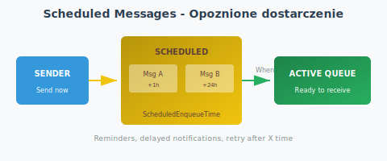

```csharp
// Zaplanuj wiadomość na później
var scheduledMessage = new ServiceBusMessage("Scheduled reminder");
long sequenceNumber = await sender.ScheduleMessageAsync(
    scheduledMessage, 
    DateTimeOffset.UtcNow.AddHours(1)  // Za godzinę
);

// Anuluj zaplanowaną wiadomość
await sender.CancelScheduledMessageAsync(sequenceNumber);

// Lub ustaw ScheduledEnqueueTime
var message = new ServiceBusMessage("Later...")
{
    ScheduledEnqueueTime = DateTimeOffset.UtcNow.AddMinutes(30)
};
await sender.SendMessageAsync(message);
```

---

### Managed Identity (bez connection string)

```csharp
using Azure.Identity;
using Azure.Messaging.ServiceBus;

string fullyQualifiedNamespace = "myServiceBusNS.servicebus.windows.net";
string queueName = "myQueue";

// Managed Identity (App Service, Functions, AKS)
await using var client = new ServiceBusClient(
    fullyQualifiedNamespace, 
    new DefaultAzureCredential()
);

await using var sender = client.CreateSender(queueName);
await sender.SendMessageAsync(new ServiceBusMessage("Secure message!"));
```

**Wymagane RBAC role:**
- `Azure Service Bus Data Sender` - wysyłanie
- `Azure Service Bus Data Receiver` - odbieranie
- `Azure Service Bus Data Owner` - pełny dostęp

---

### Service Bus vs Storage Queue vs Event Grid vs Event Hubs

| Cecha | Service Bus | Storage Queue | Event Grid | Event Hubs |
|-------|-------------|---------------|------------|------------|
| **Typ** | Message broker | Simple queue | Event routing | Event streaming |
| **Pattern** | Queue + Pub/Sub | Queue only | Pub/Sub | Stream |
| **Max size** | 256KB/100MB | 64 KB | 1 MB | 1 MB |
| **Ordering** | FIFO (Sessions) | NIE | NIE | Partition |
| **DLQ** | Tak | NIE | Tak | NIE |
| **Throughput** | High | Medium | Very high | Very high |
| **Use case** | Enterprise | Simple tasks | Events | Telemetry |
| **Cena** | Higher | Low | Pay per event | Medium |

> **Egzamin:** Service Bus to enterprise message broker. Storage Queue to prosta, tania kolejka. Event Grid to event routing (reactive). Event Hubs to streaming (big data).

---

### Best Practices

| Praktyka | Opis |
|----------|------|
| **Reuse clients** | ServiceBusClient i Sender/Processor są thread-safe |
| **Use batching** | SendMessagesAsync(batch) dla wielu wiadomości |
| **Set appropriate TTL** | Unikaj zalegających wiadomości |
| **Monitor DLQ** | Regularnie sprawdzaj dead-letter queue |
| **Use Managed Identity** | Unikaj connection strings w kodzie |
| **Idempotent handlers** | At-least-once może dostarczyć duplikaty |
| **Enable duplicate detection** | Dla krytycznych wiadomości |
| **Use Premium for prod** | Jeżeli potrzebujesz VNet, Geo-DR |

---

### Przykładowy scenariusz: Order Processing

```csharp
// 1. API otrzymuje zamówienie -> publikuje do Topic
public class OrderController : ControllerBase
{
    private readonly ServiceBusSender _sender;
    
    [HttpPost]
    public async Task<IActionResult> CreateOrder(Order order)
    {
        var message = new ServiceBusMessage(BinaryData.FromObjectAsJson(order))
        {
            MessageId = order.Id.ToString(),  // Dla duplicate detection
            Subject = "NewOrder",
            ApplicationProperties = 
            {
                { "OrderType", order.IsPremium ? "Premium" : "Standard" },
                { "Region", order.Region }
            }
        };
        
        await _sender.SendMessageAsync(message);
        return Accepted();
    }
}

// 2. Subscription "InventoryUpdate" (filter: wszystkie zamówienia)
// 3. Subscription "PremiumNotify" (filter: OrderType = 'Premium')
// 4. Subscription "EuropeAnalytics" (filter: Region = 'Europe')
```

---

### FAQ - Egzamin

| Pytanie | Odpowiedź |
|---------|----------|
| Czym różni się Queue od Topic? | Queue = point-to-point, Topic = pub/sub |
| Czy Basic tier ma Topics? | NIE, tylko Standard/Premium |
| Co to jest DLQ? | Dead-letter queue dla nieprzetworzonych wiadomości |
| Jak zagwarantować FIFO? | Użyj Sessions (SessionId) |
| Max message size w Standard? | 256 KB |
| Jak filtrować w subscriptions? | SQL Filter lub Correlation Filter |
| Service Bus vs Event Grid? | Service Bus = messaging, Event Grid = event routing |

> **Egzamin:** Service Bus to enterprise message broker obsługujący queues i topics (pub/sub). Basic tier NIE obsługuje topics. Sessions zapewniają FIFO. DLQ przechowuje nieprzetworzone wiadomości.

---

<a id="sec-26-event-hub"></a>
## 26. Azure Event Hub

Azure Event Hub to w pełni zarządzana usługa do strumieniowego przesyłania dużych ilości danych (Big Data streaming). Umożliwia przechwytywanie, przechowywanie i przetwarzanie milionów zdarzeń na sekundę z niskim opóźnieniem.

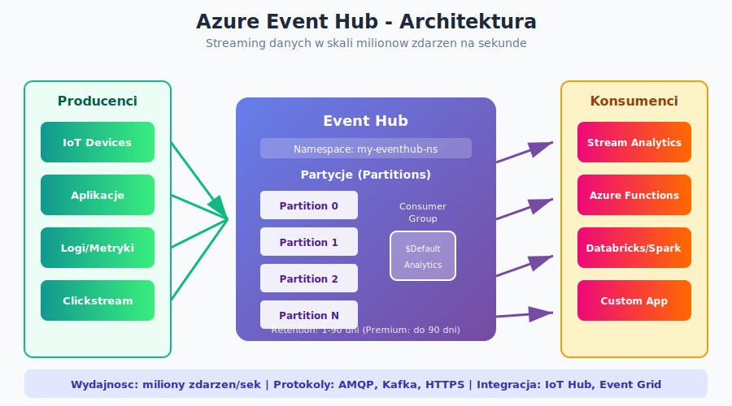

### Kluczowe cechy Event Hub

| Cecha | Opis |
|-------|------|
| **Przepustowość** | Miliony zdarzeń na sekundę |
| **Protokoły** | AMQP 1.0, Kafka, HTTPS |
| **Retencja** | 1-90 dni (zależnie od tier) |
| **Partycje** | 1-2000 (zależnie od tier) |
| **Rozmiar zdarzenia** | Max 1 MB |
| **Integracja** | IoT Hub, Stream Analytics, Databricks, Spark |

### Tworzenie Event Hub (CLI)

```bash
# Tworzenie namespace
az eventhubs namespace create \
  --name myEventHubNS \
  --resource-group myRG \
  --location westeurope \
  --sku Standard

# Tworzenie Event Hub z 4 partycjami
az eventhubs eventhub create \
  --name myEventHub \
  --namespace-name myEventHubNS \
  --resource-group myRG \
  --partition-count 4 \
  --message-retention 7

# Tworzenie Consumer Group
az eventhubs eventhub consumer-group create \
  --eventhub-name myEventHub \
  --namespace-name myEventHubNS \
  --resource-group myRG \
  --name AnalyticsGroup
```

### Partycje i Consumer Groups

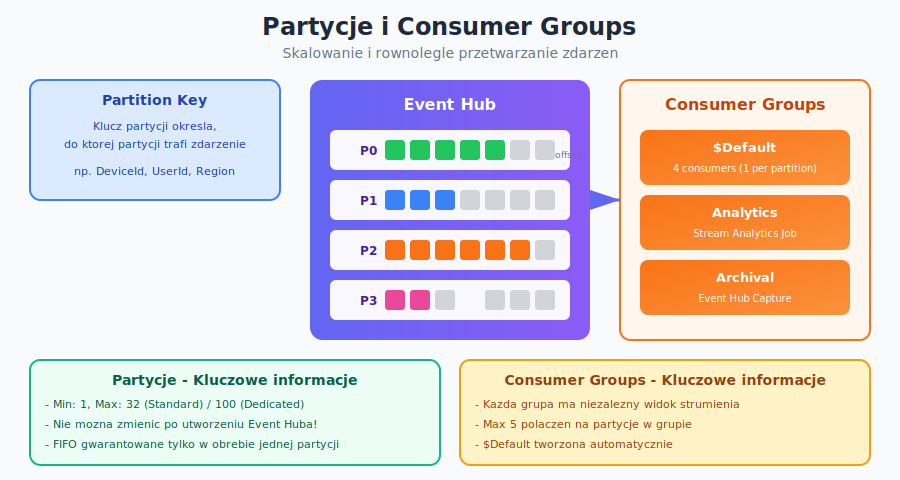

**Partycje:**
- Strumień danych jest dzielony na partycje dla skalowalności
- Partition Key określa, do której partycji trafi zdarzenie
- **FIFO gwarantowane tylko w obrębie jednej partycji**
- Liczby partycji **nie można zmienić** po utworzeniu Event Hub!

**Consumer Groups:**
- Każda grupa ma niezależny widok całego strumienia
- Umożliwia wielu konsumentom odczytywanie tych samych danych
- `$Default` tworzona automatycznie
- Max 5 połączeń na partycję w grupie (AMQP)

### Wysyłanie i odbieranie zdarzeń (C#)

```csharp
using Azure.Messaging.EventHubs;
using Azure.Messaging.EventHubs.Producer;
using Azure.Messaging.EventHubs.Consumer;
using Azure.Messaging.EventHubs.Processor;
using Azure.Storage.Blobs;

// === WYSYŁANIE ZDARZEŃ ===
public class EventHubProducer
{
    private readonly EventHubProducerClient _producer;
    
    public EventHubProducer(string connectionString, string eventHubName)
    {
        _producer = new EventHubProducerClient(connectionString, eventHubName);
    }
    
    // Wysyłanie batch zdarzeń
    public async Task SendEventsAsync(IEnumerable<SensorData> sensorReadings)
    {
        using EventDataBatch batch = await _producer.CreateBatchAsync();
        
        foreach (var reading in sensorReadings)
        {
            var eventData = new EventData(BinaryData.FromObjectAsJson(reading));
            
            // Dodawanie właściwości
            eventData.Properties["DeviceId"] = reading.DeviceId;
            eventData.Properties["Timestamp"] = reading.Timestamp.ToString("O");
            
            if (!batch.TryAdd(eventData))
            {
                // Batch pełny - wyślij i utwórz nowy
                await _producer.SendAsync(batch);
                batch = await _producer.CreateBatchAsync();
                batch.TryAdd(eventData);
            }
        }
        
        // Wyślij pozostałe zdarzenia
        if (batch.Count > 0)
        {
            await _producer.SendAsync(batch);
        }
    }
    
    // Wysyłanie z Partition Key (zdarzenia z tym samym kluczem trafiają do tej samej partycji)
    public async Task SendWithPartitionKeyAsync(string deviceId, SensorData data)
    {
        var options = new SendEventOptions { PartitionKey = deviceId };
        var eventData = new EventData(BinaryData.FromObjectAsJson(data));
        
        await _producer.SendAsync(new[] { eventData }, options);
    }
}

// === ODBIERANIE ZDARZEŃ (Event Processor) ===
public class EventHubProcessor
{
    private readonly EventProcessorClient _processor;
    
    public EventHubProcessor(
        string eventHubConnectionString,
        string eventHubName,
        string consumerGroup,
        string storageConnectionString,
        string containerName)
    {
        var storageClient = new BlobContainerClient(storageConnectionString, containerName);
        
        _processor = new EventProcessorClient(
            storageClient,
            consumerGroup,
            eventHubConnectionString,
            eventHubName);
            
        _processor.ProcessEventAsync += ProcessEventHandler;
        _processor.ProcessErrorAsync += ProcessErrorHandler;
    }
    
    public async Task StartAsync() => await _processor.StartProcessingAsync();
    public async Task StopAsync() => await _processor.StopProcessingAsync();
    
    private async Task ProcessEventHandler(ProcessEventArgs args)
    {
        if (args.Data != null)
        {
            var sensorData = args.Data.EventBody.ToObjectFromJson<SensorData>();
            var partitionId = args.Partition.PartitionId;
            
            Console.WriteLine($"Partition {partitionId}: Device {sensorData.DeviceId}, Value: {sensorData.Value}");
            
            // Checkpoint - zapisz pozycję (offset) w storage
            // Pozwala kontynuować od tego miejsca po restarcie
            await args.UpdateCheckpointAsync();
        }
    }
    
    private Task ProcessErrorHandler(ProcessErrorEventArgs args)
    {
        Console.WriteLine($"Error in partition {args.PartitionId}: {args.Exception.Message}");
        return Task.CompletedTask;
    }
}

// Model danych
public record SensorData(string DeviceId, double Value, DateTime Timestamp);
```

### Event Hub Capture

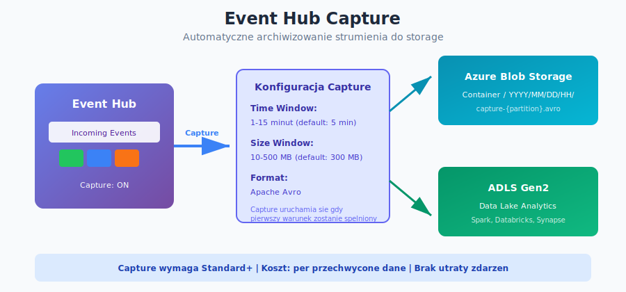

Capture automatycznie archiwizuje strumień danych do Azure Storage lub ADLS Gen2:

```bash
# Włączenie Capture
az eventhubs eventhub update \
  --name myEventHub \
  --namespace-name myEventHubNS \
  --resource-group myRG \
  --enable-capture true \
  --capture-destination-name EventHubArchive.AzureBlockBlob \
  --storage-account mystorageaccount \
  --blob-container capture \
  --capture-interval 300 \
  --capture-size-limit 314572800
```

**Konfiguracja Capture:**
| Parametr | Opis | Wartości |
|----------|------|----------|
| Time Window | Interwał zapisu | 1-15 minut (default: 5) |
| Size Window | Rozmiar do zapisu | 10-500 MB (default: 300 MB) |
| Format | Format pliku | Apache Avro |
| Skip Empty | Pomijaj puste okna | true/false |

### Warstwy cenowe Event Hub

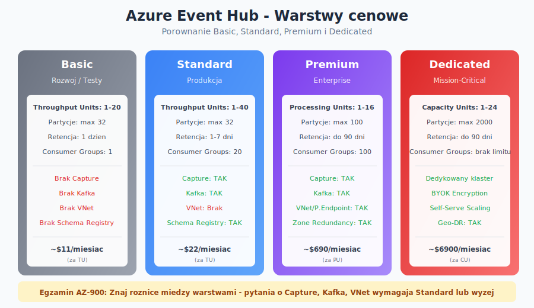

| Cecha | Basic | Standard | Premium | Dedicated |
|-------|-------|----------|---------|-----------|
| **Throughput Units** | 1-20 | 1-40 (Auto-inflate) | 1-16 PU | 1-24 CU |
| **Partycje** | max 32 | max 32 | max 100 | max 2000 |
| **Retencja** | 1 dzień | 1-7 dni | do 90 dni | do 90 dni |
| **Consumer Groups** | 1 | 20 | 100 | bez limitu |
| **Capture** | NIE | TAK | TAK | TAK |
| **Kafka Protocol** | NIE | TAK | TAK | TAK |
| **VNet/Private Endpoint** | NIE | NIE | TAK | TAK |
| **Zone Redundancy** | NIE | NIE | TAK | TAK |
| **Cena (za jednostkę)** | ~$11/msc | ~$22/msc | ~$690/msc | ~$6900/msc |

### Integracja z Apache Kafka

Event Hub Standard i wyżej obsługuje protokół Apache Kafka bez zmian w kodzie aplikacji:

```csharp
// Konfiguracja Kafka dla Event Hub
var config = new ProducerConfig
{
    BootstrapServers = "myeventhubns.servicebus.windows.net:9093",
    SecurityProtocol = SecurityProtocol.SaslSsl,
    SaslMechanism = SaslMechanism.Plain,
    SaslUsername = "$ConnectionString",
    SaslPassword = "<Your-Event-Hub-Connection-String>"
};

// Od teraz możesz używać standardowego Kafka client
using var producer = new ProducerBuilder<string, string>(config).Build();
await producer.ProduceAsync("myeventhub", new Message<string, string> 
{ 
    Key = "device001", 
    Value = "{\"temp\": 25.5}" 
});
```

### Event Hub vs Service Bus vs Event Grid

| Aspekt | Event Hub | Service Bus | Event Grid |
|--------|-----------|-------------|------------|
| **Scenariusz** | Big Data streaming | Enterprise messaging | Event routing |
| **Model** | Pub/Sub streaming | Queue/Topic | Pub/Sub reactive |
| **Przepustowość** | Miliony/sek | Tysiące/sek | Miliony/sek |
| **Rozmiar wiadomości** | 1 MB | 256 KB - 100 MB | 1 MB |
| **Retencja** | 1-90 dni | Do przetworzenia | 24h retry |
| **Kolejność** | FIFO per partition | FIFO (sessions) | Nie gwarantowana |
| **Protokół** | AMQP, Kafka, HTTP | AMQP, HTTP | HTTP, webhooks |
| **Typowe użycie** | IoT telemetry, logs | Orders, transactions | Blob events, alerts |

### Przykład: IoT Telemetry Pipeline

```csharp
// Kompletny pipeline: IoT -> Event Hub -> Processing -> Storage
public class IoTTelemetryPipeline
{
    private readonly EventHubProducerClient _producer;
    private readonly EventProcessorClient _processor;
    private readonly TableClient _tableClient;
    
    public async Task ProcessTelemetryAsync(ProcessEventArgs args)
    {
        var telemetry = args.Data.EventBody.ToObjectFromJson<DeviceTelemetry>();
        
        // Walidacja
        if (telemetry.Temperature > 100)
        {
            // Alert - przekroczono próg temperatury
            await SendAlertAsync(telemetry);
        }
        
        // Agregacja per minuta
        var aggregated = new TableEntity(
            partitionKey: telemetry.DeviceId,
            rowKey: telemetry.Timestamp.ToString("yyyyMMddHHmm"))
        {
            { "AvgTemp", telemetry.Temperature },
            { "MaxTemp", telemetry.Temperature },
            { "ReadingCount", 1 }
        };
        
        await _tableClient.UpsertEntityAsync(aggregated, TableUpdateMode.Merge);
        
        // Checkpoint
        await args.UpdateCheckpointAsync();
    }
}

public record DeviceTelemetry(
    string DeviceId, 
    double Temperature, 
    double Humidity, 
    DateTime Timestamp);
```

---

### FAQ - Egzamin

| Pytanie | Odpowiedź |
|---------|----------|
| Ile zdarzeń na sekundę obsługuje Event Hub? | Miliony |
| Czy Event Hub gwarantuje FIFO? | Tylko w obrębie partycji |
| Co to jest Consumer Group? | Niezależny widok strumienia dla konsumentów |
| Czy można zmienić liczbę partycji? | NIE, trzeba utworzyć nowy Event Hub |
| Co robi Capture? | Automatycznie archiwizuje do Blob/ADLS |
| Który tier obsługuje Kafka? | Standard i wyżej |
| Event Hub vs Service Bus? | Event Hub = streaming, Service Bus = messaging |

> **Egzamin:** Event Hub służy do Big Data streaming (miliony zdarzeń/sek). Partycje zapewniają skalowalność ale FIFO tylko per partition. Capture archiwizuje do storage. Kafka protocol wymaga Standard tier lub wyższego.

---

<a id="sec-27-event-grid"></a>
## 27. Azure Event Grid

Azure Event Grid to w pełni zarządzana usługa routingu zdarzeń oparta na modelu publikuj-subskrybuj (pub/sub). Umożliwia reaktywne programowanie z sub-sekundowym opóźnieniem i płatnością per zdarzenie.

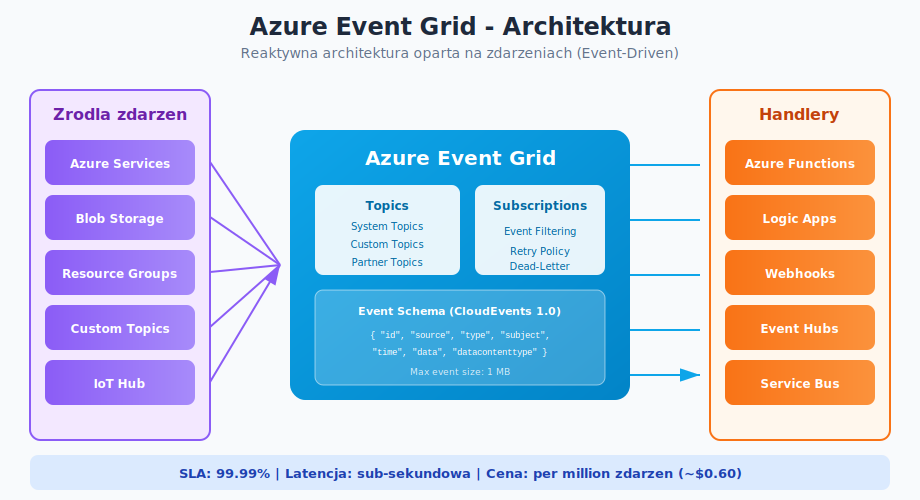

### Kluczowe cechy Event Grid

| Cecha | Opis |
|-------|------|
| **Model** | Reaktywny pub/sub (event-driven) |
| **Latencja** | Sub-sekundowa |
| **Przepustowość** | 10 milionów zdarzeń/sek per region |
| **Schema** | CloudEvents 1.0 / Event Grid schema |
| **Max event size** | 1 MB |
| **SLA** | 99.99% |
| **Cena** | ~$0.60 per milion zdarzeń |

### Podstawowe koncepty

**Topics** - Endpoint do wysyłania zdarzeń:
- **System Topics** - automatycznie tworzone dla usług Azure (Blob, VM, etc.)
- **Custom Topics** - tworzone przez użytkownika dla własnych aplikacji
- **Partner Topics** - zdarzenia od partnerów (Auth0, SAP, Datadog)

**Subscriptions** - łączą Topic z Handlerem:
- Definiują filtrowanie zdarzeń
- Konfigurują retry policy i dead-letter
- Wskazują destination (handler)

**Event Handlers** - przetwarzają zdarzenia:
- Azure Functions, Logic Apps, Webhooks
- Event Hubs, Service Bus, Storage Queues

### Typy Topics

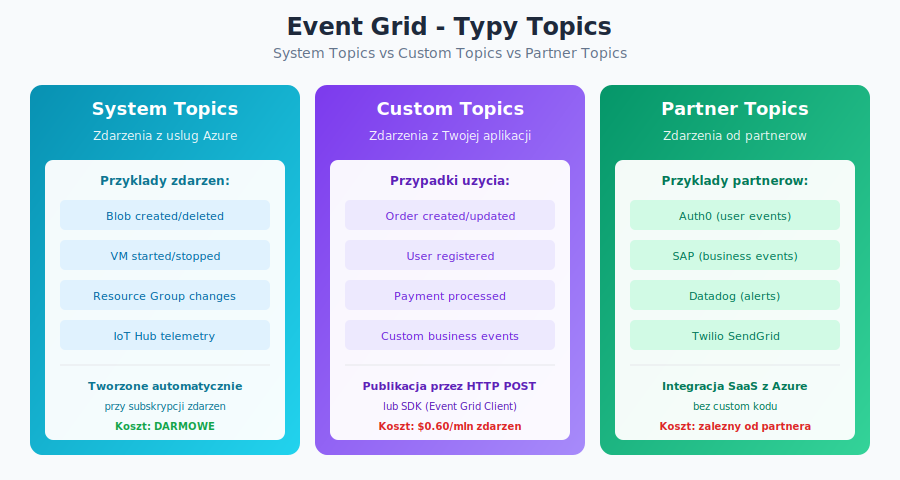

### Tworzenie Event Grid (CLI)

```bash
# Tworzenie Custom Topic
az eventgrid topic create \
  --name myCustomTopic \
  --resource-group myRG \
  --location westeurope

# Pobieranie endpoint i klucza
endpoint=$(az eventgrid topic show --name myCustomTopic --resource-group myRG --query "endpoint" -o tsv)
key=$(az eventgrid topic key list --name myCustomTopic --resource-group myRG --query "key1" -o tsv)

# Tworzenie subskrypcji z webhook
az eventgrid event-subscription create \
  --name mySubscription \
  --source-resource-id "/subscriptions/{sub-id}/resourceGroups/myRG/providers/Microsoft.EventGrid/topics/myCustomTopic" \
  --endpoint "https://myapp.azurewebsites.net/api/events" \
  --endpoint-type webhook

# Tworzenie subskrypcji na zdarzenia Blob Storage
az eventgrid event-subscription create \
  --name blobSubscription \
  --source-resource-id "/subscriptions/{sub-id}/resourceGroups/myRG/providers/Microsoft.Storage/storageAccounts/mystorageaccount" \
  --endpoint "/subscriptions/{sub-id}/resourceGroups/myRG/providers/Microsoft.Web/sites/myFunctionApp/functions/ProcessBlob" \
  --endpoint-type azurefunction \
  --included-event-types Microsoft.Storage.BlobCreated \
  --subject-begins-with "/blobServices/default/containers/images/" \
  --subject-ends-with ".jpg"
```

### Filtrowanie zdarzeń

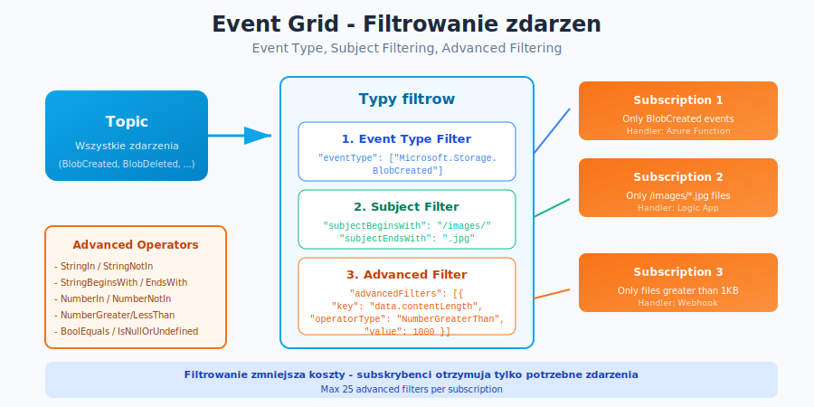

```bash
# Subscription z advanced filtering
az eventgrid event-subscription create \
  --name filteredSubscription \
  --source-resource-id "/subscriptions/{sub-id}/resourceGroups/myRG/providers/Microsoft.Storage/storageAccounts/mystorageaccount" \
  --endpoint "https://myfunction.azurewebsites.net/api/processLargeImages" \
  --advanced-filter data.contentLength NumberGreaterThan 1048576 \
  --advanced-filter data.contentType StringIn image/jpeg image/png
```

**Typy filtrów:**

| Typ filtra | Opis | Przykład |
|------------|------|----------|
| **Event Type** | Typ zdarzenia | `Microsoft.Storage.BlobCreated` |
| **Subject** | Ścieżka zasobu | `beginsWith: /images/`, `endsWith: .jpg` |
| **Advanced** | Filtrowanie po danych | `data.contentLength > 1000` |

**Operatory Advanced Filter:**
- `StringIn`, `StringNotIn`, `StringBeginsWith`, `StringEndsWith`, `StringContains`
- `NumberIn`, `NumberNotIn`, `NumberGreaterThan`, `NumberLessThan`
- `BoolEquals`, `IsNullOrUndefined`, `IsNotNull`

### Wysyłanie i odbieranie zdarzeń (C#)

```csharp
using Azure.Messaging.EventGrid;
using Azure.Messaging.EventGrid.SystemEvents;
using Microsoft.Azure.Functions.Worker;

// === PUBLIKOWANIE ZDARZEŃ DO CUSTOM TOPIC ===
public class EventGridPublisher
{
    private readonly EventGridPublisherClient _client;
    
    public EventGridPublisher(string topicEndpoint, string topicKey)
    {
        _client = new EventGridPublisherClient(
            new Uri(topicEndpoint),
            new Azure.AzureKeyCredential(topicKey));
    }
    
    // Wysyłanie pojedynczego zdarzenia
    public async Task PublishOrderCreatedAsync(Order order)
    {
        var eventGridEvent = new EventGridEvent(
            subject: $"orders/{order.Id}",
            eventType: "Contoso.Orders.OrderCreated",
            dataVersion: "1.0",
            data: new OrderCreatedEventData
            {
                OrderId = order.Id,
                CustomerId = order.CustomerId,
                TotalAmount = order.TotalAmount,
                Items = order.Items.Select(i => i.Name).ToList()
            });
        
        await _client.SendEventAsync(eventGridEvent);
    }
    
    // Wysyłanie batch zdarzeń (CloudEvents format)
    public async Task PublishCloudEventsAsync(IEnumerable<OrderEvent> events)
    {
        var cloudEvents = events.Select(e => new CloudEvent(
            source: "https://contoso.com/orders",
            type: e.EventType,
            jsonSerializableData: e.Data));
        
        await _client.SendEventsAsync(cloudEvents);
    }
}

// === ODBIERANIE ZDARZEŃ (Azure Function - Event Grid Trigger) ===
public class EventGridFunctions
{
    private readonly ILogger<EventGridFunctions> _logger;
    private readonly IOrderService _orderService;
    
    public EventGridFunctions(ILogger<EventGridFunctions> logger, IOrderService orderService)
    {
        _logger = logger;
        _orderService = orderService;
    }
    
    // Obsługa Custom Events
    [Function("ProcessOrderEvent")]
    public async Task ProcessOrderEvent(
        [EventGridTrigger] EventGridEvent eventGridEvent)
    {
        _logger.LogInformation($"Event Type: {eventGridEvent.EventType}");
        _logger.LogInformation($"Subject: {eventGridEvent.Subject}");
        
        switch (eventGridEvent.EventType)
        {
            case "Contoso.Orders.OrderCreated":
                var orderData = eventGridEvent.Data.ToObjectFromJson<OrderCreatedEventData>();
                await _orderService.ProcessNewOrderAsync(orderData);
                break;
                
            case "Contoso.Orders.OrderCancelled":
                var cancelData = eventGridEvent.Data.ToObjectFromJson<OrderCancelledEventData>();
                await _orderService.HandleCancellationAsync(cancelData);
                break;
        }
    }
    
    // Obsługa System Events (Blob Storage)
    [Function("ProcessBlobEvent")]
    public async Task ProcessBlobEvent(
        [EventGridTrigger] EventGridEvent eventGridEvent)
    {
        if (eventGridEvent.EventType == "Microsoft.Storage.BlobCreated")
        {
            var blobData = eventGridEvent.Data.ToObjectFromJson<StorageBlobCreatedEventData>();
            
            _logger.LogInformation($"New blob: {blobData.Url}");
            _logger.LogInformation($"Size: {blobData.ContentLength} bytes");
            _logger.LogInformation($"Content-Type: {blobData.ContentType}");
            
            // Przetwarzanie obrazu
            if (blobData.ContentType.StartsWith("image/"))
            {
                await ProcessImageAsync(blobData.Url);
            }
        }
    }
}

// Event Data classes
public record OrderCreatedEventData(
    Guid OrderId, 
    string CustomerId, 
    decimal TotalAmount, 
    List<string> Items);

public record OrderCancelledEventData(
    Guid OrderId, 
    string Reason, 
    DateTime CancelledAt);
```

### Retry Policy i Dead-Letter

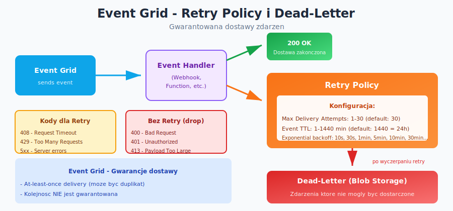

```bash
# Konfiguracja retry i dead-letter
az eventgrid event-subscription create \
  --name mySubscription \
  --source-resource-id "/subscriptions/{sub-id}/resourceGroups/myRG/providers/Microsoft.EventGrid/topics/myTopic" \
  --endpoint "https://myapp.com/api/events" \
  --max-delivery-attempts 10 \
  --event-ttl 1440 \
  --deadletter-endpoint "/subscriptions/{sub-id}/resourceGroups/myRG/providers/Microsoft.Storage/storageAccounts/mystorage/blobServices/default/containers/deadletter"
```

**Retry Policy:**
| Parametr | Opis | Default | Zakres |
|----------|------|---------|--------|
| Max Delivery Attempts | Liczba prób dostawy | 30 | 1-30 |
| Event TTL | Czas życia zdarzenia | 1440 min (24h) | 1-1440 min |

**Kody odpowiedzi:**
- **Sukces:** 200, 201, 202, 204
- **Retry:** 408, 429, 500-599
- **No Retry (drop):** 400, 401, 403, 404, 413

### Walidacja Webhook Endpoint

Event Grid wymaga walidacji endpointu przed pierwszą dostawą zdarzeń:

```csharp
// Obsługa walidacji w Azure Function
[Function("WebhookEndpoint")]
public async Task<IActionResult> WebhookEndpoint(
    [HttpTrigger(AuthorizationLevel.Anonymous, "post")] HttpRequest req)
{
    var requestBody = await new StreamReader(req.Body).ReadToEndAsync();
    var events = JsonSerializer.Deserialize<EventGridEvent[]>(requestBody);
    
    foreach (var eventGridEvent in events)
    {
        // Obsługa walidacji subskrypcji
        if (eventGridEvent.EventType == "Microsoft.EventGrid.SubscriptionValidationEvent")
        {
            var validationData = eventGridEvent.Data.ToObjectFromJson<SubscriptionValidationEventData>();
            
            return new OkObjectResult(new SubscriptionValidationResponse
            {
                ValidationResponse = validationData.ValidationCode
            });
        }
        
        // Przetwarzanie normalnych zdarzeń
        await ProcessEventAsync(eventGridEvent);
    }
    
    return new OkResult();
}
```

### Przykład: Reaktywna architektura

```csharp
// Scenariusz: Upload obrazu -> resize -> CDN purge -> notification
// Wszystko orkiestrowane przez Event Grid

// 1. Blob Storage emituje BlobCreated event
// 2. Azure Function przetwarza obraz
[Function("ResizeImage")]
public async Task ResizeImage([EventGridTrigger] EventGridEvent evt)
{
    var blobData = evt.Data.ToObjectFromJson<StorageBlobCreatedEventData>();
    await _imageProcessor.ResizeAsync(blobData.Url);
    
    // Publikuj własne zdarzenie o zakończeniu przetwarzania
    await _eventGridClient.SendEventAsync(new EventGridEvent(
        subject: $"images/{Path.GetFileName(blobData.Url)}",
        eventType: "Contoso.Images.Processed",
        dataVersion: "1.0",
        data: new { OriginalUrl = blobData.Url, ProcessedAt = DateTime.UtcNow }));
}

// 3. Logic App subskrybuje Contoso.Images.Processed -> purge CDN
// 4. Azure Function subskrybuje Contoso.Images.Processed -> wyślij email
[Function("NotifyImageProcessed")]
public async Task NotifyImageProcessed([EventGridTrigger] EventGridEvent evt)
{
    var data = evt.Data.ToObjectFromJson<ImageProcessedData>();
    await _emailService.SendAsync(
        to: "admin@contoso.com",
        subject: "Image processed",
        body: $"Image {data.OriginalUrl} has been processed");
}
```

### Event Grid vs Event Hub vs Service Bus

| Aspekt | Event Grid | Event Hub | Service Bus |
|--------|------------|-----------|-------------|
| **Model** | Reactive pub/sub | Streaming | Enterprise messaging |
| **Przypadek użycia** | Event routing, automation | Telemetry, logs, IoT | Transactions, orders |
| **Latencja** | Sub-sekundowa | Sub-sekundowa | Milisekundy |
| **Przepustowość** | 10M events/sec/region | Millions/sec | Thousands/sec |
| **Retencja** | 24h (retry) | 1-90 dni | Do przetworzenia |
| **Kolejność** | Nie gwarantowana | FIFO per partition | FIFO (sessions) |
| **Filtrowanie** | Event Type, Subject, Advanced | Brak (consumer side) | SQL/Correlation filters |
| **Cena** | Per event (~$0.60/M) | Per TU/PU | Per operation |
| **Główne źródła** | Azure services, custom apps | IoT, logs, clickstream | Business apps |
| **Główne handlery** | Functions, Logic Apps, webhooks | Stream Analytics, Spark | Workers, Functions |

### Kiedy użyć którego?

```
Event Grid:
✓ Reakcje na zmiany w Azure (blob created, VM started)
✓ Automatyzacja i orchestracja (serverless workflows)
✓ Wysoka liczba źródeł, niski wolumen per źródło
✓ Nie potrzebujesz retencji danych

Event Hub:
✓ Big Data streaming (miliony zdarzeń/sek)
✓ IoT telemetry, logi aplikacji, clickstream
✓ Potrzebujesz retencji (replay, Capture)
✓ Integracja z Apache Kafka

Service Bus:
✓ Enterprise messaging (zamówienia, transakcje)
✓ Gwarantowane przetworzenie (at-least-once)
✓ Potrzebujesz FIFO, sessions, transactions
✓ Pub/sub z filtrowanymi subskrypcjami
```

---

### FAQ - Egzamin

| Pytanie | Odpowiedź |
|---------|----------|
| Co to jest Event Grid? | Usługa reaktywnego routingu zdarzeń (pub/sub) |
| Ile kosztuje Event Grid? | ~$0.60 per milion zdarzeń |
| Jaka jest latencja? | Sub-sekundowa |
| Czy Event Grid gwarantuje kolejność? | NIE |
| Czym są System Topics? | Automatyczne topics dla usług Azure |
| Jakie handlery obsługuje Event Grid? | Functions, Logic Apps, webhooks, Event Hubs, Service Bus |
| Event Grid vs Service Bus? | Event Grid = event routing, Service Bus = messaging |
| Event Grid vs Event Hub? | Event Grid = reactive, Event Hub = streaming |

> **Egzamin:** Event Grid to reaktywny pub/sub do routingu zdarzeń z sub-sekundową latencją. System Topics automatycznie tworzą się dla usług Azure (Blob, VMs). NIE gwarantuje kolejności. Cena per event (~$0.60/M). Filtrowanie: Event Type, Subject, Advanced Filters.

---

<a id="sec-28-logic-apps"></a>
## 28. Azure Logic Apps

Azure Logic Apps to w pełni zarządzana usługa integracyjna (iPaaS), która pozwala automatyzować przepływy pracy (workflows) i łączyć aplikacje, dane oraz usługi - bez pisania kodu lub z minimalnym kodem.

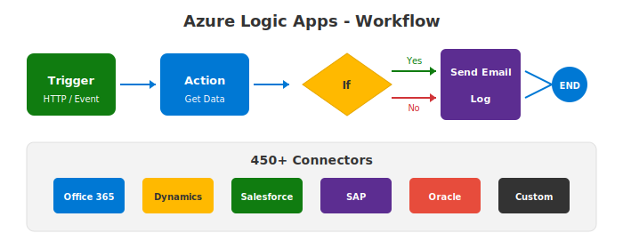

### Kluczowe cechy Logic Apps

| Cecha | Opis |
|-------|------|
| **Visual Designer** | Graficzny edytor workflow w portalu Azure lub VS Code |
| **450+ Connectors** | Gotowe łączniki do Microsoft, SaaS, on-premises |
| **Serverless** | Automatyczne skalowanie (Consumption) |
| **Enterprise** | B2B, EDI, XML, AS2 (Integration Account) |
| **Event-driven** | Triggery: HTTP, Schedule, Event Grid, Service Bus |
| **Low-code/No-code** | Nie wymaga programowania |

### Podstawowe koncepty

**Workflow** - sekwencja kroków definiująca automatyzację:
- **Trigger** - zdarzenie uruchamiające workflow (1 na workflow)
- **Actions** - operacje wykonywane po triggerze (wiele)
- **Conditions** - warunki if/switch
- **Loops** - pętle For Each, Until
- **Variables** - zmienne do przechowywania danych
- **Expressions** - funkcje do transformacji danych

**Connectors** - gotowe integracje:
- **Standard** - Azure services, Office 365, SQL
- **Enterprise** - SAP, IBM MQ, EDI (wymaga Integration Account)
- **Custom** - własne API (OpenAPI/Swagger)
- **On-premises Data Gateway** - łączność z systemami lokalnymi

### Consumption vs Standard

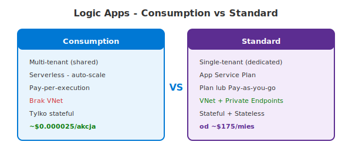

| Cecha | Consumption | Standard |
|-------|-------------|----------|
| **Hosting** | Multi-tenant (shared) | Single-tenant (dedicated) |
| **Skalowanie** | Serverless (auto) | App Service Plan (WS1-WS3) |
| **Rozliczenie** | Pay-per-execution | Stała cena planu |
| **VNet** | NIE (ISE legacy) | TAK (Private Endpoints) |
| **Workflows** | Tylko stateful | Stateful + Stateless |
| **Designer** | Portal Azure | Portal + VS Code |
| **Local debug** | NIE | TAK |
| **DevOps** | ARM Templates | CI/CD, Git integration |
| **Use case** | Proste integracje, PoC | Enterprise, produkcja |

### Tworzenie Logic App (CLI)

```bash
# Tworzenie Consumption Logic App
az logic workflow create \
  --name myLogicApp \
  --resource-group myRG \
  --location westeurope \
  --definition @workflow.json

# Tworzenie Standard Logic App
az logicapp create \
  --name myStandardLogicApp \
  --resource-group myRG \
  --location westeurope \
  --storage-account mystorageaccount \
  --plan myAppServicePlan

# Lista connectorów
az logic integration-account list-callback-url \
  --resource-group myRG \
  --name myIntegrationAccount
```

### Przykład: Workflow Definition (JSON)

```json
{
  "definition": {
    "$schema": "https://schema.management.azure.com/providers/Microsoft.Logic/schemas/2016-06-01/workflowdefinition.json#",
    "contentVersion": "1.0.0.0",
    "triggers": {
      "When_a_HTTP_request_is_received": {
        "type": "Request",
        "kind": "Http",
        "inputs": {
          "schema": {
            "type": "object",
            "properties": {
              "orderId": { "type": "string" },
              "customerEmail": { "type": "string" }
            }
          }
        }
      }
    },
    "actions": {
      "Get_Order": {
        "type": "ApiConnection",
        "inputs": {
          "host": { "connection": { "name": "@parameters('$connections')['sql']['connectionId']" } },
          "method": "get",
          "path": "/v2/datasets/@{encodeURIComponent('default')}/tables/@{encodeURIComponent('Orders')}/items",
          "queries": { "$filter": "OrderId eq '@{triggerBody()?['orderId']}'" }
        },
        "runAfter": {}
      },
      "Condition": {
        "type": "If",
        "expression": {
          "and": [{ "greater": ["@body('Get_Order')?['value']?[0]?['TotalAmount']", 100] }]
        },
        "actions": {
          "Send_Premium_Email": {
            "type": "ApiConnection",
            "inputs": {
              "host": { "connection": { "name": "@parameters('$connections')['office365']['connectionId']" } },
              "method": "post",
              "path": "/v2/Mail",
              "body": {
                "To": "@{triggerBody()?['customerEmail']}",
                "Subject": "Premium Order Confirmation",
                "Body": "Thank you for your order!"
              }
            }
          }
        },
        "else": {
          "actions": {
            "Send_Standard_Email": {
              "type": "ApiConnection",
              "inputs": {
                "host": { "connection": { "name": "@parameters('$connections')['office365']['connectionId']" } },
                "method": "post",
                "path": "/v2/Mail",
                "body": {
                  "To": "@{triggerBody()?['customerEmail']}",
                  "Subject": "Order Confirmation",
                  "Body": "Your order has been received."
                }
              }
            }
          }
        },
        "runAfter": { "Get_Order": ["Succeeded"] }
      },
      "Response": {
        "type": "Response",
        "kind": "Http",
        "inputs": {
          "statusCode": 200,
          "body": { "status": "processed", "orderId": "@{triggerBody()?['orderId']}" }
        },
        "runAfter": { "Condition": ["Succeeded"] }
      }
    }
  }
}
```

### Popularne Triggery

| Trigger | Opis | Przykład użycia |
|---------|------|----------------|
| **HTTP Request** | Webhook endpoint | REST API, integrations |
| **Recurrence** | Schedule (CRON) | Scheduled jobs, reports |
| **Event Grid** | Azure events | Blob created, VM started |
| **Service Bus** | Queue/Topic message | Order processing |
| **Blob Storage** | File added/modified | Document processing |
| **Office 365** | New email, calendar | Email automation |
| **Dynamics 365** | Record created/updated | CRM workflows |
| **SharePoint** | Item created | Document approval |

### Popularne Actions

| Action | Opis |
|--------|------|
| **HTTP** | Wywołanie dowolnego REST API |
| **Parse JSON** | Parsowanie odpowiedzi JSON |
| **Compose** | Tworzenie obiektów JSON |
| **Initialize Variable** | Deklaracja zmiennej |
| **For Each** | Iteracja po tablicy |
| **Until** | Pętla while |
| **Condition** | If-then-else |
| **Switch** | Multi-branch condition |
| **Delay** | Opóźnienie wykonania |
| **Terminate** | Zakończenie workflow |

### Expressions - Przydatne funkcje

```javascript
// Dostęp do danych triggera
@triggerBody()
@triggerBody()?['propertyName']

// Dostęp do wyników akcji
@body('ActionName')
@outputs('ActionName')

// String functions
@concat('Hello ', triggerBody()?['name'])
@substring('Hello World', 0, 5)
@replace('Hello World', 'World', 'Azure')
@toLower('HELLO')
@toUpper('hello')

// Date/Time functions
@utcNow()
@addDays(utcNow(), 7)
@formatDateTime(utcNow(), 'yyyy-MM-dd')
@dayOfWeek(utcNow())

// Collection functions
@length(body('Get_Items')?['value'])
@first(body('Get_Items')?['value'])
@last(body('Get_Items')?['value'])
@contains(body('Get_Items')?['value'], 'item')

// Conditional
@if(equals(triggerBody()?['status'], 'approved'), 'Yes', 'No')
@coalesce(triggerBody()?['name'], 'Unknown')
```

### Error Handling

**Configure Run After** - kontrola wykonania akcji:
- `Succeeded` - wykonaj gdy poprzednia akcja zakończyła się sukcesem
- `Failed` - wykonaj gdy poprzednia akcja zakończyła się błędem
- `Skipped` - wykonaj gdy poprzednia akcja została pominięta
- `TimedOut` - wykonaj gdy poprzednia akcja przekroczyła timeout

**Scope** - grupowanie akcji z obsługą błędów:
```json
{
  "Scope_Try": {
    "type": "Scope",
    "actions": {
      "Risky_Action": { ... }
    }
  },
  "Scope_Catch": {
    "type": "Scope",
    "actions": {
      "Send_Error_Email": { ... }
    },
    "runAfter": { "Scope_Try": ["Failed", "TimedOut"] }
  }
}
```

**Retry Policy:**
```json
{
  "retryPolicy": {
    "type": "exponential",
    "count": 4,
    "interval": "PT10S",
    "minimumInterval": "PT5S",
    "maximumInterval": "PT1H"
  }
}
```

### Integration Account (B2B)

Dla scenariuszy enterprise B2B:

| Funkcja | Opis |
|---------|------|
| **Partners** | Definicje partnerów biznesowych |
| **Agreements** | Umowy AS2, X12, EDIFACT |
| **Schemas** | XML/JSON schemas do walidacji |
| **Maps** | XSLT transformacje |
| **Certificates** | Certyfikaty do podpisywania/szyfrowania |

```bash
# Tworzenie Integration Account
az logic integration-account create \
  --name myIntegrationAccount \
  --resource-group myRG \
  --location westeurope \
  --sku Standard
```

### Monitorowanie i diagnostyka

**Run History:**
- Portal: Logic App -> Overview -> Runs history
- Szczegóły każdego wykonania
- Input/Output każdej akcji
- Czas wykonania, status

**Diagnostic Logs:**
```bash
# Włączenie logów diagnostycznych
az monitor diagnostic-settings create \
  --name "LogicAppLogs" \
  --resource <logic-app-resource-id> \
  --workspace <log-analytics-workspace-id> \
  --logs '[{"category":"WorkflowRuntime","enabled":true}]'
```

**Metryki:**
- `RunsStarted` - liczba uruchomień
- `RunsSucceeded` - udane wykonania
- `RunsFailed` - nieudane wykonania
- `ActionLatency` - czas wykonania akcji
- `TriggerLatency` - czas odpowiedzi triggera

### Logic Apps vs Power Automate vs Azure Functions

| Aspekt | Logic Apps | Power Automate | Azure Functions |
|--------|------------|----------------|----------------|
| **Użytkownik** | Developer/IT Pro | Business User | Developer |
| **Interface** | Azure Portal / VS Code | Power Platform | Code (C#, JS, Python) |
| **Connectors** | 450+ | 900+ | Custom code |
| **Enterprise** | TAK (B2B, EDI) | Ograniczone | Custom |
| **VNet** | TAK (Standard) | NIE | TAK |
| **Koszt** | Per-execution | Per-user license | Per-execution |
| **DevOps** | ARM, CI/CD | Limited | Full CI/CD |
| **Use case** | Enterprise integration | Personal/Team automation | Custom logic |

### Przykładowe scenariusze

**1. Order Processing Pipeline:**
```
HTTP Trigger (new order)
  -> Validate JSON
  -> Insert to SQL Database
  -> If amount > $1000: Send approval email
  -> Create invoice in SAP
  -> Send confirmation to customer
  -> Post to Teams channel
```

**2. Document Approval Workflow:**
```
SharePoint Trigger (new document)
  -> Get document metadata
  -> Get manager from Azure AD
  -> Send approval email
  -> Wait for response (Approval connector)
  -> If approved: Move to "Approved" folder
  -> If rejected: Notify author
```

**3. Data Synchronization:**
```
Recurrence Trigger (every hour)
  -> Get records from Salesforce
  -> For each record:
      -> Check if exists in Dynamics 365
      -> If yes: Update
      -> If no: Create
  -> Log results to Blob Storage
```

### Best Practices

| Praktyka | Opis |
|----------|------|
| **Używaj zmiennych** | Zamiast powtarzać expressions |
| **Grupuj w Scope** | Dla czytelności i error handling |
| **Retry Policy** | Dla niestabilnych połączeń |
| **Concurrent Control** | Ogranicz równoległe wykonania |
| **Secure Inputs/Outputs** | Ukryj wrażliwe dane w logach |
| **Managed Identity** | Zamiast connection strings |
| **Standard dla produkcji** | VNet, dedicated resources |
| **Testuj lokalnie** | VS Code + Standard |

---

### FAQ - Egzamin

| Pytanie | Odpowiedź |
|---------|----------|
| Co to jest Logic Apps? | iPaaS - integracja aplikacji bez kodu |
| Ile connectorów ma Logic Apps? | 450+ |
| Consumption vs Standard? | Consumption = serverless, Standard = dedicated |
| Czy Logic Apps obsługuje VNet? | TAK, ale tylko Standard tier |
| Logic Apps vs Power Automate? | Logic Apps = IT Pro/Dev, Power Automate = Business User |
| Co to jest Integration Account? | B2B, EDI, XML schemas, maps |
| Jak debugować Logic Apps? | Run History w portalu, VS Code dla Standard |
| Czy Logic Apps jest serverless? | Consumption = TAK, Standard = NIE (App Service Plan) |

> **Egzamin:** Logic Apps to iPaaS do automatyzacji workflow z 450+ connectorami. Consumption = serverless (pay-per-execution), Standard = dedicated (VNet, VS Code debug). Integration Account wymagany dla B2B/EDI. Low-code/no-code - nie wymaga programowania.

---

<a id="sec-29-load-balancing"></a>
## 29. Load Balancing w Azure

Load balancing to technika dystrybucji ruchu sieciowego miedzy wiele serwerow w celu zwiekszenia dostepnosci, skalowalnosci i wydajnosci aplikacji.

### Uslugi Load Balancing w Azure

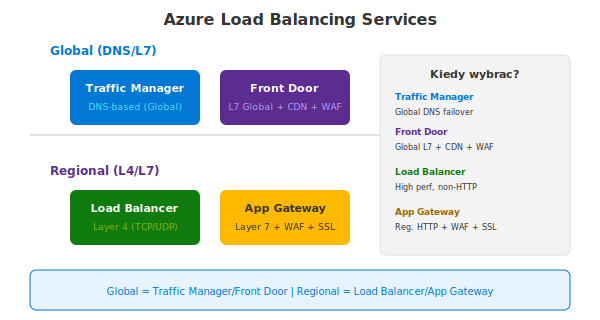

| Usluga | Warstwa | Zakres | Protokol | Glowne cechy |
|--------|---------|--------|----------|---------------|
| **Azure Load Balancer** | L4 | Regional | TCP/UDP | Ultra-niska latencja, miliony req/s |
| **Application Gateway** | L7 | Regional | HTTP/S | WAF, SSL offload, URL routing |
| **Traffic Manager** | DNS | Global | Any | DNS-based failover, geo-routing |
| **Front Door** | L7 | Global | HTTP/S | CDN + WAF + Global L7 LB |

---

### Algorytmy Load Balancing

#### 1. Round Robin

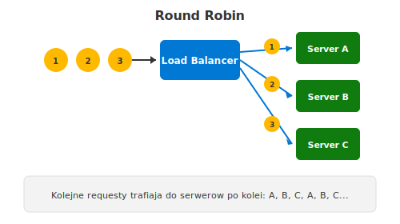

Najprostszy algorytm - requesty sa rozdzielane rowno miedzy serwery po kolei.

**Charakterystyka:**
- Prosta implementacja
- Rownomierna dystrybucja
- Nie uwzglednia obciazenia serwerow
- Idealny gdy serwery maja identyczna wydajnosc

**Azure:** Load Balancer (domyslnie), Application Gateway

---

#### 2. Weighted Round Robin

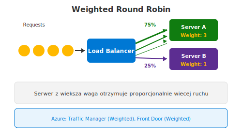

Rozszerzenie Round Robin z wagami - serwery z wieksza waga otrzymuja proporcjonalnie wiecej ruchu.

**Charakterystyka:**
- Uwzglednia roznice w wydajnosci serwerow
- Elastyczna konfiguracja
- Idealny przy heterogenicznych serwerach

**Azure:** Traffic Manager (Weighted routing), Front Door (Weighted)

```bash
# Traffic Manager z weighted routing
az network traffic-manager endpoint create \
  --resource-group myRG \
  --profile-name myTMProfile \
  --name endpoint-west \
  --type azureEndpoints \
  --target-resource-id /subscriptions/.../westus-app \
  --weight 3

az network traffic-manager endpoint create \
  --resource-group myRG \
  --profile-name myTMProfile \
  --name endpoint-east \
  --type azureEndpoints \
  --target-resource-id /subscriptions/.../eastus-app \
  --weight 1
```

---

#### 3. Least Connections

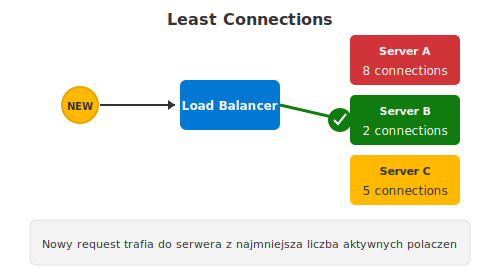

Nowe requesty trafiaja do serwera z najmniejsza liczba aktywnych polaczen.

**Charakterystyka:**
- Dynamiczne balansowanie obciazenia
- Idealny dla dlugich polaczen (WebSocket, keep-alive)
- Wymaga sledzenia stanu polaczen

**Azure:** Application Gateway (Connection Draining wsparcie)

---

#### 4. Source IP Hash (Session Affinity)

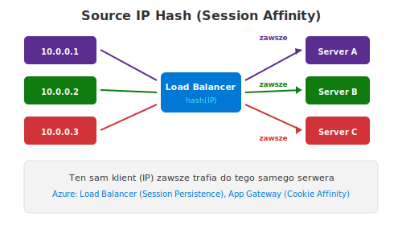

Hash z adresu IP klienta determinuje, do ktorego serwera trafi request. Ten sam klient zawsze trafia do tego samego serwera.

**Charakterystyka:**
- Sticky sessions bez cookie
- Zachowuje stan sesji po stronie serwera
- Problematyczne przy NAT (wielu klientow za jednym IP)

**Azure:** 
- Load Balancer: Session Persistence (Source IP, Source IP + Protocol)
- Application Gateway: Cookie-based Affinity

```bash
# Load Balancer z session persistence
az network lb rule create \
  --resource-group myRG \
  --lb-name myLB \
  --name myRule \
  --protocol Tcp \
  --frontend-port 80 \
  --backend-port 80 \
  --frontend-ip-name myFrontEnd \
  --backend-pool-name myBackEndPool \
  --load-distribution SourceIP
```

---

#### 5. URL Path-based Routing

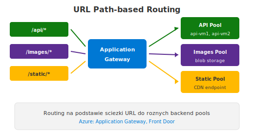

Routing na podstawie sciezki URL do roznych backend pools.

**Charakterystyka:**
- Microservices-friendly
- Rozne backendy dla roznych funkcji
- Wymaga L7 load balancera

**Azure:** Application Gateway, Front Door

```bash
# Application Gateway z path-based routing
az network application-gateway url-path-map create \
  --gateway-name myAppGateway \
  --name myPathMap \
  --resource-group myRG \
  --paths /api/* \
  --address-pool apiPool \
  --http-settings apiSettings \
  --default-address-pool defaultPool \
  --default-http-settings defaultSettings

az network application-gateway url-path-map rule create \
  --gateway-name myAppGateway \
  --name imagesRule \
  --resource-group myRG \
  --path-map-name myPathMap \
  --paths /images/* \
  --address-pool imagesPool \
  --http-settings imagesSettings
```

---

#### 6. Priority-based Routing

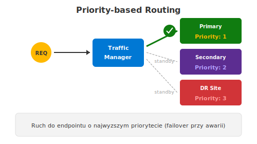

Ruch kierowany do endpointu o najwyzszym priorytecie. Jesli endpoint jest niedostepny, ruch przechodzi do nastepnego w kolejnosci.

**Charakterystyka:**
- Active-Passive failover
- Disaster Recovery scenarios
- Niski priorytet = standby

**Azure:** Traffic Manager (Priority routing), Front Door (Priority)

```bash
# Traffic Manager z priority routing
az network traffic-manager profile create \
  --resource-group myRG \
  --name myTMProfile \
  --routing-method Priority \
  --unique-dns-name myapp

az network traffic-manager endpoint create \
  --resource-group myRG \
  --profile-name myTMProfile \
  --name primary-endpoint \
  --type azureEndpoints \
  --target-resource-id /subscriptions/.../primary-app \
  --priority 1

az network traffic-manager endpoint create \
  --resource-group myRG \
  --profile-name myTMProfile \
  --name secondary-endpoint \
  --type azureEndpoints \
  --target-resource-id /subscriptions/.../secondary-app \
  --priority 2
```

---

### Inne metody routingu

| Metoda | Opis | Azure Service |
|--------|------|---------------|
| **Performance** | Najnizsza latencja do klienta | Traffic Manager |
| **Geographic** | Na podstawie lokalizacji DNS klienta | Traffic Manager |
| **Multivalue** | Zwraca wiele zdrowych endpointow | Traffic Manager |
| **Subnet** | Na podstawie podsieci klienta | Traffic Manager |

---

### Porownanie uslug Azure LB

| Cecha | Load Balancer | App Gateway | Traffic Manager | Front Door |
|-------|---------------|-------------|-----------------|------------|
| **Warstwa** | L4 | L7 | DNS | L7 |
| **Zakres** | Regional | Regional | Global | Global |
| **SSL Offload** | Nie | Tak | Nie | Tak |
| **WAF** | Nie | Tak | Nie | Tak |
| **URL Routing** | Nie | Tak | Nie | Tak |
| **Session Affinity** | Source IP | Cookie | - | Tak |
| **Health Probes** | TCP/HTTP | HTTP/S | HTTP/S/TCP | HTTP/S |
| **Latencja** | Ultra-niska | Niska | Zalezna od DNS | Niska |

---

### Scenariusze uzycia

| Scenariusz | Rekomendowana usluga |
|------------|----------------------|
| Wewnetrzny ruch miedzy VM | **Load Balancer Internal** |
| Publiczny ruch TCP/UDP non-HTTP | **Load Balancer Public** |
| Aplikacja webowa regionalna z WAF | **Application Gateway** |
| Globalna aplikacja web z CDN | **Front Door** |
| DNS-based failover multi-region | **Traffic Manager** |
| Hybrydowe (on-prem + cloud) | **Traffic Manager** |

---

### Best Practices

| Praktyka | Opis |
|----------|------|
| **Health probes** | Zawsze konfiguruj custom health probes |
| **Zones** | Uzyj zone-redundant LB dla HA |
| **Standard SKU** | Zawsze Standard (nie Basic) dla produkcji |
| **WAF** | Wlacz WAF dla publicznych aplikacji webowych |
| **CDN + Front Door** | Dla globalnych aplikacji statycznych |
| **Monitoring** | Azure Monitor + Connection Monitor |

---

### FAQ - Egzamin

| Pytanie | Odpowiedz |
|---------|----------|
| Load Balancer vs App Gateway? | LB = L4 (TCP/UDP), AppGW = L7 (HTTP) |
| Kiedy Traffic Manager? | Global DNS failover, geo-routing |
| Kiedy Front Door? | Global L7 + CDN + WAF w jednym |
| Czy LB obsluguje SSL? | NIE, to L4 - uzyj App Gateway |
| Round Robin w Azure? | Load Balancer (domyslnie), App Gateway |
| Session affinity jak? | LB = Source IP, AppGW = Cookie |
| Ktory dla microservices? | App Gateway (path routing) lub Front Door |
| Ktory ma najnizsza latencje? | Load Balancer (L4, ultra-low latency) |

> **Egzamin:** Azure Load Balancer = L4 (TCP/UDP), regional, ultra-niska latencja. Application Gateway = L7 (HTTP/S), WAF, SSL offload, URL routing. Traffic Manager = DNS-based, global, failover. Front Door = L7 global + CDN + WAF. Round Robin to domyslny algorytm. Session Affinity = Source IP (LB) lub Cookie (AppGW).

---

<a id="sec-30-data-factory"></a>
## 30. Azure Data Factory

Azure Data Factory (ADF) to w pelni zarzadzana usluga **ETL/ELT** (Extract-Transform-Load) w chmurze. Pozwala na tworzenie, planowanie i monitorowanie **pipeline'ow danych** - czyli automatycznych przepływow, ktore pobieraja dane z roznych zrodel, przeksztalcaja je i laduja do systemow docelowych.

### Po co to jest?

Wyobraz sobie, ze masz:
- Dane sprzedazowe w **SQL Server** (on-premises)
- Dane klientow w **Salesforce** (SaaS)
- Logi aplikacji w **Azure Blob Storage**
- Dane produktow w **Oracle Database**

Chcesz to wszystko **polaczyc, oczyscic i zaladowac** do hurtowni danych (Azure Synapse), zeby analitycy mogli tworzyc raporty. Reczne kopiowanie? Niemozliwe. Skrypty? Trudne w utrzymaniu. **Data Factory** robi to automatycznie!

### Jak to dziala?

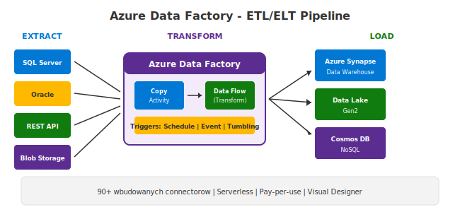

**Przepływ danych w Data Factory:**

1. **EXTRACT (Pobierz)** - Polacz sie ze zrodlami danych (SQL, Oracle, API, pliki)
2. **TRANSFORM (Przeksztalc)** - Oczyscic, polaczyc, zagregowac dane
3. **LOAD (Zaladuj)** - Zapisz do systemu docelowego (Synapse, Data Lake, Cosmos DB)

---

### Glowne komponenty

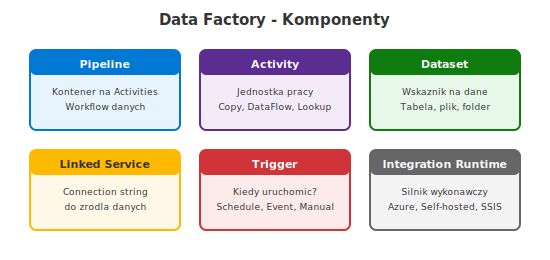

| Komponent | Co to robi? | Przyklad |
|-----------|-------------|----------|
| **Pipeline** | Kontener na kroki (activities) | "Pipeline_Sprzedaz_Dzienna" |
| **Activity** | Pojedyncza operacja | Copy Data, Data Flow, Lookup |
| **Dataset** | Wskaznik na dane | Tabela SQL, plik CSV, folder |
| **Linked Service** | Polaczenie do zrodla | Connection string do SQL Server |
| **Trigger** | Kiedy uruchomic? | Co godzine, po uploadzoe pliku |
| **Integration Runtime** | Gdzie wykonac? | Azure (cloud), Self-hosted (on-prem) |

---

### Typy Activities (operacji)

| Typ | Opis | Przyklady |
|-----|------|----------|
| **Data Movement** | Kopiowanie danych | Copy Activity |
| **Data Transformation** | Przeksztalcenia | Data Flow, Databricks, HDInsight |
| **Control Flow** | Logika przepływu | If, ForEach, Until, Wait |
| **External** | Wywolanie zewnetrzne | Azure Function, Web Activity, Stored Procedure |

---

### Integration Runtime - gdzie sie wykonuje?

| Typ IR | Uzycie | Gdzie dziala |
|--------|--------|---------------|
| **Azure IR** | Cloud-to-cloud | W Azure (domyslny) |
| **Self-hosted IR** | Cloud-to-on-premises | Na Twojej maszynie (VM/serwer) |
| **Azure-SSIS IR** | Pakiety SSIS | Azure (dla migracji SSIS) |

**Kiedy Self-hosted IR?**
- Dane w sieci firmowej (on-premises)
- Firewall blokuje dostep z internetu
- Dane w prywatnej sieci VNet

---

### Przyklady uzycia

**1. Codzienna synchronizacja sprzedazy:**
```
Trigger: Codziennie o 2:00
Pipeline:
  1. Copy z SQL Server (on-prem) do Blob Storage
  2. Data Flow - agregacja po regionach
  3. Copy do Azure Synapse
  4. Send email z raportem
```

**2. Event-driven processing:**
```
Trigger: Nowy plik w Blob Storage
Pipeline:
  1. Lookup - sprawdz format pliku
  2. If JSON: Parsuj i laduj do Cosmos DB
  3. If CSV: Przeksztalc i laduj do SQL Database
  4. Archive - przenies plik do archiwum
```

---

### Tworzenie Data Factory - CLI

```bash
# Utworz Data Factory
az datafactory create \
  --resource-group myRG \
  --factory-name myDataFactory \
  --location westeurope

# Utworz Linked Service (polaczenie do Blob Storage)
az datafactory linked-service create \
  --resource-group myRG \
  --factory-name myDataFactory \
  --linked-service-name AzureBlobStorage \
  --properties '{"type":"AzureBlobStorage","typeProperties":{"connectionString":"DefaultEndpointsProtocol=https;AccountName=mystorageaccount;AccountKey=xxx"}}'

# Uruchom pipeline
az datafactory pipeline create-run \
  --resource-group myRG \
  --factory-name myDataFactory \
  --pipeline-name MyPipeline
```

---

### Mapping Data Flow vs Copy Activity

| Cecha | Copy Activity | Mapping Data Flow |
|-------|---------------|-------------------|
| **Cel** | Proste kopiowanie | Zlozone transformacje |
| **Transformacje** | Brak (1:1 copy) | Join, Aggregate, Pivot, Filter |
| **Wydajnosc** | Bardzo szybkie | Wolniejsze (Spark pod spodem) |
| **Koszt** | Nizszy | Wyzszy |
| **Kiedy?** | Migracja danych | ETL z logika biznesowa |

---

### Cennik (uproszczony)

| Skladnik | Cena (przyklad) |
|----------|----------------|
| **Orkiestracja** | ~$1 / 1000 uruchomien |
| **Data Movement** | ~$0.25 / DIU-godzina |
| **Data Flow** | ~$0.27 / vCore-godzina |
| **Self-hosted IR** | Bezplatne (Twoj hardware) |

> **DIU** = Data Integration Unit - jednostka mocy obliczeniowej dla Copy Activity

---

### ADF vs inne narzedzia

| Cecha | Data Factory | Logic Apps | Azure Synapse Pipelines |
|-------|--------------|------------|------------------------|
| **Fokus** | ETL/ELT danych | Workflow/integracja | Analytics + ETL |
| **Transformacje** | Data Flow (Spark) | Ograniczone | Data Flow (Spark) |
| **Kod** | No-code / Low-code | No-code | No-code / SQL / Spark |
| **90+ connectorow** | Tak | 450+ | Tak |
| **Kiedy?** | Pipeline danych | Automatyzacja procesow | Kompleksowa analityka |

---

### Best Practices

| Praktyka | Opis |
|----------|------|
| **Parametryzuj pipeline'y** | Unikaj hardcodowania wartosci |
| **Uzywaj Linked Service z Key Vault** | Nie przechowuj hasel w ADF |
| **Monitoruj uruchomienia** | Azure Monitor + alerty |
| **Partycjonuj dane** | Dla lepszej wydajnosci Copy |
| **Testuj na malych danych** | Debug mode przed produkcja |
| **Git integration** | Wersjonowanie pipeline'ow |

---

### FAQ - Egzamin

| Pytanie | Odpowiedz |
|---------|----------|
| Co to jest Azure Data Factory? | Serverless ETL/ELT service w chmurze |
| Do czego sluzy ADF? | Integracja i transformacja danych z roznych zrodel |
| Co to jest Pipeline? | Kontener na Activities (kroki) |
| Co to jest Activity? | Pojedyncza operacja (Copy, DataFlow, Lookup) |
| Co to jest Linked Service? | Connection string do zrodla danych |
| Czym jest Integration Runtime? | Silnik wykonawczy (Azure, Self-hosted, SSIS) |
| Kiedy Self-hosted IR? | Dane on-premises lub w prywatnej sieci |
| ADF vs Synapse Pipelines? | Synapse = ADF + Analytics w jednym |
| Ile connectorow ma ADF? | 90+ wbudowanych |
| Czy ADF jest serverless? | TAK - pay-per-use |

> **Egzamin:** Azure Data Factory to serverless ETL/ELT service do integracji danych. Pipeline = kontener na Activities. Activity = operacja (Copy, Data Flow). Linked Service = polaczenie do zrodla. Integration Runtime = silnik wykonawczy (Azure dla cloud, Self-hosted dla on-premises). 90+ wbudowanych connectorow. Data Flow uzywa Apache Spark do transformacji.

---

<a id="sec-31-azure-storage"></a>
## 31. Azure Storage i Blob Storage

Azure Storage to podstawowa usluga przechowywania danych w chmurze Azure. Oferuje wysoce dostepne, skalowalne i bezpieczne storage dla roznych typow danych.

### Storage Account - co to jest?

**Storage Account** to kontener zarzadzania dla uslug storage. Kazdy Storage Account ma unikalna nazwe (globalnie unikalna w Azure!) i zawiera wszystkie obiekty danych.

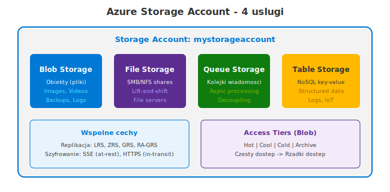

### 4 uslugi w Storage Account

| Usluga | Typ danych | Protokol | Uzycie |
|--------|------------|----------|--------|
| **Blob Storage** | Obiekty (pliki binarne) | REST/HTTP | Obrazy, video, backupy, logi |
| **File Storage** | Udzialy plikowe | SMB 3.0 / NFS | Lift-and-shift, file servers |
| **Queue Storage** | Wiadomosci kolejkowe | REST/HTTP | Async processing, decoupling |
| **Table Storage** | Dane strukturalne NoSQL | REST/HTTP | Logi, IoT, proste dane |

---

## Azure Blob Storage - szczegolowo

Blob = **B**inary **L**arge **OB**ject. Najpopularniejsza usluga storage do przechowywania niestrukturalnych danych (pliki, obrazy, video, backupy).

### Hierarchia Blob Storage

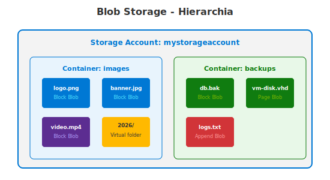

**Struktura:**
```
Storage Account
  └── Container (folder glowny)
        └── Blob (plik)
        └── Virtual folder / (opcjonalnie)
              └── Blob
```

### 3 typy Blobow

| Typ | Opis | Max rozmiar | Uzycie |
|-----|------|-------------|--------|
| **Block Blob** | Bloki danych do uploadu | 190.7 TB | Pliki, obrazy, video, dokumenty |
| **Append Blob** | Tylko dopisywanie na koncu | 195 GB | Logi, audit trails |
| **Page Blob** | Random read/write | 8 TB | Dyski VM (VHD), bazy danych |

**Block Blob** - najbardziej uniwersalny, uzywa blokow (do 4000) ktore mozna uploadowac rownolegle.

---

### Access Tiers (Warstwy dostepu)

Blob Storage oferuje rozne warstwy kosztowe w zaleznosci od czestotliwosci dostepu do danych.

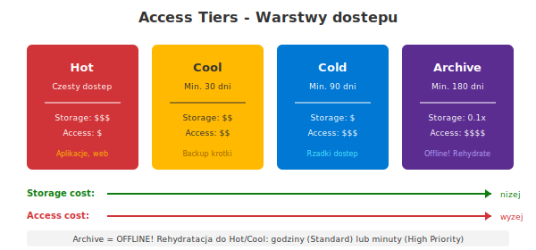

| Tier | Min. czas | Storage cost | Access cost | Kiedy? |
|------|-----------|--------------|-------------|--------|
| **Hot** | Brak | Wysoki | Niski | Czesty dostep, aplikacje web |
| **Cool** | 30 dni | Sredni | Sredni | Backup krotkoterminowy |
| **Cold** | 90 dni | Niski | Wysoki | Rzadki dostep, compliance |
| **Archive** | 180 dni | Najnizszy | Najwyzszy | Archiwum, OFFLINE! |

> **WAZNE:** Archive tier jest **OFFLINE**! Dane nie sa dostepne natychmiast. Rehydratacja (przywrocenie do Hot/Cool) trwa:
> - Standard: do 15 godzin
> - High Priority: do 1 godziny (drozsze)

---

### Redundancja (Replikacja)

Azure automatycznie replikuje dane dla ochrony przed awariami.

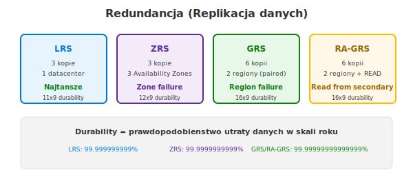

| Typ | Kopie | Lokalizacja | Ochrona przed | SLA |
|-----|-------|-------------|---------------|-----|
| **LRS** | 3 | 1 datacenter | Awaria dysku/rack | 99.9% |
| **ZRS** | 3 | 3 Availability Zones | Awaria strefy | 99.9% |
| **GRS** | 6 | 2 regiony (paired) | Awaria regionu | 99.9% |
| **RA-GRS** | 6 | 2 regiony + READ | Awaria regionu + read HA | 99.99% |
| **GZRS** | 6 | 3 AZ + paired region | Zone + region failure | 99.9% |
| **RA-GZRS** | 6 | 3 AZ + paired + READ | Max protection | 99.99% |

**Wybor redundancji:**
- **Dev/Test:** LRS (najtanszy)
- **Produkcja regionalna:** ZRS
- **Disaster Recovery:** GRS lub GZRS
- **Read HA globally:** RA-GRS lub RA-GZRS

---

### Typy Storage Account

| Typ | Uslugi | Performance | Uzycie |
|-----|--------|-------------|--------|
| **Standard general-purpose v2** | Blob, File, Queue, Table | Standard (HDD) | Wiekszoss zastosowań |
| **Premium block blobs** | Blob (block) | Premium (SSD) | Low latency, high transactions |
| **Premium file shares** | File | Premium (SSD) | Enterprise file shares |
| **Premium page blobs** | Blob (page) | Premium (SSD) | VM disks, databases |

---

### Bezpieczenstwo

| Funkcja | Opis |
|---------|------|
| **SSE (Storage Service Encryption)** | Szyfrowanie at-rest (automatyczne, AES-256) |
| **Encryption in transit** | HTTPS/TLS wymagane |
| **Shared Access Signature (SAS)** | Token z ograniczonym dostepem |
| **Access Keys** | Pelny dostep (2 klucze do rotacji) |
| **Microsoft Entra ID** | RBAC dla Blob i Queue |
| **Private Endpoint** | Dostep przez VNet (bez public IP) |
| **Firewall rules** | Ograniczenie po IP/VNet |
| **Immutable storage (WORM)** | Write Once Read Many - compliance |
| **Soft delete** | Odzyskiwanie usunietych danych |
| **Versioning** | Historia wersji blobow |

---

### Lifecycle Management

Automatyczne przenoszenie danych miedzy tierami na podstawie regul.

```json
{
  "rules": [
    {
      "name": "moveToArchive",
      "type": "Lifecycle",
      "definition": {
        "filters": {
          "blobTypes": ["blockBlob"],
          "prefixMatch": ["logs/"]
        },
        "actions": {
          "baseBlob": {
            "tierToCool": { "daysAfterModificationGreaterThan": 30 },
            "tierToArchive": { "daysAfterModificationGreaterThan": 90 },
            "delete": { "daysAfterModificationGreaterThan": 365 }
          }
        }
      }
    }
  ]
}
```

---

### Azure CLI - podstawowe operacje

```bash
# Utworz Storage Account
az storage account create \
  --name mystorageaccount \
  --resource-group myRG \
  --location westeurope \
  --sku Standard_LRS \
  --kind StorageV2 \
  --access-tier Hot

# Utworz container
az storage container create \
  --name mycontainer \
  --account-name mystorageaccount

# Upload pliku
az storage blob upload \
  --account-name mystorageaccount \
  --container-name mycontainer \
  --name myfile.txt \
  --file ./localfile.txt

# Lista blobow
az storage blob list \
  --account-name mystorageaccount \
  --container-name mycontainer \
  --output table

# Zmien access tier
az storage blob set-tier \
  --account-name mystorageaccount \
  --container-name mycontainer \
  --name myfile.txt \
  --tier Archive

# Generuj SAS token
az storage blob generate-sas \
  --account-name mystorageaccount \
  --container-name mycontainer \
  --name myfile.txt \
  --permissions r \
  --expiry 2026-12-31T23:59:59Z
```

---

### Static Website Hosting

Blob Storage moze hostowac statyczne strony (HTML, CSS, JS) bez serwera!

```bash
# Wlacz static website
az storage blob service-properties update \
  --account-name mystorageaccount \
  --static-website \
  --index-document index.html \
  --404-document 404.html

# Upload plikow do $web container
az storage blob upload-batch \
  --account-name mystorageaccount \
  --destination '$web' \
  --source ./website-files
```

**URL:** `https://mystorageaccount.z6.web.core.windows.net/`

---

### Azure Files vs Blob Storage

| Cecha | Blob Storage | Azure Files |
|-------|--------------|-------------|
| **Protokol** | REST/HTTP | SMB 3.0 / NFS |
| **Dostep** | URL/API | Mount jako dysk |
| **Uzycie** | Aplikacje web, backup | File servers, lift-and-shift |
| **Mapowanie dysku** | NIE | TAK (Z:\\, /mnt) |
| **Wspoldzielenie** | URL + SAS | UNC path |
| **Max file size** | 190.7 TB (block blob) | 4 TB (pojedynczy plik) |

---

### Data Lake Storage Gen2

Hierarchical Namespace (HNS) na Blob Storage - dla Big Data analytics.

| Cecha | Blob Storage | Data Lake Gen2 |
|-------|--------------|----------------|
| **Namespace** | Flat | Hierarchical (foldery) |
| **Operacje folderow** | Rename = copy+delete | Atomic rename |
| **ACL** | Container level | File/folder level |
| **Big Data** | Ograniczone | Optimized (Hadoop, Spark) |
| **Koszt** | Standardowy | Taki sam |

```bash
# Utworz Storage z HNS (Data Lake Gen2)
az storage account create \
  --name mydatalake \
  --resource-group myRG \
  --location westeurope \
  --sku Standard_LRS \
  --kind StorageV2 \
  --enable-hierarchical-namespace true
```

---

### Cennik (przyklady West Europe)

| Tier | Storage (per GB/mies) | Read (per 10k) | Write (per 10k) |
|------|----------------------|----------------|----------------|
| **Hot LRS** | ~$0.0184 | ~$0.004 | ~$0.05 |
| **Cool LRS** | ~$0.01 | ~$0.01 | ~$0.10 |
| **Cold LRS** | ~$0.0036 | ~$0.10 | ~$0.18 |
| **Archive LRS** | ~$0.00099 | ~$5.00 | ~$0.10 |

> **Optymalizacja kosztow:** Uzyj Lifecycle Management do automatycznego przenoszenia danych do tanszych tierow!

---

### AzCopy - szybkie kopiowanie

Narzedzie CLI do szybkiego transferu danych do/z Azure Storage.

```bash
# Upload folderu
azcopy copy "./lokalny-folder" "https://mystorageaccount.blob.core.windows.net/container?SAS_TOKEN" --recursive

# Download
azcopy copy "https://mystorageaccount.blob.core.windows.net/container/blob?SAS_TOKEN" "./lokalny-plik"

# Sync (jak rsync)
azcopy sync "./lokalny-folder" "https://mystorageaccount.blob.core.windows.net/container?SAS_TOKEN"
```

---

### Best Practices

| Praktyka | Opis |
|----------|------|
| **Wybierz odpowiedni tier** | Hot dla aktywnych, Archive dla archiwum |
| **Lifecycle Management** | Automatyzuj przenoszenie miedzy tierami |
| **Uzyj ZRS/GRS dla produkcji** | LRS tylko dla dev/test |
| **Private Endpoint** | Dla wrazliwych danych - bez public access |
| **Soft delete** | Wlacz dla ochrony przed przypadkowym usunieciem |
| **Versioning** | Dla waznych dokumentow |
| **Immutable storage** | Dla compliance (WORM) |
| **Monitoring** | Azure Monitor + Storage Analytics |
| **Rotuj Access Keys** | Regularna rotacja (Key Vault) |

---

### FAQ - Egzamin

| Pytanie | Odpowiedz |
|---------|----------|
| Co zawiera Storage Account? | Blob, File, Queue, Table |
| Ile kopii tworzy LRS? | 3 kopie w 1 datacenter |
| Ile kopii tworzy GRS? | 6 kopii (3+3 w 2 regionach) |
| Co to jest RA-GRS? | GRS + Read Access do secondary |
| Ktory tier jest OFFLINE? | Archive (wymaga rehydratacji) |
| Ile trwa rehydratacja Archive? | Standard: do 15h, High: do 1h |
| Block vs Page vs Append Blob? | Block=pliki, Page=VHD, Append=logi |
| Max rozmiar Block Blob? | 190.7 TB |
| Co to jest HNS? | Hierarchical Namespace (Data Lake Gen2) |
| Czy Blob moze hostowac strone? | TAK - Static Website Hosting |
| Jak ograniczyc dostep czasowo? | SAS (Shared Access Signature) |
| Co to jest SSE? | Storage Service Encryption (at-rest) |

> **Egzamin:** Storage Account zawiera 4 uslugi: Blob, File, Queue, Table. Blob ma 3 typy: Block (pliki), Page (VHD), Append (logi). Access Tiers: Hot (czesty), Cool (30 dni), Cold (90 dni), Archive (180 dni, OFFLINE!). Redundancja: LRS (3 kopie, 1 DC), ZRS (3 AZ), GRS (6 kopii, 2 regiony), RA-GRS (GRS + read). Archive wymaga rehydratacji (godziny). Data Lake Gen2 = Blob + HNS.

---