# Microsoft Azure – AZ‑900 Fundamentals (Kompendium w 1 pliku)

> Kompletny, praktyczny README do szybkiej nauki i utrwalenia wiedzy pod egzamin **AZ‑900 Microsoft Azure Fundamentals**. Zawiera: podstawy chmury, architekturę Azure, kluczowe usługi (Compute/Networking/Storage), tożsamość i bezpieczeństwo (Microsoft Entra), governance i koszty, monitoring, IaC & automatyzację, rozszerzone usługi oraz **podchwytliwe pytania egzaminacyjne**.

---

## Spis treści
- [1. Cloud Concepts (Podstawy chmury)](#1-cloud-concepts-podstawy-chmury)
- [2. Azure Architecture (Architektura i hierarchia)](#2-azure-architecture-architektura-i-hierarchia)
- [3. Compute Services (Usługi obliczeniowe)](#3-compute-services-usługi-obliczeniowe)
- [4. Networking (Sieci i łączność)](#4-networking-sieci-i-łączność)
- [5. Storage (Przechowywanie danych)](#5-storage-przechowywanie-danych)
- [6. Identity & Access (Microsoft Entra)](#6-identity--access-microsoft-entra)
- [7. Security (Bezpieczeństwo)](#7-security-bezpieczeństwo)
- [8. Governance & Compliance](#8-governance--compliance)
- [9. Monitoring & Logging](#9-monitoring--logging)
- [10. Costs & Billing (Koszty i rozliczenia)](#10-costs--billing-koszty-i-rozliczenia)
- [11. IaC & Automation (Infrastruktura jako kod)](#11-iac--automation-infrastruktura-jako-kod)
- [12. Extended Azure Services (Usługi rozszerzone)](#12-extended-azure-services-usługi-rozszerzone)
- [13. Podchwytliwe pytania AZ‑900](#13-podchwytliwe-pytania-az900)
- [14. Glosariusz skrócony](#14-glosariusz-skrócony)
- [15. Azure Free Account - Free Tier](#15-azure-free-account-free-tier)
- [16. SLA - Service Level Agreement](#16-sla-service-level-agreement)
- [17. Bazy danych (Databases)](#17-bazy-danych-databases)
- [18. Subskrypcje (Subscription Models)](#18-subskrypcje-subscription-models)
- [19. Azure CLI](#19-azure-cli)
- [Załącznik A – Diagramy ASCII](#załącznik-a--diagramy-ascii)

---

## 1. Cloud Concepts (Podstawy chmury)

## Modele wdrożenia

### Public Cloud
Usługi uruchamiane w infrastrukturze dostawcy (np. Microsoft Azure). Dostępność i skalowanie zapewnia provider, a Ty płacisz za zużycie. Szybki time‑to‑market, szeroka oferta usług, brak konieczności utrzymywania hardware’u.
<br>

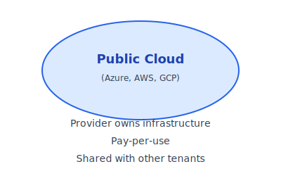

**Kiedy używać:** projekty o zmiennym obciążeniu, potrzeba globalnego zasięgu, krótkie cykle wdrożeniowe.  
**Ryzyka/uwagi:** lock‑in, zgodność/regulacje, kontrola nad siecią niższa niż on‑prem.

---

### Private Cloud
Dedykowana chmura dla jednej organizacji (własne DC / hosting dedykowany / Azure Stack HCI). Najwyższa kontrola i możliwość dopasowania do rygorów zgodności, kosztem zwinności i CAPEX/OPEX.
<br>


**Kiedy używać:** silne wymagania compliance, izolacja, specyficzne potrzeby bezpieczeństwa/latencji.  
**Ryzyka/uwagi:** większe koszty utrzymania, mniejsza elastyczność skalowania.

---

### Hybrid Cloud
Połączenie środowisk on‑prem/private z public cloud. Umożliwia przenoszenie obciążeń, burst do chmury i stopniową migrację, z zachowaniem kontroli nad danymi krytycznymi.
<br>

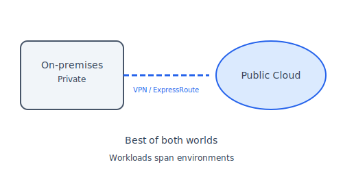

**Kiedy używać:** modernizacja etapowa, wymogi rezydencji danych, integracje z istniejącymi systemami.  
**Ryzyka/uwagi:** złożoność sieci/identyfikacji/monitoringu, potrzeba spójnego governance.

---

### Community Cloud
Chmura współdzielona przez grupę organizacji o wspólnych wymaganiach — np. sektor publiczny, medyczny, edukacyjny lub finansowy. Zapewnia wspólne standardy bezpieczeństwa, zgodność regulacyjną i kontrolę nad środowiskiem.
<br>

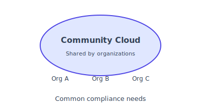

**Kiedy używać:** organizacje o wspólnych regulacjach (RODO, HIPAA, FINREP), współdzielone koszty, potrzeba jednolitych polityk bezpieczeństwa.  
**Ryzyka/uwagi:** uzgodnienie governance między uczestnikami, współdzielona odpowiedzialność, potencjalnie mniejsza elastyczność niż public cloud.

---

### Multi‑Cloud
Wykorzystanie wielu dostawców chmury (np. Azure, AWS, GCP) jednocześnie. Pozwala redukować vendor lock‑in, wybierać najlepsze usługi z różnych platform oraz zwiększyć odporność na awarie jednego providera.
<br>

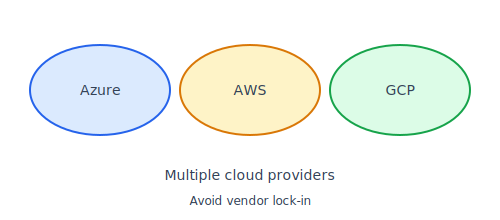

**Kiedy używać:** minimalizacja zależności od jednego dostawcy, strategia „best‑of‑breed”, wymagania biznesowe lub prawne dotyczące dywersyfikacji.  
**Ryzyka/uwagi:** wyższa złożoność operacyjna, trudniejsze bezpieczeństwo i monitoring, konieczność ujednolicenia narzędzi i procesów (IaC/CI/CD).

---

### Distributed Cloud
Model, w którym usługi chmurowe dostawcy (np. Azure, AWS, GCP) są fizycznie uruchamiane bliżej użytkownika — w lokalnych centrach danych, edge‑location, on‑prem lub w regionach partnerskich. Pozwala zachować jedno zarządzanie chmurą, ale wykonywać obliczenia tam, gdzie są potrzebne.
<br>

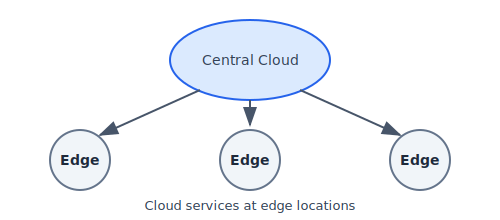

**Kiedy używać:** niska latencja, wymagania rezydencji danych, obciążenia przemysłowe/IoT, obliczenia blisko fabryki lub oddziału.  
**Ryzyka/uwagi:** większa złożoność wdrożeń, koordynacja między lokalnymi zasobami a centralną chmurą, zależność od infrastruktury partnerów.

---

### Edge Cloud
Przetwarzanie danych bezpośrednio na „krawędzi” sieci — blisko urządzeń IoT, fabryk, sklepów, samochodów autonomicznych czy systemów przemysłowych. Minimalizuje opóźnienia i redukuje transfer danych do regionów chmurowych.
<br>


**Kiedy używać:** ultra‑niska latencja, IoT, urządzenia mobilne, autonomiczne systemy, lokalne decyzje w czasie rzeczywistym.  
**Ryzyka/uwagi:** konieczność zarządzania wieloma lokalizacjami, ograniczone zasoby sprzętowe, bardziej złożone bezpieczeństwo.

---

## Modele usług chmurowych (Cloud Service Models)

### IaaS (Infrastructure as a Service)
Dostawca udostępnia zasoby infrastruktury: maszyny wirtualne, sieci, load balancery, firewalle, dyski.  
Użytkownik zarządza systemem operacyjnym, aplikacjami i konfiguracją.

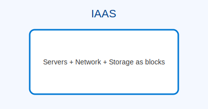

**Przykłady:** Azure VM, VNet, Load Balancer, Storage.  
**Kiedy używać:** migracje lift‑and‑shift, systemy wymagające pełnej kontroli nad OS.  
**Ryzyka/uwagi:** większe koszty utrzymania i administracji.

---

### PaaS (Platform as a Service)
Środowisko uruchomieniowe dla aplikacji bez konieczności zarządzania OS, patchami i infrastrukturą.  
Odpowiadasz jedynie za kod i dane.

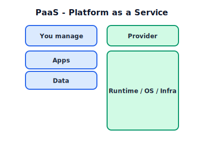

**Przykłady:** Azure App Service, Azure SQL, Functions (Premium).  
**Kiedy używać:** API, mikroserwisy, aplikacje web.  
**Plusy:** automatyczne skalowanie, wysoka dostępność, szybkie wdrażanie.

---

### SaaS (Software as a Service)
W pełni gotowe aplikacje dostarczane jako usługa — bez instalacji i utrzymania.

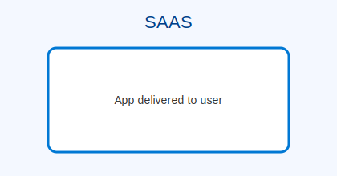

**Przykłady:** Microsoft 365, Power BI, Salesforce.  
**Kiedy używać:** poczta, dokumenty, CRM, HR, analiza danych.  
**Plusy:** minimalny narzut operacyjny.

---

### Serverless / FaaS (Function as a Service)
Kod uruchamiany na żądanie, bez serwerów i bez opłat stałych — płacisz tylko za wykonanie.

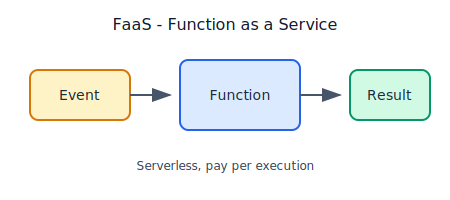

**Przykłady:** Azure Functions (Consumption), AWS Lambda.  
**Kiedy używać:** event‑driven, automatyzacje, integracje, IoT.  
**Plusy:** pełna autoskalowalność.

---

### NaaS (Network as a Service)
Sieć jako usługa — routing, VPN, SD‑WAN, firewalle, połączenia między chmurami, edge networking.

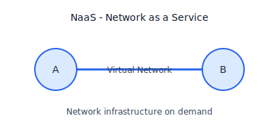

**Przykłady:** Azure Virtual WAN, AWS Cloud WAN.  
**Kiedy używać:** globalna sieć firmy, integracje multi‑cloud, oddziały.  
**Ryzyka/uwagi:** zależność od usług sieciowych dostawcy.

---

### CaaS (Container as a Service)
Zarządzane środowisko kontenerowe — bez utrzymywania VM czy orkiestracji.

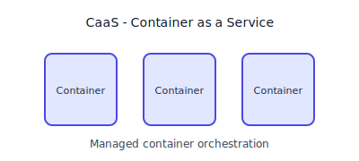

**Przykłady:** Azure Container Instances, AWS Fargate, Cloud Run.  
**Kiedy używać:** mikroserwisy, API, krótkie zadania batch.  
**Plusy:** zero administrowania infrastrukturą.

---

### DaaS (Desktop as a Service)
Zdalne, hostowane w chmurze środowiska pulpitu użytkownika.

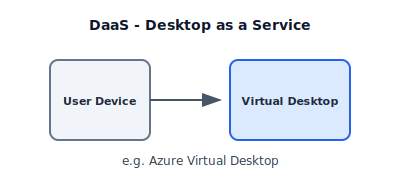

**Przykłady:** Azure Virtual Desktop, Windows 365.  
**Kiedy używać:** praca zdalna, call‑center, access z dowolnego urządzenia.  
**Ryzyka/uwagi:** zależność od jakości łącza.

---

### iPaaS (Integration Platform as a Service)
Platformy integracyjne do łączenia systemów, API, ETL i workflow.

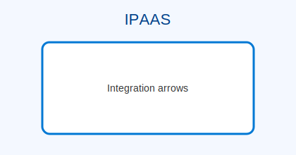

**Przykłady:** Azure Logic Apps, MuleSoft, Boomi.  
**Kiedy używać:** integracje ERP/CRM, automatyzacja procesów.  
**Plusy:** szybkie łączenie systemów bez pisania backendu.

---

### MBaaS / BaaS (Mobile/Backend as a Service)
Backend dostarczany jako usługa — auth, bazy, storage, push, API.

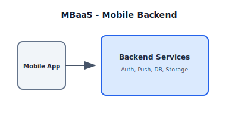

**Przykłady:** Firebase, AWS Amplify.  
**Kiedy używać:** aplikacje mobilne, prototypy, szybki development.

---

### BPaaS (Business Process as a Service)
Gotowe procesy biznesowe jako usługa, np. HR, płace, księgowość, CRM.

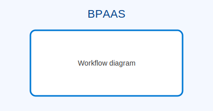

**Przykłady:** Workday, Dynamics 365, Salesforce.  
**Kiedy używać:** outsourcing procesów biznesowych.  
**Plusy:** standaryzacja i skalowalność.

---

## Skalowanie i elastyczność

### **Vertical Scaling (Scale Up / Scale Down)**
Zwiększanie lub zmniejszanie *mocy pojedynczej instancji* zasobu — np. większy rozmiar VM (więcej CPU/RAM/dysk), mocniejsza baza danych, większy plan App Service.

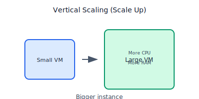

**Charakterystyka:**
- Skalowanie „w górę” = mocniejsza maszyna.
- Skalowanie „w dół” = tańsza/słabsza maszyna.
- Zwykle **wymaga restartu** (przestój zależny od usługi).
- Ograniczenia sprzętowe — istnieje „sufit” skali.

**Kiedy używać:** bazy danych, monolity, workloady zależne od pojedynczego węzła.

---

### **Horizontal Scaling (Scale Out / Scale In)**
Dodawanie lub usuwanie *instancji zasobu*. Zamiast jednej mocnej maszyny — wiele mniejszych pracujących równolegle.

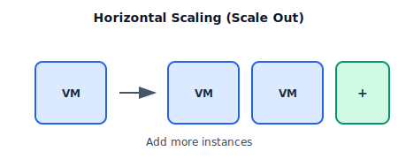

**Charakterystyka:**
- Scale out = dodawanie instancji.
- Scale in = usuwanie instancji.
- **Brak przestojów** — nowa instancja dołącza automatycznie.
- Wymaga stateless lub odpowiedniego przechowywania sesji.

**Przykłady:**  
- VMSS (Virtual Machine Scale Sets)  
- App Service z wieloma instancjami  
- Kubernetes / AKS (HPA, VPA, node autoscaling)

**Kiedy używać:** API, web, mikroserwisy, obciążenia rozproszone.

---

### **Autoskalowanie (Automatic Scaling / Auto‑Scale)**
Automatyczne zwiększanie/zmniejszanie liczby instancji lub mocy zasobu na podstawie *metryk, progów i reguł*.

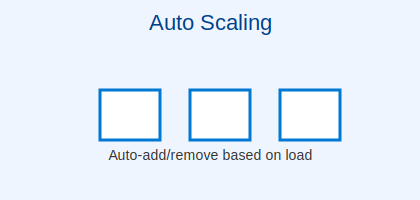

**Rodzaje autoskalowania:**
- **Metric-based** – CPU, RAM, latency, queue depth, request count.
- **Schedule-based** – konkretne godziny/dni (np. nocne / weekendy).
- **Event-based** – zdarzenia aplikacyjne (np. komunikat w kolejce).
- **Predictive autoscaling** – AI/ML przewiduje obciążenie (np. Azure Functions Premium, App Service Premium).

**Co potrafi autoscaler:**
- Dynamicznie dołącza/usuwa instancje VM / kontenerów / workerów.
- Reaguje na przeciążenia i koszt.
- Zapewnia odporność — jeśli instancja padnie, zostaje automatycznie odtworzona.

**Kiedy używać:** zmienne obciążenia, obciążenia sezonowe, systemy o ruchu skokowym (e‑commerce, IoT, integracje).

---

### **Additional Concepts (warto dodać w chmurze)**

#### **Bursting**
Tymczasowe podniesienie mocy zasobu ponad nominalną (np. Azure Premium Disks, niektóre VM).

#### **Load Balancing**
Load balancer rozprowadza ruch między instancjami, umożliwiając skuteczne scale-out.

#### **Stateless Architecture**
Wymagana do efektywnego autoskalowania — stan przechowywany poza instancjami (cache/DB/redis).

- Ważna różnica:
  - **Stateless** to serwer, który nie pamięta niczego między żądaniami.
  - **Stateful** to serwer, który musi pamiętać stan, więc kolejne żądania muszą wracać do niego.

#### **Throttling / Rate Limiting**
Kontrola obciążenia aplikacji i API w czasie autoskalowania — ochrona przed lawinowym ruchem.

---

## Odporność, Wysoka Dostępność i Disaster Recovery

### **High Availability (HA) – Wysoka dostępność**
Projektowanie infrastruktury w taki sposób, aby usługa pozostawała dostępna mimo awarii pojedynczych elementów.

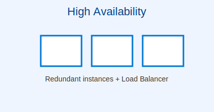

**Kluczowe mechanizmy:**
- **Redundancja zasobów** – co najmniej 2 instancje (VM, kontenery, App Service) pracujące równolegle.
- **Availability Zones (AZ)** – fizycznie odseparowane strefy w regionie, każda z własnym zasilaniem, chłodzeniem i siecią.
- **Load Balancing** – równoważenie ruchu między instancjami (L4/L7).
- **Health probes** – automatyczne wykrywanie niedziałających instancji i wyłączanie ich z rotacji.
- **Autoskalowanie** – dodawanie instancji, aby uniknąć przeciążeń.

**Cel:** minimalizacja przestojów (downtime) w obrębie *jednego regionu*.

---

### **Fault Tolerance – Odporność na awarie**
System działa nawet wtedy, gdy część komponentów ulegnie całkowitej awarii — bez utraty usługi i bez przerwy.

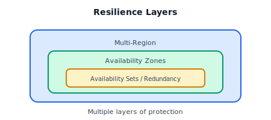

**Cechy architektury odpornej na awarie:**
- **Brak pojedynczego punktu awarii (SPOF)** — każdy element ma co najmniej jeden duplikat.
- **Active/Active** – wszystkie instancje stale działają i są gotowe przejąć ruch.
- **Self‑healing** – automatyczne zastępowanie uszkodzonych zasobów (VMSS, Kubernetes).
- **Dane replikowane synchronicznie** – brak utraty danych przy padzie jednego węzła (np. ZRS dla storage).

**Cel:** ciągłość działania przy awariach sprzętu, instancji, stref AZ lub fragmentów infrastruktury.

---

### **Disaster Recovery (DR) – Odzyskiwanie po awarii**
Zabezpieczenie na wypadek katastrofalnej awarii całego regionu lub utraty danych.  
Skupia się na **przywróceniu pracy systemu w innym regionie**.

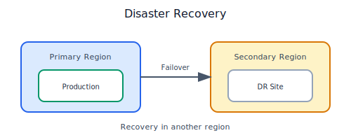

**Podstawowe pojęcia:**
- **RTO (Recovery Time Objective)** – jak szybko system musi zostać przywrócony (czas).
- **RPO (Recovery Point Objective)** – ile danych można stracić (czas od ostatniej replikacji).

**Techniki w Azure:**
- **Region Pairs** – każdy region ma sparowany region w tej samej geografii (szybsze przywracanie, chroniona aktualizacja).
- **Asynchroniczna replikacja danych** – Storage GRS/RA‑GRS, SQL Geo-Replication, Cosmos DB multi-region.
- **Azure Site Recovery (ASR)** – automatyczna replikacja VM, odtwarzanie aplikacji, orchestracja failover.
- **Backupy i snapshoty** – dane krytyczne przechowywane niezależnie od głównej infrastruktury.

**Scenariusze DR:**
- **Cold Standby** – zasoby odtwarzane dopiero po awarii (najtańsze).
- **Warm Standby** – ograniczona liczba maszyn działa w regionie zapasowym.
- **Hot Standby / Active-Passive** – pełna gotowość, ale ruch idzie tylko do jednego regionu.
- **Active-Active Multi‑Region** – oba regiony obsługują ruch jednocześnie.

**Cel:** utrzymanie pracy biznesu nawet w przypadku utraty całego regionu.

---

### **Podsumowanie różnic**

| Mechanizm            | Ochrona przed awarią | Poziom geograficzny | Przestój | Koszt |
|----------------------|----------------------|----------------------|----------|-------|
| **High Availability** | awaria instancji, AZ | 1 region             | bardzo niski | średni |
| **Fault Tolerance**  | pełna odporność       | 1 region (Active/Active) | praktycznie brak | wysoki |
| **Disaster Recovery** | awaria regionu        | 2+ regiony           | zależny od RTO | zróżnicowany |

---

### **Dobre praktyki odporności systemów**
- Projektuj **stateless** — stan w DB, cache, storage.
- Używaj **multi-zone** dla HA i **multi-region** dla DR.
- Testuj **regularnie failover** i aktualizuj runbooki DR.
- Wymuszaj **replikację danych** zgodnie z RPO.
- Zapewnij **monitoring + alerty** (Azure Monitor, KQL).

---

## 2. Azure Architecture (Architektura i hierarchia)
**Hierarchia i scope:**

### 2. Azure Architecture (Architektura i hierarchia)

**Hierarchia i scope — logika porządkowania zasobów w Azure**

Poniższy diagram przedstawia pełną hierarchię zarządzania w Azure — od najwyższego poziomu tożsamości (Tenant), przez struktury organizacyjne (Management Groups), aż po subskrypcje, grupy zasobów i pojedyncze zasoby.

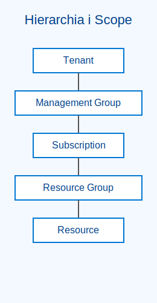

### Hierarchia definiuje:
- **zakres (scope)**, na którym można przypisywać uprawnienia (RBAC),
- **miejsce stosowania polityk** (Azure Policy),
- **jak organizować zasoby** w skali całej organizacji,
- **gdzie przebiegają granice rozliczeń i odpowiedzialności**.

<br>

---

Ta struktura jest fundamentem pracy z Azure — wpływa na **uprawnienia, governance, koszty, compliance**, a nawet na sposób planowania architektury i CI/CD.

## Struktura Azure

- **Tenant (Microsoft Entra ID)** – główny kontener tożsamości całej organizacji. Zawiera użytkowników, grupy i zasady bezpieczeństwa.
- **Management Group** – umożliwia grupowanie wielu subskrypcji oraz nakładanie wspólnych polityk na poziomie organizacji.
- **Subscription** – określa sposób rozliczeń, limity oraz stanowi granicę uprawnień administracyjnych.
- **Resource Group (RG)** – logiczny kontener na powiązane ze sobą zasoby (np. aplikację i jej bazę danych).
- **Resource** – pojedynczy zasób lub usługa, np. VM, VNet, konto Storage, App Service itd.

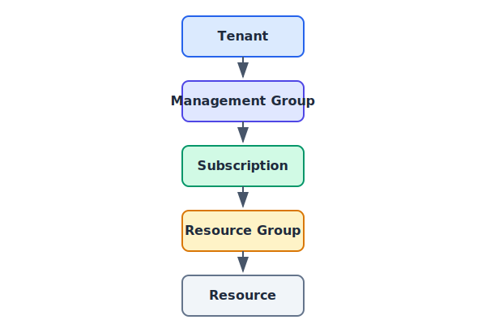

- Jeden **Resource** może należeć tylko do jednej **Resource Group**.

## Globalna infrastruktura Azure

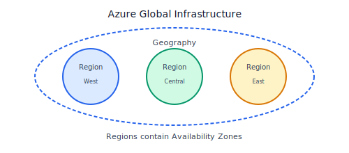

- **Geography** – obszar składający się z jednego lub kilku regionów, stanowiący granicę rezydencji i zgodności danych (np. EU, US).

- **Region** – zestaw współpołączonych centrów danych działających jako jedna lokalizacja dostarczająca usługi Azure.

- **Regions** to miejsca na świecie, w których Azure ma swoje centra danych — dzięki temu usługi działają szybciej, bliżej użytkowników i zgodnie z lokalnymi przepisami.

  - **Public Regions**
  - Standardowe regiony Azure dostępne globalnie dla wszystkich klientów i uruchamiające pełny zestaw usług.

  - **Restricted Regions**
  - Regiony o ograniczonym dostępie, dostępne wyłącznie po akceptacji Microsoft w specjalnych scenariuszach biznesowych.

  - **Upcoming Regions**
  - Nowo ogłoszone, budowane regiony, które poszerzą globalny zasięg i spełnią lokalne wymogi rezydencji danych.

  - **Sovereign Regions** (Azure Government / China)
  - Oddzielone, suwerenne regiony przeznaczone dla rządów i krajów o szczególnych regulacjach jak USA Gov lub Chiny.

- **Availability Zone (AZ)** – fizycznie odseparowane centra danych w obrębie jednego regionu (oddzielne zasilanie, chłodzenie, sieć) zapewniające wysoki poziom odporności.

- **Region Pair** – dwa regiony w tej samej geografii sparowane ze sobą w celu zapewnienia odporności, planowania aktualizacji i disaster recovery.

## ARM (Azure Resource Manager) – warstwa zarządzania

**Azure Resource Manager (ARM)** to centralna warstwa zarządzania platformą Azure.  
Odpowiada za spójne, bezpieczne i powtarzalne zarządzanie zasobami — niezależnie od tego, z jakiego narzędzia korzystasz.

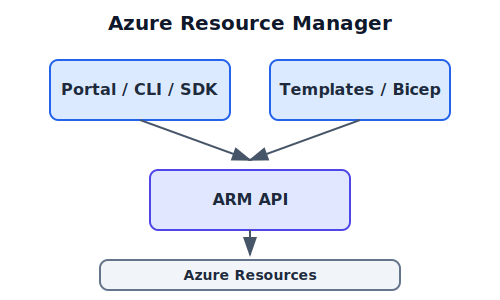

- **Spójne API** – ujednolicony mechanizm zarządzania zasobami Azure.

  Niezależnie od tego, czy korzystasz z Portalu, Azure CLI, PowerShell czy REST API, wszystkie operacje trafiają do tej samej warstwy zarządzającej. Dzięki temu działania są przewidywalne i działają tak samo w każdym narzędziu.

- **Deklaratywne wdrożenia** – możliwość opisywania infrastruktury w formie deklaratywnej, czyli definiujesz *co* ma powstać, a nie *jak to tworzyć*.  

  Azure realizuje to poprzez **ARM Templates (JSON)** oraz **Bicep**, umożliwiając automatyczne, powtarzalne i kontrolowane wdrożenia w modelu Infrastructure as Code.

        {
        "$schema": "https://schema.management.azure.com/schemas/2019-04-01/deploymentTemplate.json#",
        "contentVersion": "1.0.0.0",

        "parameters": {
            "storageAccountName": {
            "type": "string",
            "metadata": {
                "description": "Nazwa tworzonego konta Storage."
            }
            },
            "storageSku": {
            "type": "string",
            "defaultValue": "Standard_LRS",
            "allowedValues": [
                "Standard_LRS",
                "Standard_GRS",
                "Standard_ZRS",
                "Premium_LRS"
            ],
            "metadata": {
                "description": "SKU konta Storage."
            }
            }
        },

        "resources": [
            {
            "type": "Microsoft.Storage/storageAccounts",
            "2022-05-01",
            "name": "[parameters('storageAccountName')]",
            "location": "[resourceGroup().location]",
            "sku": {
                "name": "[parameters('storageSku')]"
            },
            "kind": "StorageV2",
            "properties": {
                "accessTier": "Hot"
            }
            }
        ],

        "outputs": {
            "storageAccountId": {
            "type": "string",
            "value": "[resourceId('Microsoft.Storage/storageAccounts', parameters('storageAccountName'))]"
            }
        }
        }

- **Organizacja zasobów** – możliwość nadawania zasobom struktury i zabezpieczeń.  

    Przykłady organizacji zasobów:

    - **Podziel subskrypcje** według środowisk (np. Dev / Test / Prod) lub jednostek biznesowych.
    - **Używaj Resource Groups** jako kontenerów dla jednego rozwiązania lub aplikacji — zasoby o wspólnym cyklu życia powinny być razem.
    - **Dodawaj tagi**, aby oznaczać koszty, właścicieli, środowiska i elementy automatyzacji.
    - **Dodawaj blokady (locks)**, aby chronić ważne lub krytyczne zasoby przed przypadkowym usunięciem lub zmianą.
    - **Stosuj Azure Policy**, aby wymuszać standardy organizacji, np. obowiązkowe tagi, dozwolone regiony, typy zasobów.
    - **Trzymaj się konwencji nazw**, aby zasoby były łatwe do odnalezienia, filtrowania i automatyzacji.

- **Tags** służą do dodawania metadanych (np. koszt centrum, właściciel, projekt) dla naszych zasobów,  

    Najczęstsze zastosowania:

    - **Rozliczenia i kosztorysowanie** – tagi pozwalają przypisać koszt zasobów do projektu, działu, środowiska lub zespołu. Dzięki temu raporty kosztów są czytelne i dokładne.  
    Przykłady: `CostCenter=IT01`, `Project=Ecommerce`, `Environment=Prod`

    - **Zarządzanie i porządkowanie zasobów** – ułatwiają odnajdywanie i grupowanie powiązanych elementów w dużych subskrypcjach.  
    Przykłady: `Owner=Jan.Kowalski`, `Service=BackendAPI`

    - **Automatyzacja i polityki** – tagi mogą być używane przez Azure Policy, Automation, zaplanowane skrypty i governance.  
    Przykłady: automatyczne wyłączanie maszyn z tagiem `AutoShutdown=True`

    - **Bezpieczeństwo i odpowiedzialność** – jasne wskazanie właściciela lub kontaktu sprawia, że wiadomo, kto odpowiada za utrzymanie zasobu.  
    Przykład: `OwnerEmail=devops-team@example.com`

    - **Zarządzanie cyklem życia** – tagi mogą określać datę wygaśnięcia, przeglądu lub planowanego usunięcia.  
    Przykład: `ExpiryDate=2026-06-30`

- **Locks** (`Delete` / `ReadOnly`) chronią zasoby przed przypadkowym usunięciem lub modyfikacją, co jest kluczowe w utrzymaniu porządku i bezpieczeństwa w środowisku.

    **Po co?**  
    Aby chronić zasoby przed przypadkowym usunięciem lub zmianą.

    **Rodzaje blokad:**
    - **Delete** – uniemożliwia usunięcie zasobu; konfigurację nadal można zmieniać.  
    - **ReadOnly** – blokuje usuwanie i jakiekolwiek modyfikacje; zasób działa tylko w trybie odczytu.

    **Gdzie można je stosować?**
    - na poziomie: **subscription**, **resource group**, **resource**
    - blokady dziedziczą się w dół (lock na RG obejmuje wszystkie zasoby w środku)

    **Kto może je zdjąć?**
    - tylko role uprzywilejowane (np. **Owner**)

    **Kiedy stosować?**
    - zasoby krytyczne (produkcyjne sieci, Key Vault, Storage z backupami)  
    - elementy, których nie wolno usuwać ani zmieniać

    **Dlaczego to ważne?**  
    Locki chronią środowisko przed błędami administratorów i pipeline’ów automatyzacji — zapewniają porządek i bezpieczeństwo operacyjne.

---

## 3. Compute Services (Usługi obliczeniowe)

- **Virtual Machines (VM)**  

    Elastyczne maszyny wirtualne w wielu seriach (B, Dv5/Ev5, pamięciochłonne, obliczeniowe, GPU).  
    Obsługują **managed disks**, **VM Extensions** i dowolne systemy operacyjne.

    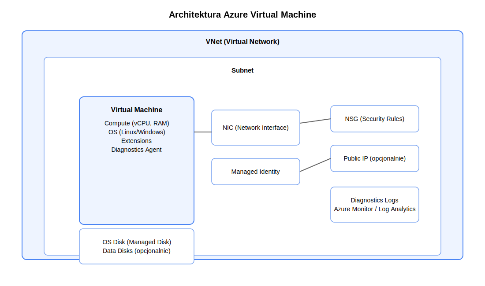

    **Managed disks** czyli niezawodne dyski zarządzane dla maszyny virtualnej.

    **VM Extensions** czyli dodatki instalowane w VM, które automatyzują konfigurację.

- **Availability Sets**  

    Zapewniają odporność na awarie dzięki podziałowi na **Fault Domains** i **Update Domains**.  
    Chronią przed skutkami awarii sprzętu oraz planowanych aktualizacji.

    

    **Fault Domains** czyli niezależne fizyczne strefy (różne racki, zasilanie, sieć).  

    **Update Domains** czyli logiczne grupy aktualizacji, restartowane osobno.

    - **VM Scale Sets (VMSS)**  

    **VM Scale Sets** to usługa umożliwiająca automatyczne uruchamianie, skalowanie i zarządzanie wieloma identycznymi maszynami wirtualnymi (VM). Wszystkie instancje oparte są na jednym *modelu* konfiguracji, co zapewnia spójność środowiska przy dużej skali.

    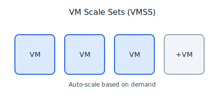

  - **Autoscaling** – automatyczne zwiększanie lub zmniejszanie liczby VM na podstawie metryk (CPU, RAM, Queue Length, HTTP load) lub harmonogramów.

    - **Rolling Upgrades** – bezpieczne wdrażanie aktualizacji poprzez stopniową wymianę instancji (grupami – Update Domains), bez przestojów całego systemu.

    - **Load Balancer Integration** – natywne połączenie z Azure Load Balancer lub Application Gateway, które równomiernie rozdzielają ruch na instancje.

    - **Instance Model (VM Template)** – wzorzec definiujący obraz systemu (image), rozmiar VM, dyski, konfiguracje sieciowe, rozszerzenia i bootstrap (cloud-init/UserData).

    - **High Availability** – instancje automatycznie rozkładane są między **Fault Domains / Update Domains**, zwiększając odporność na awarie.

    - **Orchestracja** – dwa tryby:  
            - *Uniform* (domyślny): wszystkie VM są identyczne i zarządzane centralnie.  
            - *Flexible*: większa elastyczność, np. do scenariuszy z różnymi typami VM lub strefami dostępności (AZ).

    VMSS pozwala budować skalowalne, wysoko dostępne farmy serwerów opartych o identyczne VM, z automatycznym balansowaniem obciążenia i kontrolowanymi aktualizacjami.

- **App Service**  

    Zarządzana platforma do uruchamiania aplikacji Web, API i Mobile — bez konieczności zarządzania infrastrukturą.  

    

    Umożliwia łatwe wdrażanie aplikacji, obsługuje **deployment slots**, integruje się z CI/CD  
    (GitHub Actions, Azure DevOps) i zapewnia automatyczne skalowanie instancji w zależności od obciążenia.

- **Azure Functions**

    **Serverless compute** uruchamiany „na żądanie” — kod wykonuje się tylko wtedy, gdy pojawi się zdarzenie, a Ty płacisz wyłącznie za czas wykonania.
   
    Funkcje działają w planach **Consumption** (auto‑skalowanie, płatność za wykonania) oraz **Premium** (stałe instancje, VNET, dłuższe timeouty), obsługując dziesiątki triggerów i bindingów.

    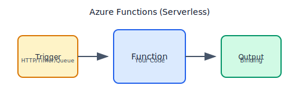

    - **Triggers** – zdarzenia uruchamiające funkcję (np. HTTP, Timer, Queue, Service Bus, Blob, Event Grid).

    - **Input/Output Bindings** – deklaratywne powiązania z usługami Azure, bez pisania boilerplate (np. zapis do Blob Storage albo pobranie wiadomości z Queue).

    - **Function App** – kontener logiczny grupujący funkcje, ich konfigurację, connection strings i runtime.

    - **Host.json** – konfiguracja środowiskowa, retry, batch size, integracje.

    - **Application Settings** – klucze, connection stringi, konfiguracja runtime.

    - **Monitoring** – wbudowana integracja z Application Insights.

    Azure Functions = event‑driven + serverless + automatyczne skalowanie + bogaty ekosystem triggerów i bindingów.

    **Rodzaje**:
    - **Standard** functions
        - Brak stanu (Stateless)
        - Krótki stan działania
        - Brak koordynacji, ręczna koordynacja
        - Brak wbudowanego retry
        - Brak natywnego wsparcia dla workflow
    - **Durable** functions
        - Stan zapisywany automatycznie
        - Mogą działać długo
        - Wbudowany orhciestrator
        - Automatyczne retry
        - Wzorce workflow (chaining, fan-in.out)
              - **Function Chaining** - wykonywanie funkcji jednej po drugiej w łańcuchu (wynik wykonania poprzedniej funkcji jest wejściem do następnej) np. ValidateOrder -> ChargePayment -> PrepareShipment -> SendConfirmation (orchestrator pilnuje kolejności         wykonania funkcji w łańcuchu jednej po drugiej)
              - **FAN-IN** - wzorzec, który czeka aż wszystkie funkcje się zakończą i łączy ich wynik (agregacja) 
              - **FAN-OUT** - to wzorzec pozwalający uruchomić wiele funkcji równolegle (np. przetwarzanie wielu plików na raz)
              
      Durable Functions mają gotowe mechanizmy do budowania złożonych, wieloetapowych, równoległych i długotrwałych workflow, bez konieczności implementowania własnej logiki kolejek, retry, czekania czy przechowywania stanu.

- **Azure Container Instances (ACI)**  

    Azure Container Instances to najszybszy sposób uruchamiania kontenerów w Azure bez potrzeby tworzenia lub zarządzania klastrem Kubernetes.

    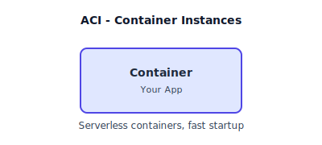

    Idealne do krótkotrwałych, jednorazowych lub prostych workloadów — batch jobs, API workers, testów, automatyzacji.

    Kluczowe cechy:
    - start kontenera w kilka sekund (bez orkiestracji)
    - płatność tylko za czas działania CPU/RAM kontenera
    - obsługa obrazów z Azure Container Registry (ACR) i Docker Hub
    - wsparcie dla sidecar containers i grup kontenerów (Container Groups)
    - integracja z VNet (opcjonalnie)
    - idealne do: jobów, event-driven tasks, ETL, automatyzacji, szybkich micro‑API

- **AKS (Azure Kubernetes Service)**  

    Zarządzany Kubernetes w Azure, który automatyzuje większość złożonych zadań administracyjnych — takich jak aktualizacje węzłów, skalowanie, bezpieczeństwo i integracja z ekosystemem Azure.  

    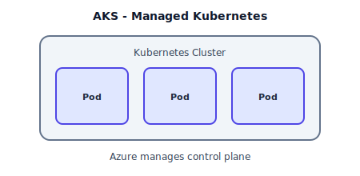

    Umożliwia uruchamianie kontenerów w modelu produkcyjnym bez konieczności samodzielnego zarządzania control plane.
    
    **Kluczowe elementy AKS:**
    - **Zarządzany control plane** – Kubernetes API server, scheduler, controller manager utrzymywane przez Azure.
    - **Node Pools (agent nodes)** – węzły robocze, na których działają pody (VM‑ki w tle).
    - **Autoscaling** – Cluster Autoscaler (CA) + Horizontal Pod Autoscaler (HPA).
    - **Integracja z ACR** – bezpośrednie pobieranie obrazów kontenerów z Azure Container Registry.
    - **Network model** – Kubenet lub Azure CNI (pełna integracja z VNet).
    - **Load Balancing** – automatyczne tworzenie Load Balancera dla usług typu LoadBalancer.
    - **AKS Add‑ons** – monitoring, logi, Application Gateway Ingress, Azure Policy, KEDA.
    - **Bezpieczeństwo** – MSI, Azure RBAC, políticas, OIDC, secret store CSI driver.

    **AKS** to w pełni zarządzany Kubernetes + automatyczne aktualizacje + skalowanie + integracje Azure (ACR, VNet, RBAC).

- **Azure Bastion**  

    Azure Bastion umożliwia bezpieczne połączenia RDP i SSH do maszyn wirtualnych **bez potrzeby wystawiania publicznych adresów IP**.  

    

    Działa przez przeglądarkę (HTML5), minimalizuje powierzchnię ataku, usuwa konieczność otwierania portów 3389/22. 

    Zapewnia dostęp w pełni przez sieć prywatną (VNet).

---

## 4. Networking (Sieci i łączność)

---

### **VNet / Subnets / UDR**

Podstawowa sieć prywatna w Azure – kontrola adresacji, segmentacji oraz tras statycznych (UDR) do kierowania ruchu.

- **VNet (Virtual Network)**  
  Logiczna sieć prywatna w Azure, działająca podobnie do klasycznej sieci LAN.  
  Umożliwia pełną kontrolę nad adresacją IP, komunikacją między zasobami, integracją z siecią on‑prem oraz izolacją środowisk.

- **Subnets**  
  Podział VNet na mniejsze logiczne segmenty w celu separacji usług, zwiększenia bezpieczeństwa i kontroli dostępu.  
  Pozwalają przypisywać różne NSG, UDR i zasady per segment, np. subnet „App”, „DB”, „Gateway”.

- **UDR (User Defined Routes)**  
  Niestandardowe trasy wymuszające kierowanie ruchu przez określone urządzenia, np. firewall NVA.

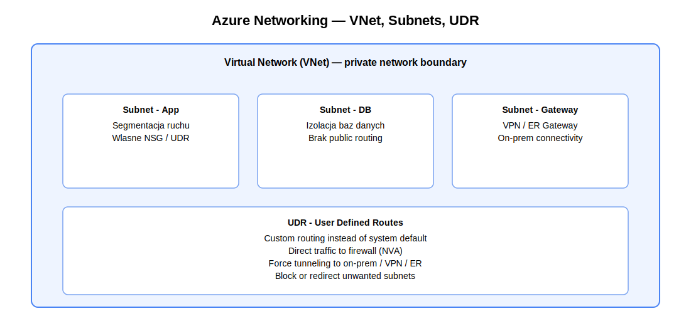

Najczęstsze zastosowania:
- kierowanie ruchu przez firewall (NVA / Azure Firewall)  
- wymuszenie ruchu między subnetami  
- tunelowanie ruchu do on‑prem / VPN / ExpressRoute  
- blokowanie lub przekierowanie wybranych sieci

---

### **NSG (Network Security Groups)**

Podstawowy firewall warstwy L3/L4 dla subnetów i NIC VM.

Reguły filtrują:
- źródło / cel (IP, zakres, tag),
- porty,
- protokół.

> NSG działa jak ACL – pozwala / blokuje ruch, ale go **nie inspektuje**.

---

### **ASG (Application Security Groups)**

Logiczne grupowanie VM według funkcji (App, API, DB).  
NSG może wskazywać ASG zamiast adresów IP — ułatwia to zarządzanie dynamicznymi środowiskami.

---

### **Azure Firewall**

Zarządzany firewall L3–L7:

- inspekcja ruchu aplikacyjnego,  
- FQDN filtering,  
- SNAT/DNAT,  
- polityki centralne,  
- integracja z Log Analytics.

> Azure Firewall ≠ NSG.  
> NSG = ACL, Azure Firewall = stateful firewall z inspekcją.

---

### **VNet Peering**

Bezpośrednie, szybkie połączenie dwóch VNetów **bez tuneli, NAT i VPN**.

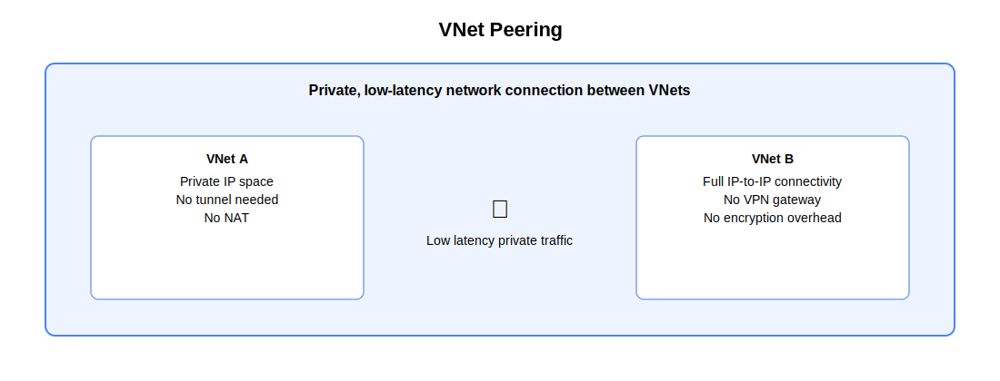

Cechy:
- komunikacja IP‑to‑IP po prywatnym backbone Azure,  
- bardzo niskie opóźnienia,  
- brak NAT,  
- globalny peering między regionami.

---

### **VPN Gateway**

Brama VPN umożliwiająca szyfrowane połączenia IPsec.

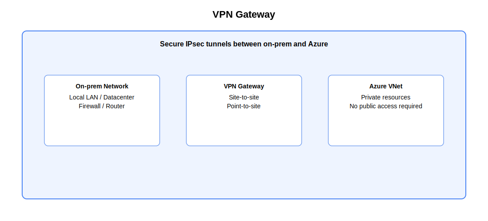

#### **Site‑to‑Site (S2S)**
- Używasz S2S, gdy chcesz połączyć całą sieć on‑prem z Azure.
- tunel router ↔ Azure (cała sieć ↔ VNet),  
- wymaga publicznego IP po stronie on‑prem.

#### **Point‑to‑Site (P2S)**  
- VPN dla pojedynczego użytkownika (OpenVPN / IKEv2 / Azure VPN Client),  
- nie wymaga infrastruktury po stronie użytkownika.

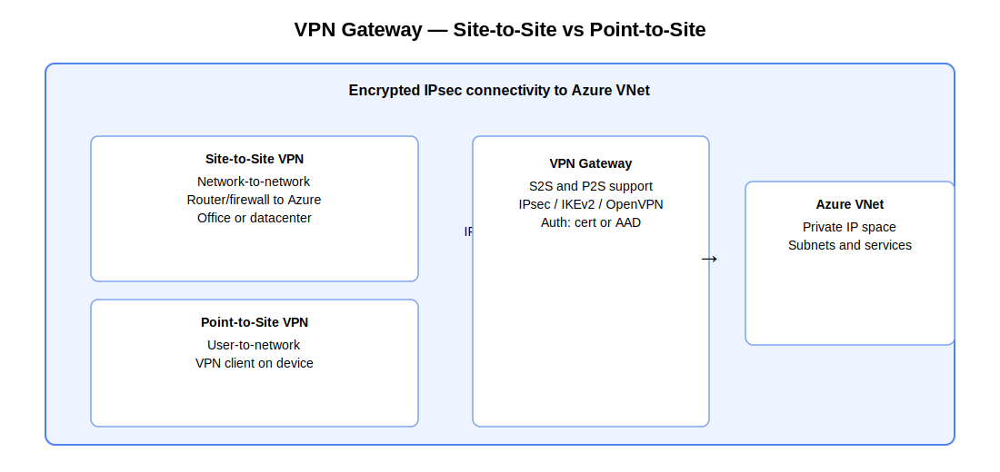

---

### **ExpressRoute**

Prywatne łącze WAN do Azure, całkowicie poza publicznym Internetem.

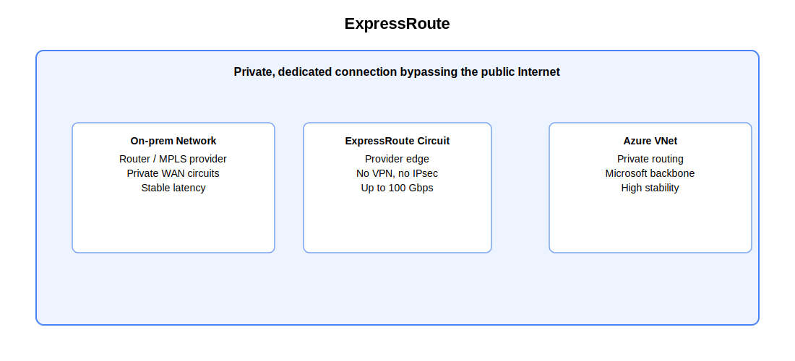

Cechy:
- 50 Mbps – 100 Gbps,  
- stabilne parametry i SLA operatorskie,  
- private peering (VNet), Microsoft peering (Microsoft 365),  
- idealny do krytycznych aplikacji i masowych migracji.
- połączenie jest prywatne ale nie szyfrowane.

Rodzaje:
- **Standard** – połączenia do regionu w tym samym obszarze geograficznym.
- **Premium** – dostęp do wszystkich regionów + większe limity VNetów/tras.

---

### **Public Endpoint / Private Endpoint / Service Endpoint**

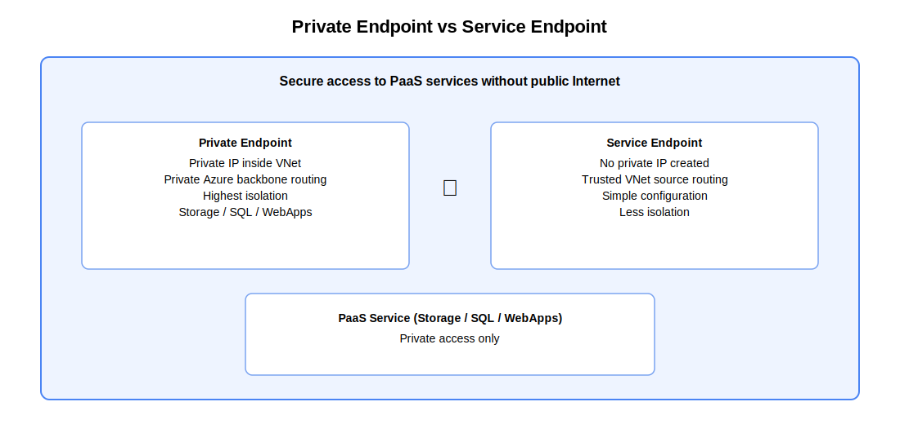

#### **Public Endpoint**
- publiczny adres IP usługi PaaS,
- dostęp przez Internet (można ograniczyć firewallami / Access Restrictions),
- brak izolacji sieciowej — ruch zawsze trafia na publiczny endpoint.

#### **Private Endpoint**
- prywatny IP w Twoim VNet (z subnetu),
- dostęp przez Azure Private Link (prywatny backbone),
- wymaga prywatnych stref DNS (privatelink.azure.com),
- najwyższy poziom izolacji (pełne odcięcie Internetu).

#### **Service Endpoint**
- nie tworzy prywatnego IP,
- ruch do PaaS przechodzi po prywatnym backbone Azure,
- nadal używa publicznego endpointu usługi,
- mniej izolacji niż Private Endpoint.

Pułapki:
- Public Endpoint + złe reguły = przypadkowe wystawienie danych do Internetu
- Private Endpoint może „schować” usługę przed światem (konieczny poprawny DNS)
- Service Endpoint nie działa cross‑tenant
- Private Endpoint blokuje publiczny dostęp przy ustawieniu Deny public network access
- Service Endpoint nie korzysta z NAT — usługa widzi regionalny adres źródłowy Azure

---

### **Public IP (Basic vs Standard)**

- **Basic**
  - brak stref AZ,  
  - mniej bezpieczne,  
  - brak SLA.

- **Standard**
  - strefowy (zone‑redundant),  
  - domyślnie „secure by default”,  
  - płatny za sam przydział.

---

### **NAT Gateway**

Zalecane rozwiązanie dla wychodzącego ruchu Internetowego (egress).

Cechy:
- jedno źródło ruchu (stały publiczny IP/prefix),  
- wysoka skalowalność (miliony SNAT),  
- lepsze niż SNAT na Load Balancer.

---

### **DDoS Protection**

- **Basic** – zawsze włączone, automatyczne.  
- **Standard** – ochrona warstw **L3/L4**: wolumetria, SYN flood, UDP flood.

> DDoS Standard nie chroni L7 — od tego jest **WAF**.

---

### **WAF (Web Application Firewall)**

Firewall L7 (HTTP/S), ochrona webowych aplikacji przed:
- OWASP Top 10,  
- botami,  
- wstrzykiwaniem,  
- anomaliami.

Dostępny jako:
- WAF on Application Gateway (regionalny),  
- WAF on Azure Front Door (globalny edge).

---

### **Load Balancing i Edge Networking**

#### **Azure Load Balancer (L4)**  

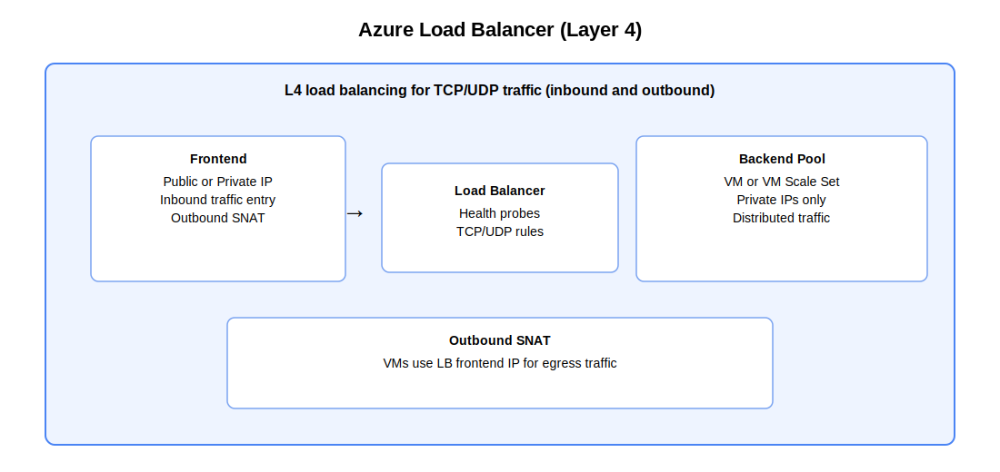

Warstwa 4 – TCP/UDP. Szybki, prosty, idealny dla VM/VMSS.

#### **Application Gateway (L7 + WAF)**  

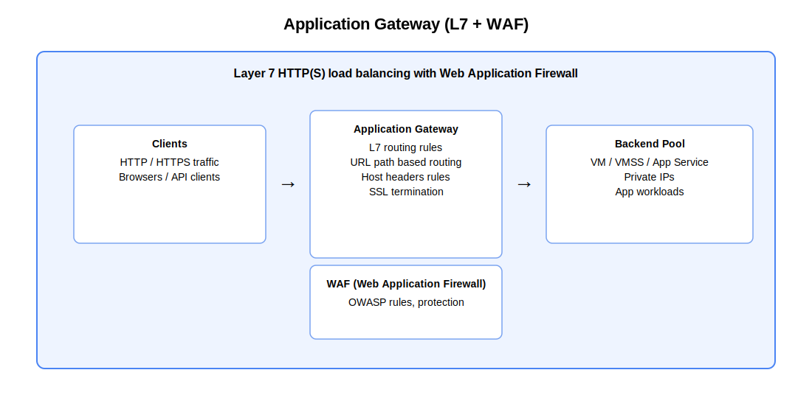

Warstwa 7 – routing HTTP/S, WAF, SSL termination, cookie affinity.

#### **Traffic Manager (DNS LB)**  

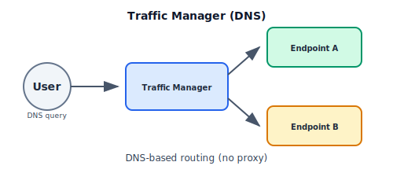

Stosowany na poziomie DNS – georouting, failover, weighted.

#### **Azure Front Door (L7 Edge)**   

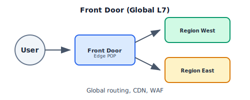

Globalny CDN + smart routing L7 + WAF na edge.

---

### **Porównanie usług LB (skrót)**

| Usługa | Warstwa | Zastosowania | Zakres |
|--------|---------|--------------|--------|
| Load Balancer | L4 | VM/VMSS, TCP/UDP | Regional |
| Application Gateway | L7 | Web apps + WAF | Regional |
| Traffic Manager | DNS | Global routing DNS | Global |
| Front Door | L7 Edge | Global web apps, WAF, caching | Global |

---

### **Network Watcher**

Narzędzia do diagnostyki:
- IP Flow Verify,  
- NSG Flow Logs,  
- Connection Troubleshoot,  
- Packet Capture.

Umożliwia analizę ruchu i debugowanie problemów sieciowych.

---

## 5. Storage (Przechowywanie danych)

**Azure Storage** to zestaw usług do przechowywania plików, obiektów, danych NoSQL oraz dysków dla maszyn wirtualnych. 

Poniżej znajdziesz jasne i zrozumiałe wyjaśnienie, czym są poszczególne typy storage, po co się ich używa oraz jak działa redundancja danych.

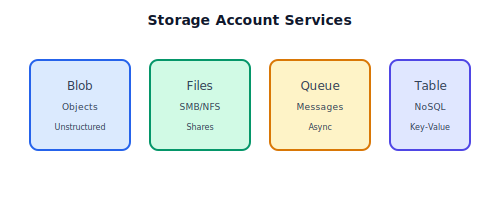

---

## **Typy danych i ich zastosowania**

**Blob Storage** (obiekty / pliki)
Najbardziej uniwersalne miejsce na duże, niestrukturalne dane.

- **Hot** najczęściej używane dane, najwyższy koszt przechowywania, najniższy koszt dostępu.
- **Cool** dane rzadziej używane (dni–miesiące).
- **Cold** dane używane bardzo rzadko (miesiące–lata), tańsze od Cool, droższe od Archive pod względem odczytu.
- **Archive** dane długoterminowe, najniższy koszt przechowywania, ale bardzo drogi i wolny odczyt (kilka godzin).

Zastosowania: kopie zapasowe, logi, obrazy, filmy, dane ML, statyczne pliki

---

**Azure Files** (udzialy sieciowe)
Chmurowy odpowiednik klasycznego Windows File Server.

- SMB/NFS udziały sieciowe  
- Azure File Sync do synchronizacji z lokalnym serwerem plików  
- Zastosowania: udziały użytkowników, zasoby współdzielone, migracje serwerów plików

**Access Tiers** dla Azure Files
Azure Files obsługuje warstwy wydajności i warstwy dostępu, podobnie jak Blob Storage — ale inaczej działające.

Warstwy wydajności (Performance Tiers):
- **Standard** (HDD/SSD) – najtańszy, idealny dla klasycznych udziałów SMB/NFS
- **Premium** (SSD) – wysoka przepustowość i niski latency (np. FSLogix, intensywne I/O)

---

**Queue Storage** (kolejki wiadomości)
Prosta, skalowalna kolejka komunikatów dla architektur event‑driven.

- komunikacja asynchroniczna między usługami  
- idealna dla mikroserwisów, workerów, batch processing

---

**Table Storage** (NoSQL key‑value)
Tania, szybka i schematless baza NoSQL do ogromnych ilości danych.

- dane w formie PartitionKey + RowKey  
- idealne dla logów, metadanych, telemetrii, konfiguracji  
- alternatywa: Cosmos DB Table API

---

**Managed Disks** (dyski dla VM)
Dyski zarządzane przez Azure, wykorzystywane przez maszyny wirtualne.

- Premium SSD — produkcja, wysokie IOPS  
- Standard SSD — solidny kompromis cena/wydajność  
- Standard HDD — archiwizacja, testy  
- Ultra SSD — bardzo wysokie IOPS i throughput  
- OS Disk / Data Disk / Temp Disk (lokalny, nietrwały)

---

## **Redundancja danych (odporność na awarie)**


**LRS — Locally Redundant Storage**
- 3 kopie danych w jednym datacenter  
- najniższy koszt  
- odporność tylko w obrębie pojedynczego DC

**ZRS — Zone Redundant Storage**
- replikacja między 3 strefami Availability Zone  
- ochrony przed awarią całej strefy  
- stabilny wybór dla środowisk produkcyjnych

**GRS — Geo Redundant Storage**
- LRS + kopia do regionu pary  
- 6 kopii danych łącznie  
- ochrona przed awarią całego regionu

**RA‑GRS — Read‑Access GRS**
- jak GRS, ale region zapasowy jest możliwy do odczytu  
- idealne dla globalnych aplikacji, które potrzebują dostępu read-only w czasie awarii

---

## **Narzędzia i migracje**

**Storage Explorer**
Narzędzie GUI do zarządzania Blob/Files/Queue/Table.

- przeglądanie i edycja danych  
- zarządzanie dostępem (SAS)  
- wygodne operacje na dużych strukturach plików  

**AzCopy**
Najszybsze narzędzie do przesyłania danych do/z Azure Storage.

- praca w CLI  
- wysoka wydajność  
- idealne do migracji dużych wolumenów

**Azure Migrate**
Aplikacje, VM‑ki i dane mogą być analizowane i migrowane do Azure.

- automatyczne rekomendacje  
- integracja z Azure Storage (np. blob staging)


**Data Box**  
Fizyczne urzadzenia Azure do przenoszenia bardzo duzych ilosci danych **offline**, bez wykorzystania Internetu.  
Stosowane wtedy, gdy lacze sieciowe jest zbyt wolne, niestabilne lub kosztowne.

- **Data Box Disk** – do ok. 40 TB; zestaw szyfrowanych dyskow SSD USB.  
  Szybkie wdrozenie, lekkie migracje, wiele lokalizacji.

- **Data Box** – do ok. 100 TB; pelne urzadzenie NAS w formie walizki.  
  Wysoka przepustowosc lokalna, SMB/NFS/REST, duze migracje danych.

- **Data Box Heavy** – do ok. 1 PB; przemyslowe urzadzenie na kolach.  
  Bardzo duze migracje (archiwa, data lakes, media), transfery wielogigabitowe.
 
---

## 6. Identity & Access (Microsoft Entra)

**Microsoft Entra ID**  
Centralny system tozsamosci w Azure i Microsoft 365. Odpowiada za uwierzytelnianie uzytkownikow, aplikacji i urzadzen. 

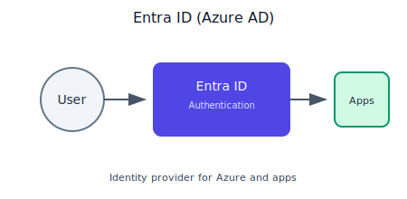
 
Kluczowe funkcje:
- **SSO (Single Sign-On)** – jedno logowanie do wielu aplikacji (SaaS, on-prem, Azure).  
- **MFA (Multi-Factor Authentication)** – dodatkowe potwierdzenie tozsamosci (aplikacja, SMS, klucz FIDO2).  
- **External Identities** – bezpieczny dostep dla partnerow/klientow bez tworzenia kont wewnetrznych.  
- **Passwordless** – logowanie bez hasla (Windows Hello, FIDO2, Phone Sign-in).  
- **Directory roles** – role administracyjne dla zarzadzania tozsamoscia.

**Jak Entra ID uwierzytelnia uzytkownika**?

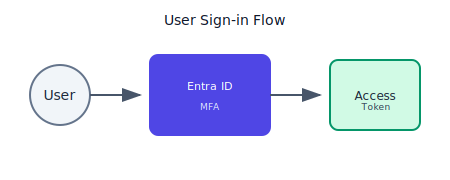

Proces logowania przebiega w kilku krokach:
1. **Identyfikacja** – uzytkownik podaje login (UPN), Entra ID ustala tenant i polityki.  
2. **Uwierzytelnienie** – haslo, passwordless (FIDO2/Hello), certyfikat lub SSO z urzadzenia.  
3. **Kontrole dostepu** (Conditional Access) – Entra ID ocenia ryzyko logowania, lokalizacje, stan urzadzenia, zgodnosc z politykami oraz wymaga MFA jesli to konieczne.  
4. **Wydanie tokenow** – po pozytywnym potwierdzeniu wydawane sa ID Token, Access Token i Refresh Token (OAuth2/OIDC), ktore aplikacje wykorzystuja do autoryzacji.

**Access Token** i **ID Tokeny** wygasają **po 1 godzinie**, a **Refresh Token** po **maksymalnie 90 dniach** — chyba że wcześniej przestanie być używany lub polityki bezpieczeństwa wymuszą ponowne logowanie.

**Jak uwierzytelniane sa aplikacje?**

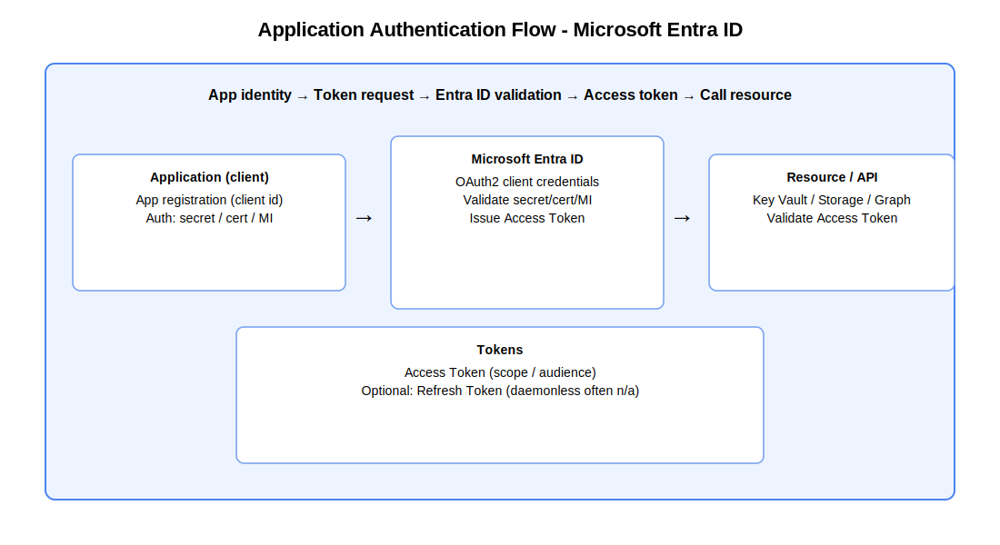

Aplikacje korzystaja z wlasnej tozsamosci aplikacyjnej:
- sekret klienta,  
- certyfikat,  
- lub **Managed Identity** (najbardziej bezpieczny model, bez sekretow).  

**Managed Identity** to mechanizm nadawania aplikacjom tozsamosci zarzadzanej w pelni przez Azure — bez sekretow, bez hasel, bez certyfikatow.  

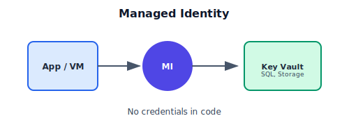

**Jak dziala Managed Identity**:
- aplikacja nie przechowuje żadnych sekretów ani kluczy  
- uwierzytelnia sie poprzez lokalny endpoint MSI dostepny tylko wewnatrz uslugi  
- Azure potwierdza, ze aplikacja ma tozsamosc MI oraz sprawdza jej role RBAC  
- Entra ID wystawia **Access Token** dla konkretnej uslugi  
- aplikacja dodaje token: `Authorization: Bearer <token>` i laczy sie z zasobem

**Rodzaje Managed Identity**:
- **System-assigned** – tożsamość jest związana z jednym zasobem; tworzy sie sama i znika wraz z zasobem.  
- **User-assigned** – osobny zasób tożsamości, który można przypisac do wielu aplikacji; bardziej elastyczne.

Aplikacja uwierzytelnia sie w Entra ID, a nastepnie otrzymuje **Access Token** do zasobów takich jak Storage, Key Vault, SQL, Event Hub itd.

**Jak uwierzytelniane sa urzadzenia?**

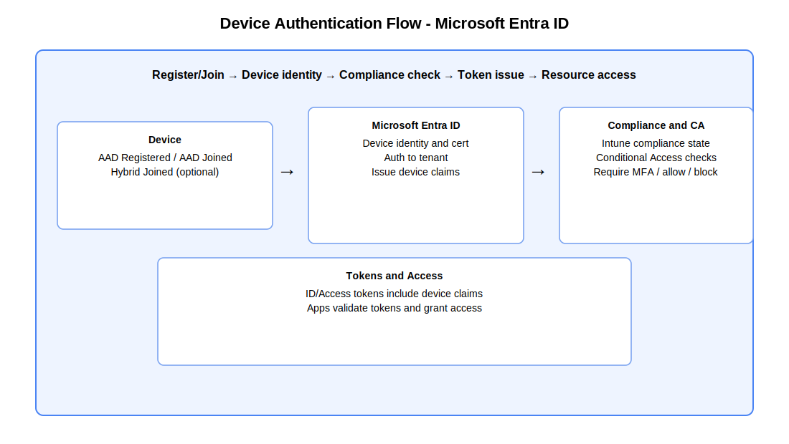

Urzadzenia moga byc:
- Azure AD Registered (BYOD),  
- Azure AD Joined (urzadzenia firmowe),  
- Hybrid Joined (AD on‑prem + Entra ID).  

Entra ID sprawdza:
- czy urzadzenie jest zapisane w katalogu,  
- czy jest zgodne (Intune compliance),  
- czy spelnia polityki bezpieczenstwa organizacji.  

Dzieki temu mozliwe jest SSO, wymuszanie MFA, lub blokada dostepu dla niezaufanych urzadzen.

---

**RBAC (Role-Based Access Control)**  
Mechanizm autoryzacji w Azure oparty na rolach przypisywanych do okreslonych zakresow zasobow (scope).  
Umozliwia precyzyjne kontrolowanie, kto co moze zrobic w danym zasobie — zgodnie z zasada least privilege.

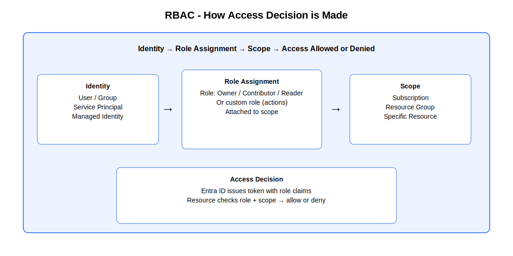

Najwazniejsze elementy:

- **Role wbudowane**  
  Podstawowe role obejmuja:  
  - **Owner** – pelna administracja zasobami + zarzadzanie dostepem  
  - **Contributor** – pelna administracja zasobami, ale bez nadawania uprawnien  
  - **Reader** – tylko odczyt  

  Dodatkowo istnieja setki **ról specjalistycznych**, np. Storage Blob Reader, Key Vault Secrets Officer, Virtual Machine Contributor.

- **Custom roles**  
  Gdy role wbudowane sa zbyt szerokie, mozna tworzyc role **niestandardowe** oparte na pojedynczych akcjach (actions / notActions), 
  np. tylko „odczyt sekretow Key Vault” lub „restart VM bez mozliwosci kasowania”.

- **Scope (zakres) i dziedziczenie**  
  Scope definiuje, do czego rola ma zastosowanie:  
  - **Subscription** → dziedziczy na wszystkie Resource Groups i zasoby  
  - **Resource Group** → dziedziczy na zasoby w tej grupie  
  - **Resource** → dotyczy tylko jednego zasobu  
  Uprawnienia przypisane wyzej **zawsze dziedzicza w dol**, dlatego zaleca sie przypisywanie ról na mozliwie najnizszym poziomie.

- **Model decyzyjny**  
  Jeżeli uzytkownik ma wiele ról w danym scope, sumuja sie one (model additive).  
  Blokady resource lock **nie sa** elementem RBAC — dzialaja oddzielnie.

- **Zastosowania mechanizmu RBAC**  
  RBAC jest kluczowe dla bezpieczenstwa:  
  - ogranicza nadmiarowe uprawnienia  
  - zapewnia podzial obowiazkow (SoD)  
  - precyzyjnie definiuje, kto moze zarzadzac Storage, VM, SQL, App Service, Key Vault itd.  
  - integruje sie z **Managed Identity**, dzięki czemu aplikacje rowniez korzystaja z RBAC zamiast sekretow

---

**Conditional Access**
Mechanizm kontroli dostepu, ktory ocenia kontekst logowania i decyduje, czy uzytkownik powinien uzyskac dostep, zostac zablokowany, czy wykonac dodatkowa akcje (np. MFA).  

Jest to kluczowy element modelu **Zero Trust — zasada: „never trust, always verify”**.

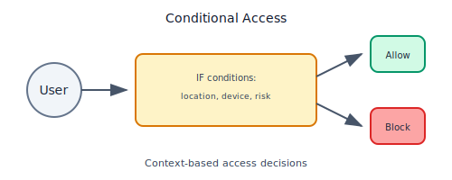

**Kluczowe atrybuty oceniane podczas logowania:**
- **Ryzyko logowania / ryzyko uzytkownika** – wykrywanie anomalii, podejrzanych lokalizacji, nietypowych zachowan.  
- **Lokalizacja** – kraje, zakresy IP, sieci zaufane, VPN, corporate network.  
- **Stan urzadzenia** – zgodnosc z Intune (compliant / non-compliant), typ OS, poziom zabezpieczen.  
- **Typ aplikacji i klienta** – przegladarka, aplikacja mobilna, desktopowa, klient legacy, API.  
- **Typ zasobu** – niektore aplikacje lub API moga wymagac mocniejszych zasad.  

**Dzialania (akcje) podejmowane przez zasady:**
- **Wymuszenie MFA** – dodatkowy czynnik potwierdzenia tozsamosci.  
- **Blokada dostepu** – gdy ryzyko jest zbyt duze lub warunki nie sa spelnione.  
- **Wymuszenie zgodnego urzadzenia** – tylko urządzenia spełniające wymagania Intune.  
- **Wymuszenie sesji bezhaslowej** – logowanie passwordless.  
- **Sesje z ograniczeniami** – np. zakaz pobierania plikow (MCAS/Defender for Cloud Apps).  

---

**PIM (Privileged Identity Management)**  
Mechanizm nadawania uprawnien administracyjnych na zasadzie JIT (Just‑In‑Time).

Najwazniejsze funkcje:
- Tymczasowa aktywacja roli tylko na okres wykonywanych zadan.  
- Wymuszenie uzasadnienia, zgody (approval) lub MFA przed nadaniem roli.  
- Audyt aktywacji, notyfikacje i alerty.  
- Minimalizacja ryzyka naduzyc przez stale podniesione uprawnienia.

---

**Managed Identities**  
Tozsamosc systemowa dla aplikacji dzialajacych w Azure — bez kluczy, bez hasel, bez sekretow.  

Zastosowania:
- Dostep aplikacji do Azure Storage, Key Vault, SQL, Event Hub itp.  
- Obsluga wbudowana w uslugi Azure (VM, App Service, Functions, Logic Apps).  
- Kluczowe korzysci:
  - automatyczne zarzadzanie tozsamoscia przez Azure  
  - brak potrzeby przechowywania i rotowania sekretow  
  - zgodnosc z Zero Trust  

Rodzaje:
- **System-assigned** – tozsamosc przypisana do jednego zasobu  
- **User-assigned** – tozsamosc tworzona jako oddzielny zasob, wspoldzielona miedzy aplikacjami

---

## 7. Security (Bezpieczeństwo)

- **Microsoft Defender for Cloud**  
  Kompleksowa platforma zabezpieczeń chmurowych zapewniająca:
  - **Secure Score** – miernik poziomu bezpieczeństwa środowiska z rekomendacjami działań naprawczych.
  - **Rekomendacje bezpieczeństwa** – zalecenia dot. konfiguracji, podatności i zgodności ze standardami (CIS, NIST, ISO).
  - **Ochrona obciążeń (Cloud Workload Protection):**
    - **VM** – wykrywanie zagrożeń, analiza zachowań, agentless scanning.
    - **Bazy danych** – ochrona SQL/PostgreSQL/MySQL, wykrywanie anomalii.
    - **Storage** – skanowanie pod kątem malware, identyfikacja niepoprawnych konfiguracji.
  - **Defender for Containers** – analiza obrazów, runtime protection, integracja z AKS.
  - **Defender for APIs** – wykrywanie ryzyk i nadużyć API.

- **Key Vault**  
  Bezpieczne przechowywanie i zarządzanie:
  - **Secrets** – hasła, tokeny, connection stringi.
  - **Keys** – klucze kryptograficzne do szyfrowania i podpisywania.
  - **Certificates** – pełny cykl życia certyfikatów, automatyczne odnowienia.
  - **HSM (Managed HSM)** – sprzętowe moduły kryptograficzne FIPS 140-2 Level 3.

- **DDoS Protection**  
  Ochrona przed atakami DDoS:
  - **Basic** – automatyczna ochrona dla wszystkich usług publicznych Azure.
  - **Standard** – zaawansowana ochrona (L3–L7), adaptacyjne profile ruchu, automatyczne łagodzenie, alerty, raporty, **DDoS Rapid Response (DRR)** oraz SLA finansowe.

- **WAF (Web Application Firewall)**  
  Ochrona aplikacji webowych przed atakami (OWASP Top 10):
  - **Application Gateway WAF** – filtrowanie L7, Managed/Custom Rules, bot protection, TLS termination.
  - **Azure Front Door WAF** – globalna ochrona na edge, rate limiting, szybkie reagowanie.
  - Wspólne polityki, integracja z Log Analytics i Sentinel.

---

## 8. Governance & Compliance

Governance w Azure to **zestaw zasad i narzędzi**, które pomagają utrzymać porządek, bezpieczeństwo i kontrolę nad zasobami w chmurze.

### Azure Policy

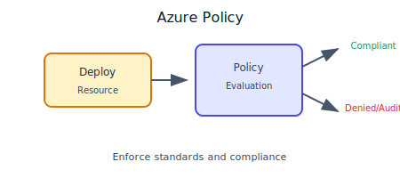

Mechanizm wymuszający zgodność konfiguracji zasobów z wymaganiami organizacji.

- **Policy Definition** – pojedyncza reguła (np. „wymagaj tagu Environment”, „blokuj publiczne IP”).
- **Policy Initiative** – zestaw wielu reguł grupowanych w standardy (np. CIS, NIST, ISO, Zero Trust).

#### Effects (działania polityk)
- **Deny** – blokuje wdrożenie **(Owner również nie może ominąć Deny)**.
- **Audit** – oznacza zasób jako niezgodny, ale nie blokuje wdrożenia.
- **Append** – dodaje brakujące właściwości (np. tagi).
- **Modify** – automatycznie poprawia konfigurację podczas wdrażania.
- **DeployIfNotExists** – tworzy brakujące zasoby towarzyszące (np. diag settings).

#### Exemptions (wyjątki)
Tymczasowe wyłączenie polityki dla wybranego scope — bez jej usuwania.  
Stosowane w okresach migracji, wyjątkach biznesowych lub scenariuszach legacy.

#### Remediation Tasks
Automatyczne zadania naprawcze działające na istniejących zasobach:
- poprawiają konfigurację (Modify),
- doinstalowują wymagane elementy (DeployIfNotExists).

#### Scope i dziedziczenie
Management Group → Subscription → Resource Group → Resource  
(polityki dziedziczą się **wyłącznie w dół**)

---

### Resource Locks


Zabezpieczają zasoby przed przypadkowym usunięciem lub edycją.

- **Delete** – blokada usunięcia zasobu.
- **ReadOnly** – blokada usunięcia i modyfikacji (tylko odczyt).

Stosowane szczególnie dla:
- Key Vault,  
- Storage (backupy),  
- VNet / Firewall,  
- Log Analytics Workspace.

---

### Tags

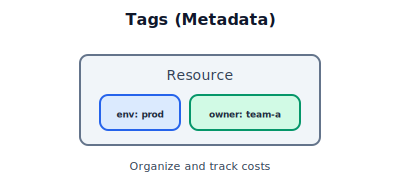

To specjalne **metadane** przypisywane do zasobów w celu:
- mają klucz i wartość
- **maksymalnie 50 tagów** na resource
- organizacji i klasyfikacji (Environment, Owner, Project),
- chargeback/showback (koszty per projekt/dział),
- automatyzacji (np. auto‑shutdown),
- wymuszania governance (Azure Policy może wymagać tagów).

Ważne!
- Management Groups **nie mogą mieć** tagów.

---

### Azure Blueprints

Blueprint pozwala w jednym, powtarzalnym procesie stworzyć całe środowisko Azure zgodne ze standardami organizacji — od zasad i uprawnień po strukturę zasobów.


Pakiet governance łączący:
- Azure Policy,  
- RBAC,  
- ARM/Bicep templates,  
- strukturę Resource Groups,

w jedno spójne, powtarzalne środowisko (np. Landing Zone).

Idealne dla enterprise i audytowalnych wdrożeń.

Uwaga!
- Obecnie Blueprints są przestarzałe i teraz zaleca się używania **Azure Landing Zones** + Bicep/ARM + Policy + GitOps.

**Azure Landing Zones (ALZ)** to kompletna, gotowa architektura i zestaw najlepszych praktyk, które pozwalają szybko i poprawnie zbudować bezpieczne, skalowalne środowisko chmurowe zgodne z CAF.

---

### Azure Arc

**Azure Arc** to usługa, która pozwala zarządzać serwerami, Kubernetesem i usługami działającymi poza Azure tak, jakby były natywnymi zasobami Azure.


Rozszerza Azure na środowiska:
- on‑premise,  
- multi‑cloud,  
- edge.

Umożliwia:
- nakładanie Azure Policy poza Azure,  
- zarządzanie serwerami, Kubernetes, SQL spoza Azure,  
- zbieranie logów/telemetrii z różnych środowisk,  
- utrzymanie spójnego governance.

---

### Shared Responsibility Model


Podział odpowiedzialności między Azure a klientem.

#### Azure odpowiada za:
- fizyczną infrastrukturę (DC, sieć, hypervisor),
- platformę PaaS oraz jej aktualizacje,
- dostępność usług i SLA,
- bezpieczeństwo warstw poniżej OS (w modelu PaaS).

#### Klient odpowiada za:
- tożsamość i dostęp (MFA, CA, RBAC, PIM),
- dane (szyfrowanie, backup, klasyfikacja),
- konfiguracje usług (NSG, firewall, KV access),
- bezpieczeństwo aplikacji,
- rotację kluczy, SAS, tokenów,
- aktualizacje OS w VM (IaaS).

---

### Service Trust, Compliance i Rezydencja Danych

**Service Trust Portal** służy do szybkiego sprawdzania, jak Microsoft spełnia wymagania bezpieczeństwa i zgodności, co ułatwia audyty i ocenę ryzyka.


- **Microsoft Service Trust Portal** – raporty zgodności (ISO, SOC, PCI), audyty, certyfikaty.
- **Data Residency (rezydencja danych)** – dane pozostają w wybranej geografii (np. EU).
- **Azure Government / Azure China** – suwerenne regiony dla wymagań regulacyjnych.

---

### Well‑Architected Framework (WAF – 5 filarów)


1. **Cost Optimization** – eliminacja marnotrawstwa, right‑size, automatyzacja kosztów.  
2. **Operational Excellence** – automatyzacja, CI/CD, versioning, monitoring.  
3. **Performance Efficiency** – wybór właściwych usług, autoscaling, cache.  
4. **Reliability** – HA, DR, self‑healing, multi‑zone/multi‑region.  
5. **Security** – Zero Trust, least privilege, szyfrowanie, segmentacja.

---

### Cloud Adoption Framework & Landing Zone

**CAF** obejmuje:
- strategię i uzasadnienie biznesowe,  
- plan migracji,  
- przygotowanie organizacji,  
- governance (Policy, RBAC, MG),  
- operacje (monitoring, DevOps).

**Landing Zone** = gotowy wzorzec środowiska produkcyjnego:
- hierarchia Management Groups,
- polityki bezpieczeństwa,
- sieć hub/spoke,
- RBAC baseline,
- logowanie i monitoring,
- zgodność z CAF i WAF.

---

## 9. Monitoring & Logging

- **Azure Monitor**
  Centralna platforma monitoringu w Azure, która zbiera, przechowuje, analizuje i wizualizuje dane operacyjne z zasobów.
  
  - **Metrics (metryki czasowe)**
    Dane numeryczne zbierane w krótkich odstępach czasu (np. CPU %, pamięć, IOPS, opóźnienia).
    - przeznaczone do szybkiej analizy trendów,
    - idealne do alertów w czasie zbliżonym do rzeczywistego,
    - przechowywane w wysokiej rozdzielczości (1-minutowe interwały).

  - **Logs (KQL / Log Analytics)**
    Dane o wysokiej szczegółowości zapisywane w Log Analytics Workspace.
    - logi strukturalne i niestandardowe,
    - analiza poprzez **Kusto Query Language (KQL)**,
    - możliwość łączenia danych z wielu usług,
    - fundament dla Security, Monitoring, Governance.

  - **Alerts**
    Mechanizm powiadamiania o problemach, oparty na:
    - metrykach (np. CPU > 80% przez 5 min),
    - zapytaniach KQL (np. błędy 500 w ostatnich 10 minutach),
    - logach aktywności, logach zasobów,
    - integracji z Action Groups (e-mail, Teams, webhook, ITSM).

- **Azure Advisor**

**Azure Advisor** to wbudowany doradca dla platformy Azure, analizujący środowisko pod kątem najlepszych praktyk Microsoft i generujący konkretne rekomendacje dotyczące optymalizacji kosztów, wydajności, bezpieczeństwa, niezawodności i operacyjności.


### Kategorie rekomendacji
- **Cost** – redukcja kosztów (right-size, wyłączanie nieużywanych zasobów, Reserved Instances, Azure Hybrid Benefit).  
- **Security** – rekomendacje z Defender for Cloud zwiększające poziom zabezpieczeń.  
- **Reliability** – wskazówki dotyczące wysokiej dostępności, redundancji, odporności i usunięcia SPOF.  
- **Operational Excellence** – automatyzacja, kopie zapasowe, poprawa procesów operacyjnych.  
- **Performance** – optymalizacja wydajności (autoscale, właściwe SKU, zwiększanie przepustowości).

### Przykładowe rekomendacje
- Zmniejszenie przewymiarowanych VM lub wyłączanie ich poza godzinami pracy.  
- Dodanie redundancji (np. wdrożenia w wielu strefach AZ).  
- Migracja storage do wydajniejszych SKU (np. Premium SSD).  
- Dodanie tagów wymaganych przez governance.  

Azure Advisor jest narzędziem **proaktywnym**, często wskazywanym na egzaminie AZ‑900 jako źródło rekomendacji dotyczących kosztów, bezpieczeństwa, wydajności oraz utrzymania środowiska.

- **Service Health**
  Informacje o stanie platformy Azure dotyczące:
  - trwających incydentów,
  - planowanych prac konserwacyjnych,
  - degradacji usług w wybranych regionach.
  Można konfigurować alerty na awarie wpływające na konkretne zasoby.

- **Activity Log**
  Log operacyjny na poziomie subskrypcji, zawierający:
  - **kto** wykonał operację,
  - **co** zmieniono,
  - **kiedy** i **z jakiego źródła**,
  - dotyczy głównie operacji ARM (tworzenie/usuwanie/aktualizacje zasobów).
  Jest podstawą audytów i analizy zmian.

- **Resource Logs**
  Szczegółowe logi działania konkretnych usług (np. Storage Access Logs, Key Vault Audit Logs).
  - wymagają włączenia **Diagnostic Settings**,
  - można je wysłać do:
    - Log Analytics Workspace,
    - Event Hub,
    - Storage Account,
  - pozwalają analizować zachowanie aplikacji, ruch, błędy, opóźnienia, dostęp.

- **Workbooks**
  Zaawansowane interaktywne dashboardy:
  - łączą wizualizacje, tekst, parametry, zapytania KQL,
  - nadają się do tworzenia raportów operacyjnych, security, SRE/DevOps,
  - w pełni konfigurowalne (heatmapy, wykresy, tabele, integracja z Azure Monitor).

---

## 10. Costs & Billing (Koszty i rozliczenia)

**Za co płacisz w Azure:**
- **Compute (czas działania)**  
  Opłaty za czas pracy zasobów obliczeniowych (VM, App Service, AKS node pools, Functions).  
  Rozliczanie zwykle „pay‑as‑you‑go” — za sekundę lub minutę działania.

- **Storage (GB / miesiąc)**  
  Koszt zależny od ilości przechowywanych danych oraz liczby operacji.  
  Uwzględnia typ przestrzeni dyskowej (Hot / Cool / Archive), replikację (LRS/ZRS/GRS) oraz transakcje.

- **Egress sieci (wyjście z Azure)**  
  Dane *opuszczające* Azure — np. wysyłane do Internetu, do lokalnego datacenter lub między regionami.  
  To jedno z najczęstszych „ukrytych” źródeł kosztów, bo transfer wychodzący jest **zawsze płatny**.

- **Ingress sieci (wejście do Azure)**  
  Dane *wchodzące* do Azure — np. upload plików, dane z on‑prem, ruch przychodzący z Internetu.  
  **Ingress jest zawsze darmowy**, bez ograniczeń.  
  W praktyce: za pobieranie z Azure płacisz, za wysyłanie do Azure — nie.

- **Licencje**  
  Płatne modele licencji dla Windows Server, SQL Server, RedHat, SUSE, a także usług takich jak Defender.  
  Rozliczane per rdzeń, instancję lub użytkownika.

---

### **Optymalizacja kosztów:**

- **Reservations (1 lub 3 lata)**  
  Rezerwacje na VM, SQL, Cosmos DB i inne usługi.  
  Oszczędność 40–70% — idealne dla stabilnych workloadów produkcyjnych.

- **Spot VMs**  
  Tanie VM działające, gdy dostępna jest wolna moc obliczeniowa.  
  Mogą zostać przerwane — dobre do batch jobs, CI/CD, symulacji, renderingu.

- **Azure Hybrid Benefit (AHB)**  
  Możliwość wykorzystania posiadanych licencji Windows/SQL z Software Assurance.  
  Obniża koszt VM i SQL PaaS nawet o 30–50%.

---

### **Narzędzia do kosztów i analizy:**

- **Pricing Calculator**  
  Kalkulator kosztów — pozwala wyliczyć przewidywane koszty architektury przed wdrożeniem.

- **TCO (Total Cost of Ownership) Calculator**  
  Porównanie kosztów on‑premise vs Azure (sprzęt, energia, zarządzanie, amortyzacja).  
  Pomocny przy planowaniu migracji i budowaniu business case.

- **Cost Management**  
  Wbudowane narzędzie do analizy i kontroli wydatków:
  - budżety i alerty,
  - analiza kosztów po tagach, subskrypcjach i zasobach,
  - prognozy wydatków,
  - rekomendacje optymalizacyjne (np. niewykorzystywane IP/VM/dyski).

---

## 11. IaC & Automation (Infrastruktura jako kod)

**IaC (Infrastructure as Code)** to podejście, w którym całą infrastrukturę — serwery, sieci, bazy, konfiguracje — definiuje się i zarządza nią za pomocą plików kodu, zamiast ręcznych kliknięć w portal, co zapewnia automatyzację, powtarzalność i pełną kontrolę wersji.


- **ARM Templates (JSON) / Bicep**
  Deklaratywne podejście do definiowania infrastruktury:
  - **Deklaratywność** – opisujesz *jaki* ma być stan zasobów, a Azure zajmuje się wdrożeniem.
  - **Idempotencja** – wielokrotne uruchamianie tych samych szablonów daje ten sam efekt; brak ryzyka duplikacji.
  - **GitOps** – idealne do łączenia z CI/CD; kod infrastruktury w repozytorium pozwala na kontrolę wersji, PR review i automatyczne wdrażanie.
  - **ARM (JSON)** – niskopoziomowe, bardziej szczegółowe, natywne dla Azure.
  - **Bicep** – nowszy, prostszy i czytelniejszy język, który kompiluje się do ARM; wspiera moduły, lepszą walidację i łatwiejsze utrzymanie.

  Uwaga!
  - **ARM templates** definiują co wdrożyć — konkretne zasoby i ich konfigurację.
  - **Blueprints** definiują całe środowisko — mogą zawierać ARM templates plus polityki, RBAC i strukturę zasobów, czyli pełny pakiet governance.

- **Terraform**
  Popularne i uniwersalne narzędzie IaC działające w modelu multi‑cloud:
  - **Provider AzureRM** – umożliwia pełne zarządzanie zasobami Azure.
  - **Stan (state)** – Terraform śledzi zmiany infrastruktury i porównuje stan bieżący z planowanym.
  - **Plan → Apply** – weryfikacja zmian przed wdrożeniem (co zostanie utworzone, zmodyfikowane lub usunięte).
  - **Multi‑cloud** – jedna składnia dla Azure, AWS, GCP, VMware, K8s.
  - Świetny wybór dla organizacji działających w wielu środowiskach lub chcących odseparować IaC od konkretnego dostawcy.

- **DSC (Desired State Configuration)**
  Mechanizm konfiguracji hostów Windows (i częściowo Linux):
  - Definiujesz docelowy stan systemu (np. zainstalowane role, pliki, serwisy).
  - DSC zapewnia **wymuszanie i utrzymanie** zadeklarowanego stanu.
  - Używany głównie do konfiguracji serwerów, VM, środowisk hybrydowych.
  - Integruje się z Azure Automation State Configuration.

- **Automation**
  Zestaw narzędzi do automatyzacji operacji i zarządzania:
  - **Runbooki** – skrypty PowerShell i Python wykonywane w chmurze; idealne do automatyzacji operacji, cleanupów, rotacji kluczy.
  - **Update Management** – automatyczne instalowanie poprawek dla VM (Windows i Linux) bez potrzeby własnej infrastruktury patchowania.
  - **Change Tracking & Inventory** – monitorowanie zmian plików, rejestru, usług, pakietów oraz zbieranie szczegółowej inwentaryzacji serwerów.
  - Świetne do operacji typu: harmonogramy, cykliczne zadania, utrzymanie zgodności środowisk.

---

## 12. Extended Azure Services (Usługi rozszerzone)

### Integracja i zdarzenia

- **Azure Service Bus**  
  Broker komunikatów klasy enterprise — **niezawodne kolejki** (1:1) oraz publish/subscribe (1→n), z obsługą transakcji, DLQ i protokołu AMQP. Idealny do integracji mikroserwisów oraz scenariuszy wymagających trwałego kolejkowania.

  

- **Azure Event Hub**  
  Platforma do zbierania i przetwarzania **strumieni danych** na ogromną skalę (telemetria, logi, IoT)nawet miliony zdarzeń na sekundę. Świetnie współpracuje z Databricks, Spark, Stream Analytics i może działać jako Kafka‑as‑a‑Service.

  

- **Azure Event Grid**  
  Lekki **router zdarzeń** typu push, idealny do budowania architektur event‑driven o niskich opóźnieniach. Umożliwia reagowanie na zdarzenia z usług Azure (np. BlobCreated → Function) i integrację systemów poprzez eventy.

  

---

### API i edge

**API Management (APIM)**
APIM to centralny *API Gateway*, który pozwala w jednym miejscu wystawiać, zabezpieczać i zarządzać wszystkimi API w organizacji.

Zapewnia m.in.:
- **transformacje request/response** (np. JSON ↔ XML, dodawanie nagłówków),
- **bezpieczeństwo i autoryzację** (OAuth2, OpenID Connect, JWT, certyfikaty),
- **rate‑limiting i throttling** – ochrona backendów przed przeciążeniem,
- **polityki (Policies)** działające bez zmian w kodzie aplikacji,
- **Developer Portal** – dokumentacja, testowanie API i zarządzanie kluczami,
- **wersjonowanie i lifecycle management** API.

Idealny jako warstwa pośrednia między aplikacjami klienckimi a backendami.

---

#### **Front Door / CDN / Traffic Manager**

**Azure Front Door**
Globalny gateway warstwy L7 działający na edge Microsoftu.

Oferuje:
- inteligentny routing HTTP/HTTPS (latency‑based, path‑based, failover),
- **WAF** na edge,
- **globalne load balancing**,
- **caching** i akcelerację aplikacji,
- **TLS termination** blisko użytkownika.

Świetny dla aplikacji działających globalnie, wymagających wysokiej wydajności i ochrony.

**Azure CDN**
Content Delivery Network przeznaczony do:

- szybkiego dostarczania statycznych treści (CSS, JS, obrazy, wideo),
- redukcji obciążenia backendu poprzez cache na edge,
- poprawy czasu ładowania aplikacji.

Działa świetnie samodzielnie lub jako uzupełnienie Front Door.

**Azure Traffic Manager**
Globalny load balancer oparty o **DNS** (nie przetwarza sam ruchu HTTP).  

Obsługuje:
- routing geograficzny (np. kierowanie użytkowników do najbliższego regionu),
- **failover** między regionami,
- **weighted routing** (kontrolowany podział ruchu),
- scenariusze blue/green i A/B.

Używany, gdy potrzebne jest sterowanie ruchem na poziomie DNS i niezależnie od protokołu.

---

### AI i Data

**Cognitive Services / Azure OpenAI / Azure ML**

- **Cognitive Services**  
  Gotowe modele AI bez trenowania: OCR, analiza obrazów, rozpoznawanie mowy, tłumaczenia, sentiment, wykrywanie anomalii.

- **Azure OpenAI**  
  Modele generatywne (GPT, embeddings): generowanie tekstu, podsumowania, chatboty, wyszukiwanie semantyczne, automatyzacja procesów.

- **Azure Machine Learning (Azure ML)**  
  Platforma MLOps: trening modeli, eksperymenty, rejestr modeli, pipeline’y, wdrożenia do endpointów, monitorowanie jakości i driftu.

---

**Data Factory / Synapse Pipelines / Databricks**

- **Azure Data Factory (ADF)**  
  Narzędzie do budowania i uruchamiania przepływów ETL/ELT między różnymi źródłami danych.

- **Synapse Pipelines**  
  Pipeline’y działające w ekosystemie Synapse, idealne do orkiestracji danych w Synapse i Data Lake.

- **Databricks**  
  Platforma oparta na Spark do skalowalnego przetwarzania danych, analityki i uczenia maszynowego.

---

### IoT (Internet of Things)

**IoT (Internet of Things)** to koncepcja, w której fizyczne urządzenia łączą się z internetem, wymieniają dane i pozwalają zdalnie monitorować oraz sterować realnym światem w sposób automatyczny i inteligentny.


**IoT Hub**
Zarządzany hub komunikacyjny IoT obsługujący MQTT/AMQP/HTTPS, z dwukierunkową komunikacją między urządzeniami a chmurą.  
Zapewnia telemetrię, komendy, konfigurację oraz **Device Twin** do przechowywania stanu i metadanych urządzeń.

**IoT Central**
Platforma IoT typu SaaS, która eliminuje potrzebę tworzenia backendu.  
Oferuje gotowe dashboardy, analitykę, alerty, zarządzanie urządzeniami i szybkie wdrożenia IoT bez programowania infrastruktury.

**Azure Digital Twins**
Silnik do modelowania cyfrowych reprezentacji obiektów i ich relacji (digital twins).  
Umożliwia odwzorowanie budynków, fabryk, urządzeń i procesów, analizę stanów, symulacje i integrację z telemetrią IoT Hub.

**Azure Sphere**
Kompletny i bezpieczny ekosystem IoT: specjalne MCU, zabezpieczony Linux OS oraz usługa bezpieczeństwa zapewniająca aktualizacje, certyfikację i ochronę urządzeń.  
Idealny dla urządzeń wymagających najwyższego poziomu bezpieczeństwa.

---

### Inne przydatne

**Azure Bastion**
Bezpieczny dostęp RDP/SSH do VM bez publicznych IP – działa przez portal i eliminuje potrzebę otwierania portów.

**Azure Load Testing**
Testy obciążeniowe w oparciu o JMeter, analiza wydajności i integracja z CI/CD bez utrzymywania własnej infrastruktury.

**Azure Cache for Redis**
Szybki in‑memory distributed cache do sesji, kolejek, pub/sub, ograniczania ruchu na bazach i niskich opóźnień.

**App Configuration / Feature Flags**
Centralna konfiguracja i kontrolowane wdrażanie funkcji (feature flags), z wersjonowaniem i pełną integracją z aplikacjami.

**AKS Fleet**
Zarządzanie wieloma klastrami AKS: governance, rollouty, multi‑cluster services, idealne dla środowisk enterprise.

**Container Registry (ACR)**
Prywatny rejestr OCI/Docker z buildami (ACR Tasks), skanowaniem podatności, replikacją geo i integracją z AKS.

**Azure Lighthouse**
Delegowane zarządzanie subskrypcjami i tenantami – doskonałe dla MSP, DevOps i scenariuszy multi‑tenant.

**Azure Virtual Desktop**
Wirtualne desktopy i aplikacje Windows w chmurze: multisession, FSLogix, autoscaling.

---

### Dodatkowe przydatne usługi

**Azure Private Link**
Prywatny dostęp do usług Azure (SQL, Storage, Key Vault) w ramach sieci bez ruchu publicznego.

**Managed HSM**
Sprzętowe moduły bezpieczeństwa (HSM) do generowania i przechowywania kluczy zgodnie z FIPS 140‑2.

**Azure Monitor / Application Insights**
Monitoring metryk, logów, zależności i wydajności aplikacji – podstawa obserwowalności.

**Logic Apps Standard**
Serverless workflowy i automatyzacje z setkami konektorów (SAP, SQL, Salesforce, EDI, B2B).

---

## 13. Podchwytliwe pytania AZ‑900
| Pytanie | Odpowiedź |
|---|---|
| Czy subskrypcja ma „swój” koszt? | **Nie.** Płacisz za zasoby; subskrypcja to granica rozliczeń i uprawnień. |
| Czy Region = Availability Zone? | **Nie.** Region to zestaw DC; AZ to separowane DC w regionie. |
| Czy Resource Group musi być w tym samym regionie co zasoby? | **Nie.** Lokalizacja RG to metadane – zasoby mogą być w innych regionach (z wyjątkami usług). |
| Czy RBAC działa „w górę” hierarchii? | **Nie.** Uprawnienia dziedziczą **w dół** (MG → Sub → RG → Resource). |
| Czy Bastion wymaga publicznego IP VM? | **Nie.** Działa przez portal bez publicznego IP. |
| Czy Azure Policy zawsze blokuje wdrożenie? | **Nie.** Zależy od **Effect** (np. Audit nie blokuje). |
| Czy Availability Set = Availability Zone? | **Nie.** Set to logiczne FD/UD; AZ to fizyczna separacja DC. |
| Czy outbound (egress) ruch sieci jest darmowy? | **Nie.** Egress jest rozliczany. |

---

## 14. Glosariusz skrócony

| Pojęcie | Definicja |
|--------|-----------|
| Tenant (Entra ID) | Instancja tożsamości dla organizacji. |
| Directory | Katalog użytkowników, grup i aplikacji. |
| Subscription | Granica rozliczeń, limitów i uprawnień. |
| Management Group | Hierarchiczne grupowanie subskrypcji. |
| Resource Group | Kontener logiczny dla zasobów. |
| Resource | Pojedynczy zasób Azure (VM, VNet, Storage itd.). |
| Tag | Metadana opisująca zasób. |
| Resource Lock | Blokada Delete/ReadOnly chroniąca zasoby. |
| Scope | Poziom przypisywania RBAC/polityk (MG→Sub→RG→Resource). |
| Region | Fizyczna lokalizacja centrum danych. |
| Availability Zone | Strefa niezależna w regionie. |
| Zone Redundant Services | Usługi działające w wielu AZ. |
| Geography | Zestaw regionów w jednej jurysdykcji. |
| Region Pair | Sparowane regiony DR. |
| Edge Location | Punkt POP dla CDN/Front Door. |
| SLA | Gwarancja dostępności. |
| HA (High Availability) | Wysoka dostępność rozwiązania. |
| DR (Disaster Recovery) | Odtwarzanie po awarii. |
| Entra ID (Azure AD) | Usługa tożsamości i uwierzytelniania. |
| User | Użytkownik w katalogu. |
| Group | Grupa uprawnień. |
| Role / RBAC | Role definiujące dostęp do zasobów. |
| Service Principal | Tożsamość aplikacji. |
| Managed Identity | Systemowa tożsamość bez kluczy. |
| Conditional Access | Dostęp zależny od warunków (lokacja, urządzenie). |
| PIM | Zarządzanie rolami uprzywilejowanymi. |
| App Registration | Rejestracja aplikacji w Entra ID. |
| VNet | Prywatna sieć w Azure. |
| Subnet | Segmentacja sieci. |
| NSG | Reguły sieciowe L3–L4. |
| ASG | Grupy aplikacyjne VM. |
| UDR (Route Table) | Niestandardowy routing. |
| VNet Peering | Połączenie prywatne między VNetami. |
| Private Endpoint | Prywatny endpoint do usług PaaS. |
| Private Link | Prywatny dostęp do usług Azure. |
| Azure Firewall | Firewall warstw L3–L7. |
| WAF | Firewall aplikacyjny L7. |
| Load Balancer | Load balancing L4. |
| Application Gateway | Load balancing L7 + WAF. |
| Front Door | Globalny routing HTTP(S). |
| Traffic Manager | DNS load balancing. |
| VPN Gateway | Tunel IPsec Azure ↔ on‑prem. |
| ExpressRoute | Prywatna łączność MPLS z Azure. |
| Bastion | Bezpieczny RDP/SSH bez publicznych IP. |
| VM (Virtual Machine) | Maszyna wirtualna. |
| VMSS | Skalowanie grup VM. |
| Availability Set | Separacja VM w domenach awarii. |
| App Service | Hosting aplikacji Web/API. |
| Function App | Serverless oparty o trigerry. |
| Container Apps | Zarządzane kontenery serverless. |
| AKS | Zarządzany Kubernetes. |
| ACR | Prywatny rejestr obrazów OCI. |
| Logic Apps | Workflow integracyjny. |
| Batch | Przetwarzanie wsadowe/HPC. |
| AVD | Wirtualne desktopy Windows. |
| Dedicated Host | Fizyczny host tylko dla jednego klienta. |
| Storage Account | Konto usług magazynowych. |
| Blob Storage | Obiektowy magazyn danych. |
| Azure Files | Udostępnione SMB/NFS. |
| Queue Storage | Proste kolejki komunikatów. |
| Table Storage | NoSQL key‑value. |
| Disk Storage | Dyski VM. |
| Azure SQL Database | Zarządzana baza SQL. |
| SQL Managed Instance | Prawie pełna instancja SQL w PaaS. |
| Cosmos DB | Globalna baza NoSQL z niskimi opóźnieniami. |
| PostgreSQL Flexible Server | Zarządzany PostgreSQL. |
| MySQL Flexible Server | Zarządzany MySQL. |
| MariaDB | PaaS MariaDB. |
| Synapse Analytics | Lakehouse + SQL + Spark. |
| Databricks | Spark + Delta Lake + MLflow. |
| Redis Cache | In-memory distributed cache. |
| Service Bus | Messaging enterprise (kolejki/topics). |
| Event Hub | Streaming telemetrii i big‑data. |
| Event Grid | Routing zdarzeń serverless. |
| Storage Queue | Kolejki w Storage. |
| API Management | API Gateway. |
| App Configuration | Centralna konfiguracja. |
| Feature Flags | Przełączniki funkcji w aplikacji. |
| Azure Monitor | Centralny monitoring zasobów. |
| Metrics | Metryki czasowe. |
| Logs | Logi w KQL. |
| Activity Log | Operacje zarządcze. |
| Diagnostic Settings | Kierowanie logów/metryk. |
| Application Insights | Telemetria i APM. |
| Alerts | Alerty metryczne/logowe. |
| Workbooks | Dashboardy i wizualizacje. |
| Change Tracking | Zmiany konfiguracji VM. |
| Update Management | Aktualizacje systemów. |
| Azure Policy | Wymuszanie konfiguracji zasobów. |
| Policy Definition | Pojedyncza reguła. |
| Initiative | Zestaw reguł. |
| Blueprints | Szablony governance. |
| Defender for Cloud | Bezpieczeństwo i Secure Score. |
| Key Vault | Sekrety, klucze i certyfikaty. |
| Managed HSM | Sprzętowy moduł kryptograficzny. |
| DDoS Protection | Ochrona przed atakami wolumetrycznymi. |
| IAM | Identity & Access Management. |
| Zero Trust | Model bezpieczeństwa „never trust, always verify”. |
| Azure DevOps | Repos, Boards, Pipelines, Artifacts. |
| GitHub Actions | CI/CD jako usługa. |
| Pipelines | Procesy budowania i wdrażania. |
| Artifacts | Rejestr paczek. |
| ARM Templates | Deklaratywne szablony JSON. |
| Bicep | DSL IaC dla ARM. |
| Terraform | Multi-cloud IaC. |
| GitOps | Model declarative + repository-driven. |
| Runbook | Automatyczne skrypty. |
| DSC | Wymuszanie stanu konfiguracji. |
| Azure Machine Learning | MLOps i trening modeli. |
| Azure OpenAI | Modele generatywne GPT. |
| Cognitive Services | Gotowe modele AI (Vision/Speech/Language). |
| Data Factory | ETL/ELT i integracja danych. |
| Synapse Pipelines | Orkiestracja danych w Synapse. |
| Databricks | Spark + ML + Lakehouse. |
| Power BI Embedded | Wizualizacja danych w aplikacjach. |
| IoT Hub | Dwukierunkowa komunikacja IoT. |
| Device Twin | Stan i właściwości urządzeń. |
| IoT Edge | Moduły kontenerowe na urządzeniach. |
| IoT Central | Platforma IoT SaaS. |
| Device Provisioning Service | Automatyczna rejestracja urządzeń IoT. |
| Azure Digital Twins | Modele i relacje obiektów fizycznych. |
| Azure Sphere | Bezpieczny MCU i OS IoT. |
| Cost Management | Analiza kosztów i budżety. |
| Reservations | Rezerwacje na 1/3 lata. |
| Azure Hybrid Benefit | Wykorzystanie własnych licencji. |
| Spot VM | Tanie, przerywalne VM. |
| Egress | Ruch wychodzący z chmury (płatny). |
| Ingress | Ruch przychodzący (bezpłatny). |
| TCO Calculator | Porównanie kosztów on‑prem vs Azure. |
| Soft Delete | Odzyskiwanie skasowanych zasobów. |
| Immutable Storage | Nie­zmienialne dane (compliance). |
| Hot/Cool/Archive | Warstwy przechowywania danych. |
| Autoscale | Automatyczne skalowanie zasobów. |
| Replica | Kopia danych. |
| Shard | Partycja danych. |
| SAS Token | Delegowany dostęp do Storage. |
| CORS | Polityki cross-origin. |
| CDN | Sieć dostarczania treści. |

---

## 15. Azure Free Account (Free Tier)

- **US$200 kredytu** na pierwszy miesiąc (trial).
- Po wyczerpaniu – świadomie przejdź na PAYG lub wyłącz zasoby.
- Wybrane usługi mają **12‑miesięczny Free Tier** (limity darmowe).

---

## 16. SLA (Service Level Agreement)

- Każda usługa ma własne SLA (np. 99,9 / 99,95 / 99,99%).
- Złożone SLA ≈ iloczyn SLA składników (przy niezależności awarii).
- Przykład: 99,95% × 99,9% ≈ 99,85%.
- Rozmieszczenie w wielu **AZ (Availability Zones)** zwykle podnosi SLA (np. VM).

---

## 17. Bazy danych (Databases)

Azure oferuje kilka modeli baz danych dostępnych jako IaaS, PaaS lub globalne, skalowalne systemy NoSQL. Poniżej najważniejsze usługi wymagane na poziomie AZ‑900.

### **Azure SQL Database (Single / Elastic Pool)**
W pełni zarządzana baza danych SQL w modelu PaaS.

- automatyczne backupy, patchowanie, aktualizacje
- wysokie SLA, autoskalowanie, brak zarządzania OS
- modele: Single Database lub Elastic Pool (wspólne zasoby dla wielu DB)
- najlepsza opcja dla nowych aplikacji cloud‑native
- brak pełnego wsparcia SQL Agent / cross‑instance features (w porównaniu z MI)

### **SQL Managed Instance (MI)**
Zarządzana instancja SQL z niemal 100% zgodnością z SQL Server on‑prem.

- wsparcie dla SQL Agent, Linked Servers, Service Broker
- PaaS z automatyzacją, ale zachowuje funkcje instancyjne
- idealny do migracji aplikacji, które wymagają pełnej zgodności z SQL Server
- sieciowo wymaga VNet (bez public endpoint domyślnie)

### **SQL Server on Virtual Machine (SQL on VM)**
Pełny SQL Server działający na maszynie wirtualnej (IaaS).

- pełna kontrola nad OS, wersją SQL, konfiguracją, agentami
- wymaga własnego patchowania, backupów, HA
- najlepsze dla scenariuszy, które wymagają pełnego dostępu do instancji lub - niestandardowych rozszerzeń

### **Cosmos DB (NoSQL, global distribution)**
Globalnie rozproszona, wysokowydajna baza NoSQL działająca w wielu modelach danych:

- dokumenty (Core API / Mongo API)
- key‑value (Table API)
- graf (Gremlin API)
- column‑family (Cassandra API)
- natywna replikacja między regionami
- ultra‑niska latencja (milisekundy), automatyczne skalowanie RUs

### **Azure Database for PostgreSQL / MySQL (Flexible Server)**
Zarządzane instancje popularnych baz open‑source.

- automatyczne backupy, maintenance, skalowanie
- tryby: Single Server (legacy) i Flexible Server (zalecany)
- idealne dla aplikacji korzystających z open‑source DB

---

## 18. Subskrypcje (Subscription Models)

**Azure Subscription Models**
Azure oferuje różne modele subskrypcji w zależności od tego, jak organizacja chce kupować i rozliczać usługi chmurowe.

**Pay-As-You-Go (PAYG)**
- Płacisz tylko za zużycie, bez umów i zobowiązań — idealne na start i małe projekty.
- PAYG nie daje żadnych stałych zniżek, ale można obniżyć koszty poprzez Reservations lub Azure Hybrid Benefit.

**Enterprise Agreement (EA)**
- Długoterminowa umowa dla dużych firm, dająca zniżki i centralne zarządzanie kosztami.
- EA daje największe zniżki, bo są oparte na wolumenie i deklarowanym wydatku organizacji.

**CSP (Cloud Solution Provider)**
- Kupujesz Azure przez partnera, który zapewnia rozliczenia i dodatkowe wsparcie.
- W CSP zniżki zależą od partnera, a nie od Microsoft — partner może dać rabat lub własne ceny.

---

## 19. Azure CLI

Azure CLI to **narzędzie wiersza poleceń**, które pozwala zarządzać usługami Azure z terminala — szybciej i wygodniej niż przez portal.

Jest cross‑platform (Windows, Linux, macOS), działa też w Azure Cloud Shell.

Pozwala wykonywać polecenia administracyjne oraz automatyzować zadania w skryptach.

### **Officjalne API** Microsoft tutaj:
- https://learn.microsoft.com/en-us/cli/azure/reference-index?view=azure-cli-latest

### Microsoft opisuje schemat jako:
- az <grupa> <podgrupa> <komenda> --parametr wartość

### LOGIN
- az login
- az account set --subscription "<SUB>"

### RESOURCE GROUP
- az group create --name MyRG --location westeurope
- az group delete --name MyRG --yes --no-wait

### VM
- az vm create --resource-group MyRG --name MyVM --image UbuntuLTS
- az vm start --resource-group MyRG --name MyVM
- az vm stop --resource-group MyRG --name MyVM
- az vm delete --resource-group MyRG --name MyVM --yes

### STORAGE
- az storage account create --name mystorage --resource-group MyRG --sku Standard_LRS

### NETWORK
- az network vnet create --resource-group MyRG --name MyVNet
- az network public-ip create --resource-group MyRG --name MyIP

### WEB APP
- az appservice plan create --name MyPlan --resource-group MyRG --sku B1
- az webapp create --resource-group MyRG --plan MyPlan --name mywebapp123

### AKS
- az aks create --resource-group MyRG --name MyAKS --node-count 3
- az aks get-credentials --resource-group MyRG --name MyAKS

### RBAC
- az role assignment create --assignee <USER> --role Reader --scope /subscriptions/<SUB>

---

## Załącznik A – Diagramy ASCII
**Hierarchia i scope:**
```
Tenant
 └─ Management Groups
     └─ Subscription(s)
         └─ Resource Group(s)
             └─ Resource(s)
```

**Region i strefy AZ:**
```
Region (low-latency network)
 ├─ AZ1 (independent power/cooling/network)
 ├─ AZ2 (independent power/cooling/network)
 └─ AZ3 (independent power/cooling/network)
```

---
