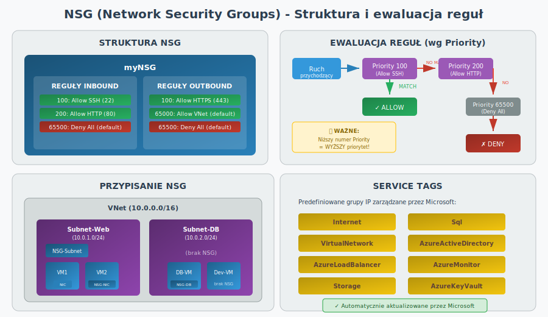
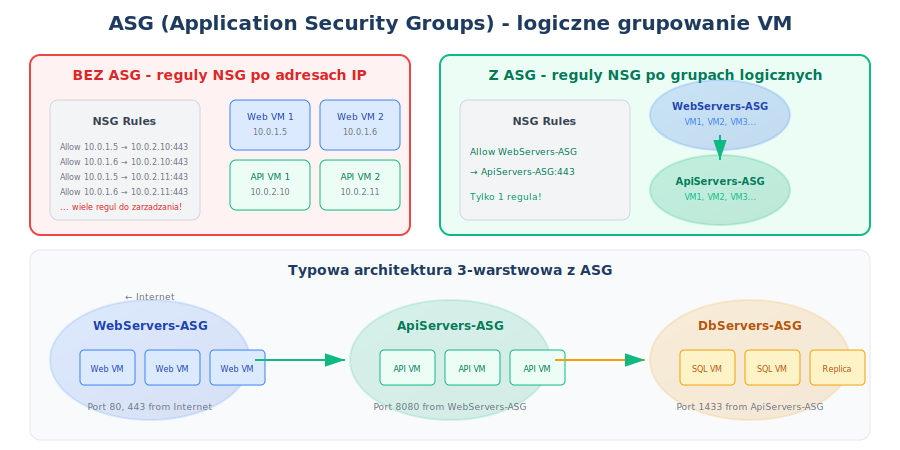
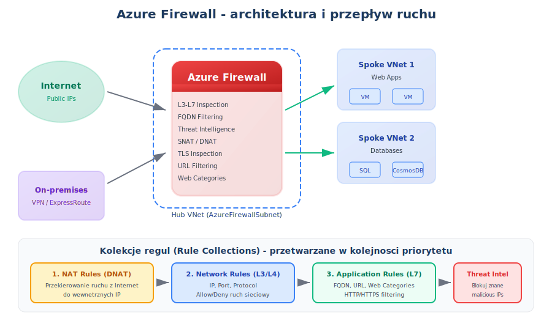
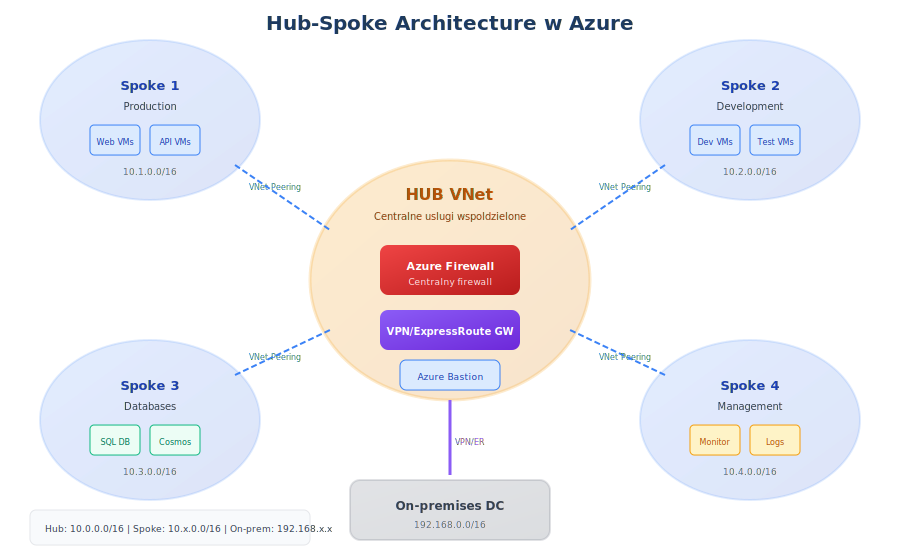

<a id="sec-04-networking"></a>
## 4. Networking (Sieci i łączność)

[ Powrót do spisu treści](../README.md)


---

### **VNet / Subnets / UDR**

Podstawowa sieć prywatna w Azure – kontrola adresacji, segmentacji oraz tras statycznych (UDR) do kierowania ruchu.

- **VNet (Virtual Network)**  
  Logiczna sieć prywatna w Azure, działająca podobnie do klasycznej sieci LAN.  
  Umożliwia pełną kontrolę nad adresacją IP, komunikacją między zasobami, integracją z siecią on‑prem oraz izolacją środowisk.

- **Subnets**  
  Podział VNet na mniejsze logiczne segmenty w celu separacji usług, zwiększenia bezpieczeństwa i kontroli dostępu.  
  Pozwalają przypisywać różne NSG, UDR i zasady per segment, np. subnet „App”, „DB”, „Gateway”.

- **UDR (User Defined Routes)**  
  Niestandardowe trasy wymuszające kierowanie ruchu przez określone urządzenia, np. firewall NVA.


Najczęstsze zastosowania:
- kierowanie ruchu przez firewall (NVA / Azure Firewall)  
- wymuszenie ruchu między subnetami  
- tunelowanie ruchu do on‑prem / VPN / ExpressRoute  
- blokowanie lub przekierowanie wybranych sieci

### **Azure DNS**

Usługa hostowania stref DNS w Azure:
- public DNS zones dla rekordów dostępnych z Internetu,
- private DNS zones dla rozwiązywania nazw wewnątrz VNet,
- integracja z Private Endpoint (rekordy `privatelink`).

Egzaminowo: **Azure DNS odpowiada za rozwiązywanie nazw**, a nie za filtrowanie ruchu czy balansowanie L7.

---

### **NSG (Network Security Groups)**



**NSG (Network Security Group)** to podstawowy firewall warstwy 3/4 (L3/L4) filtrujący ruch sieciowy na poziomie IP i portów. Może być przypisany do subnetu lub bezpośrednio do karty sieciowej (NIC) maszyny wirtualnej.

**Elementy reguły NSG:**

| Element | Opis | Przykład |
|---------|------|----------|
| **Priority** | 100-4096; niższy = wyższy priorytet | 100, 200, 300 |
| **Name** | Unikalna nazwa reguły | AllowSSH, DenyAll |
| **Source** | IP, zakres CIDR, Service Tag, ASG | 10.0.0.0/24, Internet |
| **Source Port** | * lub konkretny port | *, 443 |
| **Destination** | IP, zakres CIDR, Service Tag, ASG | VirtualNetwork |
| **Destination Port** | Port lub zakres portów | 22, 80, 443, 8080-8090 |
| **Protocol** | TCP, UDP, ICMP, Any | TCP |
| **Action** | Allow / Deny | Allow |

**Domyślne reguły (nie można usunąć):**

| Priority | Nazwa | Kierunek | Źródło | Cel | Akcja |
|----------|-------|----------|--------|-----|-------|
| 65000 | AllowVnetInBound | Inbound | VirtualNetwork | VirtualNetwork | Allow |
| 65001 | AllowAzureLoadBalancerInBound | Inbound | AzureLoadBalancer | * | Allow |
| 65500 | DenyAllInBound | Inbound | * | * | **Deny** |
| 65000 | AllowVnetOutBound | Outbound | VirtualNetwork | VirtualNetwork | Allow |
| 65001 | AllowInternetOutBound | Outbound | * | Internet | Allow |
| 65500 | DenyAllOutBound | Outbound | * | * | **Deny** |

**Ewaluacja reguł:**

```
Ruch przychodzący → Priority 100 → (match?) → ALLOW/DENY
                          ↓ (no match)
                    Priority 200 → (match?) → ALLOW/DENY
                          ↓ (no match)
                    Priority 300 → ...
                          ↓ (no match)
                    Priority 65500 → DENY (domyślna)
```

**Gdzie przypisać NSG?**

| Poziom | Zalety | Wady | Kiedy używać |
|--------|--------|------|--------------|
| **Subnet** | Jedna konfiguracja dla wszystkich VM | Mniej granularna kontrola | Wspólne reguły dla grupy VM |
| **NIC** | Granularna kontrola per VM | Więcej zarządzania | Specyficzne wymagania VM |
| **Oba** | Maksymalna kontrola | Złożoność, trudniejszy debug | Wielowarstwowa ochrona |

> **Uwaga:** Gdy NSG jest na obu poziomach, ruch musi przejść przez **OBA** - najpierw subnet NSG, potem NIC NSG.

**Service Tags - predefiniowane grupy IP:**

| Service Tag | Opis |
|-------------|------|
| **Internet** | Cała przestrzeń publiczna IP |
| **VirtualNetwork** | Wszystkie adresy w VNet + peered VNets |
| **AzureLoadBalancer** | Health probes Load Balancera |
| **Storage** | Wszystkie adresy Azure Storage |
| **Sql** | Adresy Azure SQL Database |
| **AzureActiveDirectory** | Adresy Microsoft Entra ID |
| **AzureMonitor** | Adresy Azure Monitor/Log Analytics |
| **AzureKeyVault** | Adresy Azure Key Vault |

**Tworzenie NSG przez CLI:**

```bash
# Utworzenie NSG
az network nsg create --name myNSG \
    --resource-group myRG --location westeurope

# Dodanie reguły Allow SSH
az network nsg rule create --nsg-name myNSG \
    --resource-group myRG --name AllowSSH \
    --priority 100 --direction Inbound \
    --source-address-prefixes Internet \
    --destination-port-ranges 22 \
    --protocol Tcp --access Allow

# Dodanie reguły Allow HTTP/HTTPS
az network nsg rule create --nsg-name myNSG \
    --resource-group myRG --name AllowWeb \
    --priority 200 --direction Inbound \
    --source-address-prefixes Internet \
    --destination-port-ranges 80 443 \
    --protocol Tcp --access Allow

# Dodanie reguły dla Storage (Service Tag)
az network nsg rule create --nsg-name myNSG \
    --resource-group myRG --name AllowStorageOutbound \
    --priority 100 --direction Outbound \
    --destination-address-prefixes Storage \
    --destination-port-ranges 443 \
    --protocol Tcp --access Allow

# Przypisanie NSG do subnetu
az network vnet subnet update --vnet-name myVNet \
    --name mySubnet --resource-group myRG \
    --network-security-group myNSG

# Przypisanie NSG do NIC
az network nic update --name myVM-NIC \
    --resource-group myRG \
    --network-security-group myNSG
```

**Diagnostyka NSG:**

```bash
# Sprawdzenie effective rules (suma subnet + NIC)
az network nic show-effective-nsg --name myVM-NIC \
    --resource-group myRG

# NSG Flow Logs (wymaga Network Watcher)
az network watcher flow-log create --name myFlowLog \
    --resource-group myRG --nsg myNSG \
    --storage-account myStorageAccount --enabled true
```

**Porównanie NSG vs Azure Firewall:**

| Aspekt | NSG | Azure Firewall |
|--------|-----|----------------|
| **Warstwa** | L3/L4 (IP, porty) | L3/L4 + L7 (aplikacja) |
| **Zasięg** | Subnet/NIC | Cały VNet/Hub |
| **FQDN filtering** | ❌ Nie | ✅ Tak |
| **Threat Intelligence** | ❌ Nie | ✅ Tak |
| **TLS inspection** | ❌ Nie | ✅ Tak (Premium) |
| **Centralny** | ❌ Nie | ✅ Tak |
| **Koszt** | Darmowy | ~$900+/miesiąc |
| **Use case** | Podstawowa filtracja | Enterprise security |

**Dobre praktyki NSG:**

| Praktyka | Opis |
|----------|------|
| **Używaj Service Tags** | Zamiast hardkodować IP Microsoft |
| **Nazywaj reguły opisowo** | AllowSSH, DenyInternet, nie Rule1 |
| **Zostawiaj gaps w Priority** | 100, 200, 300 - nie 100, 101, 102 |
| **Włącz Flow Logs** | Do audytu i troubleshootingu |
| **NSG na subnet** | Jako baseline, NIC dla wyjątków |
| **Dokumentuj reguły** | Dlaczego ta reguła istnieje? |

> **Egzamin:** NSG działa jak ACL – pozwala/blokuje ruch, ale go **nie inspektuje**. Dla inspekcji L7 użyj Azure Firewall.

---

### **ASG (Application Security Groups)**



**ASG (Application Security Groups)** to logiczne grupowanie maszyn wirtualnych według ich funkcji w aplikacji. Zamiast pisać reguły NSG z konkretnymi adresami IP, używasz nazw grup aplikacyjnych.

**Problem bez ASG:**
```
Reguła 1: Allow 10.0.1.5 → 10.0.2.10:443
Reguła 2: Allow 10.0.1.5 → 10.0.2.11:443
Reguła 3: Allow 10.0.1.6 → 10.0.2.10:443
Reguła 4: Allow 10.0.1.6 → 10.0.2.11:443
... dziesiątki reguł do zarządzania!
```

**Rozwiązanie z ASG:**
```
Reguła 1: Allow WebServers-ASG → ApiServers-ASG:443
Jedna reguła zamiast wielu!
```

**Kluczowe zalety:**

| Zaleta | Opis |
|--------|------|
| **Uproszczone reguły** | Zamiast IP używasz logicznych nazw grup |
| **Dynamiczne członkostwo** | Nowa VM automatycznie dziedziczy reguły po przypisaniu do ASG |
| **Czytelność** | Reguły opisują intencję (WebServers→ApiServers) |
| **Mniej błędów** | Nie musisz aktualizować reguł przy zmianie IP |
| **Skalowalność** | Dodanie VM = przypisanie do ASG, bez zmian w NSG |

**Typowa architektura 3-warstwowa:**

| ASG | Członkowie | Dozwolony ruch przychodzący |
|-----|------------|----------------------------|
| **WebServers-ASG** | Web VM 1, Web VM 2, ... | Internet → port 80, 443 |
| **ApiServers-ASG** | API VM 1, API VM 2, ... | WebServers-ASG → port 8080 |
| **DbServers-ASG** | SQL VM 1, SQL VM 2, ... | ApiServers-ASG → port 1433 |

**Tworzenie ASG przez CLI:**

```bash
# Utworzenie ASG
az network asg create --name WebServers-ASG \
    --resource-group myRG --location westeurope

az network asg create --name ApiServers-ASG \
    --resource-group myRG --location westeurope

az network asg create --name DbServers-ASG \
    --resource-group myRG --location westeurope

# Przypisanie VM do ASG (przez NIC)
az network nic update --name myWebVM-NIC \
    --resource-group myRG \
    --application-security-groups WebServers-ASG

# Reguła NSG używająca ASG
az network nsg rule create --nsg-name myNSG \
    --resource-group myRG --name AllowWebToApi \
    --priority 100 --direction Inbound \
    --source-asgs WebServers-ASG \
    --destination-asgs ApiServers-ASG \
    --destination-port-ranges 8080 \
    --protocol Tcp --access Allow

az network nsg rule create --nsg-name myNSG \
    --resource-group myRG --name AllowApiToDb \
    --priority 110 --direction Inbound \
    --source-asgs ApiServers-ASG \
    --destination-asgs DbServers-ASG \
    --destination-port-ranges 1433 \
    --protocol Tcp --access Allow
```

**Ograniczenia ASG:**

| Ograniczenie | Wartość |
|--------------|---------|
| ASG per subscription | 3000 |
| NIC może należeć do | Wielu ASG |
| ASG musi być w tym samym | Regionie co VM |
| Członkowie ASG muszą być w | Tym samym VNet |
| Mieszanie ASG i IP w jednej regule | NIE dozwolone |

**Porównanie: ASG vs bez ASG**

| Aspekt | Bez ASG (IP-based) | Z ASG |
|--------|-------------------|-------|
| Reguły w NSG | Wiele (per IP) | Pojedyncze (per grupa) |
| Nowa VM | Aktualizacja reguł | Tylko przypisanie do ASG |
| Zmiana IP VM | Aktualizacja reguł | Brak zmian |
| Czytelność | Niska (adresy IP) | Wysoka (nazwy logiczne) |
| Błędy | Częste | Rzadkie |

> **Egzamin:** ASG to logiczne grupowanie VM dla uproszczenia reguł NSG. NIE jest to firewall - to sposób organizacji reguł w NSG.

---

### **Azure Firewall**



**Azure Firewall** to w pełni zarządzany, stanowy firewall warstwy L3–L7, wdrażany jako usługa PaaS w dedykowanym subnecie (`AzureFirewallSubnet`).

**Kluczowe funkcje:**
| Funkcja | Opis |
|---------|------|
| **FQDN Filtering** | Filtrowanie po nazwach domenowych (np. `*.microsoft.com`) |
| **URL Filtering** | Filtrowanie po pełnych URL (Premium) |
| **Web Categories** | Blokowanie kategorii stron (gambling, adult, etc.) |
| **Threat Intelligence** | Automatyczne blokowanie znanych malicious IPs |
| **TLS Inspection** | Deszyfrowanie i inspekcja HTTPS (Premium) |
| **SNAT/DNAT** | Source/Destination NAT dla ruchu sieciowego |
| **IDPS** | Intrusion Detection & Prevention (Premium) |

#### Warstwy Azure Firewall

| Cecha | Standard | Premium |
|-------|----------|---------|
| L3-L4 filtering | Tak | Tak |
| FQDN filtering | Tak | Tak |
| Threat Intelligence | Alert/Deny | Alert/Deny |
| TLS Inspection | Nie | Tak |
| IDPS | Nie | Tak |
| URL Filtering | Nie | Tak |
| Web Categories | Podstawowe | Rozszerzone |
| Cena | ~$1.25/godz | ~$1.75/godz |

#### Kolekcje reguł (Rule Collections)

Reguły są przetwarzane w kolejności priorytetu (niższy numer = wyższy priorytet):

**1. NAT Rules (DNAT)** - priorytet 100-300
```
Przekierowanie ruchu przychodzącego z Internetu do wewnętrznych zasobów.

Przykład:
  Source: * (Internet)
  Destination: Firewall Public IP:443
  Translated: 10.0.1.5:443 (internal web server)
```

**2. Network Rules (L3/L4)** - priorytet 200-65000
```
Filtrowanie po IP, porcie i protokole.

Przykład:
  Source: 10.0.0.0/16 (VNet)
  Destination: 8.8.8.8
  Port: 53
  Protocol: UDP
  Action: Allow
```

**3. Application Rules (L7)** - priorytet 200-65000
```
Filtrowanie HTTP/HTTPS po FQDN lub URL.

Przykład:
  Source: 10.0.0.0/16
  Target FQDNs: *.windowsupdate.com, *.microsoft.com
  Protocol: Https:443
  Action: Allow
```

#### Konfiguracja przez Azure CLI

```bash
# Utworzenie Resource Group i VNet
az group create --name myFWRG --location westeurope
az network vnet create --name myVNet --resource-group myFWRG \
    --address-prefix 10.0.0.0/16

# Utworzenie AzureFirewallSubnet (wymagana nazwa!)
az network vnet subnet create --name AzureFirewallSubnet \
    --resource-group myFWRG --vnet-name myVNet \
    --address-prefix 10.0.1.0/26

# Utworzenie Public IP dla Firewall
az network public-ip create --name myFW-PIP --resource-group myFWRG \
    --sku Standard --allocation-method Static

# Utworzenie Azure Firewall
az network firewall create --name myFirewall \
    --resource-group myFWRG --location westeurope

# Konfiguracja IP
az network firewall ip-config create --firewall-name myFirewall \
    --name myFWConfig --public-ip-address myFW-PIP \
    --resource-group myFWRG --vnet-name myVNet

# Dodanie Network Rule Collection
az network firewall network-rule create \
    --firewall-name myFirewall --resource-group myFWRG \
    --collection-name "AllowDNS" --priority 200 \
    --action Allow --name "DNS" \
    --source-addresses "10.0.0.0/16" \
    --destination-addresses "8.8.8.8" "8.8.4.4" \
    --destination-ports 53 --protocols UDP

# Dodanie Application Rule Collection
az network firewall application-rule create \
    --firewall-name myFirewall --resource-group myFWRG \
    --collection-name "AllowWeb" --priority 300 \
    --action Allow --name "MicrosoftUpdates" \
    --source-addresses "10.0.0.0/16" \
    --target-fqdns "*.windowsupdate.com" "*.microsoft.com" \
    --protocols Https=443
```

#### Firewall Policy (zalecane)

Firewall Policy to centralny obiekt zarządzania regułami, który można przypisać do wielu firewalli:

```bash
# Utworzenie Firewall Policy
az network firewall policy create --name myPolicy \
    --resource-group myFWRG --location westeurope

# Utworzenie Rule Collection Group
az network firewall policy rule-collection-group create \
    --name DefaultRuleCollectionGroup \
    --policy-name myPolicy --resource-group myFWRG \
    --priority 100

# Przypisanie Policy do Firewall
az network firewall update --name myFirewall \
    --resource-group myFWRG \
    --firewall-policy myPolicy
```

#### Hub-Spoke Architecture



**Hub-Spoke** to najpopularniejsza architektura sieciowa w Azure dla środowisk enterprise. Opiera się na centralnym VNecie (Hub), który łączy się z wieloma VNetami aplikacyjnymi (Spokes) za pomocą VNet Peering.

**Koncepcja:**
- **Hub VNet** = centralny węzeł z usługami współdzielonymi
- **Spoke VNets** = izolowane VNety dla różnych aplikacji/środowisk
- **VNet Peering** = połączenie Hub ↔ Spoke (bez tranzytywności!)

**Co umieszczamy w Hub:**
| Usługa | Rola |
|--------|------|
| **Azure Firewall** | Centralny firewall dla całego ruchu |
| **VPN Gateway** | Połączenie z on-premises |
| **ExpressRoute Gateway** | Dedykowane połączenie z on-prem |
| **Azure Bastion** | Bezpieczny dostęp RDP/SSH |
| **DNS Server** | Centralne rozwiązywanie nazw |
| **NVA** | Network Virtual Appliances (3rd party) |

**Co umieszczamy w Spokes:**
- Aplikacje produkcyjne (Spoke: Production)
- Środowiska deweloperskie (Spoke: Development)
- Bazy danych (Spoke: Databases)
- Zarządzanie i monitoring (Spoke: Management)

**Dlaczego Hub-Spoke?**

| Zaleta | Opis |
|--------|------|
| **Izolacja** | Każdy Spoke jest oddzielony od innych |
| **Centralne bezpieczeństwo** | Jeden Firewall kontroluje cały ruch |
| **Koszt** | Współdzielone usługi (VPN GW, Firewall) zamiast duplikacji |
| **Skalowalność** | Łatwe dodawanie nowych Spokes |
| **Compliance** | Różne regulacje dla różnych Spokes |

**Ważne: VNet Peering NIE jest tranzytywny!**

```
Spoke1 ←→ Hub ←→ Spoke2

Spoke1 NIE może rozmawiać z Spoke2 bezpośrednio przez peering!
Ruch musi przejść przez Hub (np. przez Azure Firewall lub NVA).
```

**Rozwiązania dla komunikacji Spoke-to-Spoke:**
1. **Azure Firewall/NVA** - ruch routowany przez Hub (UDR)
2. **Virtual WAN** - natywna tranzytywność
3. **Bezpośredni peering** - Spoke ↔ Spoke (dodatkowy koszt, brak kontroli)

**Przykładowa konfiguracja sieci:**
```
Hub VNet:        10.0.0.0/16
  ├── AzureFirewallSubnet:  10.0.1.0/26
  ├── GatewaySubnet:        10.0.2.0/27
  └── AzureBastionSubnet:   10.0.3.0/26

Spoke1 (Prod):   10.1.0.0/16
Spoke2 (Dev):    10.2.0.0/16
Spoke3 (DB):     10.3.0.0/16
On-premises:     192.168.0.0/16
```

**Konfiguracja UDR dla Spoke-to-Spoke przez Firewall:**

```bash
# Route Table dla każdego Spoke
az network route-table create --name Spoke1-RT --resource-group myRG

# Route do innych Spokes przez Firewall
az network route-table route create --name ToSpoke2 \
    --route-table-name Spoke1-RT --resource-group myRG \
    --address-prefix 10.2.0.0/16 \
    --next-hop-type VirtualAppliance \
    --next-hop-ip-address 10.0.1.4  # Firewall private IP

# Route do on-premises przez Firewall
az network route-table route create --name ToOnPrem \
    --route-table-name Spoke1-RT --resource-group myRG \
    --address-prefix 192.168.0.0/16 \
    --next-hop-type VirtualAppliance \
    --next-hop-ip-address 10.0.1.4

# Default route (Internet) przez Firewall
az network route-table route create --name ToInternet \
    --route-table-name Spoke1-RT --resource-group myRG \
    --address-prefix 0.0.0.0/0 \
    --next-hop-type VirtualAppliance \
    --next-hop-ip-address 10.0.1.4
```

**Porównanie: Hub-Spoke vs Virtual WAN**

| Cecha | Hub-Spoke (manual) | Azure Virtual WAN |
|-------|-------------------|-------------------|
| Tranzytywność | UDR + Firewall/NVA | Natywna |
| Zarządzanie | Ręczne | Automatyczne |
| Skalowalność | Do ~100 Spokes | Do 1000+ |
| Koszt | Niższy (DIY) | Wyższy (managed) |
| Złożoność | Średnia | Niska |
| Multi-region | Wymaga konfiguracji | Wbudowane |

> **Egzamin:** Hub-Spoke to wzorzec architektoniczny, nie usługa Azure. Virtual WAN to managed service, który implementuje Hub-Spoke automatycznie.

#### Porównanie z NSG

| Cecha | NSG | Azure Firewall |
|-------|-----|----------------|
| Warstwa | L3/L4 | L3-L7 |
| Stateful | Tak | Tak |
| FQDN filtering | Nie | Tak |
| URL filtering | Nie | Tak (Premium) |
| Threat Intelligence | Nie | Tak |
| TLS Inspection | Nie | Tak (Premium) |
| Centralne zarządzanie | Nie | Tak (Policy) |
| Logging | Flow Logs | Azure Monitor |
| Koszt | Darmowe | ~$1.25-1.75/godz |
| Kiedy używać | Per-subnet ACL | Centralny firewall |

> **Egzamin:** NSG = prosty ACL na poziomie subnet/NIC, Azure Firewall = enterprise-grade firewall z inspekcją ruchu.

---

### **VNet Peering**

Bezpośrednie, szybkie połączenie dwóch VNetów **bez tuneli, NAT i VPN**.


Cechy:
- komunikacja IP‑to‑IP po prywatnym backbone Azure,  
- bardzo niskie opóźnienia,  
- brak NAT,  
- globalny peering między regionami.

---

### **VPN Gateway**

Brama VPN umożliwiająca szyfrowane połączenia IPsec.


#### **Site‑to‑Site (S2S)**
- Używasz S2S, gdy chcesz połączyć całą sieć on‑prem z Azure.
- tunel router ↔ Azure (cała sieć ↔ VNet),  
- wymaga publicznego IP po stronie on‑prem.

#### **Point‑to‑Site (P2S)**  
- VPN dla pojedynczego użytkownika (OpenVPN / IKEv2 / Azure VPN Client),  
- nie wymaga infrastruktury po stronie użytkownika.


---

### **ExpressRoute**

Prywatne łącze WAN do Azure, całkowicie poza publicznym Internetem.


Cechy:
- 50 Mbps – 100 Gbps,  
- stabilne parametry i SLA operatorskie,  
- private peering (VNet), Microsoft peering (wybrane usługi publiczne Microsoft),  
- idealny do krytycznych aplikacji i masowych migracji.
- połączenie jest prywatne, ale nie szyfrowane.

Rodzaje:
- **Standard** – połączenia do regionu w tym samym obszarze geograficznym.
- **Premium** – dostęp do wszystkich regionów + większe limity VNetów/tras.

---

### **Public Endpoint / Private Endpoint / Service Endpoint**


#### **Public Endpoint**
- publiczny adres IP usługi PaaS,
- dostęp przez Internet (można ograniczyć firewallami / Access Restrictions),
- brak izolacji sieciowej — ruch zawsze trafia na publiczny endpoint.

#### **Private Endpoint**
- prywatny IP w Twoim VNet (z subnetu),
- dostęp przez Azure Private Link (prywatny backbone),
- wymaga prywatnych stref DNS (privatelink.azure.com),
- najwyższy poziom izolacji (pełne odcięcie Internetu).

#### **Service Endpoint**
- nie tworzy prywatnego IP,
- ruch do PaaS przechodzi po prywatnym backbone Azure,
- nadal używa publicznego endpointu usługi,
- mniej izolacji niż Private Endpoint.

Pułapki:
- Public Endpoint + złe reguły = przypadkowe wystawienie danych do Internetu
- Private Endpoint może „schować” usługę przed światem (konieczny poprawny DNS)
- Service Endpoint nie działa cross‑tenant
- Private Endpoint blokuje publiczny dostęp przy ustawieniu Deny public network access
- Service Endpoint nie korzysta z NAT — usługa widzi regionalny adres źródłowy Azure

---

### **Public IP (Basic vs Standard)**

- **Basic**
  - brak stref AZ,  
  - mniej bezpieczne,  
  - brak SLA.

- **Standard**
  - strefowy (zone‑redundant),  
  - domyślnie „secure by default”,  
  - płatny za sam przydział.

---

### **NAT Gateway**

Zalecane rozwiązanie dla wychodzącego ruchu Internetowego (egress).

Cechy:
- jedno źródło ruchu (stały publiczny IP/prefix),  
- wysoka skalowalność (miliony SNAT),  
- lepsze niż SNAT na Load Balancer.

---

### **DDoS Protection**

- **Basic** – zawsze włączone, automatyczne.  
- **Standard** – ochrona warstw **L3/L4**: wolumetria, SYN flood, UDP flood.

> DDoS Standard nie chroni L7 — od tego jest **WAF**.

---

### **WAF (Web Application Firewall)**

Firewall L7 (HTTP/S), ochrona webowych aplikacji przed:
- OWASP Top 10,  
- botami,  
- wstrzykiwaniem,  
- anomaliami.

Dostępny jako:
- WAF on Application Gateway (regionalny),  
- WAF on Azure Front Door (globalny edge).

---

### **Load Balancing i Edge Networking**

#### **Azure Load Balancer (L4)**  


Warstwa 4 – TCP/UDP. Szybki, prosty, idealny dla VM/VMSS.

#### **Application Gateway (L7 + WAF)**  


Warstwa 7 – routing HTTP/S, WAF, SSL termination, cookie affinity.

#### **Traffic Manager (DNS LB)**  


Stosowany na poziomie DNS – georouting, failover, weighted.

#### **Azure Front Door (L7 Edge)**   


Globalny CDN + smart routing L7 + WAF na edge.

---

### **Porównanie usług LB (skrót)**

| Usługa | Warstwa | Zastosowania | Zakres |
|--------|---------|--------------|--------|
| Load Balancer | L4 | VM/VMSS, TCP/UDP | Regional |
| Application Gateway | L7 | Web apps + WAF | Regional |
| Traffic Manager | DNS | Global routing DNS | Global |
| Front Door | L7 Edge | Global web apps, WAF, caching | Global |

---

### **Network Watcher**

Narzędzia do diagnostyki:
- IP Flow Verify,  
- NSG Flow Logs,  
- Connection Troubleshoot,  
- Packet Capture.

Umożliwia analizę ruchu i debugowanie problemów sieciowych.

---
---

[Poprzednia strona](./03-compute-services.md) | [Spis treści](../README.md) | [Następna strona](./05-storage.md)
