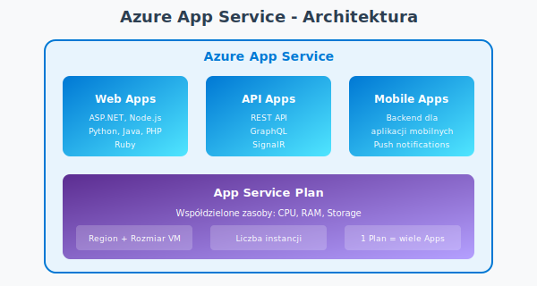
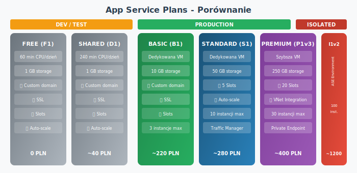
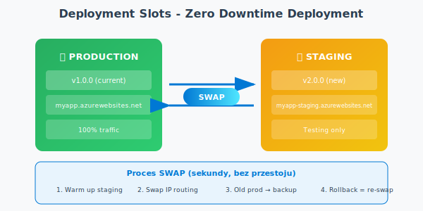
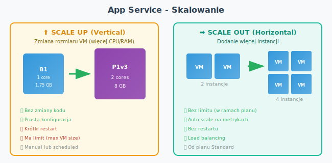
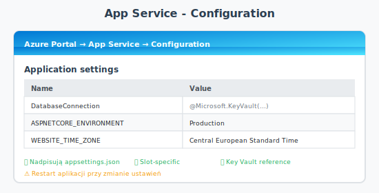

<a id="sec-32-app-service"></a>
## 32. Azure App Service

[ Powrót do spisu treści](../README.md)


### Co to jest Azure App Service?

**Azure App Service** to w pełni zarządzana platforma PaaS (Platform as a Service) do hostowania aplikacji webowych, REST API, mobilnych backendów i funkcji. Nie musisz zarządzać infrastrukturą - Azure zajmuje się serwerami, aktualizacjami, skalowaniem i bezpieczeństwem.



### Kluczowe cechy App Service

| Cecha | Opis |
|-------|------|
| **Automatyczne skalowanie** | Scale up (większa VM) lub Scale out (więcej instancji) |
| **CI/CD** | Integracja z GitHub, Azure DevOps, Bitbucket |
| **Deployment Slots** | Wdrażanie bez przestojów (staging → production swap) |
| **Custom Domains** | Własne domeny z certyfikatami SSL/TLS |
| **Managed Identity** | Bezpieczne połączenia bez haseł |
| **VNet Integration** | Połączenie z siecią prywatną |
| **WebJobs** | Procesy w tle (background tasks) |
| **Health Checks** | Automatyczne monitorowanie stanu aplikacji |

### App Service Plans - Porównanie

App Service Plan określa **ile zasobów** (CPU, RAM, storage) dostaje Twoja aplikacja i **ile kosztuje**.



| Plan | Instancje | Slots | Auto-scale | VNet Integration | Cena miesięczna* |
|------|-----------|-------|------------|------------------|------------------|
| **Free (F1)** | 1 | ❌ | ❌ | ❌ | 0 PLN |
| **Shared (D1)** | 1 | ❌ | ❌ | ❌ | ~40 PLN |
| **Basic (B1)** | 3 | ❌ | ❌ | ❌ | ~220 PLN |
| **Standard (S1)** | 10 | 5 | ✅ | ❌ | ~280 PLN |
| **Premium v3 (P1v3)** | 30 | 20 | ✅ | ✅ | ~400 PLN |
| **Isolated (I1v2)** | 100 | 20 | ✅ | ✅ (ASE) | ~1200 PLN |

*Ceny orientacyjne, zależą od regionu

### 🎯 Na egzamin AZ-900:
- **Free/Shared** = DEV/TEST, współdzielone zasoby
- **Basic i wyżej** = produkcja, dedykowane VM
- **Deployment Slots** = od Standard
- **VNet Integration** = od Premium
- **Isolated (ASE)** = pełna izolacja sieciowa

---

### Deployment Slots (Sloty wdrożeniowe)

Deployment Slots pozwalają mieć **wiele wersji aplikacji** działających równolegle. Dzięki temu możesz testować nową wersję na "staging" i przeprowadzić **swap** do produkcji bez przestoju.



**Slot settings** - niektóre ustawienia mogą być "sticky" (pozostają w slocie):
- Connection strings oznaczone jako slot-specific
- App settings oznaczone jako slot-specific
- Authentication/authorization settings

---

### Skalowanie App Service



**Reguły Auto-scale** (od planu Standard wzwyż):
- CPU > 70% → dodaj 1 instancję
- CPU < 30% → usuń 1 instancję
- HTTP Queue Length > 100 → dodaj instancję
- Schedule-based (np. więcej instancji w dzień)

---

### Wdrażanie aplikacji (Deployment Methods)

| Metoda | Opis | Kiedy używać |
|--------|------|--------------|
| **GitHub Actions** | CI/CD z GitHub | Automatyzacja, PR triggers |
| **Azure DevOps** | Pipeline z Azure Pipelines | Enterprise, zaawansowane CI/CD |
| **ZIP Deploy** | Upload pliku ZIP | Szybkie wdrożenie, skrypty |
| **FTP/FTPS** | Transfer plików | Legacy, małe zmiany |
| **Local Git** | Git push do Azure | Dev/test, szybkie zmiany |
| **Azure CLI** | `az webapp deploy` | Automatyzacja, skrypty |
| **Visual Studio** | Publish z IDE | .NET development |
| **VS Code** | Azure Extension | Wszystkie języki |

---

### Konfiguracja aplikacji

**App Settings** - zmienne środowiskowe dostępne w aplikacji:



**Connection Strings** - osobna sekcja dla connection stringów:
- Również mogą być slot-specific
- Typy: SQLServer, MySQL, PostgreSQL, Custom

---

### C# - Kod produkcyjny

**1. Program.cs - Konfiguracja z Managed Identity i Key Vault**

```csharp
using Azure.Identity;

var builder = WebApplication.CreateBuilder(args);

// Dodaj Key Vault jako źródło konfiguracji (Managed Identity)
if (!builder.Environment.IsDevelopment())
{
    var keyVaultName = builder.Configuration["KeyVaultName"];
    builder.Configuration.AddAzureKeyVault(
        new Uri($"https://{keyVaultName}.vault.azure.net/"),
        new DefaultAzureCredential());
}

// Dodaj serwisy
builder.Services.AddControllers();
builder.Services.AddEndpointsApiExplorer();
builder.Services.AddSwaggerGen();

// Health checks
builder.Services.AddHealthChecks();

var app = builder.Build();

// Configure pipeline
if (app.Environment.IsDevelopment())
{
    app.UseSwagger();
    app.UseSwaggerUI();
}

app.UseHttpsRedirection();
app.UseAuthorization();
app.MapControllers();
app.MapHealthChecks("/health");

app.Run();
```

**NuGet packages:**
```
Azure.Extensions.AspNetCore.Configuration.Secrets
Azure.Identity
Microsoft.Extensions.Diagnostics.HealthChecks
```

---

**2. Konfiguracja z IConfiguration**

```csharp
public class MyAppSettings
{
    public string DatabaseConnection { get; set; } = string.Empty;
    public string StorageAccount { get; set; } = string.Empty;
    public int MaxRetries { get; set; } = 3;
    public TimeSpan Timeout { get; set; } = TimeSpan.FromSeconds(30);
}

// W Program.cs - rejestracja
builder.Services.Configure<MyAppSettings>(
    builder.Configuration.GetSection("MyApp"));

// W kontrolerze - użycie
public class MyController : ControllerBase
{
    private readonly MyAppSettings _settings;
    
    public MyController(IOptions<MyAppSettings> options)
    {
        _settings = options.Value;
    }
}
```

**appsettings.json:**
```json
{
  "KeyVaultName": "my-keyvault",
  "MyApp": {
    "DatabaseConnection": "Server=myserver.database.windows.net;Database=mydb;Authentication=Active Directory Default",
    "StorageAccount": "mystorageaccount",
    "MaxRetries": 5,
    "Timeout": "00:00:45"
  }
}
```

---

**3. Połączenie z Azure SQL Database (Managed Identity)**

```csharp
using Azure.Core;
using Azure.Identity;
using Microsoft.Data.SqlClient;

public class DatabaseService
{
    private readonly string _connectionString;
    private readonly DefaultAzureCredential _credential;
    
    public DatabaseService(IConfiguration configuration)
    {
        _connectionString = configuration.GetConnectionString("SqlDatabase")
            ?? throw new InvalidOperationException("Missing SQL connection string");
        _credential = new DefaultAzureCredential();
    }
    
    public async Task<List<Product>> GetProductsAsync()
    {
        await using var connection = new SqlConnection(_connectionString);
        
        // Token dla Azure SQL
        var token = await _credential.GetTokenAsync(
            new TokenRequestContext(["https://database.windows.net/.default"]));
        connection.AccessToken = token.Token;
        
        await connection.OpenAsync();
        
        var products = new List<Product>();
        await using var command = new SqlCommand("SELECT Id, Name, Price FROM Products", connection);
        await using var reader = await command.ExecuteReaderAsync();
        
        while (await reader.ReadAsync())
        {
            products.Add(new Product
            {
                Id = reader.GetInt32(0),
                Name = reader.GetString(1),
                Price = reader.GetDecimal(2)
            });
        }
        
        return products;
    }
}

public record Product
{
    public int Id { get; init; }
    public string Name { get; init; } = string.Empty;
    public decimal Price { get; init; }
}
```

**Connection string w appsettings.json:**
```json
{
  "ConnectionStrings": {
    "SqlDatabase": "Server=tcp:myserver.database.windows.net,1433;Database=mydb;Encrypt=True;"
  }
}
```

---

**4. Health Checks**

```csharp
using Microsoft.Extensions.Diagnostics.HealthChecks;

// Program.cs
builder.Services.AddHealthChecks()
    .AddCheck<DatabaseHealthCheck>("database")
    .AddCheck<StorageHealthCheck>("storage");

// Custom Health Check
public class DatabaseHealthCheck : IHealthCheck
{
    private readonly DatabaseService _dbService;
    
    public DatabaseHealthCheck(DatabaseService dbService)
    {
        _dbService = dbService;
    }
    
    public async Task<HealthCheckResult> CheckHealthAsync(
        HealthCheckContext context,
        CancellationToken cancellationToken = default)
    {
        try
        {
            // Proste sprawdzenie połączenia
            await _dbService.CheckConnectionAsync();
            return HealthCheckResult.Healthy("Database connection OK");
        }
        catch (Exception ex)
        {
            return HealthCheckResult.Unhealthy("Database connection failed", ex);
        }
    }
}
```

**Wymagane role RBAC dla Managed Identity:**

| Zasób | Rola | Opis |
|-------|------|------|
| SQL Database | `SQL DB Contributor` + SQL user | Dostęp do bazy |
| Storage Account | `Storage Blob Data Contributor` | Dostęp do Blob |
| Key Vault | `Key Vault Secrets User` | Odczyt sekretów |
| Service Bus | `Azure Service Bus Data Sender/Receiver` | Wysyłanie/odbieranie |

---

### Azure CLI - App Service

**Tworzenie App Service:**

```bash
# Utwórz Resource Group
az group create --name myResourceGroup --location polandcentral

# Utwórz App Service Plan
az appservice plan create \
    --name myAppServicePlan \
    --resource-group myResourceGroup \
    --sku S1 \
    --is-linux

# Utwórz Web App (.NET 8)
az webapp create \
    --name mywebapp-unique-name \
    --resource-group myResourceGroup \
    --plan myAppServicePlan \
    --runtime "DOTNETCORE:8.0"

# Włącz Managed Identity
az webapp identity assign \
    --name mywebapp-unique-name \
    --resource-group myResourceGroup
```

**Deployment Slots:**

```bash
# Utwórz slot staging
az webapp deployment slot create \
    --name mywebapp-unique-name \
    --resource-group myResourceGroup \
    --slot staging

# Wdróż na staging
az webapp deployment source config-zip \
    --name mywebapp-unique-name \
    --resource-group myResourceGroup \
    --slot staging \
    --src ./publish.zip

# Swap staging → production
az webapp deployment slot swap \
    --name mywebapp-unique-name \
    --resource-group myResourceGroup \
    --slot staging \
    --target-slot production
```

**Konfiguracja:**

```bash
# Ustaw App Setting
az webapp config appsettings set \
    --name mywebapp-unique-name \
    --resource-group myResourceGroup \
    --settings ASPNETCORE_ENVIRONMENT=Production

# Ustaw Connection String
az webapp config connection-string set \
    --name mywebapp-unique-name \
    --resource-group myResourceGroup \
    --settings SqlDatabase="Server=..." \
    --connection-string-type SQLServer

# Konfiguruj Auto-scale (Standard i wyżej)
az monitor autoscale create \
    --resource-group myResourceGroup \
    --resource mywebapp-unique-name \
    --resource-type Microsoft.Web/serverFarms \
    --min-count 1 \
    --max-count 5 \
    --count 2
```

**Logi i monitoring:**

```bash
# Włącz logi aplikacji
az webapp log config \
    --name mywebapp-unique-name \
    --resource-group myResourceGroup \
    --application-logging filesystem \
    --level information

# Streamuj logi
az webapp log tail \
    --name mywebapp-unique-name \
    --resource-group myResourceGroup

# Pobierz status
az webapp show \
    --name mywebapp-unique-name \
    --resource-group myResourceGroup \
    --query "{State:state,URL:defaultHostName}"
```

---

### Best Practices dla App Service

| Praktyka | Dlaczego |
|----------|----------|
| **Używaj Managed Identity** | Brak haseł w kodzie, automatyczna rotacja |
| **Sekrety w Key Vault** | Centralne zarządzanie, audyt dostępu |
| **Deployment Slots** | Zero-downtime deployments, łatwy rollback |
| **Health Checks** | Automatyczne wykrywanie problemów |
| **Auto-scale** | Elastyczność kosztowa, obsługa ruchu |
| **VNet Integration** | Bezpieczny dostęp do zasobów prywatnych |
| **App Settings zamiast kodu** | Różne środowiska bez zmiany kodu |
| **Staging environment** | Testowanie przed produkcją |

### ❌ Częste błędy:

```csharp
// ❌ ŹLE - hardkodowane dane
var connectionString = "Server=myserver;Password=secret123";

// ✅ DOBRZE - z konfiguracji
var connectionString = configuration.GetConnectionString("SqlDatabase");
```

```csharp
// ❌ ŹLE - brak Health Checks
app.Run();

// ✅ DOBRZE - z Health Checks
app.MapHealthChecks("/health");
app.Run();
```

---

### Porównanie: App Service vs inne usługi

| Cecha | App Service | Azure Functions | Container Apps | AKS |
|-------|-------------|-----------------|----------------|-----|
| **Model** | Web Apps (PaaS) | Serverless | Container (PaaS) | Kubernetes |
| **Rozliczenie** | Za Plan | Za wywołania | Za vCPU/RAM | Za VM |
| **Skalowanie** | Manual/Auto | Auto (0→N) | Auto (0→N) | Manual/Auto |
| **Złożoność** | Niska | Niska | Średnia | Wysoka |
| **Kontrola** | Ograniczona | Minimalna | Średnia | Pełna |
| **Dla kogo** | Web apps, API | Event-driven | Microservices | Enterprise |

---

### FAQ dla egzaminu AZ-900

| Pytanie | Odpowiedź |
|---------|----------|
| Co to App Service? | Zarządzana platforma PaaS dla aplikacji web |
| Co określa App Service Plan? | Zasoby (CPU, RAM), cenę, region |
| Który plan ma Deployment Slots? | Standard i wyżej |
| Który plan ma VNet Integration? | Premium i Isolated |
| Co to Deployment Slot? | Osobna instancja do testowania/staging |
| Co robi Swap? | Zamienia production ze staging bez przestoju |
| Scale Up vs Scale Out? | Up = większa VM, Out = więcej instancji |
| Auto-scale od którego planu? | Standard |
| Co to Isolated (ASE)? | App Service Environment - pełna izolacja sieciowa |
| Ile aplikacji w jednym Planie? | Wiele (współdzielą zasoby) |
| Free vs Shared? | Free = 60 min/dzień, Shared = 240 min/dzień |
| Jak bezpiecznie połączyć z bazą? | Managed Identity + Key Vault |

---
---

[Poprzednia strona](./31-azure-storage.md) | [Spis treści](../README.md) | Następna strona
